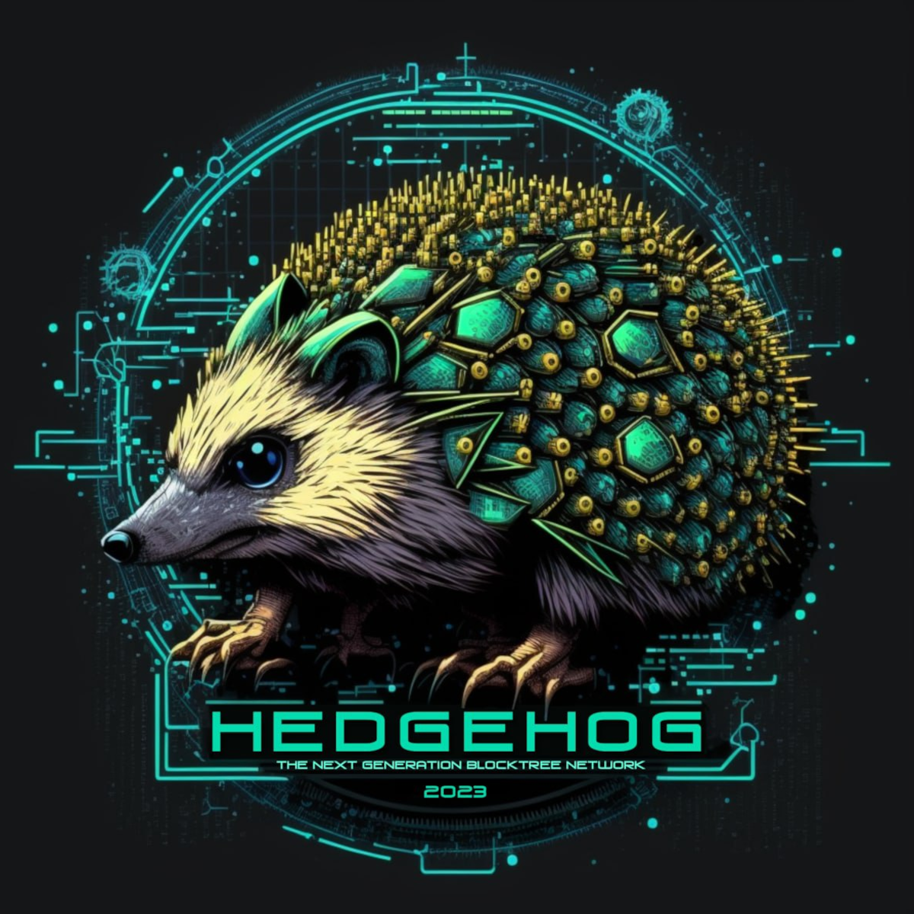

# The Sharded Unigrid Treechain Network

Hedgehog is a high-performant, concurrent peer-to-peer treechain (blockchain) network built on top of [Netty](https://netty.io/) and [Java NIO](https://docs.oracle.com/javase/8/docs/technotes/guides/io/index.html).

__Currently published features:__
- Gridnode sporks and configurable network properties
- Peer to peer distriubution
- REST interface

__Upcoming features currently in development:__
- Shard group and network storage (accesible via [Janus](https://github.com/unigrid-project/janus-java) and virtual desktop drives)
- Built in SOCKS5 Proxy for VPN-like functionality
- Amazon S3 REST API to access storage on the network

__Features slated for 2023:__
- Web Assembly support
- Compute workloads
- Duality  consensus
- GPU workloads

__Secondary goals:__
- Replacement of the network and consensus chain in the [legacy daemon](https://github.com/unigrid-project/daemon), including complete or partial migration to Hedgehog. We are currently investigating different options for the network and what direction makes the most sense for the Unigrid network out of a go-to-market perspective.

## For developers that want to build Hedgehog
Hedgehog requires Java 17+. To run and build the distribution you need [Maven](https://maven.apache.org/). To execute a build you need to run the following command from within the Hedgehog directory:

> mvn clean install

This will create an archive in `target/hedgehog-<version>-SNAPSHOT-jar-with-dependencies.jar`. This can then be started with `java -jar hedgehog-<version>-SNAPSHOT-jar-with-dependencies.jar`.

## Running Hedgehog
While most people will not run Hedgehog manually, it is certainly possible. For documentation on all the features in the distribution please run the Hedgehog jar with `java -jar hedgehog-<version>-SNAPSHOT-jar-with-dependencies.jar --help`. This will display all the options available when executing the application.

Depending on the options passed, Hedgehog will act as a network daemon, client or stand-alone application.

## Native Image Support
Native image support is available via the native-image sub-project. Because of problems with CDI and dependencies being reliant on a full CDI implementation, the native image is not really native, but wraps a JVM and the hedgehog jar into a native version for execution.

To build the native image, execute `mvn package` inside the native-image module/project. Depending on the operating system, this will generate an executable `hedgehog.exe` or `hedgehog.bin` fille inside the  `native-image/target/`.
