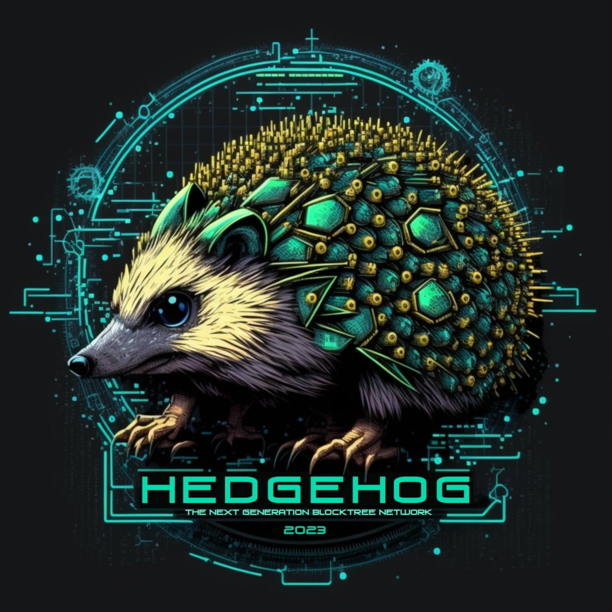

# The Sharded Unigrid Treechain Network

Hedgehog is a high-performant, concurrent peer-to-peer treechain (blockchain) network built on top of [Netty](https://netty.io/) and [Java NIO](https://docs.oracle.com/javase/8/docs/technotes/guides/io/index.html).

__Currently published features:__
- Gridnode sporks and configurable network properties
- Peer to peer distriubution
- REST interface

__Upcoming features currently in development:__
- Shard group and network storage (accesible via [Janus](https://github.com/unigrid-project/janus-java) and virtual desktop drives)
- Built in SOCKS5 Proxy for VPN-like functionality
- Amazon S3 REST API to access storage on the network

__Features slated for 2023:__
- Web Assembly support
- Compute workloads
- Duality  consensus
- GPU workloads

__Secondary goals:__
- Replacement of the network and consensus chain in the [legacy daemon](https://github.com/unigrid-project/daemon), including complete or partial migration to Hedgehog. We are currently investigating different options for the network and what direction makes the most sense for the Unigrid network out of a go-to-market perspective.

## Documentation
In-depth documentation of the codebase lives in [documentation/](documentation/README.md):

- [Architecture overview](documentation/architecture.md)
- [Peer-to-peer network protocol](documentation/network-protocol.md)
- [Grid sporks](documentation/sporks.md)
- [REST interface](documentation/rest-api.md)
- [CDI container and component lifecycle](documentation/cdi-and-lifecycle.md)
- [Build, testing and native image](documentation/build-and-native-image.md)

## For developers that want to build Hedgehog
Hedgehog requires Java 25+. To run and build the distribution you need [Maven](https://maven.apache.org/). To execute a build you need to run the following command from within the Hedgehog directory:

> mvn clean install

This will create an archive in `application/target/hedgehog-<version>-jar-with-dependencies.jar`. This can then be started with `java -jar hedgehog-<version>-jar-with-dependencies.jar`.

## Running Hedgehog
While most people will not run Hedgehog manually, it is certainly possible. For documentation on all the features in the distribution please run the Hedgehog jar with `java -jar hedgehog-<version>-jar-with-dependencies.jar --help`. This will display all the options available when executing the application.

Depending on the options passed, Hedgehog will act as a network daemon, client or stand-alone application.

## Native Image Support
Native image support is available via the native-image sub-project. Because of problems with CDI and dependencies being reliant on a full CDI implementation, the native image is not really native, but wraps a JVM and the hedgehog jar into a native version for execution.

To build the native image, execute `mvn package` inside the native-image module/project. Depending on the operating system, this will generate an executable `hedgehog.exe` or `hedgehog.bin` file inside `native-image/target/`.

The native build needs a GraalVM 25 installation as well; point `GRAALVM_HOME` at it. Maven itself runs on any JDK 25, which is also the runtime bundled into the executable.

## Releases
Every release on the [releases page](https://github.com/unigrid-project/hedgehog/releases) carries the executables for Linux, macOS on Apple Silicon, and Windows, the runnable jar, the signed chain snapshot `bootstrap.dat.gz` that `hedgehog bootstrap fetch` downloads together with its hash `bootstrap.dat.gz.sha256`, and a detached signature (`.asc`) for each of them. Intel Macs run the jar. The signatures are made with the Unigrid Foundation release key, whose public half is [release-key.asc](release-key.asc) and whose fingerprint is

> A1CB 0037 B3B9 2D59 5FA1 536C 95A9 8E88 8B0B A5D9

To verify a download:

> gpg --import release-key.asc
>
> gpg --verify hedgehog-0.0.8-x86_64-linux-gnu.bin.asc hedgehog-0.0.8-x86_64-linux-gnu.bin

The snapshot additionally carries its own signature inside the file, made with a board member's network key, which is what `bootstrap fetch` checks before installing it.

### Cutting a release
Releases are cut from a clean `master` with `release.sh`, which needs `gh` logged in and the release key's secret half in the keyring of whoever runs it:

1. `./release.sh cut` builds and tests the whole project at the release version, turns the pom's `X.Y.Z-SNAPSHOT` into the release `X.Y.Z` with a commit and the tag `vX.Y.Z`, opens the next snapshot and pushes both. The tag reaching GitHub builds the executables and drafts the release.
2. Prepare the snapshot as described in [Legacy chain snapshot](documentation/legacy-chain-snapshot.md): `bootstrap import`, then `bootstrap sign` with a board member's key.
3. `./release.sh publish --bootstrap bootstrap.dat --codename "<Name>"` waits for the draft, checks that the snapshot verifies against the keys built into that release, signs every asset, attaches the signatures and `bootstrap.dat.gz`, and publishes. Without `--bootstrap` the previous release's snapshot is carried forward, so no release ever goes out without one.
