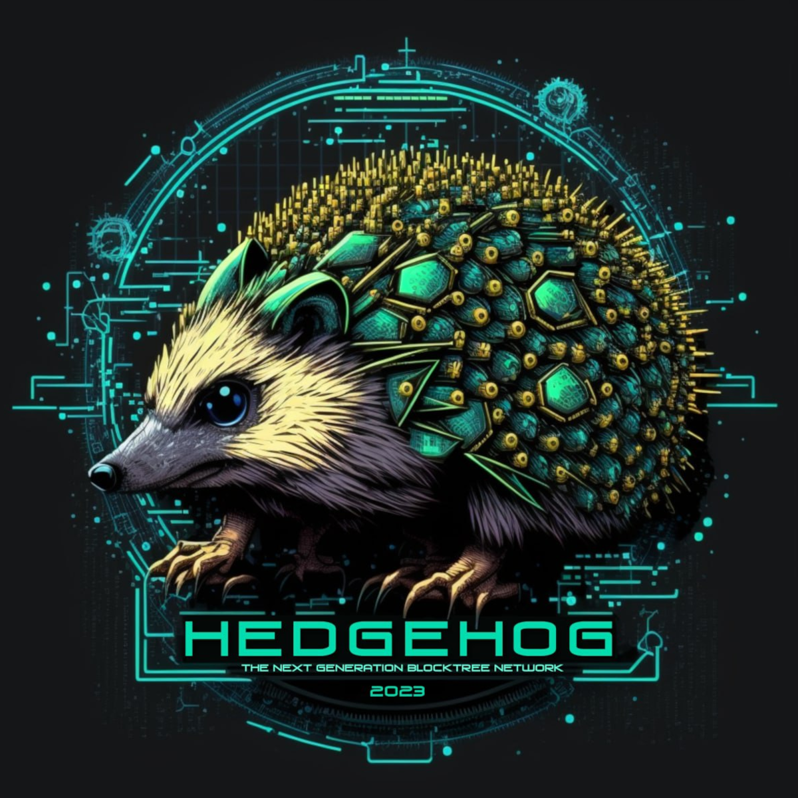

# The Sharded Unigrid Treechain Network

Hedgehog is a high-performance, concurrent peer-to-peer treechain (blockchain) network built on top of [Netty](https://netty.io/) and QUIC. One executable is the network daemon, the command-line client that controls it and a stand-alone key utility.

__What works today:__
- Peer-to-peer distribution over QUIC
- Gridnode sporks: network parameters that take effect only when two network keys have signed them
- Network storage: files encrypted, erasure coded and spread over the gridnodes, which repair lost fragments themselves
- REST interface with an S3-compatible object store
- A signed snapshot of the legacy chain: every address, balance and transaction

__In development or planned:__
- Access to network storage through the S3 API, [Janus](https://github.com/unigrid-project/janus-java) and virtual desktop drives
- Built-in SOCKS5 proxy for VPN-like functionality
- WebAssembly support, compute and GPU workloads
- Duality consensus
- Replacing the network and consensus chain of the [legacy daemon](https://github.com/unigrid-project/daemon)

## Documentation
The [wiki](https://github.com/unigrid-project/hedgehog/wiki) gives a short overview of each part:

- [Architecture overview](https://github.com/unigrid-project/hedgehog/wiki/Architecture-overview)
- [Peer-to-peer network protocol](https://github.com/unigrid-project/hedgehog/wiki/Peer-to-peer-network-protocol)
- [Grid sporks](https://github.com/unigrid-project/hedgehog/wiki/Grid-sporks)
- [REST interface](https://github.com/unigrid-project/hedgehog/wiki/REST-interface)
- [Network storage](https://github.com/unigrid-project/hedgehog/wiki/Network-storage) and [Erasure coding](https://github.com/unigrid-project/hedgehog/wiki/Erasure-coding)
- [Build, testing and native image](https://github.com/unigrid-project/hedgehog/wiki/Build-testing-and-native-image)

## Building and running
Hedgehog requires Java 25+ and [Maven](https://maven.apache.org/). From the Hedgehog directory:

> mvn clean install

This creates `application/target/hedgehog-<version>-jar-with-dependencies.jar`. Start it with `java -jar`, and pass `--help` to see every command and option. Depending on the options, Hedgehog acts as a network daemon, a client or a stand-alone application.

The native executable wraps a JVM and the Hedgehog jar. Build it with `mvn package` inside `native-image`, with `GRAALVM_HOME` pointing at a GraalVM 25 installation. The result is `native-image/target/hedgehog.bin`, or `hedgehog.exe` on Windows.

## Releases
Every release on the [releases page](https://github.com/unigrid-project/hedgehog/releases) carries the executables for Linux, macOS on Apple Silicon and Windows, the runnable jar, and the signed chain snapshot `bootstrap.dat.gz` that `hedgehog bootstrap fetch` downloads. Intel Macs run the jar.

Every asset has a detached signature (`.asc`) made with the Unigrid Foundation release key, [release-key.asc](release-key.asc), fingerprint

> A1CB 0037 B3B9 2D59 5FA1 536C 95A9 8E88 8B0B A5D9

To verify all downloads at once, from the directory that holds them:

> gpg --import release-key.asc
>
> gpg --verify SHA256SUMS.asc SHA256SUMS
>
> sha256sum -c SHA256SUMS

### Cutting a release
Releases are cut from a clean `master` with `release.sh`, which needs `gh` logged in and the secret half of the release key:

1. `./release.sh cut` builds and tests the project, tags `vX.Y.Z`, opens the next snapshot version and pushes. The tag builds the executables and drafts the release.
2. Prepare the snapshot with `bootstrap import` and `bootstrap sign`, as described in [Legacy chain snapshot](https://github.com/unigrid-project/hedgehog/wiki/Legacy-chain-snapshot).
3. `./release.sh publish --bootstrap bootstrap.dat --codename "<Name>"` signs every asset, attaches the snapshot and a signed `SHA256SUMS`, and publishes. Without `--bootstrap` the previous release's snapshot is carried forward.

`./release.sh --help` lists the remaining options.
