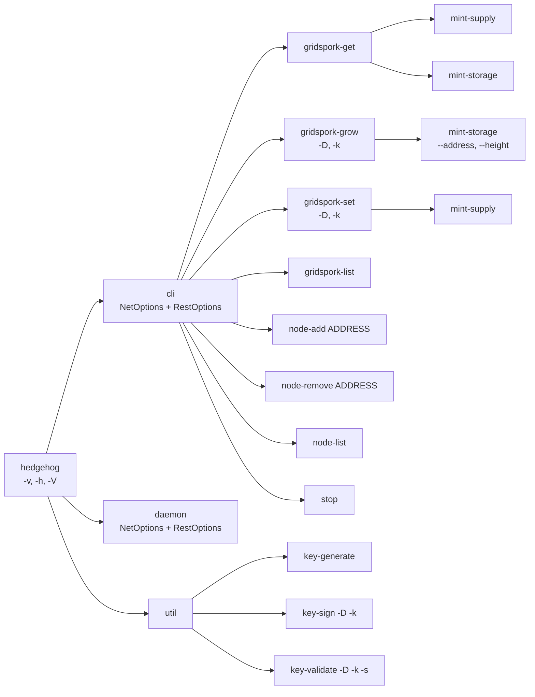
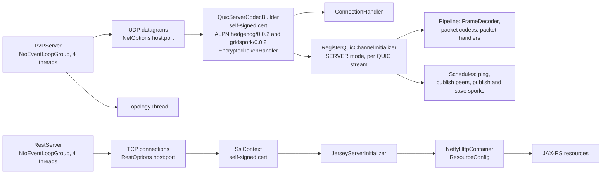
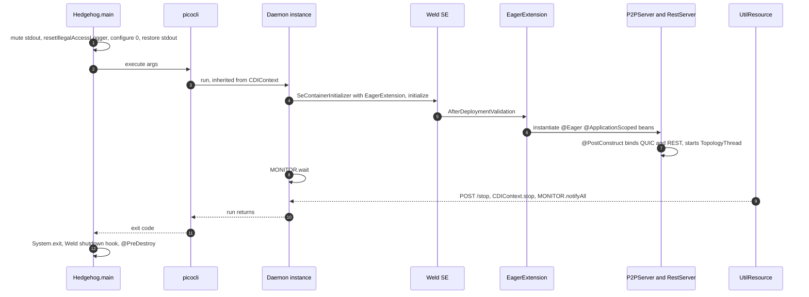
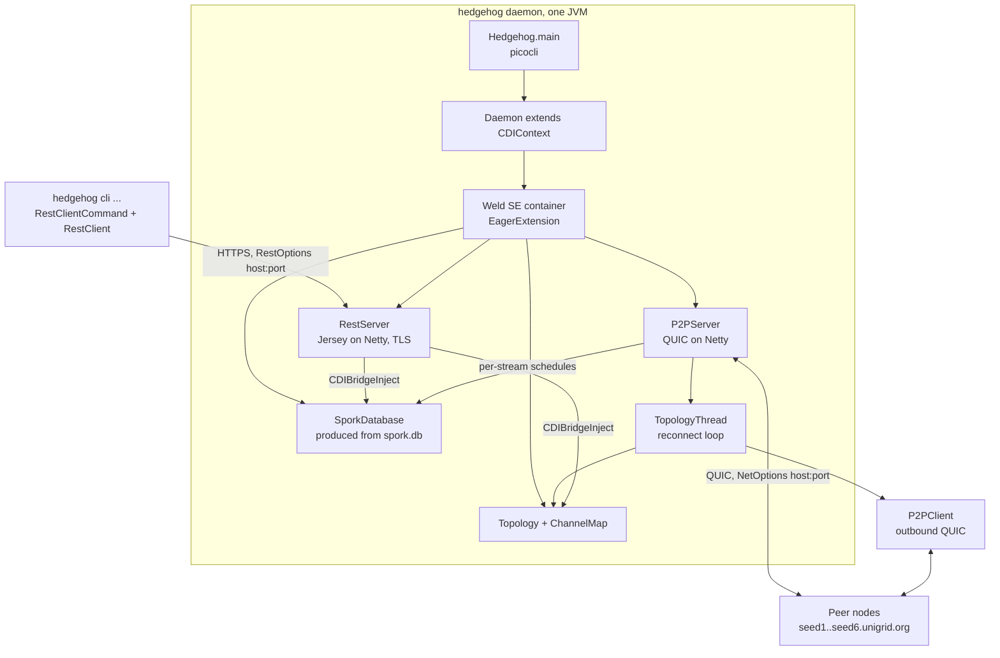

# Architecture overview

Hedgehog is a single Java 17 process that can act as a network daemon, as a REST client against a
running daemon, or as a stand-alone key utility — which of the three it becomes is decided entirely by
the picocli command line. This document maps the three Maven modules, the module system usage, the
command tree with every option, the two servers, the package layout, the on-disk state and the shared
model types that do not belong to any one subsystem. Protocol framing, spork semantics, REST endpoint
detail, CDI mechanics and the toolchain are covered in
[Peer-to-peer network protocol](network-protocol.md), [Grid sporks](sporks.md),
[REST interface](rest-api.md), [CDI container and component lifecycle](cdi-and-lifecycle.md) and
[Build, testing and native image](build-and-native-image.md) respectively.

## Where to start reading

1. `application/src/main/java/org/unigrid/hedgehog/Hedgehog.java` — one small class that defines the
   whole process shape.
2. `application/src/main/java/org/unigrid/hedgehog/command/` — the command tree; `CLI`, `Daemon`,
   `Util`, then `option/NetOptions.java` and `option/RestOptions.java` for the knobs.
3. `application/src/main/java/org/unigrid/hedgehog/model/cdi/CDIContext.java` — how `daemon` starts and
   stops, unpacked in [CDI container and component lifecycle](cdi-and-lifecycle.md).
4. `application/src/main/java/org/unigrid/hedgehog/server/p2p/P2PServer.java` — the QUIC pipeline, and
   from there `model/network/initializer/RegisterQuicChannelInitializer.java` into
   [Peer-to-peer network protocol](network-protocol.md).
5. `application/src/main/java/org/unigrid/hedgehog/server/rest/RestServer.java` and the resources
   beside it, covered in [REST interface](rest-api.md).
6. `application/src/main/java/org/unigrid/hedgehog/model/network/Topology.java` and `TopologyThread.java`
   — how peers are discovered, connected and dropped.
7. `application/src/main/java/org/unigrid/hedgehog/model/spork/` — the state the network actually
   agrees on, described in [Grid sporks](sporks.md).
8. `application/src/test/java/org/unigrid/hedgehog/server/BaseServerTest.java` and `TestServer.java` —
   the fastest way to see a full daemon stood up in-process. The harness behind them lives in
   `application/src/test/java/org/unigrid/hedgehog/jqwik/` and is documented in
   [Build, testing and native image](build-and-native-image.md).

## The three modules

The root `pom.xml` (`org.unigrid.hedgehog:hedgehog-parent`, version `0.0.8-SNAPSHOT`, packaging `pom`)
aggregates three modules.

| Module | Artifact | Contains |
| --- | --- | --- |
| `application` | `hedgehog` | Everything of substance: entry point, commands, servers, network stack, sporks, S3 storage service |
| `common` | `hedgehog-common` | `ApplicationDirectory` and `Version` only; deliberately dependency-light and depended on by both other modules |
| `native-image` | `hedgehog-native` | GraalVM wrapper that bundles a jlink runtime plus the application jar into one executable |

The toolchain around them — pinned plugin versions, the `jar-with-dependencies` assembly that produces
the runnable artifact, the jandex index Weld reads instead of scanning, the OS-activated profiles that
select the platform-specific QUIC native classifier, and resource filtering — is described in
[Build, testing and native image](build-and-native-image.md). Two of its consequences are load-bearing
for this document: the shipped jar declares `Main-Class: org.unigrid.hedgehog.Hedgehog`, and
`application/src/main/resources/META-INF/beans.xml` sets `bean-discovery-mode="annotated"` against the
CDI 4.0 schema with no other content — no `<interceptors>`, no `<alternatives>`.

## The Java Platform Module System

Both `application` and `common` carry a `module-info.java`, and both are compiled as named modules.

`common/src/main/java/module-info.java` declares `org.unigrid.hedgehog.common` and exports exactly one
package, `org.unigrid.hedgehog.common.model`. `application/src/main/java/module-info.java` declares
`org.unigrid.hedgehog` and — this is the point worth internalizing — **exports nothing at all**. Its
only directive beyond `requires` is:

```java
opens org.unigrid.hedgehog.model.s3.entity to jakarta.xml.bind;
```

so that JAXB can reflect over the S3 response entities. Everything else in the application module is
strongly encapsulated. The `requires` list is long and explicit (Netty split into
`io.netty.buffer`/`transport`/`codec`/`handler`/`common`/`incubator.codec.classes.quic`, Jersey split
into `jersey.server`/`client`/`container.netty.http`/`media.json.jackson`/`bean.validation`/`common`/
`hk2`, Weld into `weld.se.core`/`core.impl`/`environment.common`/`spi`, plus `jdk.crypto.ec` for the
P-521 signatures).

Two practical consequences follow:

* **Tests need a long list of module escapes.** Because nothing is exported, `application/pom.xml`
  hands Surefire nine `--add-exports`, thirty-six `--add-opens` and one `--add-reads`, and introducing
  a new bean package or a new serialized type usually means adding a line there. The flag-by-flag
  rationale — which consumer needs which package, and why — belongs to
  [Build, testing and native image](build-and-native-image.md).
* **The shipped fat jar is not run as a module.** The assembly flattens all dependencies into one jar
  and `java -jar` puts it on the classpath, so at runtime the code lives in the unnamed module and the
  module descriptor is inert. JPMS is therefore a compile-time and test-time constraint here, not a
  runtime one. The native image takes the same route: `native-image/templates/run.ftl` emits a
  `bin/java -cp <classPath> <mainClass>` launcher for the non-modular case.

## Runtime entry point

`application/src/main/java/org/unigrid/hedgehog/Hedgehog.java` is the whole of `main`:

```java
final PrintStream stdout = System.out;
System.setOut(new PrintStream(OutputStream.nullOutputStream()));

Reflection.resetIllegalAccessLogger(); /* Try to get rid of the "illegal reflective access..." nags */
ApplicationLogLevel.configure(0); /* Start quiet, if any -v are defined, the setter above is called */

System.setOut(stdout);
System.exit(new CommandLine(Hedgehog.class).execute(args));
```

* **stdout is muted for the duration of startup.** The real `System.out` is stashed, replaced by a
  null stream, and restored before picocli runs. This exists so that nothing emitted while the logging
  subsystem is still at its default level reaches the terminal — in particular the warning from
  `Reflection.resetIllegalAccessLogger()` described below. The mirror image of this happens at
  shutdown: `CDIContext.shutdown(@Observes ContainerShutdown)`
  (`application/src/main/java/org/unigrid/hedgehog/model/cdi/CDIContext.java`) installs a swallowing
  `PrintStream` to suppress Weld's "container ... shut down by shutdown hook" line.
* **`Reflection.resetIllegalAccessLogger()`**
  (`application/src/main/java/org/unigrid/hedgehog/model/util/Reflection.java`) tries to null out
  `jdk.internal.module.IllegalAccessLogger.logger` through `sun.misc.Unsafe`. On Java 17 that class no
  longer exists, so the `Class.forName` fails, the method logs `Unable to choke IllegalAccessLoger`
  and returns — it is effectively a no-op on the supported JDK, kept for older runtimes. The muted
  stdout is what keeps that warning invisible.
* **Verbosity.** `ApplicationLogLevel.configure(0)` sets the Logback root logger to `OFF` before
  parsing, so a run with no `-v` is silent. `-v/--verbose` is declared on a *setter*
  (`Hedgehog.setVerbose(boolean[])`) with `scope = INHERIT`, so picocli calls it during parsing at any
  depth of the command tree and the level is re-applied from the number of occurrences.

| `-v` count | Logback level | Source |
| ---: | --- | --- |
| 0 | `OFF` | `ApplicationLogLevel.LEVELS` |
| 1 | `ERROR` | |
| 2 | `WARN` | |
| 3 | `INFO` | |
| 4 | `DEBUG` | |
| 5 | `TRACE` | |
| 6 or more | `ALL` | `getLevelFromVerbosity` returns `Level.ALL` for `verbosity >= 6` |

`ApplicationLogLevel.getVerbosityFromLevel(Level)` inverts the map and throws
`UnsupportedLogLevelException` for anything not in it (`Level.ALL` included) — pinned by
`application/src/test/java/org/unigrid/hedgehog/model/util/ApplicationLogLevelTest.java`. The parsed
`boolean[]` is also stored in the static `Hedgehog.verbose` with a Lombok `@Getter`, but nothing in the
codebase reads it.

The root `@Command` annotation itself carries `scope = CommandLine.ScopeType.INHERIT`, not just the
`-v` setter. That is a command-level attribute in picocli, so every subcommand and sub-subcommand
inherits the root command's attributes: `mixinStandardHelpOptions` puts `-h`/`-V` on all of them, and
the interpolated banner is reprinted above every usage message. Running `hedgehog cli node-list -h`
prints the four banner lines, then `-h`, `-H`, `--network-keys`, `--[no-]seeds`, `-p`, `-r`, `-R`, `-v`
and `-V` — the six mixin options of `cli`, plus the inherited `-v` and the two inherited help options.

### The banner and `VersionProvider`

The `@Command` header on `Hedgehog` is a six-element array — four ASCII banner lines bracketed by two
blank ones — and the first banner line contains `${HEDGEHOG_VERSION_PAD}${HEDGEHOG_VERSION}`. Those are
not picocli built-ins; they are the system properties named by
`Version.VERSION_PROPERTY_NAME` (`"HEDGEHOG_VERSION"`) and `Version.VERSION_PAD_PROPERTY_NAME`
(`"HEDGEHOG_VERSION_PAD"`), set as a side effect of
`org.unigrid.hedgehog.common.model.Version.getVersion()`:

```java
/* Right-aligns the output of the version string for the header output. With this implementation, the maximum
   length of completeVersion is VERSION_PAD_WIDTH. */

System.setProperty(VERSION_PROPERTY_NAME, completeVersion);
System.setProperty(VERSION_PAD_PROPERTY_NAME,
    StringUtils.rightPad(" ", VERSION_PAD_WIDTH - completeVersion.length())
);
```

`org.unigrid.hedgehog.model.VersionProvider` is an empty subclass of `Version` that implements
picocli's `IVersionProvider`, and is wired in via `versionProvider = VersionProvider.class`.
Constructing `new CommandLine(Hedgehog.class)` is enough to trigger it: after construction the
properties are set and `usageMessage().header()` comes back interpolated, with all four non-empty
banner lines exactly 77 characters wide.
`application/src/test/java/org/unigrid/hedgehog/HedgehogTest.java` asserts precisely that — the number
of header entries sharing the width of `header[1]` must equal `header.length - 2`, the two blank
entries being the exceptions.

`VERSION_PAD_WIDTH` is `42` and the fixed banner prefix ahead of the interpolation is 35 characters
wide, so the line comes out at 77 as long as `completeVersion` is 41 characters or shorter. The
padding is produced with `StringUtils.rightPad(" ", 42 - length)`, which returns the single space it
was handed whenever the requested width is `1` or less; from 42 characters upwards the pad can no
longer shrink and the banner silently misaligns instead of failing.

`Version` reads `application.properties` off the thread context classloader and expects `project.name`
to be exactly two words, since `getAuthor()`, `getName()` and `getVersionNumber()` are
`getVersion()[0].split(" ")[0|1|2]`. The fallbacks are `Unigrid`, `Hedgehog` and `0.0.0-BASTARD`. That
two-word constraint is not cosmetic: `ApplicationDirectory` derives the on-disk paths from
`getAuthor()` and `getName()`, so renaming the project moves the data directory. How the file is
filtered into the build is covered in [Build, testing and native image](build-and-native-image.md).

## Command tree



`CLI` (`command/CLI.java`) and `Util` (`command/Util.java`) are pure containers — neither implements
`Runnable`. So are `GridSporkGet`, `GridSporkSet` and `GridSporkGrow`, which only hold subcommands and,
for the latter two, the shared `-D`/`-k` options. Invoking `hedgehog`, `hedgehog cli` or `hedgehog util`
without a subcommand prints `Missing required subcommand`, the usage message, and exits with status
`2`. `Daemon` (`command/Daemon.java`) is the only top-level command that does anything; it inherits
`run()` from `CDIContext`.

`command/cli/spork/MintSupply.java` and `command/cli/spork/MintStorage.java` are reused as leaves under
more than one parent. Each injects picocli's `@Spec CommandSpec` and branches on
`spec.parent().userObject()` — `GridSporkGet` means read, `GridSporkSet`/`GridSporkGrow` means write —
throwing `UnsupportedOperationException` for any parent that was not accounted for.

## Command reference

Every `cli` leaf command is a REST client against the daemon's REST port; none of them touch the P2P
network directly. The plumbing lives in
`application/src/main/java/org/unigrid/hedgehog/command/util/RestClientCommand.java`, which opens a
`RestClient` against `RestOptions.getHost()`/`getPort()` **over HTTPS** (`isSecure = true`),
dispatches on the HTTP method, and calls the subclass's `execute(Response)`.

`RestClient` treats `200`, `201`, `202`, `204`, `401` and `404` as normal and raises
`ResponseOddityException` (message `"<code> <status> (<reason>)"`) for anything else;
`RestClientCommand.run()` catches it and prints the message on stderr. A `GET` that comes back `204`
and a `PUT` that comes back `401` both take the same branch: `defaultSupplier.ifPresentOrElse(...)`
prints the supplier's value if the command was built with one, and otherwise falls back to
`response.getStatusInfo()`. Only `GridSporkList` and `NodeList` pass a supplier, so both
`gridspork-get` leaves print the bare status line (`No Content`) on a `204`, and an unsigned or wrongly
signed spork update surfaces as `Unauthorized` on the terminal.

| Command | Class | HTTP call | Behavior |
| --- | --- | --- | --- |
| `hedgehog` | `Hedgehog` | — | Banner plus usage; `-V` prints `Unigrid Hedgehog <version>` |
| `cli` | `command/CLI.java` | — | Container; carries the `NetOptions` and `RestOptions` mixins |
| `cli gridspork-get` | `command/cli/GridSporkGet.java` | — | Container for `mint-supply`, `mint-storage` |
| `cli gridspork-get mint-supply` | `command/cli/spork/MintSupply.java` | `GET /gridspork/mint-supply` | Pretty-prints the response body through `Json.parse`; prints `No Content` on `204` |
| `cli gridspork-get mint-storage` | `command/cli/spork/MintStorage.java` | `GET /gridspork/mint-storage` | Pretty-prints the body; `--address`/`--height` are accepted but unused on this path |
| `cli gridspork-set` | `command/cli/GridSporkSet.java` | — | Container for `mint-supply`; declares `-D` and `-k` as `required = true` |
| `cli gridspork-set mint-supply` | `command/cli/spork/MintSupply.java` | `PUT /gridspork/mint-supply` | Body is `--data` as `text/plain`; `--key` is sent in a `privateKey` header; no output on success |
| `cli gridspork-grow` | `command/cli/GridSporkGrow.java` | — | Container for `mint-storage`; declares `-D` and `-k` as `required = true` |
| `cli gridspork-grow mint-storage` | `command/cli/spork/MintStorage.java` | `PUT /gridspork/mint-storage/{address}/{height}` | Same body/header scheme; prints `Both block height and address have to be specified` when the guard trips |
| `cli gridspork-list` | `command/cli/GridSporkList.java` | `GET /gridspork` | Prints the `SporkDatabaseInfo` as pretty JSON; its `No Content` fallback is unreachable, as that endpoint never returns `204` |
| `cli node-add <address>` | `command/cli/NodeAdd.java` | `POST /node` | Sends the `ip:port` parameter as `text/plain`, prints `Response.getLocation()` |
| `cli node-remove <address>` | `command/cli/NodeRemove.java` | `DELETE /node/{address}` | Prints the response read as `Set<Node>` |
| `cli node-list` | `command/cli/NodeList.java` | `GET /node` | Prints the node set as pretty JSON; prints `[]` on `204` |
| `cli stop` | `command/cli/Stop.java` | `POST /stop` | Sends an empty body and ignores the response |
| `daemon` | `command/Daemon.java` | — | Boots the CDI container and blocks (see below) |
| `util` | `command/Util.java` | — | Container; described as "Helpful utility functionality to facilitate network administrators, node runners and users." |
| `util key-generate` | `command/util/KeyGenerate.java` | — | Creates a `Signature` and prints `Private Key: <hex>` and `Public Key: <hex>` |
| `util key-sign` | `command/util/KeySign.java` | — | Signs hex `--data` with hex `--key`, prints the hex signature |
| `util key-validate` | `command/util/KeyValidate.java` | — | Prints `true`/`false` for hex `--data`, public `--key` and `--signature` |

Command-local options:

| Option | Command(s) | Required | Meaning |
| --- | --- | --- | --- |
| `-D`, `--data` | `gridspork-set`, `gridspork-grow` (inherited by their leaves) | yes | JSON describing the spork data; sent verbatim as the request body |
| `-k`, `--key` | `gridspork-set`, `gridspork-grow` (inherited) | yes | Hex private key signing the spork; sent as the `privateKey` header |
| `--address` | `gridspork-*` `mint-storage` | no | Unigrid address for the mint; part of the PUT path |
| `--height` | `gridspork-*` `mint-storage` | no | Block height on the consensus chain; part of the PUT path |
| `<address>` | `node-add`, `node-remove` | positional, index 0 | The `ip:port` combination of the node |
| `-D`, `--data` | `key-sign`, `key-validate` | yes | Hex data to sign / verify |
| `-k`, `--key` | `key-sign`, `key-validate` | yes | Hex private key (sign) or public key (validate) |
| `-s`, `--signature` | `key-validate` | yes | Hex signature to verify |

`--address` and `--height` carry no `required = true`, so picocli never enforces them. The grow path
checks them itself instead, with the runtime guard described below.

Two rough edges in this surface are worth knowing about, and this document is where they are stated in
full:

* `MintStorage` guards its grow path with `ObjectUtils.anyNull(address, height)`, and `height` is
  declared as a primitive `int`. Autoboxing hands `anyNull` an `Integer` that is never null, so only a
  missing `--address` can trip the guard; a missing `--height` silently becomes `0` and is formatted
  straight into the request path as `/gridspork/mint-storage/<address>/0`.
* `NodeRemove.execute` reads the response as `Set<Node>` through a `GenericType`, but
  `NodeResource.remove(...)` answers with `Response.ok().build()` — an empty `200` with no entity.
  `NodeList`, by contrast, pretty-prints through `Json.parse`. The endpoint side of this is in
  [REST interface](rest-api.md).

The key utilities are thin wrappers over
`application/src/main/java/org/unigrid/hedgehog/model/crypto/Signature.java`: `SHA512WithECDSA` over
`secp521r1`. `key-generate` prints a 130-character private key and a 262-character public key, the
latter being the affine X and Y coordinates concatenated. Those widths are not accidental — the no-arg
constructor regenerates keypairs in a loop until both coordinates are exactly `PUBLIC_KEY_SIZE / 2`
(521) bits and the private scalar is exactly `PRIVATE_KEY_SIZE` (520) bits, which pins the
`BigInteger.toString(16)` forms to 131 and 130 hex digits. Keys of any other width are rejected with
`IllegalArgumentException`, with one gap: the guards compare `hex.length() / 2` against
`PRIVATE_KEY_HEX_SIZE` (65) and `PUBLIC_KEY_HEX_SIZE` (131), and that truncating division also lets a
131-character private key and a 263-character public key through. [Grid sporks](sporks.md) takes the
key format apart in full.

## Shared options: `NetOptions` and `RestOptions`

Both mixins live in `application/src/main/java/org/unigrid/hedgehog/command/option/`. Every option
field in them is **`private static`** with a Lombok `@Getter` and `scope = CommandLine.ScopeType.INHERIT`,
which is what makes them readable from anywhere in the process without injection —
`Network.getSeeds()`, `Node.isMe()`, `NetworkKey.getPublicKeys()`, `P2PServer.init()`,
`RestServer.init()` and `RestClientCommand.run()` all read them straight off the class. Neither class
reads an environment variable or a system property; the command line is the only input, and
`${DEFAULT-VALUE}` in the descriptions is picocli's own interpolation of the `defaultValue` attribute.

| Option | Mixin | Type | Default | Consumed by |
| --- | --- | --- | --- | --- |
| `-H`, `--nethost` | `NetOptions` | `String` | `0.0.0.0` | `P2PServer` bind address, `Node.isMe()` |
| `-p`, `--netport` | `NetOptions` | `int` | `52883` (`NetOptions.DEFAULT_PORT`) | `P2PServer` bind port, the port advertised in the `Hello` packet, `Node.isMe()`. The constant itself is what `Node.fromURI` falls back to when a URI carries no port |
| `--seeds` / `--no-seeds` | `NetOptions` | `boolean`, negatable | `true` | `Network.getSeeds()` — returns an empty array when disabled |
| `--network-keys` | `NetOptions` | `String[]`, `split = ","` | three built-in public keys | `NetworkKey.getPublicKeys()`, i.e. which keys may sign sporks |
| `-R`, `--resthost` | `RestOptions` | `String` | `localhost` | `RestServer` bind address, `RestClientCommand` target |
| `-r`, `--restport` | `RestOptions` | `int` | `52884` (`RestOptions.DEFAULT_PORT`) | `RestServer` bind port, `RestClientCommand` target |

Both mixins are attached to `cli` **and** `daemon`, so `-H`/`-p`/`--no-seeds`/`--network-keys` appear
in the help of every `cli` subcommand even though the client-side commands only ever use
`RestOptions`. The reverse also holds: `-R`/`-r` are the pair that actually matter for `cli`.

The `--network-keys` default is three hard-coded hex strings of 262 characters each — the network's
trusted spork signing keys, exactly the width `key-generate` emits. Overriding them replaces the whole
set rather than adding to it, which is the hinge the private-network recipe below turns on.
`NetworkKey.isTrusted(privateKey)` decides trust by signing a random 32-byte blob and verifying it
against every configured public key; [Grid sporks](sporks.md) carries that mechanism in full.

The default network host is `0.0.0.0` while the default REST host is `localhost` — the P2P server is
public by design and the REST control surface is loopback-only by default.

`Network` (`application/src/main/java/org/unigrid/hedgehog/model/Network.java`) holds the rest of the
network-wide constants: protocols `hedgehog/0.0.2` and `gridspork/0.0.2`, seeds `seed1..seed6.unigrid.org`,
`COMMUNICATION_THREADS = 4`, `MAX_DATA_SIZE = 1024 * 1024 * 256` (256 MiB, commented `/* 256 MB */` in
the source), `MAX_STREAMS = 512`, `IDLE_TIME_MINUTES = 15` and `CONNECTION_TIMEOUT_MS = 2000`.
`getSeeds()` swallows a `ClassCastException` around `NetOptions.isSeeds()` with a `TODO` noting it
"only seems to happen during testing" — an artifact of the static-field design meeting JMockit mocking.

## The two servers



`application/src/main/java/org/unigrid/hedgehog/server/AbstractServer.java` is the small shared base:
`getChannel()` is abstract, `getHostName()` and `getPort()` cast the bound channel's `localAddress()`
to an `InetSocketAddress`, and `getChannelId()` returns the channel's Netty `ChannelId`. It also
carries `allocate(String propertyUrl)`, which rewrites a URL onto a port that
`FreePortFinder.findFreeLocalPort(...)` reports as free. Only `RestServer` uses it, and only for the
base URI it hands to Jersey; the Netty channel is bound to `RestOptions.getPort()` directly. When that
port is already occupied the bind throws rather than moving, so the two never diverge in a running
process — [REST interface](rest-api.md) owns the details.

**`server/p2p/P2PServer.java`** is `@Eager @ApplicationScoped`. Its `@PostConstruct` routes Netty's
internal logging to SLF4J, generates a `SelfSignedCertificate`, builds a `QuicServerCodecBuilder` with
the `Network` limits above and the CDI-injected `EncryptedTokenHandler` as QUIC token handler, attaches
a `ConnectionHandler` at connection level and a `RegisterQuicChannelInitializer` in `SERVER` mode at
stream level, then binds a `NioDatagramChannel` to `NetOptions.getHost():getPort()` and starts a
`TopologyThread`. `@PreDestroy` stops the thread, closes the channel and shuts the event loop group
down gracefully. The pipeline it installs, packet by packet, is the subject of
[Peer-to-peer network protocol](network-protocol.md).

**`server/rest/RestServer.java`** is also `@Eager @ApplicationScoped`. It builds a `ResourceConfig`
listing every resource class explicitly (`GridSporkResource`, `MintStorageResource`,
`MintSupplyResource`, `NodeResource`, `VestingStorageResource`, `StorageBucket`, `StorageObject`,
`UtilResource`) plus `JacksonJaxbJsonProvider`, `JsonConfiguration`, `JsonExceptionMapper` and
Jersey's `ValidationFeature`, instantiates Jersey's package-private
`org.glassfish.jersey.netty.httpserver.NettyHttpContainer` and `JerseyServerInitializer` reflectively,
and binds a TLS `NioServerSocketChannel`. It keeps its own private `COMMUNICATION_THREADS = 4` constant
rather than reusing `Network.COMMUNICATION_THREADS`. The endpoints behind it are documented in
[REST interface](rest-api.md).

`TopologyThread` (`model/network/TopologyThread.java`) is the reconnect loop: if the topology is empty
it repopulates from the seeds, then for every known node without a live connection it opens a
`P2PClient` and registers the resulting channel in the `ChannelMap`. Failures drop the node from the
topology. It then sleeps for a back-off that grows with the size of the node set, derived from
`BASE_SECONDS_BETWEEN_RECONNECTS = 30` and `ADDITIONAL_SECONDS_BETWEEN_RECONNECTS_PER_NODE = 3`; the
exact formula and its consequences are in [Peer-to-peer network protocol](network-protocol.md).

`Topology` and `ChannelMap` annotate most of their methods `@Protected @Lock(...)`, but that
interception is not active in the packaged daemon: `ProtectedInterceptor` declares no `@Priority` and
`beans.xml` declares no `<interceptors>`, so the annotated methods run unsynchronized in production
while the test harness enables the interceptor explicitly.
[CDI container and component lifecycle](cdi-and-lifecycle.md) explains the mechanism and the
divergence.

## Daemon lifecycle



`CDIContext.run()` boots Weld SE with `EagerExtension` registered and then parks on a private monitor.
Nothing else keeps the process alive; the servers run on Netty's event loops. `POST /stop`
(`server/rest/UtilResource.java`) calls the static `CDIContext.stop()`, which notifies the monitor,
`run()` returns, `execute()` returns and `System.exit` triggers the JVM shutdown hooks — Weld's hook
then fires `@PreDestroy` on `P2PServer`, `RestServer` and `SporkDatabaseProducer`, which is what
persists `spork.db`.

One structural detail to be aware of: `Daemon` is annotated `@ApplicationScoped` and declares
`@Inject P2PServer` / `@Inject RestServer`, but the instance picocli constructs is not a CDI bean, so
those two fields stay `null` on it. Weld creates its *own* `Daemon` instance to deliver the
`ContainerInitialized` event to `Daemon.start(...)` (whose body is empty). The servers come up because
they are `@Eager`, not because of those injection points. See
[CDI container and component lifecycle](cdi-and-lifecycle.md) for the `@Eager`, `@Protected`/`@Lock`
and `CDIBridge*` machinery.

## Standing up a network

Nothing in the daemon requires the public Unigrid network. A private or test network is assembled out
of options that are each documented above; the ordering is what is not obvious, so it is written out
here once.

1. **Mint a network key.** `hedgehog util key-generate` prints a 130-character private key and a
   262-character public key. The public half becomes the network's trust anchor; the private half is
   what signs spork updates and must be kept off the machines that only serve traffic.
2. **Start the first daemon with that key and no seeds.**

   ```
   hedgehog daemon --no-seeds --network-keys=<public-key-hex> -H 0.0.0.0 -p 52883 -R localhost -r 52884
   ```

   `--no-seeds` makes `Network.getSeeds()` return an empty array, so `Topology.repopulate()` — which
   `Topology.@PostConstruct` calls immediately — leaves the node set empty instead of contacting
   `seed1..seed6.unigrid.org`. `--network-keys` replaces the built-in list outright, so the three
   production keys stop being trusted on this network. Multiple keys are comma-separated
   (`split = ","`).
3. **Start the other daemons the same way**, with the same `--network-keys` value. Two daemons on one
   host need distinct `--netport` values: `Node.isMe()` compares every local interface address paired
   with `NetOptions.getPort()`, and `Topology.addNode` refuses any node that matches, so co-located
   nodes sharing a port can never be introduced to each other.
4. **Introduce the peers.** `hedgehog cli -r 52884 node-add <ip>:<p2p-port>` posts the address to
   `POST /node` on the daemon's REST port; the address in the argument is the *P2P* endpoint of the
   other node, not its REST endpoint. The daemon answers `201` with a `Location` header, `409` if the
   node is already known, `400` on an unparseable address, and `304` when `addNode` refuses — which in
   practice means the address resolved to the daemon itself. `RestClient` does not treat `304` as
   normal, so that last case surfaces as a `ResponseOddityException` message on stderr rather than as
   silence. `TopologyThread` opens the actual QUIC connection on its next pass, so a link appears
   within the reconnect back-off rather than immediately.
5. **Seed the sporks.** The database starts empty, so `GET /gridspork/mint-supply` answers `204` until
   something is written:

   ```
   hedgehog cli -r 52884 gridspork-set mint-supply -D '<json>' -k <private-key-hex>
   hedgehog cli -r 52884 gridspork-grow mint-storage --address <wif> --height <n> -D '<json>' -k <private-key-hex>
   ```

   The private key travels in a `privateKey` header and is checked with `NetworkKey.isTrusted`, so only
   the key from step 1 is accepted; anything else comes back `401` and the CLI prints `Unauthorized`.
   A successful write is flooded to the connected peers as a `PublishSpork` packet.
6. **Verify and stop.** `hedgehog cli node-list` and `hedgehog cli gridspork-list` read the daemon's
   view back; `hedgehog cli stop` shuts it down through `POST /stop` and lets the `@PreDestroy` chain
   persist `spork.db`.

Every `cli` invocation above talks to `RestOptions.getHost()`/`getPort()`, so `-R`/`-r` are needed
whenever the daemon is not on the `localhost:52884` default; the `NetOptions` flags that also appear in
its help are inert on the client side.

## Trust and threat model

The security-relevant properties of a running daemon are spread over several subsystems, so they are
collected here. The short version: **content is authenticated, transport and control are not.**

* **TLS on both sockets is encryption without authentication.** `P2PServer` and `RestServer` each
  generate a fresh `SelfSignedCertificate` at startup, and both shipped clients accept anything:
  `client/RestClient.java` installs `InsecureTrustManagerFactory` together with a hostname verifier
  that returns `true` unconditionally, and `client/P2PClient.java` uses `InsecureTrustManagerFactory`
  for QUIC. An active man in the middle on either socket is not detected.
* **Spork content is authenticated, by exactly one list of keys.** Every spork write is verified with
  `NetworkKey.isTrusted`, which checks a signature against `NetOptions.getNetworkKeys()`. Whoever holds
  a matching private key can rewrite network state; nothing else can. That list is a command-line
  option, so a node started with the wrong `--network-keys` trusts a different authority without any
  other symptom.
* **The signing key is transported in the clear, header-wise.** The CLI sends the raw hex private key
  in a `privateKey` request header on every spork write. It is protected only by the (unauthenticated)
  TLS session, and it lands in whatever logs or shell history the operator keeps. [REST interface](rest-api.md)
  documents the header.
* **The REST surface is unauthenticated end to end.** `POST /stop` kills the daemon, `POST /node` and
  `DELETE /node/{address}` rewrite the topology, and the whole S3-compatible surface
  (`/bucket/...`, `/storage-object/...`) reads and writes files with no credential check at all. The
  only thing standing in front of it is the `localhost` default of `-R/--resthost`; binding it
  anywhere else exposes all of it.
* **The S3 object key is used as a path component without validation.** `ObjectService.put` builds
  `Path.of(dataDir.toString(), bucket, key)` straight from the request path parameters, so a key
  containing traversal segments resolves outside `s3data/`.
* **The QUIC retry token is weakly bound.** `EncryptedTokenHandler` encrypts server name plus client
  address with `AES/CBC/PKCS5Padding` under a key derived from an injected `UUID`, using
  `new IvParameterSpec(new byte[16])` — a fixed all-zero IV. The `UUID` comes from
  `RandomUUIDProducer`, so the key is fresh per process and tokens do not survive a restart.
* **Spork propagation has no origin suppression or hop limit.** A `PublishSpork` received on one
  channel is re-sent to every connected peer; see [Peer-to-peer network protocol](network-protocol.md).

The practical deployment posture that follows is the default one: leave the REST port on loopback,
reach it over SSH or a private link, and keep the network private key on an operator workstation
rather than on the nodes.

## Package map

| Package (`org.unigrid.hedgehog.*`) | Responsibility |
| --- | --- |
| *(root)* | `Hedgehog` — picocli root command and `main` |
| `client` | `P2PClient` (outbound QUIC connection), `RestClient` (JAX-RS client), `ResponseOddityException` |
| `command` | Top-level command groups `CLI`, `Daemon`, `Util` |
| `command.cli` | Operator commands that talk to the daemon over REST, plus the `gridspork-get`/`-set`/`-grow` containers |
| `command.cli.spork` | Spork-typed leaves (`mint-supply`, `mint-storage`) shared by the get/set/grow parents |
| `command.option` | `NetOptions` and `RestOptions` mixins |
| `command.util` | `RestClientCommand` base plus the `key-*` utilities |
| `model` | Cross-cutting types: `Address`, `Json`, `JsonConfiguration`, `Network`, `VersionProvider` |
| `model.cdi` | CDI plumbing: `CDIContext`, `CDIUtil`, `Eager`/`EagerExtension`, `CDIBridgeResource`/`CDIBridgeInject`, `Protected`/`Lock`/`ProtectedInterceptor` |
| `model.collection` | `NullableMap`, `OptionalMap` |
| `model.crypto` | `Signature`, `Signable`, `NetworkKey` and their exceptions |
| `model.function` | `VoidFunction`, `VoidFunctionE` functional interfaces |
| `model.network` | `Topology`, `TopologyThread`, `ChannelMap`, `Node`, `Connection`, `ConnectionContainer` |
| `model.network.channel` | `@ChannelCodec`/`@ChannelHandler`/`@ChannelScheduler` annotations and `ChannelCollector` |
| `model.network.chunk` | `@Chunk`, `ChunkData`, `ChunkGroup` (`DEFAULT`, `GRIDSPORK`), `ChunkType` (`ENCODER`, `DECODER`), `ChunkScanner` |
| `model.network.codec` (+ `.api`, `.chunk`) | Netty encoders/decoders for the wire packets and spork chunks |
| `model.network.handler` | Inbound packet handlers, the connection-level `ConnectionHandler`, and the QUIC `EncryptedTokenHandler` |
| `model.network.initializer` | `RegisterQuicChannelInitializer` — per-stream pipeline and schedule setup |
| `model.network.packet` | Packet value types (`Hello`, `Ping`, `AskPeers`, `PublishPeers`, `PublishSpork`, `AskNodeDetails`) |
| `model.network.schedule` | Periodic per-channel tasks (ping, peer publication, spork publish/save) |
| `model.network.util` | `ByteBufUtils` |
| `model.producer` | CDI producers for `ApplicationDirectory`, `UUID` and `SporkDatabase` |
| `model.s3.entity` | JAXB entities for the S3-compatible responses; the only package the module `opens` |
| `model.spork` | `GridSpork` hierarchy and `SporkDatabase` |
| `model.util` | `ApplicationLogLevel`, `ExceptionUtil`, `Reflection`, `UnsupportedLogLevelException` |
| `server` | `AbstractServer` |
| `server.p2p` | `P2PServer` |
| `server.rest` | `RestServer`, the JAX-RS resources, `JsonExceptionMapper`, `ResourceHelper` |
| `server.rest.entity` | Response value types built by the resources — today just `VersionResponse` |
| `service` | `BucketService`, `ObjectService` — filesystem-backed storage behind the S3 resources |
| `common.model` (module `common`) | `ApplicationDirectory`, `Version` |
| `jqwik` (test tree only) | The test harness: `BaseMockedWeldTest`, `WeldHook`/`WeldSetup`, `MockitHook`, `NamedCDIProvider`, `Instances`, `MockOn`, `SuiteDomain`/`NotNull`, `ArbitraryGenerator`, `TestFileOutput`. Detailed in [Build, testing and native image](build-and-native-image.md) |
| `nativeimage` (module `native-image`) | `NativeImage`, `NativeProperties`, `BundleFeature`, `Unzipper` |
| `nativeimage.windows` | GraalVM substitutions and JNI-free wrappers for the Windows known-folder API |

A few of those deserve a note.

`server.rest.entity` exists for exactly one class today. `UtilResource` is not only the `POST /stop`
endpoint: it also serves `GET /version`, which answers `202` with a `VersionResponse` built from
`Version.getVersionNumber()` and `Network.getProtocols()`. That makes `VersionResponse` the only
place the daemon exposes the `Version` type over the network, and the only way to ask a running node
what protocol versions it speaks without opening a QUIC connection to it.

`model.network.channel` holds an annotation-driven pipeline builder that nothing calls in production.
`ChannelCollector` discovers codecs, handlers and schedules through `org.reflections` and orders them
by `@ChannelCodec.priority()`, but both `P2PServer` and `P2PClient` build their pipelines by hand under
a `// TODO: Add support for ChannelCollector`. Only seven codec classes carry `@ChannelCodec`
(`FrameDecoder` at priority `-10` through `PublishSporkDecoder` at `11`), and nothing at all is
annotated `@ChannelHandler` or `@ChannelScheduler`.
[Peer-to-peer network protocol](network-protocol.md) covers what would happen if it were switched on.

The three otherwise-empty `Package.java` classes — in `model/network/codec`, `model/network/handler`
and `model/network/schedule`, each carrying only `/* Empty on purpose. Just a placeholder for
reflection */` — exist for that collector. `ChannelCollector.locations(...)` falls back to
`ClasspathHelper.forClass(defaultLocation)` when no explicit URL is given, and each collect method
passes its package's `Package.class` as that default, which is how the scan gets a classpath root per
package without naming a real class that might move.

The `.chunk` scanner, by contrast, is live: `ChunkScanner.scan(...)` builds the chunk codec lookup used
by the spork codecs. And `commons-configuration2` is on the dependency list purely for its `LockMode`
enum, used by `@Lock`.

## Shared model types

| Type | File | Purpose |
| --- | --- | --- |
| `Address` | `model/Address.java` | A Lombok `@Data @Builder` holder for a single `wif` string; `Serializable` |
| `Json` | `model/Json.java` | `Json.parse(T)` — pretty-prints an object, or re-prints a `String` as a parsed tree; returns the literal `"Invalid JSON"` and logs at error level on failure |
| `JsonConfiguration` | `model/JsonConfiguration.java` | JAX-RS `ContextResolver<ObjectMapper>` registered on both server and client: `JavaTimeModule`, dates not written as timestamps, timestamps not read as nanoseconds, unknown properties ignored |
| `NullableMap` | `model/collection/NullableMap.java` | `Map.of`-style factories for up to seven pairs that, unlike `Map.of`, tolerate null keys and values |
| `OptionalMap` | `model/collection/OptionalMap.java` | `AbstractMapDecorator` adding `getOptional(K)` |
| `VoidFunction` / `VoidFunctionE` | `model/function/` | No-arg, void functional interfaces; the `E` variant declares a checked exception |
| `ApplicationLogLevel` | `model/util/ApplicationLogLevel.java` | Verbosity to Logback level mapping and root logger configuration |
| `ExceptionUtil` | `model/util/ExceptionUtil.java` | `swallow(function, exceptions...)` — runs a `VoidFunctionE`, logs the listed exception types at trace level and rethrows everything else |
| `Reflection` | `model/util/Reflection.java` | `resetIllegalAccessLogger()`, `getDeclaredFieldsWithParents()`, `getConstructor()` (accessible), `invoke()`, `getFieldValue()` |
| `ApplicationDirectory` | `common/.../ApplicationDirectory.java` | Per-user data/config/cache/log directories via `net.harawata:appdirs` |
| `Version` | `common/.../Version.java` | Reads `application.properties`, exposes author/name/version and sets the banner system properties |

`ApplicationDirectory.create()` derives the author and name from `Version` and lowercases both when
`SystemUtils.IS_OS_UNIX && !SystemUtils.IS_OS_MAC`, which is why the Linux paths are `hedgehog` and the
Windows/macOS ones are `Hedgehog`. It is produced as a CDI bean by
`model/producer/ApplicationDirectoryProducer.java`, and mocked in tests by
`application/src/test/java/org/unigrid/hedgehog/model/ApplicationDirectoryMockUp.java`, which redirects
the directories to fresh temporary ones.

## Application state on disk

Only `getUserDataDir()` is used by the code today; `getUserConfigDir()`, `getUserCacheDir()` and
`getUserLogDir()` exist but have no callers, and no configuration file is read at startup — the
command line is the entire configuration surface.

| Platform | User data directory (as resolved by appdirs 1.2.1) |
| --- | --- |
| Linux/UNIX | `$XDG_DATA_HOME/hedgehog`, defaulting to `~/.local/share/hedgehog` |
| macOS | `~/Library/Application Support/Hedgehog` |
| Windows | `%APPDATA%\Unigrid\Hedgehog` (roaming; the author component appears only on Windows) |

The remaining directories, should they ever be used, follow the same library: `~/.config/hedgehog`,
`~/.cache/hedgehog` and `~/.cache/hedgehog/logs` on Linux; `~/Library/Preferences`, `~/Library/Caches`
and `~/Library/Logs` under the app name on macOS; `%LOCALAPPDATA%\Unigrid\Hedgehog\Cache` and
`...\Logs` on Windows.

What ends up in the data directory:

| Path | Written by | Contents |
| --- | --- | --- |
| `spork.db` | `model/producer/SporkDatabaseProducer.java` on `@PreDestroy`, and `model/network/schedule/PublishAndSaveSporkSchedule.java` on every run of its timer | Java-serialized `SporkDatabase` (`SporkDatabase.SPORK_DB_FILE`), via commons-lang `SerializationUtils` |
| `s3data/<bucket>/<key>` | `service/BucketService.java`, `service/ObjectService.java` | Buckets are directories, objects are plain files |
| `<sha-1 hash>/` | `native-image` module, `NativeImage.main` | The unpacked jlink runtime, keyed by a hash of the bundled archive; `--force-unpack` re-extracts it |

`SporkDatabaseProducer` is deliberately forgiving on load — a missing file or an incompatible
serialized form both yield a fresh empty database and a warning rather than a failure to start. The
branch-by-branch behavior, and what an incompatible form means for the spork format, belong to
[Grid sporks](sporks.md).

## Runtime picture



The REST resources reach CDI beans through `CDIBridgeResource`/`@CDIBridgeInject` rather than plain
`@Inject`, because Jersey (HK2) instantiates them, not Weld — the base class resolves the annotated
fields from `CDI.current()` in its `@PostConstruct`.

## Known rough edges

Collected here so they are not a surprise while reading the code:

- **`Reflection.resetIllegalAccessLogger()` cannot work on Java 17.** The class it targets,
  `jdk.internal.module.IllegalAccessLogger`, was removed from the JDK, so the method always logs
  `Unable to choke IllegalAccessLoger` and returns. It is kept for older runtimes.
- **The Jersey base URI and the REST bind port are computed separately.** `AbstractServer.allocate(...)`
  picks a free port for the URI handed to Jersey while `RestServer` binds the socket to
  `RestOptions.getPort()`; when that port is occupied the bind fails outright rather than moving to
  the free one. See [REST interface](rest-api.md).
- **`RestServer` duplicates `COMMUNICATION_THREADS = 4`** as a private constant instead of using
  `Network.COMMUNICATION_THREADS`, so the two event loop groups can drift apart unnoticed.
- **`@Protected`/`@Lock` is inert in the packaged application.** `ProtectedInterceptor` carries no
  `@Priority` and `beans.xml` enables no interceptors, so every annotated method on `Topology` and
  `ChannelMap` runs unsynchronized in the daemon — while the test harness enables the interceptor
  explicitly and therefore does not reproduce the production behavior. See
  [CDI container and component lifecycle](cdi-and-lifecycle.md).
- **`ChannelCollector` is implemented but unused.** `P2PServer` and `P2PClient` both build their
  pipelines by hand under a `// TODO: Add support for ChannelCollector`, and its single test prints
  the collected list without asserting anything about it, so it is exercised rather than tested. See
  [Peer-to-peer network protocol](network-protocol.md).
- **`Daemon`'s `@Inject` fields are never populated.** The instance picocli constructs is not a CDI
  bean, so `p2pServer` and `restServer` stay `null` on it; the servers come up because they are
  `@Eager`.
- **`NetOptions`/`RestOptions` are process-global static state.** Convenient for the servers, but the
  test suite has to mock them with JMockit (`@Mocked NetOptions` in
  `application/src/test/java/org/unigrid/hedgehog/server/BaseServerTest.java`), and `Network.getSeeds()`
  is left catching a `ClassCastException` its own `TODO` cannot explain.
- **Both TLS surfaces use self-signed certificates** that the shipped clients accept unconditionally,
  and the entire REST control surface is unauthenticated. See the trust and threat model above.
- **`MintStorage`'s null guard cannot see a missing `--height`,** and `NodeRemove` reads an entity the
  daemon never sends. Both are written out under the command reference above.
