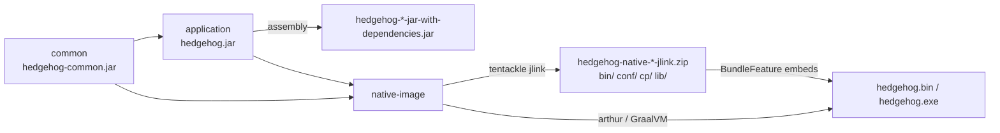
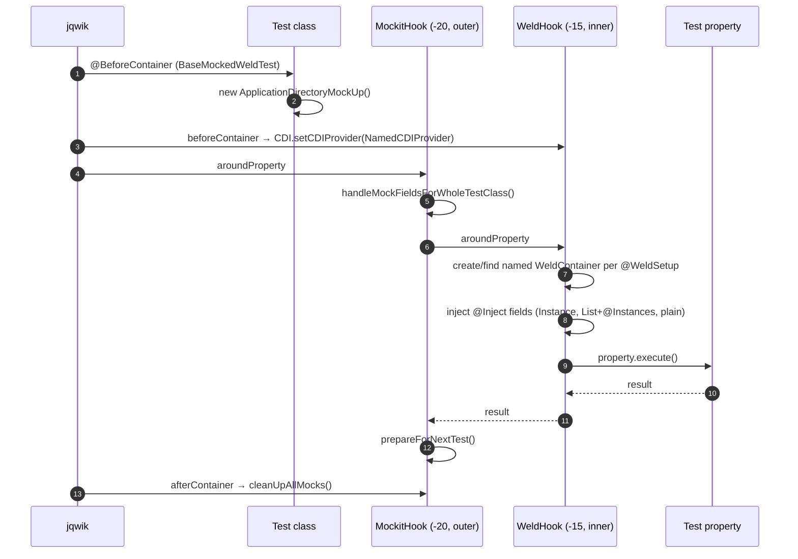
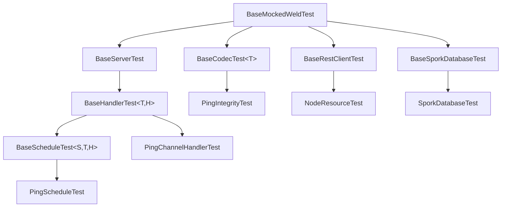

# Build, testing and native image

Hedgehog is built by a three-module Maven reactor rooted at `pom.xml`. The reactor produces three
things a developer or operator actually consumes: a thin `hedgehog` jar, a self-contained
`jar-with-dependencies` fat jar, and a per-platform executable that embeds a jlink JVM image. This
document covers the reactor and its plugin set, the exact commands, the third-party dependency
inventory, the test infrastructure under `application/src/test/java/org/unigrid/hedgehog/jqwik/`, the
`native-image` module, the GitHub workflows, the repository layout and the license header convention.

For what the built binary *does*, see [Architecture overview](architecture.md),
[Peer-to-peer network protocol](network-protocol.md), [Grid sporks](sporks.md),
[REST interface](rest-api.md) and
[CDI container and component lifecycle](cdi-and-lifecycle.md).

## The Maven reactor

The parent is `org.unigrid.hedgehog:hedgehog-parent:0.0.8-SNAPSHOT` with `pom` packaging. All three
modules carry the same version and inherit from it.

| Module | Artifact | Contains |
| --- | --- | --- |
| `application` | `org.unigrid.hedgehog:hedgehog` | The daemon, CLI, network stack, REST resources, sporks — everything of substance. Only module with tests. |
| `common` | `org.unigrid.hedgehog:hedgehog-common` | `ApplicationDirectory` and `Version` only (`common/src/main/java/org/unigrid/hedgehog/common/model/`). |
| `native-image` | `org.unigrid.hedgehog:hedgehog-native` | The GraalVM launcher, jlink bundling and the Windows known-folder substitutions. |

`<modules>` lists them as `application`, `common`, `native-image`; Maven reorders by dependency, so
the effective order is `common` → `application` → `native-image`.

Both `application` and `common` are JPMS modules — `application/src/main/java/module-info.java`
declares `module org.unigrid.hedgehog` and `common/src/main/java/module-info.java` declares
`module org.unigrid.hedgehog.common`, which `exports org.unigrid.hedgehog.common.model`. The
`native-image` module has no `module-info.java`.

Five versions are pinned centrally in the parent `<dependencyManagement>` and referenced without a
version by the modules that need them:

| Artifact | Version |
| --- | ---: |
| `net.harawata:appdirs` | `1.2.1` |
| `org.projectlombok:lombok` | `1.18.24` |
| `ch.qos.logback:logback-classic` | `1.3.16` |
| `org.slf4j:slf4j-api` | `2.0.18` |
| `org.slf4j:jul-to-slf4j` | `2.0.18` |

`slf4j-api` is managed even though no module declares it directly: `logback-classic` and
`jul-to-slf4j` each carry their own transitive pin, and without the managed entry the nearest-wins
rule resolves the API at the version `logback-classic` happens to depend on rather than the one
`jul-to-slf4j` was compiled against.

Central pinning is not uniform. `native-image/pom.xml:15` declares its own
`<graal.version>22.3.0</graal.version>` property, which is the single point that drives the
`org.graalvm.sdk:graal-sdk` and `org.graalvm.nativeimage:svm` dependency versions, Arthur's
`<graalVersion>${graal.version}.r17</graalVersion>`, the Windows GraalVM download URL and the Windows
`native-image.cmd`/`gu.cmd` paths — bumping GraalVM is a one-line change inside `native-image`.
`application/pom.xml:61-65` pins `org.graalvm.sdk:graal-sdk` at a separate literal `22.3.0` that the
property does not reach, so a GraalVM bump is really two edits. The annotation processor versions,
by contrast, are hard-coded per module and duplicated (see *Compiler and annotation processors*
below).

The parent also declares an empty `<surefireArgLine />` property, repeated verbatim in every module
pom. This exists so the `@{surefireArgLine}` late-replacement token in the surefire `argLine`
resolves to nothing when JaCoCo's `prepare-agent` has not run, instead of failing the build.

`<scm><developerConnection>` points at `scm:git:https://github.com/unigrid-project/hedgehog.git`.



## The plugin set

Ten plugins are version-managed in the parent's `<pluginManagement>` — release, JaCoCo, build-helper,
surefire, compiler, assembly, checkstyle, site, project-info-reports and socomo. Each module then
re-declares the ones it wants in its own `<build><plugins>`, and a module that does not re-declare a
managed plugin does not run it.

Re-declaration is not uniform, and it is not configuration-free:

- Bare re-declarations that simply inherit the managed configuration: checkstyle, site and
  project-info-reports in all three modules, plus JaCoCo and build-helper in `common`
  (`common/pom.xml:42-49`) and `native-image` (`native-image/pom.xml:150-157`).
- Re-declarations that carry their own configuration overriding or extending the managed one:
  surefire, compiler and socomo in all three modules; JaCoCo, build-helper and assembly in
  `application` (`application/pom.xml:261-424`); assembly in `native-image`.
- `maven-release-plugin` is never re-declared by any module. It is managed in the parent only and is
  invoked on demand.
- `maven-assembly-plugin` is absent from `common`, which produces no fat jar.

The rest (jandex, tentackle-jlink, Arthur, dependency, download, antrun, exec) are declared and
configured directly in the module that needs them, and PMD and SpotBugs appear only under
`<reporting>`.

| Plugin | Version | Bound to | Purpose |
| --- | ---: | --- | --- |
| `build-helper-maven-plugin` | 3.3.0 | `initialize` (`cpu-count`) | Computes `system.numcores`, the surefire fork count. |
| `jacoco-maven-plugin` | 0.8.8 | `initialize`/`pre-integration-test`/`verify` | Coverage agent and report. |
| `maven-surefire-plugin` | 3.0.0-M7 | `test` | Runs the jqwik suite. |
| `maven-compiler-plugin` | 3.10.1 | `compile` | `release` 17, `showDeprecation`, annotation processors. |
| `jandex-maven-plugin` | 1.2.3 | `process-classes` | Writes `META-INF/jandex.idx` (application only). |
| `maven-assembly-plugin` | 3.4.2 | `package` | Fat jar. |
| `tentackle-jlink-maven-plugin` | 17.12.0.0 | `package` | jlink runtime image (native-image only). |
| `maven-dependency-plugin` | 3.4.0 | `package` (`properties`) | Exposes `${groupId:artifactId:jar}` paths to Arthur (native-image only). |
| `download-maven-plugin` | 1.6.8 | `process-resources` (`wget`) | Fetches the GraalVM CE zip (native-image, Windows profile only). |
| `maven-antrun-plugin` | 3.1.0 | `package` (`run`) | Unzips that GraalVM zip (native-image, Windows profile only). |
| `exec-maven-plugin` | 3.1.0 | `package` (`exec`) | Runs `gu.cmd install native-image` (native-image, Windows profile only). |
| `arthur-maven-plugin` | 1.0.5 | `package` | GraalVM `native-image` invocation (native-image only). |
| `maven-checkstyle-plugin` | 3.1.2 | `verify` (`check`) | Style enforcement — fails the build. |
| `socomo-maven` | 2.3.1 | `package` (`analyze`) | Package-composition report. |
| `maven-release-plugin` | 3.0.0 | on demand | Release/tag conventions. |
| `maven-site-plugin` | 3.12.0 | `site` | Site generation. |
| `maven-project-info-reports-plugin` | 3.3.0 | `site` | Site reports. |
| `maven-pmd-plugin` | 3.16.0 | `<reporting>` only | PMD report during `mvn site`. |
| `spotbugs-maven-plugin` | 4.6.0.0 | `<reporting>` only | SpotBugs report during `mvn site`. |

The three Windows-only plugins are a two-part declaration: their executions live in a
`<pluginManagement>` block inside the `Windows` profile (`native-image/pom.xml:42-97`), while
`<build><plugins>` carries only the bare artifact plus version (`native-image/pom.xml:232-246`). On a
non-Windows host the bare declarations therefore contribute no executions and the plugins do nothing.

### Fork count and the JMockit agent

`build-helper:cpu-count` defines the property `system.numcores`. Its `factor` is `0.3` in the parent
and `0.2` in `application/pom.xml`. The mojo computes `availableProcessors() * factor`, clamps to a
minimum of `1` and truncates to an integer — so on a 16-core machine `application` gets 3 forks and
`common`/`native-image` get 4. Surefire then uses `<forkCount>${system.numcores}</forkCount>` with
`<reuseForks>false</reuseForks>`, meaning each test class gets a fresh JVM and up to `system.numcores`
JVMs run concurrently. Fresh forks matter here: the suite mutates static state (picocli option
holders, `NetworkKey`, the Weld container registry) and JMockit's `MockUp` instrumentation is
process-global.

Every module's surefire `argLine` starts with the same three entries:

```
@{surefireArgLine}
-javaagent:"${settings.localRepository}"/com/github/hazendaz/jmockit/jmockit/1.49.3/jmockit-1.49.3.jar
-Dorg.jboss.netty.debug=true
```

`@{surefireArgLine}` is the late-replacement token JaCoCo's `prepare-agent` fills in.
The JMockit javaagent path is hard-coded against `${settings.localRepository}`, which is why
`com.github.hazendaz.jmockit:jmockit:1.49.3` is also declared as a normal `test` dependency — the
dependency makes Maven download the jar to the exact coordinate the `-javaagent` path expects.
Changing the JMockit version means editing the version in five places: the four surefire `argLine`
blocks (`pom.xml:126`, `common/pom.xml:57`, `application/pom.xml:306`, `native-image/pom.xml:165`)
plus the `application` test dependency (`application/pom.xml:203-208`).

Surefire also sets `<trimStackTrace>false</trimStackTrace>` and the system property
`testoutput.target=${project.build.directory}`, which `TestFileOutput` reads (see below).

### The surefire JPMS flag block

`application/pom.xml` replaces the inherited surefire configuration wholesale and appends 47 JPMS
flags — 36 `--add-opens`, nine `--add-exports` and two `--add-reads` — plus
`<enableAssertions>true</enableAssertions>` (the flags at `application/pom.xml:304-355`,
`enableAssertions` at `application/pom.xml:362`). This block is the single place where the module
boundaries declared in `application/src/main/java/module-info.java` are opened up, and both
[Architecture overview](architecture.md) and
[CDI container and component lifecycle](cdi-and-lifecycle.md) refer back to it.

The flags exist because the tests run against the named module `org.unigrid.hedgehog` while the test
classes themselves and several libraries need reflective access into its packages. `module-info.java`
opens nothing to them, and the test classes are compiled into the same module but are read by jqwik
and JMockit from the unnamed module, so every consumer has to be named explicitly.

The 36 `--add-opens` group by the module being opened *to*:

| Opened to | Count | Why |
| --- | ---: | --- |
| `weld.core.impl` | 14 | Weld constructs beans and proxies by reflection: `command`, `model`, `model.cdi`, `model.network`, `model.network.handler`, `model.producer`, `model.spork`, `server`, `server.p2p`, `server.rest`, `service`, `jqwik` and the root `org.unigrid.hedgehog` package — 13 distinct packages, because the `service` line appears twice (see below). |
| `ALL-UNNAMED` | 15 | The test classes, jqwik's arbitrary generation and JMockit's instrumentation, including `java.base/{java.lang,java.math,java.net,java.time,java.util}`. |
| `info.picocli` | 5 | picocli reflects over the option holders and command classes: `command`, `command.cli`, `command.cli.spork`, `command.option`, `command.util`. |
| `org.apache.commons.lang3` | 2 | Commons Lang `FieldUtils` writes private fields in `model.network` and `model.producer`. |

The nine `--add-exports` name compile-visible packages rather than reflective ones: three to
`com.fasterxml.jackson.databind` (`model`, `model.network`, `model.spork`), two to `info.picocli`
(`model` and the root package), one each to `ALL-UNNAMED` (`jqwik`), `weld.core.impl` (`model.cdi`),
`jersey.server` (`server.rest`) and `org.unigrid.hedgehog.common` (`model`).

The two `--add-reads` cover opposite problems. `org.unigrid.hedgehog.common=org.unigrid.hedgehog`
reverses the normal dependency direction so that `common` can read back into `application`, which is
what `ApplicationDirectoryMockUp` needs in order to mock `ApplicationDirectory` from the test tree.
`org.unigrid.hedgehog=org.apache.commons.io` is required because Commons IO ships a real module
descriptor, and `TestFileOutput` calls `FileUtils.writeStringToFile` from inside the named module
while `module-info.java` — which describes the main sources only — has no reason to require a
test-scoped dependency. Without it the four tests that write sample output through `TestFileOutput`
fail with `IllegalAccessError`.

Introducing a package under `org.unigrid.hedgehog` that Weld, picocli or Jackson must reflect over
normally means adding a corresponding line to this block; a missing line surfaces as an
`InaccessibleObjectException` or as a Weld deployment failure inside the test fork, never at compile
time. Two quirks are worth knowing: `--add-opens org.unigrid.hedgehog/org.unigrid.hedgehog.service=weld.core.impl`
appears twice (once indented with spaces rather than tabs, breaking the file's tab convention), and
the `common`/`native-image` surefire blocks carry no JPMS flags at all — neither module has a
`src/test` tree that would need them.

### JaCoCo

Three executions, declared in the parent's `<pluginManagement>` (`pom.xml:66-100`) and repeated in
`application` (`application/pom.xml:261-299`); `common` and `native-image` declare the plugin bare and
inherit them:

| Execution id | Goal | Phase | Effect |
| --- | --- | --- | --- |
| `pre-unit-test` | `prepare-agent` | `initialize` (goal default) | Sets `surefireArgLine`, appending to `target/jacoco.exec`. |
| `pre-invoker-test` | `prepare-agent` | `pre-integration-test` | Sets `invoker.mavenOpts` against the same `.exec` file. |
| `default-report` | `report` | `verify` (goal default) | Writes `${project.basedir}/target/jacoco-results/`. |

The `application` copy is not quite verbatim: both `prepare-agent` executions qualify `destFile` as
`${project.basedir}/target/jacoco.exec` where the parent uses the bare relative `target/jacoco.exec`.
The `default-report` `dataFile` is `${project.basedir}`-qualified in both.

Both `prepare-agent` executions use `<append>true</append>`, which is what makes a shared
`jacoco.exec` work across the many non-reused forks. There is no invoker plugin in the reactor, so
`pre-invoker-test` currently has no consumer.

### Compiler and annotation processors

`maven-compiler-plugin` 3.10.1 is version-managed in the parent and re-declared with configuration in
every module: `<release>17</release>` and `<showDeprecation>true</showDeprecation>` everywhere, plus
an `<annotationProcessorPaths>` list in `application` and `common`.

| Module | Processor path | Version |
| --- | --- | ---: |
| `application` | `org.projectlombok:lombok` | 1.18.24 |
| `application` | `info.picocli:picocli-codegen` | 4.7.0 |
| `common` | `org.projectlombok:lombok` | 1.18.24 |
| `native-image` | *(none)* | — |

Declaring `annotationProcessorPaths` at all is what makes Lombok run under JPMS compilation, where a
processor found on the plain classpath would not be picked up. Two version traps live here, both of
the same kind the JMockit agent path suffers from:

- The Lombok processor version is hard-coded as `1.18.24` in `application/pom.xml:388-392` and
  `common/pom.xml:75-79` rather than taken from the parent `<dependencyManagement>`, which pins the
  same `1.18.24` for the compile-scope dependency. The three copies can drift apart silently.
- `info.picocli:picocli-codegen` is pinned at `4.7.0` (`application/pom.xml:393-397`) while the
  `info.picocli:picocli` runtime dependency is `4.7.3` (`application/pom.xml:66-70`). The codegen
  processor and the library it generates metadata for are therefore a patch release apart.

### Checkstyle

`checkstyle.xml` at the repository root, enforced by `maven-checkstyle-plugin` running Checkstyle
`9.3`. The `check` goal binds to `verify` by default, so `mvn install` and `mvn verify` fail on a
violation while `mvn test` does not. `configLocation` is the relative path `../checkstyle.xml`, which
resolves correctly only for modules exactly one directory below the root. `**/module-info.java` is
excluded.

The rules that most often bite:

| Rule | Setting |
| --- | --- |
| `LineLength` | max `125` |
| `Indentation` | `basicOffset`, `caseIndent`, `throwsIndent`, `lineWrappingIndentation`, `arrayInitIndent` all `8`; `braceAdjustment` `0` |
| `RegexpSinglelineJava` | format `^ \|^\t +\t+` — "Indent must use tab characters" |
| `RegexpSingleline` | `\s+$` — no trailing whitespace |
| `CyclomaticComplexity` | max `6` |
| `EmptyLineSeparator` | no multiple empty lines, inside members either; blank line between fields optional |
| `VisibilityModifier` | `protectedAllowed=true` |
| `AnnotationLocation` | same-line multiple and parameterized annotations allowed |

`MagicNumber` is present but commented out. `SuppressWarningsHolder`/`SuppressWarningsFilter` are
enabled, so `@SuppressWarnings("checkstyle:MethodName")` works — the Windows C-interface wrappers use
exactly that for their `IIDFromString`
(`native-image/src/main/java/org/unigrid/hedgehog/nativeimage/windows/Ole32Wrapper.java:65-67`) and
`SHGetKnownFolderPath`
(`native-image/src/main/java/org/unigrid/hedgehog/nativeimage/windows/Shell32Wrapper.java:81-83`)
natives, whose names have to keep their Win32 capitalization.

`checkstyle-suppress.xml` is loaded through two optional `SuppressionXpathFilter` entries (once as
`../checkstyle-suppress.xml`, once as `checkstyle-suppress.xml`, both `optional=true`). It holds three
`suppress-xpath` entries covering two checks: `EmptyLineSeparator` on interface method declarations,
and two `Indentation` suppressions on continued string concatenations (`//PLUS[./STRING_LITERAL]` and
its parent), which is what allows the multi-line network key literals in
`application/src/main/java/org/unigrid/hedgehog/command/option/NetOptions.java`.

### PMD

`pmd.xml` at the repository root is referenced only from `<reporting>`, in all three module poms and
the parent. PMD therefore never fails a build; it runs under `mvn site`. Note that `<ruleset>` uses
`${project.basedir}/pmd.xml`, which resolves to a per-module path — the file only exists at the root,
so the reference is satisfied for the parent and broken for the modules.

The ruleset starts from PMD's internal aggregate `rulesets/internal/all-java.xml` and excludes 30
rules outright (`LawOfDemeter`, `OnlyOneReturn`, `CommentRequired`, `ShortVariable`, `DoNotUseThreads`,
`MethodArgumentCouldBeFinal`, …). Nine rules are then re-added from the same aggregate with
`violationSuppressXPath` properties that allow project idioms through:

| Re-added rule | Suppressed when |
| --- | --- |
| `ImmutableField` | The declaring type carries Lombok `@Setter` (`pmd.xml:37-42`). |
| `LocalVariableCouldBeFinal` | The variable is a `ForStatement` loop variable (`pmd.xml:43-47`). |
| `ProperLogger` | The field carries `@Inject` — the CDI-injected loggers (`pmd.xml:48-52`). |
| `SignatureDeclareThrowsException` | The enclosing method carries `@Test` (`pmd.xml:53-58`). |
| `SingularField` | The field carries Lombok `@Getter` (`pmd.xml:59-64`). |
| `TestClassWithoutTestCases` | The file contains any `@Test` annotation (`pmd.xml:65-70`). |
| `UnusedPrivateField` | The field carries `@Getter`, `@Setter` or `@Drone` (`pmd.xml:71-76`). |
| `UnusedPrivateMethod` | The method takes an `@Observes` parameter — CDI event observers (`pmd.xml:77-82`). |
| `UseUtilityClass` | A Lombok `*ArgsConstructor` with an explicit `AccessLevel`, or `@Getter`/`@Setter` (`pmd.xml:83-88`). |

Three `category/...` rules are tuned on top of that: `codestyle.xml/ConfusingTernary` with
`ignoreElseIf=true` (`pmd.xml:89-93`), `design.xml/SignatureDeclareThrowsException` with
`IgnoreJUnitCompletely=true` plus a `violationSuppressXPath` covering `@Override` methods and
interface declarations (`pmd.xml:94-99`), and `design.xml/CognitiveComplexity` with `reportLevel=10`
(`pmd.xml:100-104`). `SignatureDeclareThrowsException` is therefore configured twice — once through
the `all-java.xml` aggregate and once through its `design` category — with different suppressions.

### Socomo

`pl.gdela:socomo-maven` 2.3.1, declared everywhere with an explicit `org.ow2.asm:asm:9.1` plugin
dependency that overrides the version socomo would otherwise resolve. The `analyze` goal binds to
`package` in all three modules (`application/pom.xml:452-469`, `common/pom.xml:97-115`,
`native-image/pom.xml:306-323`) and writes a `socomo.html` package-composition diagram next to the
module pom. The `.gitignore` pattern `socomo.html` has no leading slash, so it matches at any depth: a
`socomo.html` from an earlier run may sit next to each of `application/`, `common/` and
`native-image/` in a working tree, untracked.

### Assembly

`application/pom.xml` binds `assembly:single` to `package` with `application/assembly.xml`:

```xml
<assembly>
	<id>jar-with-dependencies</id>
	<formats><format>jar</format></formats>
	<includeBaseDirectory>false</includeBaseDirectory>
	<dependencySets>
		<dependencySet>
			<outputDirectory>/</outputDirectory>
			<useProjectArtifact>true</useProjectArtifact>
			<unpack>true</unpack>
			<scope>runtime</scope>
		</dependencySet>
	</dependencySets>
</assembly>
```

Every runtime dependency is unpacked into a single jar with `Main-Class: org.unigrid.hedgehog.Hedgehog`
in the manifest. The result is a classpath artifact, not a modular one: all the `module-info.class`
files collide and only one survives at the jar root, where it is ignored because the jar is launched
from the classpath. No `ServicesResourceTransformer` equivalent is configured, so duplicate
`META-INF/services/` entries are resolved last-writer-wins; the produced jar carries 35 service files
and the stack works, but a newly added dependency that contributes a service file already present in
another jar is a plausible failure mode.

`native-image/pom.xml` also runs `assembly:single`, but with the built-in `jar-with-dependencies`
descriptorRef rather than the custom descriptor.

### Jandex

`org.jboss.jandex:jandex-maven-plugin:1.2.3`, goal `jandex`, default phase `process-classes`, writes
`application/target/classes/META-INF/jandex.idx` (~54 KB) and therefore `META-INF/jandex.idx` inside
both jars. Weld SE's `weld-environment-common` ships a `JandexDiscoveryStrategy` that consumes such an
index instead of reflectively scanning the bean archive. `org.jboss:jandex:3.0.5` is declared as a
compile-scope dependency of `application` so the index reader is present at runtime; the coordinate is a
relocation and the jar that actually lands is `io.smallrye:jandex`. See
[CDI container and component lifecycle](cdi-and-lifecycle.md) for how discovery is configured.

### Release conventions

`maven-release-plugin` 3.0.0 is configured in the parent only:

| Setting | Value |
| --- | --- |
| `tagNameFormat` | `v@{project.version}` |
| `autoVersionSubmodules` | `true` |
| `dryRun` | `${dryRun}` |
| `preparationGoals` | *(empty)* |
| `pushChanges` | `false` |
| `scmDevelopmentCommitComment` | `@{prefix} Prepare for next development iteration` |
| `scmReleaseCommitComment` | `@{prefix} Prepare release @{releaseLabel}` |

`preparationGoals` is deliberately empty, replacing the default `clean verify` — `release:prepare` does
not build or test. `pushChanges=false` means the release commits and the `v<version>` tag stay local
until pushed by hand. `${dryRun}` is not defined anywhere, so `release:prepare` should be invoked with
`-DdryRun=true` or `-DdryRun=false` explicitly.

## Resource filtering

Every module splits resources into two roots, declared identically in the parent and in
`application`/`common`:

| Directory | Filtering | Contents |
| --- | --- | --- |
| `src/main/resources-filtered` | `true` | `application/src/main/resources-filtered/application.properties` |
| `src/main/resources` | `false` | `application/src/main/resources/META-INF/beans.xml` |
| `src/test/resources` | *(default)* | `application/src/test/resources/logback.xml` |

`application.properties` is two lines and must be filtered:

```properties
project.version=${project.version}
project.name=Unigrid Hedgehog
```

`common/src/main/java/org/unigrid/hedgehog/common/model/Version.java` loads it from the thread context
classloader and derives the author, name and version from it, falling back to `Unigrid`, `Hedgehog`
and `0.0.0-BASTARD` when the file is missing. `ApplicationDirectory.create()` builds the per-user
config, data and log directories from those values, so the filtered property file transitively
determines where the spork database and logs live — see
[Architecture overview](architecture.md) for the resulting per-OS paths.

Two consequences of the filtering follow from how `Version` reads the file. `project.version` is the
only substituted value, so a build that does not run filtering (running the classes straight out of an
IDE that copies `src/main/resources-filtered` verbatim, for example) reports the literal
`${project.version}`. And `project.name` is split on whitespace, so the two-word value
`Unigrid Hedgehog` is load-bearing. `Version.getVersion()` concatenates name and version into
`Unigrid Hedgehog 0.0.8-SNAPSHOT`, and `getAuthor()`, `getName()` and `getVersionNumber()` are
`split(" ")` indices 0, 1 and 2 of that string. A one-word `project.name` would shift every index by
one: `getAuthor()` would return the project name, `getName()` the version, and `getVersionNumber()`
would fall through `IndexOutOfBoundsException` to `0.0.0-BASTARD` — with no error anywhere, and with
the per-user directories moving accordingly.

`beans.xml` is a plain CDI descriptor with `bean-discovery-mode="annotated"` and needs no substitution;
the split keeps it, and any future resource containing `${...}`-shaped text, out of the filterer.

`common` and `native-image` have no `src/main/resources` directories of their own; `native-image`
instead points its single `<resource>` at `../application/src/main/resources-filtered`, so the native
launcher gets the same filtered `application.properties`.

## Everyday commands

All commands are run from the repository root unless stated otherwise. Java 17+ and Maven are the only
hard prerequisites for the jar builds.

```sh
# Full reactor build: compile, test, checkstyle, jars and the native executable
mvn clean install

# Everything except the native image (skips the whole native-image module)
mvn clean install -pl common,application

# Skip the suite (the suite is slow — it starts real QUIC servers)
mvn clean install -DskipTests

# Fat jar only, assuming common is already installed
cd application && mvn package -DskipTests
```

`mvn clean install` produces:

| Artifact | Path |
| --- | --- |
| Thin jar | `application/target/hedgehog-0.0.8-SNAPSHOT.jar` |
| Fat jar | `application/target/hedgehog-0.0.8-SNAPSHOT-jar-with-dependencies.jar` |
| jlink image | `native-image/target/jlink/` and `native-image/target/hedgehog-native-0.0.8-SNAPSHOT-jlink.zip` |
| Executable | `native-image/target/hedgehog.bin` (Linux, macOS) or `native-image/target/hedgehog.exe` (Windows) |

Running the fat jar:

```sh
java -jar application/target/hedgehog-0.0.8-SNAPSHOT-jar-with-dependencies.jar --help
java -jar application/target/hedgehog-0.0.8-SNAPSHOT-jar-with-dependencies.jar daemon
java -jar application/target/hedgehog-0.0.8-SNAPSHOT-jar-with-dependencies.jar daemon -p 52883 -r 52884
```

The top-level command has no default action; `Hedgehog` is not `Runnable`, so invoking it without a
subcommand is a picocli usage error. The subcommands are `cli`, `daemon` and `util`
(`application/src/main/java/org/unigrid/hedgehog/Hedgehog.java`). Default ports are `52883` for the
P2P/QUIC listener and `52884` for REST
(`NetOptions.DEFAULT_PORT` / `RestOptions.DEFAULT_PORT`); the network binds `0.0.0.0` and REST binds
`localhost` by default.

Single tests go through surefire's standard filter, which maps onto JUnit Platform selectors because
jqwik contributes a `TestEngine`:

```sh
# One test class
mvn -pl application test -Dtest=PingIntegrityTest

# One property/example method
mvn -pl application test -Dtest='PingIntegrityTest#shouldMatch'

# A whole area
mvn -pl application test -Dtest='*IntegrityTest'
```

Use `mvn test`, not `mvn surefire:test` — `forkCount` is `${system.numcores}`, which only exists after
`build-helper:cpu-count` has run in the `initialize` phase.

Reports and analysis:

```sh
mvn -pl application verify           # runs checkstyle:check as well
mvn -pl application checkstyle:check # style only
mvn -pl application site             # PMD, SpotBugs, project info reports
```

Coverage lands in `application/target/jacoco-results/` after `verify`. jqwik keeps a failure database
in `.jqwik-database` at the working directory root; it is git-ignored and can be deleted freely, at the
cost of the cached previously-falsified samples.

Native image only:

```sh
cd native-image && mvn package
```

## Dependency inventory

### `application/pom.xml`

The QUIC native binding is selected by OS profile — `io.netty.incubator:netty-incubator-codec-native-quic:0.0.50.Final`
with classifier `linux-x86_64`, `windows-x86_64` or `osx-x86_64`, activated by `<os><name>Linux</name>`,
`<os><family>Windows</family>` and `<os><family>Mac</family>` respectively. Only x86-64 classifiers exist,
so aarch64 hosts (Apple Silicon, ARM Linux) are not covered by the current profiles.

| Dependency | Version | Used for |
| --- | ---: | --- |
| `org.unigrid.hedgehog:hedgehog-common` | project | `ApplicationDirectory`, `Version`. |
| `org.graalvm.sdk:graal-sdk` | 22.3.0 | Declared and `requires`d in `module-info.java`, but nothing under `application/src` imports `org.graalvm` — it is the `native-image` module that needs the SDK. |
| `info.picocli:picocli` | 4.7.3 | The entire CLI: commands, mixins, option classes, the ASCII header. |
| `me.alexpanov:free-port-finder` | 1.1.1 | `FreePortFinder.findFreeLocalPort(...)` in `server/AbstractServer.java`, and in `TestServer` to give each test server a free port. |
| `commons-codec:commons-codec` | 1.15 | `Hex`, `DigestUtils` in the crypto and spork code. |
| `org.apache.commons:commons-collections4` | 4.4 | `AbstractMapDecorator`, `MapUtils` in the network model. |
| `org.apache.commons:commons-configuration2` | 2.15.1 | `sync.LockMode` — the read/write lock mode named by the `@Lock` annotation `ProtectedInterceptor` reads. |
| `org.jboss.weld.se:weld-se-core` | 5.1.0.Final | The CDI container (Weld SE). |
| `org.projectlombok:lombok` | managed | `@Getter`, `@Builder`, `@Slf4j`, `@SneakyThrows` throughout; `requires static lombok`. |
| `org.reflections:reflections` | 0.10.2 | Classpath scanning for handlers/codecs; `slf4j-api` and `jsr305` excluded to avoid duplicates. |
| `org.glassfish.jersey.containers:jersey-container-netty-http` | 3.0.10 | Runs JAX-RS on Netty for the REST server. |
| `org.glassfish.jersey.containers:jersey-container-jdk-http` | 3.0.10 | Second Jersey container implementation on the classpath. |
| `org.glassfish.jersey.media:jersey-media-json-jackson` | 3.0.10 | JSON entity providers (`JacksonJaxbJsonProvider`). |
| `org.glassfish.jersey.media:jersey-media-jaxb` | 3.0.10 | XML entity providers, needed by the S3 entity model. |
| `org.glassfish.jersey.inject:jersey-hk2` | 3.0.10 | Jersey's own injection backend (HK2), alongside Weld. |
| `org.glassfish.jersey.ext:jersey-bean-validation` | 3.0.10 | `ValidationFeature` on the resource config. |
| `org.glassfish.jaxb:jaxb-runtime` | 3.0.2 | JAXB implementation for the `org.unigrid.hedgehog.model.s3.entity` classes. |
| `com.fasterxml.jackson.datatype:jackson-datatype-jsr310` | 2.13.3 | `JavaTimeModule` — `Instant`/`Duration` in sporks and REST payloads. |
| `io.netty:netty-all` | 4.1.137.Final | Declared with a wildcard `<exclusion>` of everything transitive. Since 4.1.x the `netty-all` artifact is a 4 KB aggregator jar holding only manifest entries, so with its transitives excluded this declaration contributes nothing to the classpath; the Netty classes arrive through `netty-codec-http` and the QUIC binding instead. |
| `io.netty:netty-codec-http` | 4.1.137.Final | Re-added explicitly because the wildcard exclusion above strips it; required by the Jersey Netty container. |
| `org.bouncycastle:bcpkix-jdk18on` / `bcprov-jdk18on` | 1.85 | No source file imports BouncyCastle; they provide the certificate-generation backend Netty's `SelfSignedCertificate` picks up at runtime, in `P2PServer` (`application/src/main/java/org/unigrid/hedgehog/server/p2p/P2PServer.java:79`) for QUIC and in `RestServer` (`application/src/main/java/org/unigrid/hedgehog/server/rest/RestServer.java:97`) for TLS. |
| `org.jboss:jandex` | 3.0.5 | Runtime reader for the `META-INF/jandex.idx` index used by Weld discovery. |
| `ch.qos.logback:logback-classic` | managed | Logging backend; `ApplicationLogLevel` drives it directly. |
| `org.slf4j:jul-to-slf4j` | managed | Bridges `java.util.logging` (Jersey, JDK internals) onto SLF4J. |
| `com.evolvedbinary.j8fu:j8fu` | 1.23.0 | `TriConsumer`. Compile-scoped and `requires`d, but only `WeldHook` in the test tree uses it. |
| `net.harawata:appdirs` | managed | Per-OS user config/data/log directory resolution. |

Test scope:

| Dependency | Version | Used for |
| --- | ---: | --- |
| `com.github.hazendaz.jmockit:jmockit` | 1.49.3 | `MockUp`, `@Mocked`, `@Tested`, `Expectations` — the mocking layer, loaded as a javaagent. |
| `net.jqwik:jqwik` | 1.7.2 | Property-based testing; also supplies the JUnit Platform engine surefire drives. |
| `com.shazam:shazamcrest` | 0.11 | `sameBeanAs()` — full-object-graph comparison in the codec integrity tests. |
| `com.github.javafaker:javafaker` | 1.0.2 | Declared; no source file imports it. |
| `org.awaitility:awaitility` | 4.2.0 | `await().untilAtomic(...)` for the asynchronous network tests; also the transitive source of Hamcrest on the test classpath. |
| `org.jacoco:org.jacoco.agent` (classifier `runtime`) | 0.8.8 | Coverage agent artifact. |
| `commons-io:commons-io` | 2.20.0 | `FileUtils` in `TestFileOutput`. |
| `io.findify:s3mock_2.13` | 0.2.6 | In-memory S3 server the storage-bucket/object tests compare Hedgehog's own S3 surface against. |

A commented-out `org.burningwave:core` block sits at the end of the dependency list.

### `common/pom.xml`

| Dependency | Version | Used for |
| --- | ---: | --- |
| `org.apache.commons:commons-lang3` | 3.18.0 | `StringUtils.rightPad` in `Version`, `SystemUtils` in `ApplicationDirectory`. |
| `net.harawata:appdirs` | managed | `AppDirsFactory` — the whole point of `ApplicationDirectory`. |
| `org.projectlombok:lombok` | managed | `@Getter`, `@SneakyThrows`, `@Slf4j`. |
| `ch.qos.logback:logback-classic` | managed | Logging backend. |
| `org.slf4j:jul-to-slf4j` | managed | JUL bridge. |

`common` declares the full surefire/JaCoCo/checkstyle/socomo machinery but has no `src/test`
directory at all.

### `native-image/pom.xml`

| Dependency | Version | Used for |
| --- | ---: | --- |
| `org.graalvm.sdk:graal-sdk` | 22.3.0 | `Feature`, `RuntimeClassInitialization`, `RuntimeResourceAccess`, the `@CContext`/`@CFunction` JNI-free C interface. |
| `org.graalvm.nativeimage:svm` | 22.3.0 | `@TargetClass`/`@Substitute` — required for `ShellFolderResolverPatch`. |
| `org.unigrid.hedgehog:hedgehog` | project | The application the jlink image runs. |
| `org.unigrid.hedgehog:hedgehog-common` | project | `ApplicationDirectory`, `Version` inside the launcher. |
| `org.apache.commons:commons-compress` | 1.28.0 | `ZipFile`, `SeekableInMemoryByteChannel` for unpacking the embedded jlink zip. |
| `org.apache.commons:commons-exec` | 1.3 | `CommandLine`, `DefaultExecutor`, `ExecuteWatchdog`, `OS` for spawning the runner script. |
| `net.harawata:appdirs` | managed | Where the jlink image is unpacked. |

Both GraalVM coordinates read their version from the module's own `<graal.version>` property rather
than from the parent, which is why they always move together with Arthur's `graalVersion` and the
Windows download URL.

## The test stack

Tests live only in `application/src/test/java`. There is no JUnit 4/5 test class in the tree — every
test is a jqwik `@Property` or `@Example`. jqwik registers a JUnit Platform `TestEngine`, which is what
surefire 3.0.0-M7 auto-detects and runs.

### `application/src/test/resources/logback.xml`

The whole file:

```xml
<configuration debug="true">
	<contextListener class="ch.qos.logback.classic.jul.LevelChangePropagator">
		<resetJUL>true</resetJUL>
	</contextListener>
</configuration>
```

No appenders are declared. Logback installs its default console appender only when it finds no
configuration at all, so under test the root logger ends up with no appender and application log output
is discarded — what reaches the console is Logback's own status output (`debug="true"`) plus anything
written straight to `System.out`/`System.err`. The `LevelChangePropagator` with `resetJUL` pushes SLF4J
level changes down into `java.util.logging`, which stops Jersey and the JDK HTTP stack from logging
around the SLF4J configuration.

There is no `logback.xml` under `src/main/resources`, so at runtime Logback finds no configuration and
does fall back to a console appender on root;
`application/src/main/java/org/unigrid/hedgehog/model/util/ApplicationLogLevel.java` then sets the root
level from the number of `-v` flags, as tabulated in [Architecture overview](architecture.md).
`Hedgehog.main` calls `configure(0)` before parsing, so the daemon starts silent.

### `org.unigrid.hedgehog.jqwik` — the infrastructure package

| Type | File | Role |
| --- | --- | --- |
| `BaseMockedWeldTest` | `jqwik/BaseMockedWeldTest.java` | Root of almost every test class. Carries `@Domain(DomainContext.Global.class)` and registers `MockitHook` and `WeldHook` with `propagateTo = PropagationMode.ALL_DESCENDANTS`. Its `@BeforeContainer` installs `new ApplicationDirectoryMockUp()`. |
| `MockitHook` | `jqwik/MockitHook.java` | Bridges JMockit into jqwik's lifecycle. |
| `WeldHook` | `jqwik/WeldHook.java` | Boots a per-test-class Weld container and performs field injection. |
| `WeldSetup` | `jqwik/WeldSetup.java` | `@Inherited` type annotation: `value()` bean classes, `extensions()`, `scan()` (default `true`). |
| `Instances` | `jqwik/Instances.java` | Field annotation: how many independent container instances to create for an injected `List`. |
| `NamedCDIProvider` | `jqwik/NamedCDIProvider.java` | `CDIProvider` that resolves `CDI.current()` to a *named* Weld container. |
| `ArbitraryGenerator` | `jqwik/ArbitraryGenerator.java` | Hand-rolled generators for IPv4, IPv6 and version strings. |
| `SuiteDomain` | `jqwik/SuiteDomain.java` | `DomainContextBase` hosting the `NotNull` arbitrary configurator. |
| `NotNull` | `jqwik/NotNull.java` | Marker annotation consumed by `SuiteDomain.NotNullConfigurator`. |
| `TestFileOutput` | `jqwik/TestFileOutput.java` | Writes per-test text/JSON output under `target/surefire-output/`. |
| `MockOn` | `jqwik/MockOn.java` | Helper for conditionally intercepting only one concrete class in a `MockUp`. |

### `MockitHook`

Extends JMockit's `TestRunnerDecorator` and implements `AroundPropertyHook`, `AroundContainerHook` and
`ResolveParameterHook`. It is what makes JMockit's annotated parameters (`@Mocked`, `@Tested`) work on
jqwik property methods, which JMockit has no built-in integration for:

- `aroundProperty` stores the test instance in a jqwik `Store` under
  `Lifespan.PROPERTY`, calls `handleMockFieldsForWholeTestClass(...)`, runs the property, then
  `prepareForNextTest()`.
- `resolve` supplies parameter values by calling JMockit's
  `createInstancesForAnnotatedParameters(...)` once per method (memoized in a `Store` keyed by
  `MockitHook` + method name) and handing out `instances[prc.index()]`.
- `afterContainer` calls `cleanUpAllMocks()`.
- `aroundPropertyProximity()` returns `-20`.

### `WeldHook` and `WeldSetup`

`WeldHook` runs at proximity `-15`, i.e. *inside* `MockitHook`'s `-20` — in jqwik a higher
`aroundPropertyProximity()` is closer to the property method — so `MockitHook` is the outer hook and
JMockit's mock-ups are already in place by the time `WeldHook` creates beans. Getting that order the
right way round matters: `TestServer.mockProperties()` fixes `NetOptions`/`RestOptions` through
JMockit `Expectations`, and the servers those beans configure are constructed inside the Weld
container that `WeldHook` builds.

`beforeContainer` calls `CDI.setCDIProvider(new NamedCDIProvider())`. `NamedCDIProvider` returns
`DEFAULT_CDI_PROVIDER_PRIORITY + 10` from `getPriority()` so it wins over Weld's own provider, and
resolves `CDI.current()` through `WeldContainer.instance(NAME_REFERENCE.get())` — throwing
`IllegalStateException("No namespace set for requested CDI instance")` when no container name has been
set. The name is an `AtomicReference<String>` that `WeldHook.inject(...)` writes just before each
`select(...)`.

`aroundProperty` walks every declared field of the test instance and its parents (via
`org.unigrid.hedgehog.model.util.Reflection.getDeclaredFieldsWithParents`) and, for each `@Inject`
field:

- `Instance<T>` → injects the generic parameter type;
- `List<T>` → deferred to a second pass, which requires `@Instances(n)` on the field and otherwise
  throws `IllegalStateException("Lists require an instances annotation.")`. It then creates `n`
  containers named `<TestClass><1..n>` and adds one bean instance from each. Lists are only populated
  when the field is still `null`;
- anything else → injects from a container named after the test class with an empty suffix.

Container creation honors `@WeldSetup`. With `scan()` true (the default) it calls
`enableDiscovery().interceptors(ProtectedInterceptor.class)` (`WeldHook.java:102-103`); with
`scan=false` it calls `disableDiscovery()`. `extensions()` classes are instantiated via their declared
no-arg constructor, and a failure there is reported as
`IllegalArgumentException("Unable to instantiate extension type")`.

That `.interceptors(ProtectedInterceptor.class)` call is the only thing that enables the
`@Protected`/`@Lock` interceptor anywhere. The packaged application does not enable it — the shipped
`beans.xml` has no `<interceptors>` entry and `ProtectedInterceptor` carries no `@Priority` — so the
locking is live under test and inert in production. See
[CDI container and component lifecycle](cdi-and-lifecycle.md) for the consequences.

The `@Instances` mechanism is what `BaseServerTest` uses to stand up 20 fully independent servers:

```java
@WeldSetup(TestServer.class)
public class BaseServerTest extends BaseMockedWeldTest {
	private static final int NUM_SERVERS = 20;
	@Mocked protected NetOptions netOptions;
	@Mocked protected RestOptions restOptions;
	@Inject @Instances(NUM_SERVERS) private List<TestServer> servers;
	...
}
```



`MockitHook` implements `AroundContainerHook` but overrides only `afterContainer`; the
`@BeforeContainer` that installs `ApplicationDirectoryMockUp` belongs to `BaseMockedWeldTest` itself
(`application/src/test/java/org/unigrid/hedgehog/jqwik/BaseMockedWeldTest.java:36-39`), which is why
it appears on the test class in the diagram rather than on either hook.

### `ApplicationDirectoryMockUp`

`application/src/test/java/org/unigrid/hedgehog/model/ApplicationDirectoryMockUp.java` is a JMockit
`MockUp<ApplicationDirectory>` that creates three temporary directories in its constructor
(`hhg-config-`, `hhg-data-`, `hhg.logs-`) and returns them from `getUserConfigDir()`,
`getUserDataDir()` and `getUserLogDir()`. It is installed from `BaseMockedWeldTest`'s
`@BeforeContainer`, and re-installed independently by `BaseRestClientTest` and `BaseSporkDatabaseTest`.
It is the reason the suite never touches a developer's real spork database. Note it does not mock
`getUserCacheDir()`.

### `TestFileOutput`

`output(String)` uses a `StackWalker` to find the first frame that is not `TestFileOutput` itself, and
writes to `${testoutput.target}/surefire-output/<ClassName>.<methodName>.txt` — `testoutput.target`
being the surefire system property set to `${project.build.directory}`. A jqwik
`Store<AtomicInteger>` keyed on the output path with `Lifespan.RUN` tracks invocations so the first
call truncates and subsequent ones append. `outputJson(T)` serializes through
`org.unigrid.hedgehog.model.Json.parse(...)` first. Used by `NodeResourceTest`,
`MintStorageResourceTest`, `VestingStorageResourceTest` and `MintStorageTest` to dump generated data
for eyeballing after a run. When the system property is absent the method silently does nothing.

### `SuiteDomain` and `NotNull`

Several `@Provide` methods can legitimately produce `null` (for instance
`PublishSporkIntegrityTest.provideGridSpork` returns `Arbitraries.just(null)` when
`GridSporkProvider` rejects a combination). `SuiteDomain.NotNullConfigurator` filters those out:

```java
public class SuiteDomain extends DomainContextBase {
	public static class NotNullConfigurator extends ArbitraryConfiguratorBase {
		public <T> Arbitrary<T> configure(Arbitrary<T> arbitrary, NotNull notNull) {
			return arbitrary.filter(obj -> Objects.nonNull(obj));
		}
	}
}
```

A test opts in with `@Domain(SuiteDomain.class)` on the property and `@NotNull` on the parameter;
`BaseMockedWeldTest` separately carries `@Domain(DomainContext.Global.class)` so the built-in
arbitraries stay available. `PublishSporkIntegrityTest`, `PublishSporkChannelHandlerTest`,
`SporkDatabaseTest` and `SporkDatabaseInfoTest` are the four users.

### `MockOn`

```java
public static <T, R> R instance(Class<T> clazz, Invocation invocation, R value) {
	if (clazz.equals(invocation.getInvokedInstance().getClass())) {
		return value;
	} else {
		return invocation.proceed();
	}
}
```

A `MockUp` on an abstract base class intercepts *every* subclass. `MockOn.instance` narrows that to a
single concrete type and lets everything else proceed to the real implementation. `BaseScheduleTest`
uses it to shorten the period of one schedule while leaving the others alone.

### Base test classes



### `BaseCodecTest<T>`

`model/network/codec/BaseCodecTest.java`. Provides `encodeDecode(...)`, which encodes an entity with a
`PacketEncoder<T>`, pushes the buffer through a real `FrameDecoder`, decodes it with a
`PacketDecoder<T>` and returns the first decoded object. The optional
`Optional<Pair<MutableInt, MutableInt>>` size holder captures the buffer's `writerIndex()` and
`readerIndex()` after decoding, which is how the suite proves the decoder consumed exactly what the
encoder wrote. The frame layout being exercised is described in
[Peer-to-peer network protocol](network-protocol.md).

### `BaseServerTest` and `TestServer`

`server/TestServer.java` is an `@ApplicationScoped` bean holding an injected `P2PServer` and
`RestServer`. `TestServer.mockProperties()` installs a JMockit `Expectations` block that fixes
`NetOptions.getHost()` to `localhost`, both ports to values from `FreePortFinder`, and
`Network.getSeeds()` to `{ "127.0.200.1", "127.0.200.2", "127.0.200.3" }`. `mockProperties(TestServer)`
additionally forces instantiation of the two server beans through `CDIUtil.instantiate(...)`.

`BaseServerTest` injects 20 `TestServer` instances (each in its own Weld container) and exposes a
`@Provide` named `provideTestServers` that yields a shuffled sub-list, driven by two `@ForAll` ints
(`from` in `[0, 19]`, `num` in `[1, 20]`). Its `@BeforeTry` re-applies `mockProperties` to every server.
Any test wanting a live mini-network writes `@ForAll("provideTestServers") List<TestServer> servers`.

### `BaseHandlerTest<T, H>`

`model/network/handler/BaseHandlerTest.java` takes the concrete handler class as a constructor
argument and installs a `MockUp<AbstractInboundHandler>` in `@BeforeProperty`. Its `channelRead` mock
first `invocation.proceed(ctx, obj)`s to the real handler, then — only when the invoked instance is of
the configured `channelType` and that handler is in the pipeline — invokes the test's
`channelCallback`. A `ClassCastException` from the callback is silently swallowed, which is how packets
not intended for a given handler are skipped. `@AfterProperty` clears the callback.

### `BaseScheduleTest<S, T, H>`

Extends `BaseHandlerTest`. In `@BeforeProperty` it installs a `MockUp<AbstractSchedule>` whose
`getPeriod()`, `getTimeUnit()` and `executeOnCreation()` are routed through `MockOn.instance(...)` so
only the schedule type under test is affected — `executeOnCreation()` is forced to `false`. A second
`MockUp<S>` wraps `getConsumer()`, delegating to the original consumer and then to the test's
`scheduleCallback`. `PingScheduleTest` uses this to run `PingSchedule` at `PERIOD_MS = 75`, sleep
`WAIT_TIME_MS = 3000`, and assert the invocation count is within `TOLERANCE = 0.15` (15%) of
`round(3000/75) * servers.size()`.

### `BaseRestClientTest`

`server/rest/BaseRestClientTest.java` boots a single `TestServer`, and in `@BeforeTry` constructs a
`RestClient(server.getRest().getHostName(), server.getRest().getPort(), true)` which `@AfterTry` closes.
It also supplies `@Provide public Arbitrary<Signature> provideSignature()`, which creates a fresh
`Signature` and, as a side effect of generation, installs a `MockUp<NetworkKey>` whose
`getPublicKeys()` returns that signature's public key — so a test can PUT a spork with
`signature.getPrivateKey()` in a `privateKey` header and have it accepted. `MintSupplyResourceTest`
shows the pattern.

### `BaseSporkDatabaseTest`

Provides `@Provide(ignoreExceptions = IllegalArgumentException.class) Arbitrary<GridSpork>` backed by
`model/spork/GridSporkProvider.java`, a `db(Path)` helper that loads an existing `SporkDatabase` or
builds an empty one, and a static `set(SporkDatabase, GridSpork)` that dispatches on
`GridSpork.Type` (`MINT_STORAGE`, `MINT_SUPPLY`, `VESTING_STORAGE`, `STATISTICS_PUBKEY`, else throw).
`GridSporkProvider` fills each spork with randomized data *and* previous data, and nudges `UNDEFINED`
types toward `MINT_STORAGE` when the generated signature is longer than 52 bytes, purely to reduce the
generation failure rate. See [Grid sporks](sporks.md) for what those types carry.

### The codec integrity test pattern

Every packet type gets a `<Name>IntegrityTest extends BaseCodecTest<Name>` with the same shape:

```java
public class PingIntegrityTest extends BaseCodecTest<Ping> {
	@Provide
	public Arbitrary<Ping> providePing(@ForAll boolean response, @ForAll @Positive int nanoTime) {
		final Ping ping = Ping.builder().nanoTime(nanoTime).response(response).build();
		ping.setType(Packet.Type.PING);
		return Arbitraries.of(ping);
	}

	@Property
	@SneakyThrows
	public void shouldMatch(@ForAll("providePing") Ping ping, @Mocked ChannelHandlerContext context) {
		final Optional<Pair<MutableInt, MutableInt>> sizes = getSizeHolder();
		final Ping resultingPing = encodeDecode(ping, new PingEncoder(), new PingDecoder(), context, sizes);

		assertThat(resultingPing, sameBeanAs(ping));
		assertThat(resultingPing, equalTo(ping));
		assertThat(sizes.get().getLeft(), equalTo(sizes.get().getRight()));
	}
}
```

Three assertions, each catching a different class of bug:

1. `sameBeanAs(...)` (Shazamcrest) compares the full object graph, catching a field the codec forgot.
2. `equalTo(...)` compares by the type's own `equals`, catching a divergence between structural and
   semantic equality.
3. writer index equal to reader index proves the decoder consumed the entire frame — the check that
   catches an encoder writing a length prefix the decoder does not read back, which would silently
   desynchronize the stream.

Current integrity tests: `PingIntegrityTest`, `PublishPeersIntegrityTest`, `PublishSporkIntegrityTest`,
`AskNodeDetailsIntegrityTest`.

### What the suite covers

The test tree holds 54 Java files: 11 in the `jqwik` infrastructure package, six base classes plus
`TestServer`, `GridSporkProvider` and `ApplicationDirectoryMockUp` as shared fixtures, and 34 test
classes. The codec, handler, schedule and REST families are described above; the remainder are listed
here so the coverage map is complete.

The four families that follow a fixed pattern account for 15 of the 34: four codec integrity tests
(`Ping`, `PublishPeers`, `PublishSpork`, `AskNodeDetails`), three handler tests
(`PingChannelHandlerTest`, `PublishSporkChannelHandlerTest` and the empty
`PublishPeersChannelHandlerTest`), two schedule tests (`PingScheduleTest` at a 75 ms period with a 15%
tolerance, `PublishPeersScheduleTest` at 250 ms with 30%), and six REST tests (`NodeResourceTest`,
`MintStorageResourceTest`, `MintSupplyResourceTest`, `VestingStorageResourceTest` and the two S3
classes `StorageBucketTest` and `StorageObjectTest`). `SporkDatabaseTest` sits alongside them on
`BaseSporkDatabaseTest`.

The remaining 18 divide into container-backed and plain. These twelve run inside a per-class Weld
container, whether through `BaseMockedWeldTest` directly or through one of its subclasses:

| Test class | What it asserts |
| --- | --- |
| `model/cdi/EagerExtensionTest` | With `scan = false` and `extensions = { EagerExtension.class }`, only the `@Eager @ApplicationScoped` bean runs its `@PostConstruct` at boot — the plain `@ApplicationScoped` one does not. |
| `model/cdi/ProtectedInterceptorTest` | Two threads contend on `@Protected @Lock(WRITE)` and `@Protected @Lock(READ)` methods of a purpose-built bean, using an `AtomicInteger` and Awaitility to prove writes exclude and reads share. This is the only place the interceptor is exercised at all. |
| `model/crypto/NetworkKeyTest` | With `NetworkKey.getPublicKeys()` mocked to three generated signatures, `isTrusted()` accepts each matching private key and rejects 10 random 65-byte ones. |
| `model/crypto/SignatureTest` | Sign/verify round-trips over `@ForAll byte[]`, the split signer/verifier constructor, and the private/public key size guards. |
| `model/network/NodeTest` | `Node.fromAddress(...)` over generated IPv4/IPv6 addresses with and without a port, and that `Topology.addNode` filters a node that reports `isMe()`. |
| `model/network/TopologyThreadTest` | `TopologyThread` repopulates an emptied topology from `Network.getSeeds()`, and `Topology.cloneNodes()` returns a distinct set holding the same nodes. |
| `model/producer/SporkDatabaseProducerTest` | Writing a structurally incompatible serialized object into the spork database path makes `SporkDatabaseProducer.produce()` fall back to a fresh database, detected by the file size changing. |
| `model/spork/GridSporkTest` | The six branches of `GridSpork.isNewerThan(...)`, including both null-timestamp cases. |
| `model/spork/SporkDatabaseInfoTest` | Defaults on an empty database, and that `SporkDatabaseInfo` reports the timestamp and entry count of whichever spork type was set. |
| `server/ServerTest` | Every server in a generated sub-list of the 20 `TestServer` instances is listening on a distinct P2P port — the proof that `@Instances` really produces independent containers. |
| `client/P2PClientTest` | Opening and closing a `P2PClient` against each server leaves the live thread count within two of where it started, i.e. Netty groups are released on `close()`. |
| `server/rest/GridSporkResourceTest` | On `BaseRestClientTest`: `GET /gridspork` reports `LASTCHANGED_NEVER` on an empty database, then the injected spork's timestamp and mint count once one is stored. |

The other six are plain unit tests with no container and no mocking. They run in the same forks but
extend no base class:

| Test class | What it asserts |
| --- | --- |
| `HedgehogTest` | Every line of the picocli usage header is the same width as `header[1]`, excluding the two lines that are deliberately different — the banner cannot drift out of alignment unnoticed. |
| `model/util/ExceptionUtilTest` | `ExceptionUtil.swallow(...)` absorbs a single listed exception, absorbs one of several listed exceptions, and rethrows an unlisted one. |
| `model/util/ApplicationLogLevelTest` | Over generated verbosity/message-level pairs, a JUL handler attached to the logger receives a record exactly when the message level is at or below the configured level; and `getVerbosityFromLevel(Level.ALL)` throws `UnsupportedLogLevelException`. |
| `model/network/util/ByteBufUtilsTest` | Null-terminated string and string-array writes read back byte-identical through a real `ByteBuf`. |
| `model/spork/MintStorageTest` | Builds a `MintStorage` with ten generated mint locations and dumps it through `TestFileOutput.outputJson`. It writes a file for inspection and asserts nothing. |
| `model/network/channel/ChannelCollectorTest` | Declares two `@ChannelCodec`-annotated inner classes and prints the result of `ChannelCollector.collectCodecs(...)`. Like `MintStorageTest` it makes no assertion, and `ChannelCollector` itself is unused by both servers (`P2PServer.java:84` and `P2PClient.java:105` both carry `// TODO: Add support for ChannelCollector`), so the class is exercised rather than tested. |

### Adding a test

**For a new packet.** Add `model/network/codec/<Name>IntegrityTest.java` extending
`BaseCodecTest<Name>`. Write a `@Provide` that builds an instance with `@ForAll` parameters and sets
the `Packet.Type` explicitly, then a `@Property` calling `encodeDecode(...)` with the new encoder and
decoder and the three assertions above. If the generator can return `null`, annotate the property with
`@Domain(SuiteDomain.class)` and the parameter with `@NotNull`, as `PublishSporkIntegrityTest` does.
See [Peer-to-peer network protocol](network-protocol.md) for the frame layout the codec must honor.

**For a new inbound handler.** Add `model/network/handler/<Name>ChannelHandlerTest.java` extending
`BaseHandlerTest<PacketType, HandlerType>` with a constructor calling `super(HandlerType.class)`. In the
property, take `@ForAll("provideTestServers") List<TestServer> servers`, call
`setChannelCallback(Optional.of((ctx, packet) -> ...))`, filter on
`RegisterQuicChannelInitializer.Type.SERVER.is(ctx.channel())` so only one direction is counted, open a
`P2PClient(host, port)`, `send(...)`, and settle with
`await().untilAtomic(invocations, is(...))`. Where the packet fans out further across the mini-network
(as sporks do), assert `greaterThanOrEqualTo` rather than an exact count — `PublishSporkChannelHandlerTest`
documents exactly this. Use `@Property(tries = 30, shrinking = ShrinkingMode.OFF)`: shrinking a failing
case that involves live servers is not useful and is very slow.

**For a new schedule.** Extend `BaseScheduleTest<Schedule, Packet, Handler>` and pass the desired test
period and `TimeUnit` to `super(...)`. Use `setScheduleCallback(...)`, sleep for a fixed window, and
assert the count with `closeTo(expected, tolerance)`.

**For a new REST resource.** Add `server/rest/<Name>ResourceTest.java` extending `BaseRestClientTest`
and use the inherited `client` (`RestClient`) with `get`, `post`, `put`, `putWithHeaders`, `delete` and
`getEntity`. Assert on `Status.fromStatusCode(response.getStatus())`. For endpoints requiring a trusted
signature, take `@ForAll("provideSignature") Signature signature` and pass
`signature.getPrivateKey()` in a `privateKey` header. Properties against a live server share state
across tries, so write them to tolerate the resource already existing — `NodeResourceTest` GETs first
and only POSTs when absent. See [REST interface](rest-api.md) for the endpoint contracts.

**For plain CDI behavior.** Extend `BaseMockedWeldTest` and add `@WeldSetup({ ... })`, using
`scan = false` when the container should contain only the listed classes — `EagerExtensionTest` is the
minimal example, declaring both its beans and `extensions = { EagerExtension.class }`.
[CDI container and component lifecycle](cdi-and-lifecycle.md) covers the same ground from the
container's side, including which classes need a bean-defining annotation to be discovered and which
`--add-opens` line a new bean package requires.

**For a plain unit.** A class needs no base class and no annotations beyond jqwik's own to be picked
up — `ExceptionUtilTest` and `ByteBufUtilsTest` are the model. Skipping `BaseMockedWeldTest` also
skips `ApplicationDirectoryMockUp`, so a plain test must not touch `ApplicationDirectory`, or it will
read and write the developer's real config, data and log directories.

## The `native-image` module

### Why it is not a native compile

The README states the position plainly, and the code matches it: Weld requires a full CDI
implementation with runtime reflection and proxy generation that GraalVM's closed-world analysis cannot
satisfy without extensive configuration. So the "native image" that GraalVM actually compiles is not
Hedgehog — it is `org.unigrid.hedgehog.nativeimage.NativeImage`, a 78-line launcher whose only job is to
unpack a bundled JVM and run the real application on it.

### What `mvn package` does in `native-image`

Plugins bound to `package` execute in pom declaration order:

1. `maven-assembly-plugin` → `hedgehog-native-<version>-jar-with-dependencies.jar`.
2. `tentackle-jlink-maven-plugin` → `target/jlink/` plus `target/hedgehog-native-<version>-jlink.zip`.
3. `maven-dependency-plugin:properties` → defines `${groupId:artifactId:jar}` properties so the Arthur
   `<classpath>` block can name individual jars.
4. *(Windows only)* `maven-antrun-plugin` unzips the downloaded GraalVM, then `exec-maven-plugin` runs
   `gu.cmd install native-image`.
5. `arthur-maven-plugin:native-image` → `target/hedgehog.bin` or `target/hedgehog.exe`.
6. `socomo-maven:analyze`.

On Windows, `download-maven-plugin:wget` has already run at `process-resources`, fetching
`https://github.com/graalvm/graalvm-ce-builds/releases/download/vm-22.3.0/graalvm-ce-java17-windows-amd64-22.3.0.zip`
into `target/download/graal.zip`. Both `22.3.0` occurrences in that URL are `${graal.version}`
interpolations, as are the version segments of the `native-image.cmd` and `gu.cmd` paths below.

The jlink configuration is short:

```xml
<mainClass>org.unigrid.hedgehog.Hedgehog</mainClass>
<stripDebug>true</stripDebug>
<excludeModules>jdk.jfr</excludeModules>
```

`imageDirectory` defaults to `${project.build.directory}/jlink` and `zipDirectory` to
`${project.build.directory}`, so the zip is named after `${project.build.finalName}` with a `-jlink`
classifier. The image contains `bin/`, `conf/`, `cp/`, `lib/`, `include/`, `legal/`, `man/` and
`release`. `resourcesDirectory` defaults to `${project.build.directory}/classes`, which for this module
is the filtered `application.properties` copied from `../application/src/main/resources-filtered` — it
lands in `conf/`, and the runner script puts `conf` first on the classpath so `Version` can find it.

Because `mainModule` is not configured, the image is a **classpath** application: the runner script is
`bin/java -cp conf:cp/<every jar> org.unigrid.hedgehog.Hedgehog $@`. The whole modular structure that
`module-info.java` describes is therefore not used at runtime in the native path (nor in the fat jar
path) — it is only exercised by compilation and by the test JVMs.

### Per-OS profiles

| Profile | `executable.name` | `extraNativeOption` | `arthur.nativeImage` |
| --- | --- | --- | --- |
| `Linux` (`<os><name>Linux</name>`) | `hedgehog.bin` | `-H:+StaticExecutableWithDynamicLibC` | *(unset — Arthur downloads GraalVM into the local repository)* |
| `Windows` (`<os><family>Windows</family>`) | `hedgehog` | `-DNOP=true` | `target\unziped\graalvm-ce-java17-22.3.0\bin\native-image.cmd` |
| `MacOS` (`<os><family>Mac</family>`) | `hedgehog.bin` | `-DNOP=true` | `native-image` (from `PATH`); also sets `arthur.buildStaticImage=false` |

`-DNOP=true` is a deliberate no-op standing in for "no extra option" — `<customOption>` is a list
element that cannot simply be empty. The Windows profile sets `executable.name` to `hedgehog` while the
workflow uploads `hedgehog.exe`; the suffix comes from the Windows `native-image` driver, not from the
pom. The `Windows` and `MacOS` profiles also define a `<platform>` property (`windows`, `macosx64`) that
is not referenced anywhere.

Arthur is configured with `<main>org.unigrid.hedgehog.nativeimage.NativeImage</main>`,
`<graalVersion>${graal.version}.r17</graalVersion>` (`22.3.0.r17`), `allowIncompleteClasspath`, an explicit twelve-entry
`<classpath>` (graal-sdk, commons-compress/lang3/exec, appdirs, slf4j, logback, JNA, hedgehog-common and
this module's `target/classes`) and these custom options:

```
--add-exports=org.graalvm.nativeimage.builder/com.oracle.svm.core=ALL-UNNAMED
--add-exports=org.graalvm.nativeimage.builder/com.oracle.svm.core.jdk=ALL-UNNAMED
--add-exports=org.graalvm.nativeimage.builder/com.oracle.svm.hosted=ALL-UNNAMED
--add-exports=org.graalvm.nativeimage.builder/com.oracle.svm.hosted.c=ALL-UNNAMED
--features=org.unigrid.hedgehog.nativeimage.BundleFeature
-H:IncludeResources=application.properties
${extraNativeOption}
```

The four `--add-exports` open four packages of the `org.graalvm.nativeimage.builder` module to the
unnamed module the build runs in: `com.oracle.svm.core`, `com.oracle.svm.core.jdk`,
`com.oracle.svm.hosted` and `com.oracle.svm.hosted.c`. They are what let the image builder itself
process this module's code; the `com.oracle.svm.core.annotate` package that `ShellFolderResolverPatch`
imports (`@Substitute`, `@TargetClass`) is not among them and comes from the
`org.graalvm.nativeimage:svm` compile dependency in the table above.
`-H:IncludeResources=application.properties` embeds the filtered property file into the executable
itself so `Version`/`ApplicationDirectory` work inside the launcher, before anything has been
unpacked.

The `<otherFiles>` element pointing at the jlink zip is inert for this goal: `otherFiles` is a parameter
of Arthur's `image` and `docker` goals, not of `native-image`. The zip reaches the image via
`BundleFeature` instead.

### `BundleFeature` — build time

`native-image/src/main/java/org/unigrid/hedgehog/nativeimage/BundleFeature.java` implements GraalVM's
`Feature` and does its work in `duringSetup`:

1. `findJlinkArchive()` resolves the code source location (stripping a leading `/` on Windows), takes
   its parent directory, and globs `*-jlink.zip`. If nothing matches it throws
   `IllegalStateException("JLink archive is required for proper operation")`.
2. Prints `Including JLink image at '<path>'` and then reads the whole archive into a `byte[]`.
3. `NativeProperties.setBundledJlinkZip(fileName)` and `NativeProperties.setHash(hash(data))`, where
   `hash` is `MessageDigest.getInstance("SHA")` (SHA-1) rendered with `HexFormat`.
4. `RuntimeResourceAccess.addResource(getClass().getModule(), fileName, data)` — the zip becomes a
   resource of the image.
5. `RuntimeClassInitialization.initializeAtBuildTime(...)` for `Level`, `Loader`, `LoggerFactory`,
   `Logger`, `NativeProperties`, `OS`, `StatusBase`, `StatusPrinter`, `Version` and the package
   `"org.apache.commons.compress"` — i.e. Logback, SLF4J and Commons Compress are folded into the image
   heap, and `NativeProperties`' static fields are frozen with the values set in steps 3–4.

The `catch` covers `IllegalStateException | IOException` only
(`native-image/src/main/java/org/unigrid/hedgehog/nativeimage/BundleFeature.java:109-113`): either one
prints `Failed to bundle required resources for archive` and calls `System.exit(0)` — a zero exit code
on failure, which will not stop a build. Anything else thrown out of `duringSetup`, for instance from
`RuntimeResourceAccess.addResource` or `RuntimeClassInitialization`, propagates and does fail the
image build.

### `NativeProperties`

Three static, Lombok-generated accessors (`runScript`, `bundledJlinkZip`, `hash`) plus
`BIN_DIRECTORY = "bin"`. Its static initializer sets `runScript` to `run.cmd` on Windows
(`OS.isFamilyWindows()`) and `run.sh` elsewhere. Because it is initialized at image build time, the
hash and archive name baked in by `BundleFeature` survive into the runtime image as constants.

### `NativeImage` — run time

```mermaid
sequenceDiagram
    autonumber
    participant U as User
    participant B as hedgehog.bin
    participant FS as userDataDir/&lt;sha1&gt;
    participant JVM as bin/java

    U->>B: hedgehog.bin daemon -p 52883
    B->>B: read embedded &lt;name&gt;-jlink.zip resource
    B->>FS: Files.notExists(dir) or --force-unpack ?
    alt not unpacked yet
        B->>FS: Unzipper.unzip(SeekableInMemoryByteChannel, userDataDir)
        Note over B,FS: progress bar, chmod +x on bin/
    end
    B->>JVM: exec &lt;dir&gt;/bin/run.sh daemon -p 52883
    JVM-->>B: exit code (watchdog: 60 s)
    B-->>U: exit
```

`main(String[])`:

- Reads the bundled zip through the thread context classloader by
  `NativeProperties.getBundledJlinkZip().toString()`.
- Resolves `ApplicationDirectory.create().getUserDataDir().resolve(NativeProperties.getHash())` — the
  SHA-1 of the archive is the directory name, so a new build unpacks into a new directory and old
  versions are left alone rather than half-overwritten.
- Unpacks when the directory does not exist, or when `--force-unpack` appears in the arguments.
- `start(...)` builds a `CommandLine` for `<dir>/bin/<run.sh|run.cmd>`, adds the arguments with
  `--force-unpack` removed, and runs it through a `DefaultExecutor` with `setExitValue(0)`.

Two details worth knowing:

- `WATCHDOG_TIMEOUT_MS = 60000`, and the `ExecuteWatchdog` is attached to the synchronous `execute(...)`
  call. The wrapped JVM is therefore subject to a 60-second lifetime — fine for `--help` and for the CI
  smoke tests, but a real constraint on running a long-lived daemon through the native launcher.
- `ExecuteException`s with exit value `1` or `2` are swallowed and returned as-is; anything else is
  rethrown. The comment explains why: those are picocli's generic error and usage exit codes, and the CI
  workflows run the binary with no arguments, which is a usage error.

### `Unzipper`

Extracts a `SeekableByteChannel` into `<destination>/<hash>/<entry>` using Commons Compress `ZipFile`.
`normalize(...)` guards against zip-slip by resolving the entry, normalizing it and throwing
`IOException("Zip slip detected at: " + entry.getName())` when the normalized path no longer starts with
the unnormalized resolution. That works — a `..` in an entry name shortens the path under normalization
and fails the `startsWith` — although the conventional formulation compares against the destination root
rather than against the unnormalized target.

Files whose parent directory is `bin` get `setExecutable(true)`, which is what makes `bin/java` and
`bin/run.sh` runnable after extraction.

The progress bar is drawn from `PROGRESS_WIDTH = 20` cells with `PROGRESS_CLEARANCE = 15` trailing
spaces, using `█` (U+2588) and `░` (U+2591) on non-Windows and `#`/space on Windows, and is erased with a
final carriage-return-padded blank write.

### The runner script templates

`native-image/templates/run.ftl` and `native-image/templates/name.ftl` override the tentackle plugin's
built-in templates — `templateDir` defaults to `${project.basedir}/templates`, `runTemplate` to
`run.ftl` and `nameTemplate` to `name.ftl`. `name.ftl` emits `run.cmd` on Windows and `run.sh`
otherwise, matching `NativeProperties`.

The project's `run.ftl` differs from the plugin's stock copy in exactly one respect: the classpath
branches append `%*` (Windows) and `$@` (POSIX) so command-line arguments reach the application. Without
that patch the launcher could not pass `daemon`, `--help` or any option through. The modular branches of
the template are unchanged and still drop arguments, but they are not taken here because `mainModule` is
unset.

The POSIX script re-roots itself before launching:

```sh
#!/bin/sh
cd "$(dirname "$(dirname "$(readlink -f "$0")")")"
bin/java -cp conf:cp/... org.unigrid.hedgehog.Hedgehog $@
```

with a `readlink -f`-free variant for macOS (which lacks GNU `readlink -f`) using an `abs_path` helper.

### Windows known-folder patching

`net.harawata:appdirs` resolves `%APPDATA%`-style locations on Windows through
`net.harawata.appdirs.impl.ShellFolderResolver`, which uses JNA. JNA's dynamic native binding does not
survive a GraalVM native build, so the module substitutes the resolver with a GraalVM C-interface
implementation.

| Class | Role |
| --- | --- |
| `windows/KnownFolders.java` | `@Platforms(Platform.WINDOWS.class)`, `@CContext(Shell32Wrapper.Header.class)`. Holds `GUID_MAPPINGS`, an incomplete `GUID` `@CStruct`, and `GUIDHolder`, an `AutoCloseable` that `calloc`s `SIZE = 32` bytes and frees them on close. |
| `windows/Ole32Wrapper.java` | `@CLibrary("ole32")` over `<windows.h>`, `<combaseapi.h>`. `getFolder(GUIDHolder)` writes the identifier as UTF-16LE into a `TEMPORARY_GUID_ALLOCATION_SIZE = 128` byte buffer and calls the native `IIDFromString`, throwing `WindowsException` on a non-zero status. Declared `@CFunction(transition = NO_TRANSITION)`. |
| `windows/Shell32Wrapper.java` | `@CLibrary("shell32")` over `<windows.h>`, `<knownfolders.h>`, `<shlobj.h>`. `getKnownFolderPath(GUID)` `calloc`s an 8-byte (64-bit) pointer-to-pointer, calls `SHGetKnownFolderPath`, walks the returned UTF-16 string to its double-NUL terminator with `lengthUtf16(...)` and converts it to a Java string. Declared `@CFunction(transition = TO_NATIVE)`. |
| `windows/ShellFolderResolverPatch.java` | `@TargetClass(ShellFolderResolver.class)` with two `@Substitute` methods: `resolveFolder(FolderId)` maps the folder id through `GUID_MAPPINGS` (throwing `AppDirsException("Unmapped folder ID ...")` when absent) and chains `Ole32Wrapper.getFolder` into `Shell32Wrapper.getKnownFolderPath`; `convertFolderIdToCsidl(FolderId)` throws `IllegalStateException("Not supported.")` — the legacy CSIDL path is gone. |
| `windows/WindowsException.java` | `@Data` checked exception carrying an `int errorCode`. |

The three mapped folder GUIDs:

| `WindowsAppDirs.FolderId` | GUID |
| --- | --- |
| `APPDATA` | `{3EB685DB-65F9-4CF6-A03A-E3EF65729F3D}` |
| `LOCAL_APPDATA` | `{F1B32785-6FBA-4FCF-9D55-7B8E7F157091}` |
| `COMMON_APPDATA` | `{62AB5D82-FDC1-4DC3-A9DD-070D1D495D97}` |

`GUIDHolder` allocates 32 bytes for a structure that is 16 bytes on Windows; the `GUID` `@CStruct` is
declared `isIncomplete = true` with an explicit comment that the layout does not matter, since the value
is only ever produced by `IIDFromString` and consumed by `SHGetKnownFolderPath`.

### Artifact size

The executable embeds the entire jlink zip, which in turn embeds a stripped JDK 17 runtime plus one jar
per runtime dependency in `cp/`. A Linux build in this tree produced roughly a 35 MB fat jar, a 76 MB
jlink zip and a 109 MB `hedgehog.bin`, and the launcher expands on the order of 175 MB into the user
data directory on first run. Budget accordingly on constrained hosts, and note that a new build means a
new SHA-1 and therefore a second unpacked copy alongside the old one.

## Continuous integration

Four workflows under `.github/workflows/`. **All four are `workflow_dispatch` only** — nothing runs on
push or pull request, so a broken build or a checkstyle violation is not caught automatically. Each
exposes a single boolean input `skip-tests` that is passed straight through as
`-DskipTests=${{ inputs.skip-tests }}`.

| Workflow | File | Runner | Build command | Artifact |
| --- | --- | --- | --- | --- |
| Build Java Package | `jar-build.yml` | `ubuntu-20.04` | `mvn install`, then `cd application && mvn package -DskipTests=true` | `Java Package` ← `application/target/hedgehog-*-jar-with-dependencies.jar` |
| Build Linux (amd64) Executable | `linux-native-build.yml` | `ubuntu-20.04` | `mvn package` | `Linux Native Binary` ← `native-image/target/hedgehog.bin` |
| Build Mac OSX (amd64) Executable | `osx-native-build.yml` | `macos-11` | `mvn package` | `OSX Native Binary` ← `native-image/target/hedgehog.bin` |
| Build Windows (amd64) Executable | `windows-native-build.yml` | `windows-2019` | `mvn package` | `Windows Native Binary` ← `native-image/target/hedgehog.exe` |

Common steps: `actions/checkout@v3`, then `actions/setup-java@v3` with `java-version: '17'`,
`distribution: 'temurin'` and `cache: maven`. Artifacts are published with `actions/upload-artifact@v3`.

Platform-specific steps:

- **macOS** adds `ayltai/setup-graalvm@v1` with `java-version: 17`, `graalvm-version: 22.3.0`,
  `native-image: true` — this is what puts `native-image` on `PATH`, which the `MacOS` profile expects.
- **Windows** adds `microsoft/setup-msbuild@v1.1` and `ilammy/msvc-dev-cmd@v1` with
  `msbuild-architecture: x64` before checkout, supplying the MSVC toolchain GraalVM needs.
- **Linux** installs no GraalVM; Arthur downloads GraalVM CE into the Maven local repository itself.

The three native workflows end with a `Run Binary` step that executes the produced binary with no
arguments. That is a smoke test only: with no subcommand, picocli reports a usage error, which is exactly
the exit code `NativeImage.start(...)` is written to tolerate.

Two observations. `jar-build.yml` runs `mvn install` across the whole reactor, which includes the
`native-image` module and therefore performs a full GraalVM build before the `cd application && mvn package`
step that actually produces the wanted artifact. And no workflow runs `checkstyle:check` in isolation;
it is only reached through the `verify` phase of `mvn install`, so `mvn package` builds (the three native
workflows) never enforce style.

## Repository layout

Eleven files are tracked at the repository root, and every one of them is part of the build surface:

| Path | Role |
| --- | --- |
| `pom.xml` | The reactor parent — modules, `<dependencyManagement>`, `<pluginManagement>`. |
| `checkstyle.xml` | The style rules `maven-checkstyle-plugin` enforces at `verify`. |
| `checkstyle-suppress.xml` | The optional XPath suppressions loaded alongside it. |
| `pmd.xml` | The PMD ruleset used by the `<reporting>` section. |
| `README.md` | The project front page: feature list, build instructions, native-image summary. |
| `COPYING`, `COPYING.addendum`, `COPYING.header` | License, addendum and the source header block (below). |
| `.gitmodules` | The white-paper submodule (below). |
| `.gitignore` | Build output and tool droppings (below). |
| `.mailmap` | Maps two committer identities — the bare `marcus` username and `Fim-84 <marcus.stenberg@gmail.com>` — onto `Marcus Stenberg <marcus@unigrid.org>`, so `git shortlog`, `git log --author` and blame do not split one contributor across three names. |

Each module tracks its own `pom.xml` alongside an `nb-configuration.xml`; `application` adds
`assembly.xml` and `nbactions.xml`, and `native-image` adds `templates/run.ftl` and
`templates/name.ftl`.

`documentation/` holds this document and its five siblings — [Architecture overview](architecture.md),
[Peer-to-peer network protocol](network-protocol.md), [Grid sporks](sporks.md),
[REST interface](rest-api.md) and
[CDI container and component lifecycle](cdi-and-lifecycle.md) — plus `README.md`, the set's index
page, `hedgehog-logo.png`, which the root `README.md` embeds, and the `white-paper` submodule
directory. The root `README.md` links to all six from a `## Documentation` section
(`README.md:25-33`).

### Ignored paths

`.gitignore` covers ten patterns, and the reasons matter when reading a working tree:

| Pattern | What it excludes |
| --- | --- |
| `/target`, `/application/target/`, `/common/target/`, `/native-image/target/` | The reactor parent's own `target/` and each module's. Every generated jar, the jlink image and the executable live here. |
| `/native-image/reports` | The GraalVM build reports Arthur emits during `native-image`. |
| `socomo.html` | No leading slash, so it matches the package-composition report next to each of the three module poms. |
| `/nbactions.xml` | A NetBeans build-action definition, present in this working tree, adding a "Clean and Build project (no Tests)" action that runs `clean install` with `skipTests=true`. The leading slash anchors the pattern to the root, so only this copy is untracked — `application/nbactions.xml` and the modules' `nb-configuration.xml` files are tracked project state. |
| `.jqwik-database` | jqwik's failure database at the working directory root; deleting it costs only the cached previously-falsified samples. |
| `release.properties` | The scratch file `release:prepare` writes between `prepare` and `perform`. It is untracked precisely because `pushChanges=false` leaves a release half-finished locally. |
| `jshell.history` | JShell scratch history. |

## License and source headers

| File | Contents |
| --- | --- |
| `COPYING` | The GNU Affero General Public License, version 3, verbatim (623 lines). |
| `COPYING.addendum` | The Unigrid addendum, dated 27 January 2023, invoking AGPL section 7b. |
| `COPYING.header` | The 17-line comment block every Java source file is expected to carry. |

The addendum adds attribution terms that a contributor should read before submitting a patch. In
summary: it prohibits using the software to run a separate network that communicates independently of
the Hedgehog network (1a); requires the code and the CLI header to visibly attribute The Unigrid
Foundation (1b); forbids removing or obscuring references to the Foundation or its websites (1c, 1d);
allows written exemption from those clauses (1e); and states that anybody contributing via pull
request, commit or otherwise grants The Unigrid Foundation shared copyright and a perpetual
sublicense for that contribution (1f, 1g). Clause 1b is why the picocli
header in `application/src/main/java/org/unigrid/hedgehog/Hedgehog.java` carries the copyright line and
the "Under an addended AGPL3 license" strip — that block is license-bearing text, not decoration.

Every `.java` file in the repository opens with a variant of that block. Of the 226 Java files outside
`target/`, 214 carry the current text — the one that names `Stiftelsen The Unigrid Foundation` and its
organization number (`802482-2408`). Twelve carry an older variant that drops the
`Stiftelsen` prefix and the organization-number line: all nine files under
`native-image/src/main/java/`, both classes in
`common/src/main/java/org/unigrid/hedgehog/common/model/`, and `common/src/main/java/module-info.java`. New files should be started by copying `COPYING.header` verbatim.

Markdown files in the repository carry no license header.

## The white-paper submodule

`.gitmodules` declares one submodule:

```
[submodule "documentation/white-paper"]
	path = documentation/white-paper
	url = https://github.com/unigrid-project/documentation-white-paper
```

It is pinned to commit `501f1474bfc1b536bda590858b90cb9cb02d612e`. A fresh clone leaves it
uninitialized (`git submodule status` shows the commit prefixed with `-` and the directory is empty);
nothing in the Maven build or the workflows initializes it, so it is optional for building. Populate it
with:

```sh
git submodule update --init documentation/white-paper
```

## Known rough edges

Collected in one place, all verifiable from the sources cited above.

- **Nothing runs on push.** Every workflow is `workflow_dispatch`-only, and the three that build native
  binaries use `mvn package`, which never reaches `checkstyle:check` at `verify`.
- **The JMockit agent path is hard-coded** in four surefire `argLine` blocks (the parent and all three
  modules) against `${settings.localRepository}`, duplicating the version from the `application` test
  dependency — five places to edit for one version bump.
- **Annotation processor versions are hard-coded per module.** Lombok is pinned to `1.18.24` in
  `application/pom.xml` and `common/pom.xml` independently of the parent `<dependencyManagement>`, and
  `picocli-codegen` 4.7.0 is a patch release behind the `picocli` 4.7.3 it generates metadata for.
- **The GraalVM version is pinned twice.** `native-image/pom.xml:15` drives that whole module through
  `<graal.version>`, but `application/pom.xml:61-65` carries its own literal `22.3.0` for
  `org.graalvm.sdk:graal-sdk`, out of the property's reach.
- **`pmd.xml` is referenced as `${project.basedir}/pmd.xml`** in every module's `<reporting>` block, but
  the file only exists at the repository root.
- **Unused declarations.** `org.graalvm.sdk:graal-sdk` and `com.evolvedbinary.j8fu:j8fu` are compile
  dependencies of `application` with no main-source usage (j8fu is used by one test class);
  `com.github.javafaker:javafaker` is a test dependency nothing imports; the `<platform>` properties in
  the `Windows`/`MacOS` native profiles are never read; `<otherFiles>` on the Arthur `native-image` goal
  is not a parameter of that goal.
- **`BundleFeature` exits with status 0 on failure** (`System.exit(0)` in the `catch` block), so a
  failure to locate or read the jlink archive does not fail the build.
- **The native launcher's 60-second watchdog** (`WATCHDOG_TIMEOUT_MS`) applies to the wrapped JVM,
  limiting the native binary's usefulness for long-running daemon operation.
- **`PublishPeersChannelHandlerTest.shoulBeAbleToPingNetwork` is an empty method with its `@Property`
  annotation commented out** — the publish-peers handler has no live coverage.
- **The S3 surface has almost no active coverage.** All three `StorageBucketTest` methods are
  `@Disabled`, as are six of the eight `@Example` methods in `StorageObjectTest`, leaving only
  `shouldHaveInputStream` and `shouldContainHeader` running. What remains compares against an
  `io.findify:s3mock` instance hard-bound to port `8001`, so it cannot run in parallel with anything
  else holding that port.
- **`Unzipper` and `NativeImage` build on deprecated Commons Compress APIs.** Four call sites warn
  under `showDeprecation`: `new ZipFile(SeekableByteChannel)` (superseded by `ZipFile.builder()`),
  `IOUtils.copy`, `IOUtils.closeQuietly` and `IOUtils.toByteArray`, the last three having moved to
  `commons-io`. They still compile and run, but the `org.apache.commons.compress.utils.IOUtils`
  helpers are slated for removal.
- **A failing property replays until its recorded sample is cleared.** jqwik defaults to
  `after-failure = SAMPLE_FIRST` and writes the failing sample to `application/.jqwik-database`
  (gitignored), so the first failure of a property is replayed on every subsequent run. An
  intermittent fault therefore looks like a permanent one, and a fix looks ineffective until that
  file is deleted. Delete it before judging whether a property test still fails, and re-run several
  times from a clean database rather than trusting a single green run.
- **Two test classes assert nothing.** `MintStorageTest` and `ChannelCollectorTest` build their
  subject and print or dump the result; neither makes a claim a failure could break. `ChannelCollector`
  is in addition unused by both servers, which carry a `// TODO: Add support for ChannelCollector`.
- **The README's artifact path is slightly off** — it says
  `target/hedgehog-<version>-SNAPSHOT-jar-with-dependencies.jar`, while the file is produced under
  `application/target/` and the project version already carries the `-SNAPSHOT` suffix.
- **QUIC native classifiers cover x86-64 only** — there is no `linux-aarch_64` or `osx-aarch_64` profile,
  so ARM hosts have no working `netty-incubator-codec-native-quic` binding.
- **The `@Protected`/`@Lock` interceptor is enabled only under test.** `WeldHook` registers it
  explicitly; the packaged `beans.xml` does not, and `ProtectedInterceptor` carries no `@Priority`. The
  suite therefore exercises locking that the shipped daemon does not have — see
  [CDI container and component lifecycle](cdi-and-lifecycle.md).
- **Style is enforced from a relative path.** `configLocation` is `../checkstyle.xml`, which resolves
  only for modules exactly one directory below the repository root; a nested module would silently fail
  to find the configuration.
