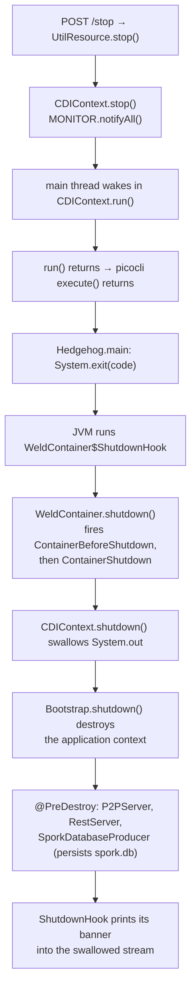

# CDI container and component lifecycle

Hedgehog is a picocli application that hosts a Weld SE container. The `daemon` subcommand does nothing
except start that container and park; every long-lived object in the process — the QUIC server, the REST
server, the topology, the spork database — is a CDI bean created and destroyed by Weld. This document
describes how that object graph is bootstrapped, what guarantees the custom CDI extensions and
interceptors provide, how Netty- and Jersey-created objects reach back into the container, and how the
test harness stands up its own containers.

For how the pieces fit together at a higher level see [Architecture overview](architecture.md); for what
those beans actually do on the wire see [Peer-to-peer network protocol](network-protocol.md) and
[REST interface](rest-api.md); for the signed parameter records the spork beans carry see
[Grid sporks](sporks.md); for the packaging and test tooling that surrounds all of this see
[Build, testing and native image](build-and-native-image.md).

## Where the container sits in the process

`application/src/main/java/org/unigrid/hedgehog/Hedgehog.java` is the `main` class. It silences `stdout`
while it resets the JDK illegal-access logger and sets the Logback root level to `Level.OFF`
(`ApplicationLogLevel.configure(0)` — the level table lives in
`application/src/main/java/org/unigrid/hedgehog/model/util/ApplicationLogLevel.java`), restores `stdout`,
and then hands control to picocli:

```java
System.exit(new CommandLine(Hedgehog.class).execute(args));
```

Verbosity is raised again from inside picocli's parse phase. `Hedgehog` exposes a setter-style option
rather than a field:

```java
@Option(names = { "-v", "--verbose" }, scope = CommandLine.ScopeType.INHERIT,
	description = "Verbose mode. Multiple options increase verbosity."
)
public void setVerbose(boolean[] verbose) {
	Hedgehog.verbose = verbose.clone();
	ApplicationLogLevel.configure(verbose.length);
}
```

Because the option is `scope = INHERIT`, every subcommand accepts `-v`, and because picocli calls the
setter during argument binding, the Logback root level is already at its final value before any bean is
created. `getLevelFromVerbosity` maps `0`–`5` onto `OFF`, `ERROR`, `WARN`, `INFO`, `DEBUG` and `TRACE`,
and anything above `5` onto `Level.ALL`.

The `@Command` on `Hedgehog` declares three subcommands: `CLI`, `Daemon` and `Util`. Only `Daemon`
touches CDI.

`application/src/main/java/org/unigrid/hedgehog/command/Daemon.java` is short enough to quote whole:

```java
@ApplicationScoped
@Command(name = "daemon")
public class Daemon extends CDIContext implements Runnable {
	@Mixin private NetOptions netOptions;
	@Mixin private RestOptions restOptions;

	@Inject private P2PServer p2pServer;
	@Inject private RestServer restServer;

	@Override
	protected void start(@Observes ContainerInitialized event) {
		/* No need to do anything here, at the moment */
	}
}
```

That class carries two independent identities, and confusing them is the single most common way to
misread this code:

| Identity | Created by | Fields that matter |
| --- | --- | --- |
| The command object | picocli, via its default factory, when `execute("daemon")` resolves the subcommand | `netOptions` / `restOptions` mixins; picocli calls `run()` on it because it implements `Runnable` |
| The bean | Weld, when the `ContainerInitialized` event is delivered | `p2pServer` / `restServer` injection points; the `start(@Observes …)` observer |

The two instances never meet. That works only because `NetOptions` and `RestOptions`
(`application/src/main/java/org/unigrid/hedgehog/command/option/`) declare their `@Option` fields
**static**, so picocli's mixin binding writes into class-level state that the CDI-side beans then read
back through `NetOptions.getPort()` and friends. The defaults are `0.0.0.0:52883` for the P2P listener
and `localhost:52884` for REST.

`run()` is inherited from `application/src/main/java/org/unigrid/hedgehog/model/cdi/CDIContext.java`:

```java
@Override
public void run() {
	SeContainerInitializer.newInstance().addExtensions(new EagerExtension()).initialize();

	synchronized (MONITOR) {
		try {
			MONITOR.wait();
		} catch (InterruptedException e) {
			log.atDebug().log("Received singal to exit");
		}
	}
}
```

`CDIContext` is abstract, declares `protected abstract void start(@Observes ContainerInitialized event)`,
and holds a `private static final Object MONITOR`. Points worth noting:

- The `SeContainer` returned by `initialize()` is discarded. Nothing in the codebase holds a reference to
  it and nothing calls `SeContainer#close()`. The container is only ever torn down by the JVM shutdown
  hook that Weld installs itself (see [Shutdown](#shutdown-and-thread-ownership)).
- `MONITOR.wait()` is a bare wait with no guard condition, so a spurious wakeup would end the daemon.
  `CDIContext.stop()` calls `MONITOR.notifyAll()`; the `InterruptedException` branch is only reached if
  something interrupts the main thread, which nothing currently does.
- `CDIContext` also declares `private void shutdown(@Observes ContainerShutdown event)`, whose only job is
  to replace `System.out` with a swallowing `PrintStream`. That is not cosmetic paranoia: Weld's
  `WeldContainer$ShutdownHook` calls `shutdown()` and then does a literal
  `System.out.println(String.format("Weld SE container %s shut down by shutdown hook", id))`. Because
  `WeldContainer#shutdown()` fires `ContainerShutdown` *before* `Bootstrap#shutdown()` and before that
  `println`, the observer gets in first and the line is discarded.
- The `ContainerShutdown` observer is `private` on an abstract superclass. Weld collects observer methods
  with `org.jboss.weld.util.BeanMethods#getObserverMethods`, which walks the whole annotated-type
  hierarchy and filters only bridge and synthetic methods, so the method is registered against the
  `Daemon` bean regardless of its access modifier.

## Bean discovery: `beans.xml` and the jandex index

`application/src/main/resources/META-INF/beans.xml` is a bare descriptor:

```xml
<beans xmlns="http://xmlns.jcp.org/xml/ns/javaee"
       xmlns:xsi="http://www.w3.org/2001/XMLSchema-instance"
       xmlns:weld="http://jboss.org/schema/weld/beans"
       xsi:schemaLocation="http://xmlns.jcp.org/xml/ns/javaee http://xmlns.jcp.org/xml/ns/javaee/beans_4_0.xsd"
       version="4.0" bean-discovery-mode="annotated">
</beans>
```

It contains no `<alternatives>`, `<decorators>` or `<interceptors>` element. `annotated` discovery means a
class only becomes a bean if it carries a bean-defining annotation — in this codebase that is
`@ApplicationScoped` everywhere, plus `@Interceptor` on `ProtectedInterceptor`.

The build also produces a jandex index. `application/pom.xml` declares `org.jboss:jandex:3.0.5` as a
compile dependency and runs `org.jboss.jandex:jandex-maven-plugin:1.2.3` (`make-index` execution, `jandex`
goal), which writes `META-INF/jandex.idx` into the artifact. Weld picks this up automatically:
`DiscoveryStrategyFactory#create` probes for `org.jboss.jandex.Index` on the classpath via
`Jandex#isJandexAvailable` and, when it is there, uses `JandexDiscoveryStrategy` instead of
`ReflectionDiscoveryStrategy`; `JandexIndexBeanArchiveHandler` reads the index from the literal resource
path `META-INF/jandex.idx`. The practical effect is that annotated-mode discovery does not have to load
and reflect over every class in every archive at boot. Nothing in the source refers to jandex directly —
it is a pure build/runtime-detection concern.

The beans the application actually deploys:

| Bean | Path (under `application/src/main/java/org/unigrid/hedgehog/`) | Scope | Notes |
| --- | --- | --- | --- |
| `Daemon` | `command/Daemon.java` | `@ApplicationScoped` | Observes `ContainerInitialized` and `ContainerShutdown` |
| `Topology` | `model/network/Topology.java` | `@ApplicationScoped` | Injects `ChannelMap`; `@PostConstruct init()` calls `repopulate()` |
| `ChannelMap` | `model/network/ChannelMap.java` | `@ApplicationScoped` | `Channel` → `Node` map; `@PostConstruct init()` allocates the backing `HashMap` |
| `EncryptedTokenHandler` | `model/network/handler/EncryptedTokenHandler.java` | `@ApplicationScoped` | Injects `UUID`; `@PostConstruct init()` calls `Quic.ensureAvailability()` |
| `P2PServer` | `server/p2p/P2PServer.java` | `@Eager @ApplicationScoped` | Injects `EncryptedTokenHandler`; binds the QUIC socket from `@PostConstruct` |
| `RestServer` | `server/rest/RestServer.java` | `@Eager @ApplicationScoped` | No injection points; binds the HTTPS socket from `@PostConstruct` |
| `BucketService` | `service/BucketService.java` | `@ApplicationScoped` | Injects `ApplicationDirectory`; `@PostConstruct init()` resolves `dataDir` |
| `ObjectService` | `service/ObjectService.java` | `@ApplicationScoped` | Injects `ApplicationDirectory`; `@PostConstruct init()` resolves `dataDir` |
| `ApplicationDirectoryProducer` | `model/producer/ApplicationDirectoryProducer.java` | `@ApplicationScoped` | Producer host |
| `RandomUUIDProducer` | `model/producer/RandomUUIDProducer.java` | `@ApplicationScoped` | Producer host |
| `SporkDatabaseProducer` | `model/producer/SporkDatabaseProducer.java` | `@ApplicationScoped` | Producer host; injects `ApplicationDirectory` |
| `ProtectedInterceptor` | `model/cdi/ProtectedInterceptor.java` | `@Interceptor` | Discovered, but see [Concurrency guards](#concurrency-guards-protected-lock-and-protectedinterceptor) |

`ChannelMap`'s callback matters more than it looks: the field is declared `private Map<Channel, Node>
channels;` with no initializer, so any path that reaches a `ChannelMap` method without Weld having run
`@PostConstruct` — a hand-constructed instance in a test, for example — sees a `NullPointerException`
rather than an empty map.

`BucketService` and `ObjectService` both resolve their storage root the same way:

```java
@PostConstruct
private void init() {
	dataDir = applicationDirectory.getUserDataDir().resolve("s3data");
}
```

Because that happens at construction time, the value is fixed for the life of the bean, and it is fixed
against whatever `ApplicationDirectory` the container produced. Under test that is the JMockit
`ApplicationDirectoryMockUp` described below, which is why the S3 tests must have the mock-up installed
*before* the container creates either service. The directory itself is not created here — see
[REST interface](rest-api.md) for what the S3 surface does when it is missing.

Every managed bean in that table apart from `ProtectedInterceptor` is normally scoped, so every injection
point that targets one receives a client proxy, and the underlying contextual instance is not created
until a business method is called through that proxy. (`ProtectedInterceptor` is an `@Interceptor` bean,
hence `@Dependent`; interceptor beans are never client-proxied and nothing injects one.) `Daemon`'s
`@Inject P2PServer` therefore does **not** start the QUIC server. That is the entire reason `@Eager`
exists. The three *produced* types — `ApplicationDirectory`, `UUID` and `SporkDatabase` — are `@Dependent`
and are injected directly, without a proxy; see [Producers](#producers).

## Eager initialization: `@Eager` and `EagerExtension`

`application/src/main/java/org/unigrid/hedgehog/model/cdi/Eager.java` is a marker annotation with runtime
retention, targeting `FIELD`, `TYPE`, `METHOD` and `PARAMETER`. It is not a qualifier, not a stereotype
and has no CDI meaning of its own — it exists purely for the portable extension to look for.

`application/src/main/java/org/unigrid/hedgehog/model/cdi/EagerExtension.java` implements
`jakarta.enterprise.inject.spi.Extension` in two observers:

```java
public <T> void collect(@Observes ProcessBean<T> event) {
	if (event.getAnnotated().isAnnotationPresent(Eager.class)
		&& event.getAnnotated().isAnnotationPresent(ApplicationScoped.class)) {

		eagerBeansList.add(event.getBean());
	}
}

public void load(@Observes AfterDeploymentValidation event, BeanManager beanManager) {
	eagerBeansList.forEach((bean) -> {
		log.atDebug().log("@Eager instantiation detected on {}", bean);

		beanManager.getReference(bean, bean.getBeanClass(),
			beanManager.createCreationalContext(bean)
		).toString();
	});
}
```

What this guarantees, and what it does not:

- **Both annotations are required.** `@Eager` without `@ApplicationScoped` is silently ignored, and vice
  versa. The check runs against `ProcessBean#getAnnotated()`, which is the `AnnotatedType` for a managed
  bean and the `AnnotatedMethod`/`AnnotatedField` for a producer, so an `@Eager @ApplicationScoped`
  producer method would qualify too — nothing in the codebase does that today.
- **The `toString()` is load-bearing, not debug residue.** `getReference` hands back a client proxy;
  calling any business method on it forces Weld to materialize the contextual instance and run
  `@PostConstruct`. `toString()` is the cheapest such method, and it works because Weld's
  `CommonProxiedMethodFilters.OBJECT_TO_STRING` accepts a method whose declaring class is not `Object`
  **or** whose name is `toString` — so `Object#toString()` is forwarded to the contextual instance, unlike
  `hashCode()` and `equals()`.
- **Ordering.** `Weld#initialize()` runs `startInitialization()` → `deployBeans()` → `validateBeans()` →
  `endInitialization()`, and only then does `WeldContainer#endInitialization(…)` install the shutdown hook
  and fire `ContainerInitialized`. `AfterDeploymentValidation` fires inside `validateBeans()`, so every
  `@Eager` bean has completed `@PostConstruct` before any `ContainerInitialized` observer runs. This is why
  `Daemon.start()` has nothing to do: by the time it is called, both servers are already bound and
  listening. Ordering *within* the eager set is whatever order the `ProcessBean` events arrived in — there
  is no way to say "start the P2P server before the REST server", and nothing currently needs one.
- **Registration is manual.** There is no
  `META-INF/services/jakarta.enterprise.inject.spi.Extension` file anywhere in the repository — the only
  `META-INF` resource in the sources is `beans.xml`. The extension is added programmatically in
  `CDIContext#run()` via `addExtensions(new EagerExtension())`, and in tests via
  `@WeldSetup(extensions = { EagerExtension.class })`. **A test container therefore does not honor
  `@Eager` unless it asks for the extension explicitly** — which is exactly why
  `application/src/test/java/org/unigrid/hedgehog/server/TestServer.java` has to call
  `CDIUtil.instantiate(server.getP2p())` by hand.

`@Eager` is used on exactly two beans: `P2PServer` and `RestServer`.
`application/src/test/java/org/unigrid/hedgehog/model/cdi/EagerExtensionTest.java` pins the behavior with
an `AtomicInteger` incremented from `@PostConstruct` on two nested beans — one `@Eager @ApplicationScoped`,
one plain `@ApplicationScoped` — and asserts the counter is exactly `1` before either field is touched.

## Concurrency guards: `@Protected`, `@Lock` and `ProtectedInterceptor`

Three files in `application/src/main/java/org/unigrid/hedgehog/model/cdi/`:

| File | What it is |
| --- | --- |
| `Protected.java` | `@InterceptorBinding`, runtime retention, targets `METHOD` and `TYPE`. No members. |
| `Lock.java` | Plain annotation (not a binding, so its value is not part of interceptor resolution), targets `METHOD` and `TYPE`, single member `LockMode value() default LockMode.READ`. `LockMode` is `org.apache.commons.configuration2.sync.LockMode`, an enum of `READ` and `WRITE`. |
| `ProtectedInterceptor.java` | `@Interceptor @Protected` class holding one `private final ReentrantReadWriteLock lock`. |

The `@AroundInvoke` method is `protect(InvocationContext)`. It reads the `@Lock` from the invoked method
through a private helper, falling back to the class:

```java
private Lock getLockAnnotation(InvocationContext ctx) {
	Lock lockAnnotation = ctx.getMethod().getAnnotation(Lock.class);

	if (lockAnnotation == null) {
		lockAnnotation = ctx.getTarget().getClass().getAnnotation(Lock.class);
	}

	return lockAnnotation;
}
```

and then dispatches on the mode:

```java
@AroundInvoke
public Object protect(InvocationContext ctx) throws Exception {
	final Lock lockAnnotation = getLockAnnotation(ctx);
	Object returnValue = null;

	if (LockMode.WRITE.equals(lockAnnotation.value())) {
		@Cleanup("unlock") final ReentrantReadWriteLock.WriteLock handler = lock.writeLock();

		handler.lock();
		returnValue = ctx.proceed();
	} else {
		@Cleanup("unlock") final ReentrantReadWriteLock.ReadLock handler = lock.readLock();
		handler.lock();
		returnValue = ctx.proceed();
	}

	return returnValue;
}
```

`LockMode.WRITE` takes the write lock; everything else — including an explicit `LockMode.READ` — takes the
read lock. Release goes through Lombok's `@Cleanup("unlock")`, which compiles to a `try`/`finally`, so the
lock survives an exception thrown by the intercepted method.

### Granularity

The lock is a field of the interceptor instance. CDI interceptors are `@Dependent`, and Weld creates one
interceptor instance per intercepted bean instance. So the granularity is **one `ReentrantReadWriteLock`
per bean instance**, not per method and not global. Since every bean using `@Protected` is
`@ApplicationScoped`, in practice that means one lock for `Topology` and a second, independent lock for
`ChannelMap`. `Topology` holding a `ChannelMap` reference does not make them share a lock.

### The interceptor is not enabled in the packaged application

`ProtectedInterceptor` carries no `@Priority`, and `application/src/main/resources/META-INF/beans.xml` is
an empty `<beans … bean-discovery-mode="annotated">` element with no `<interceptors>` child. Those are the
only two ways CDI enables an interceptor for a deployment. The consequence is that in the shipped daemon
the `@Protected @Lock(...)` annotations on `Topology` and `ChannelMap` are **inert** — every one of those
methods runs unsynchronized.

The only place the interceptor is switched on is the test harness, where
`application/src/test/java/org/unigrid/hedgehog/jqwik/WeldHook.java` does it explicitly:

```java
instance = weldInitializer.enableDiscovery()
	.interceptors(ProtectedInterceptor.class)
	.initialize();
```

That divergence is worth stating on its own: the locking semantics described above are live under test
and dead in production, so the test suite exercises a concurrency model the daemon does not have.
`application/src/test/java/org/unigrid/hedgehog/model/cdi/ProtectedInterceptorTest.java` proves the
interceptor works — a writer blocks a second writer, and two readers overlap — against its own nested
`LockModeProtected` bean, but it says nothing about whether `Topology` is thread-safe in production.
Enabling the annotations means adding `@Priority` to the interceptor or listing it in `beans.xml`, and
doing so would make the pitfalls below live rather than theoretical.

### Pitfalls a caller must know

- **`@Protected` without `@Lock` throws.** `getLockAnnotation` can return `null`, and
  `LockMode.WRITE.equals(lockAnnotation.value())` then dereferences it. The two annotations have to be
  paired.
- **Class-level `@Lock` does not work.** The fallback reads `ctx.getTarget().getClass()`. For a normal-
  scoped bean with method-level interception, Weld's target is an instance of a generated intercepted
  subclass, and `@Lock` is not `@Inherited`, so `getAnnotation(Lock.class)` returns `null` on that
  subclass. No class in the codebase relies on this today — every use site is a method-level
  `@Protected @Lock(...)` pair — but the fallback branch is effectively dead.
- **Self-invocation is not re-intercepted, and in the test container that is what saves `Topology`.**
  `Topology#repopulate()` is annotated `@Lock(LockMode.READ)` and calls `addNode()`, which is
  `@Lock(LockMode.WRITE)`. A `ReentrantReadWriteLock` cannot upgrade read to write; if the inner call were
  intercepted the thread would deadlock against itself. It is not. Weld implements method-level
  interception with a *generated subclass*, not with client-proxy delegation, and
  `org.jboss.weld.bean.proxy.InterceptedSubclassFactory` opens every generated method with an
  `org.jboss.weld.bean.proxy.InterceptionDecorationContext.startIfNotOnTop(handler)` guard that falls
  straight through to `super` when the same instance's interception context is already on the stack.
  Enabling the interceptor in production would not change that, but it is worth knowing before
  rearranging those methods.
- **`repopulate()` takes a read lock while mutating.** It assigns a fresh `HashSet` to `nodes`, calls
  `channels.clear()` and adds nodes — all under `LockMode.READ`. Read locks do not exclude one another, so
  two concurrent `repopulate()` calls are not serialized against each other.
- **`Topology#isEmpty()` carries no annotation at all** and reads `nodes` unguarded.
- **`Topology#sendAll` is `static`** yet annotated `@Protected @Lock(LockMode.READ)`. Interceptors do not
  apply to static methods; the annotations there are decoration.

Current use sites: `Topology` (`clear`, `repopulate`, `forEach`, `modifyNode`, `cloneNodes`,
`containsNode`, `addNode`, `removeNode`, `sendAll`) and `ChannelMap` (`clear`, `modify`, `get`, `set`,
`remove`). What those methods do with the topology is described in
[Peer-to-peer network protocol](network-protocol.md).

## Producers

Three producer beans live in `application/src/main/java/org/unigrid/hedgehog/model/producer/`. All three
are `@ApplicationScoped` *hosts* with a `private` `@Produces` method. Critically, **none of the producer
methods carries a scope annotation**, so every produced bean is `@Dependent` and the method runs once per
injection point.

| Producer | Produces | Qualifiers | Produced scope | Behavior |
| --- | --- | --- | --- | --- |
| `ApplicationDirectoryProducer` | `org.unigrid.hedgehog.common.model.ApplicationDirectory` | `@Default` / `@Any` only | `@Dependent` | Returns `ApplicationDirectory.create()`, a new value object each time. `create()` reads the author and name from `Version` and lower-cases both on non-macOS Unix. |
| `RandomUUIDProducer` | `java.util.UUID` | `@Default` / `@Any` only | `@Dependent` | Returns `UUID.randomUUID()` — a **different** UUID per injection point. |
| `SporkDatabaseProducer` | `org.unigrid.hedgehog.model.spork.SporkDatabase` | `@Default` / `@Any` only | `@Dependent` | Effectively a singleton by way of an `AtomicReference` field on the `@ApplicationScoped` host. |

`RandomUUIDProducer` is the one to be careful with. The only injection point today is
`EncryptedTokenHandler`, which turns the UUID into AES key material for QUIC address-validation tokens
(`QuicTokenHandler#writeToken` / `#validateToken`) and holds a single value for the lifetime of its own
`@ApplicationScoped` instance — so the behavior is correct as used. But the produced UUID is *not* a
stable node identity: a second injection point would get a different value.

`SporkDatabaseProducer` is where the `@Dependent`-produced-from-an-`@ApplicationScoped`-host pattern
actually earns its keep. The producer method itself is `@Dependent`, so CDI would happily run it once per
injection point, but the state it hands out lives on the host:

```java
@Inject private ApplicationDirectory applicationDirectory;
private AtomicReference<SporkDatabase> sporkDatabase = new AtomicReference<>(null);
```

`produce()` lazily fills that reference on first call and returns `sporkDatabase.get()` thereafter, so
every injection point in a given container resolves to the same `SporkDatabase` object even though the
produced bean is `@Dependent` and even though nothing declares the database `@ApplicationScoped`. The
scope of the *value* is the scope of the *host*, not of the producer method. What `produce()` loads from
disk, which failures fall back to a fresh database, and what `SporkDatabase.persist` writes are described
in [Grid sporks](sporks.md).

The lifecycle half of that is this document's: `@PreDestroy private void destroy()` on the host runs when
Weld destroys the application context during shutdown, and persists whatever the `AtomicReference`
currently holds. If nothing ever caused `produce()` to run during the process lifetime, that value is
still `null`.

## Programmatic lookup: `CDIUtil`

`application/src/main/java/org/unigrid/hedgehog/model/cdi/CDIUtil.java` is three static helpers:

```java
public static <T> void instantiate(T proxy) {
	proxy.toString(); /* Will force CDI to instantiate this referenced insteance */
}

public static <T> T unproxy(T proxy) {
	return (T) ((TargetInstanceProxy) proxy).weld_getTargetInstance();
}

public static <T> void resolveAndRun(Class<T> clazz, Consumer<T> consumer) {
	final Instance<T> instance = CDI.current().select(clazz);

	if (instance.isResolvable()) {
		consumer.accept(instance.get());
	} else {
		log.atWarn().log("Unable to resolve instance {}", clazz);
	}
}
```

- `instantiate` is the same `toString()` trick `EagerExtension` uses, exposed for callers that hold a
  proxy and want the contextual instance materialized now. Its only caller is the test-side `TestServer`.
- `unproxy` casts to Weld's `org.jboss.weld.interceptor.util.proxy.TargetInstanceProxy` and calls
  `weld_getTargetInstance()`. **It has no callers in the repository.**
- `resolveAndRun` is the workhorse. It is a resolution-checked `CDI.current().select(…).get()` that logs a
  warning instead of throwing when the type is not a resolvable bean. Note that it guards `isResolvable()`
  but not `CDI.current()` itself, which still throws `IllegalStateException` if no container is running.

`resolveAndRun` exists because most of the network layer is instantiated by Netty, not by CDI. Channel
handlers, channel initializers and schedules are constructed with `new` inside `P2PServer#init()` and
`P2PClient`'s constructor and handed to Netty, so they have no injection points and must reach the
container programmatically. Current call sites:

| Caller | Resolves |
| --- | --- |
| `model/network/handler/HelloChannelHandler.java` | `Topology` |
| `model/network/handler/PingChannelHandler.java` | `Topology` |
| `model/network/handler/PublishPeersChannelHandler.java` | `Topology` |
| `model/network/handler/PublishSporkChannelHandler.java` | `SporkDatabase`, then `Topology` |
| `model/network/initializer/RegisterQuicChannelInitializer.java` | `SporkDatabase` |
| `model/network/schedule/PublishPeersSchedule.java` | `Topology` |
| `model/network/schedule/PublishAndSaveSporkSchedule.java` | `ApplicationDirectory`, `SporkDatabase` |
| `model/network/TopologyThread.java` | `Topology` (held for the whole life of the thread's `run()` loop) |

`model/network/handler/ConnectionHandler.java` is the odd one out — it calls
`CDI.current().select(Topology.class)` inline and checks `isResolvable()` itself rather than going through
`CDIUtil`.

## Bridging CDI into Jersey

Jersey resource classes are instantiated by Jersey's own HK2 injection manager, which knows nothing about
the Weld container — `application/pom.xml` pulls in `jersey-hk2` but no CDI/HK2 integration module such as
`jersey-cdi2-se`. A plain `@Inject` on a resource field would therefore be handed to HK2, which has no
knowledge of the Weld beans. The project's answer is a two-file bridge in
`application/src/main/java/org/unigrid/hedgehog/model/cdi/`:

`CDIBridgeInject.java` — a runtime-retained marker for `FIELD` only, with no CDI or HK2 meaning.

`CDIBridgeResource.java` — a base class with one `@PostConstruct` callback:

```java
public class CDIBridgeResource {
	@SneakyThrows @PostConstruct
	private void init() {
		for (Field f : this.getClass().getDeclaredFields()) {
			if (f.isAnnotationPresent(CDIBridgeInject.class)) {
				f.setAccessible(true);
				f.set(this, CDI.current().select(f.getType()).get());
			}
		}
	}
}
```

A resource extends `CDIBridgeResource`, annotates its fields `@CDIBridgeInject`, and when HK2 constructs
the resource the `@PostConstruct` callback pulls each field's value straight out of the Weld container.

Constraints that follow directly from that implementation:

- `this.getClass().getDeclaredFields()` — **only fields declared on the concrete resource class**.
  `@CDIBridgeInject` on an intermediate superclass is ignored. All current resources declare their fields
  directly, so this does not bite today.
- Resolution is `select(f.getType())` — **by type only, no qualifiers**. There is no equivalent of
  `@Inject @Named` here.
- `.get()` is unguarded, so an unsatisfied or ambiguous type throws out of `@PostConstruct` rather than
  logging like `CDIUtil.resolveAndRun` does.
- `setAccessible(true)` works because `CDIBridgeResource` and every resource live in the same module.
- **The bridge does not force a normally scoped bean into existence.** For `P2PServer`, `Topology`,
  `BucketService` and `ObjectService`, `select(f.getType()).get()` returns a client proxy exactly like an
  ordinary injection point, so assigning the field does not run the bean's `@PostConstruct`. That matters
  for the `P2PServer` fields below: the QUIC server is already running because `EagerExtension`
  instantiated it at `AfterDeploymentValidation`, not because a resource asked for it. The
  `@Dependent`-produced `SporkDatabase` is the exception — `.get()` runs `SporkDatabaseProducer#produce()`
  there and then, which on the first call in a container creates the data directory and loads the database
  off disk.

The resources registered in `RestServer#getResourceConfig()` and what each bridges in:

| Resource (`server/rest/`) | `@Path` | Bridged beans |
| --- | --- | --- |
| `GridSporkResource` | `/gridspork` | `P2PServer`, `SporkDatabase` |
| `MintStorageResource` | `/gridspork` | `P2PServer`, `SporkDatabase`, `Topology` |
| `MintSupplyResource` | `/gridspork` | `P2PServer`, `SporkDatabase`, `Topology` |
| `VestingStorageResource` | `/gridspork` | `P2PServer`, `SporkDatabase`, `Topology` |
| `NodeResource` | `/node` | `Topology` |
| `StorageBucket` | `/bucket` | `P2PServer`, `BucketService` |
| `StorageObject` | `/storage-object` | `P2PServer`, `ObjectService` |
| `UtilResource` | `/` | none — it extends `CDIBridgeResource` but declares no bridged fields |

Six of those resources bridge in a `P2PServer` that no method on them reads. Combined with the point
above, the field is simply dead: it neither starts anything nor is used. See
[REST interface](rest-api.md) for the endpoint-level view.

`UtilResource` is where the REST surface reaches back into the container lifecycle: `POST /stop` calls
`CDIContext.stop()` and returns `202 Accepted`. The `hedgehog cli stop` subcommand
(`command/cli/Stop.java`) is a thin `RestClientCommand` that issues exactly that request.

## Server lifecycle

`application/src/main/java/org/unigrid/hedgehog/server/AbstractServer.java` is a small shared base. It
contributes a `protected URL allocate(String propertyUrl)` helper that resolves the host and runs the
port through `FreePortFinder.findFreeLocalPort(…)`, an abstract `getChannel()`, and three accessors —
`getHostName()` and `getPort()`, which read through to the live Netty `Channel`'s `localAddress()`, and
`getChannelId()`, which returns the channel's `ChannelId`. Reading the port off the channel rather than
off `NetOptions` is what lets the server tests assert on the port that was actually bound. `allocate()` is
used only by `RestServer`, and the consequences of that are documented in
[REST interface](rest-api.md).

### `P2PServer`

`server/p2p/P2PServer.java` is `@Eager @ApplicationScoped`, so `EagerExtension` builds it during
`AfterDeploymentValidation` and its `@PostConstruct private void init()` is what actually starts the peer
listener. From a lifecycle point of view that callback does five things:

1. Installs `Slf4JLoggerFactory` as Netty's internal logger factory — a global side effect of constructing
   this bean.
2. Generates a `SelfSignedCertificate` and builds the QUIC codec, wiring in the **injected**
   `EncryptedTokenHandler`. This is the only place a container-managed bean crosses into the Netty
   pipeline by injection rather than by `CDIUtil.resolveAndRun`.
3. Attaches a `ConnectionHandler` and a `RegisterQuicChannelInitializer` carrying the codec/handler
   pipeline and the three schedules.
4. Binds a `NioDatagramChannel` to `NetOptions.getHost()`/`NetOptions.getPort()` and blocks on `sync()`,
   so a `BindException` propagates out of `@PostConstruct` and aborts container startup.
5. Constructs and starts a `TopologyThread` — the one non-Netty thread this bean owns.

`P2PServer` does not use `AbstractServer#allocate`; it binds the configured port directly. The codec
constants it reads from `model/Network.java` (`MAX_DATA_SIZE` = 256 MiB, `MAX_STREAMS` = 512,
`IDLE_TIME_MINUTES` = 15), the handler pipeline, the schedules and the standing
`// TODO: Add support for ChannelCollector` above the codec builder are all described in
[Peer-to-peer network protocol](network-protocol.md).

`@PreDestroy private void destroy()` calls `topologyThread.exit()`, `channel.close()` and
`group.shutdownGracefully()`.

### `RestServer`

`server/rest/RestServer.java` is also `@Eager @ApplicationScoped`, with its own
`private static final int COMMUNICATION_THREADS = 4` (a separate constant from
`Network.COMMUNICATION_THREADS`, which happens to have the same value).

Its construction is split across two phases, and the split is easy to miss:

```java
private Container container;
private final NioEventLoopGroup group = new NioEventLoopGroup(COMMUNICATION_THREADS);
private ResourceConfig resourceConfig = getResourceConfig();
@Getter private Channel channel;
```

The event-loop group **and** the Jersey `ResourceConfig` are built by *field initializers*, i.e. during
bean construction, before `@PostConstruct init()` runs. So the eight resource classes and the four
providers are registered as a side effect of Weld instantiating the bean; only the container, the channel
initializer and the bind happen in the callback:

```java
@SneakyThrows
@PostConstruct
public void init() {
	container = getContainerInstance();
	final ChannelHandler initializer = getJerseyInitializerInstance(container);

	channel = new ServerBootstrap().group(group)
		.channel(NioServerSocketChannel.class)
		.childHandler(initializer)
		.bind(new InetSocketAddress(RestOptions.getHost(), RestOptions.getPort())).sync().channel();
}
```

Two consequences follow. First, `init()` is `@SneakyThrows`, and the bind is `.sync()`-ed, so an occupied
port makes the bind **fail** — a `BindException` propagates out of `@PostConstruct` and takes container
startup with it. Second, the base `URI` handed to the Jersey channel initializer comes from
`allocate(url)`, which picks a *free* port, while the bind uses `RestOptions.getPort()` directly. The two
agree while the configured port is free, and in that case the bind lands on exactly the port `allocate()`
returned. When the configured port is occupied `allocate()` moves the base URI to a different free port
while the bind still targets `RestOptions.getPort()` — and that bind fails, so the server never comes up
on either. The reflective construction of the two package-private Jersey Netty types, the
`ResourceConfig` contents and the TLS setup are documented in [REST interface](rest-api.md).

`@PreDestroy destroy()` closes the channel, calls `container.getApplicationHandler().onShutdown(container)`
and shuts the event-loop group down gracefully.

### Shutdown and thread ownership

Neither `destroy()` awaits any of the futures it starts, so teardown is fire-and-forget. In the normal
path that is benign, because the process is on its way out of `System.exit` when it happens.

The full stop sequence, from a `POST /stop` to a dead process:



`WeldContainer#shutdown()` fires `ContainerBeforeShutdown` (qualified
`@BeforeDestroyed(ApplicationScoped.class)`) before it discards the container id and releases its own
creational context, and `ContainerShutdown` (qualified `@Destroyed(ApplicationScoped.class)`) immediately
after. Nothing in this codebase observes `ContainerBeforeShutdown`; `CDIContext#shutdown` observes the
latter, which is why the swallowing `PrintStream` is installed before `Bootstrap#shutdown()` runs any
`@PreDestroy` method and before the hook prints its banner.

Threads alive in a running daemon:

| Owner | Threads | Created | Destroyed |
| --- | --- | --- | --- |
| main | 1, parked on `CDIContext.MONITOR` | `Hedgehog.main` | `CDIContext.stop()` |
| `P2PServer` | `NioEventLoopGroup(Network.COMMUNICATION_THREADS)` = 4 | field initializer, i.e. bean construction | `@PreDestroy` |
| `P2PServer` | one `TopologyThread` | `@PostConstruct` | `@PreDestroy` via `exit()` |
| `RestServer` | `NioEventLoopGroup(COMMUNICATION_THREADS)` = 4 | field initializer | `@PreDestroy` |
| `P2PClient` (one per outbound node connection, created by `TopologyThread`) | `NioEventLoopGroup(Network.COMMUNICATION_THREADS)` = 4 each | constructor | `ConnectionContainer#close()` / `#closeDirty()` |
| Weld | 1 JVM shutdown hook | `WeldContainer#endInitialization` | JVM exit |

The periodic schedules do not own threads: `RegisterQuicChannelInitializer#initChannel` registers them
with `channel.eventLoop().scheduleAtFixedRate(…)` and cancels them from the channel's close future, so
they run on the Netty event loop of the channel they were attached to.

`TopologyThread` (`model/network/TopologyThread.java`) is the one place the daemon runs container-managed
state off both the main thread and the Netty event loops. It resolves `Topology` once via
`CDIUtil.resolveAndRun` and holds that reference for the whole life of its `run()` loop, which repopulates
from seeds when the topology is empty, opens a `P2PClient` to every node without a connection, and then
waits out a back-off computed from the node count. A node whose connection attempt throws is removed from
the topology; if it already held a connection, that connection is additionally `closeDirty()`-ed and
dropped from the `ChannelMap` — the guard is `node.getConnection().ifPresent(…)`, and in the common
failure case (the `P2PClient` constructor timing out) there is no connection yet, so only
`topology.removeNode(node)` runs. `exit()` flips the `run` flag and notifies the lock, which is what
`P2PServer`'s `@PreDestroy` calls. The loop itself and its back-off formula are documented in
[Peer-to-peer network protocol](network-protocol.md).

## Startup sequence

```mermaid
sequenceDiagram
    autonumber
    participant M as Hedgehog.main
    participant PC as picocli
    participant DC as Daemon (command object)
    participant W as Weld SE
    participant EE as EagerExtension
    participant P2P as P2PServer
    participant RS as RestServer
    participant DB as Daemon (bean)

    M->>M: resetIllegalAccessLogger()<br/>ApplicationLogLevel.configure(0)
    M->>PC: new CommandLine(Hedgehog.class).execute(args)
    PC->>PC: bind @Mixin NetOptions / RestOptions<br/>(static fields); setVerbose() re-configures logging
    PC->>DC: run()  [inherited from CDIContext]
    DC->>W: SeContainerInitializer.newInstance()<br/>.addExtensions(new EagerExtension())<br/>.initialize()

    W->>W: startInitialization(): discovery<br/>(annotated mode, META-INF/jandex.idx)
    W->>W: deployBeans()
    W->>EE: ProcessBean × N
    EE->>EE: collect beans with @Eager + @ApplicationScoped
    W->>W: validateBeans()
    W->>EE: AfterDeploymentValidation
    EE->>P2P: getReference(...).toString()
    P2P->>P2P: @PostConstruct: QUIC codec, bind NetOptions host:port,<br/>start TopologyThread
    EE->>RS: getReference(...).toString()
    RS->>RS: @PostConstruct: Jersey container + initializer,<br/>bind RestOptions host:port

    W->>W: endInitialization(): install JVM shutdown hook
    W->>DB: fire ContainerInitialized
    DB->>DB: start(@Observes ContainerInitialized) — no-op
    W-->>DC: SeContainer (discarded)
    DC->>DC: MONITOR.wait() — main thread parks
```

## The module system and CDI

`application/src/main/java/module-info.java` declares the module `org.unigrid.hedgehog`. It `requires`
`weld.se.core`, `weld.core.impl`, `weld.environment.common`, `weld.spi`, `jakarta.cdi`, `jakarta.inject`
and `jakarta.interceptor` (plus picocli, Netty, Jersey, Jackson and the rest), and contains exactly one
directive that opens anything:

```java
opens org.unigrid.hedgehog.model.s3.entity to jakarta.xml.bind;
```

Nothing is opened to Weld. Weld needs deep reflective access — it generates proxies and intercepted
subclasses, injects into private fields and invokes private `@PostConstruct`/`@PreDestroy`/`@Produces`
methods — so on a strict module path this descriptor is not sufficient on its own.

That does not break the shipped binary, because the shipped binary does not run on the module path. The
maven-assembly-plugin execution in `application/pom.xml` builds the `application/assembly.xml` descriptor
into an unpacked `jar-with-dependencies` and names `org.unigrid.hedgehog.Hedgehog` as `Main-Class` through
its own `<archive><manifest>` block — `assembly.xml` itself declares only the id, the `jar` format and an
unpacked runtime-scope dependency set. `application/nbactions.xml` launches with `-classpath %classpath`.
On the classpath the descriptor is inert and everything lands in the unnamed module.

The tests are a different matter. Surefire runs a project with a `module-info.java` modularly, patching
the test classes into the module, so the module boundary is real there. `application/pom.xml` compensates
with a long Surefire `<argLine>` of `--add-opens` and `--add-exports` directives — one
`--add-opens org.unigrid.hedgehog/<package>=weld.core.impl` per package containing beans, plus
equivalents for picocli, Jackson, Jersey, `commons-lang3` and the jqwik/JMockit harness, and a single
`--add-reads org.unigrid.hedgehog.common=org.unigrid.hedgehog`. Adding a new package of CDI beans means
adding its `weld.core.impl` line there as well; the full inventory and the reasoning behind each group
live in [Build, testing and native image](build-and-native-image.md). The module descriptor is also what
the `tentackle-jlink-maven-plugin` and the GraalVM build in the `native-image` module consume.

## The test-side container

The test harness stands up a real Weld container per test class. Everything lives under
`application/src/test/java/org/unigrid/hedgehog/jqwik/`. The package as a whole is inventoried in
[Build, testing and native image](build-and-native-image.md); what follows is the container half of it.

### `BaseMockedWeldTest`

```java
@Domain(DomainContext.Global.class)
@AddLifecycleHook(value = MockitHook.class, propagateTo = PropagationMode.ALL_DESCENDANTS)
@AddLifecycleHook(value = WeldHook.class, propagateTo = PropagationMode.ALL_DESCENDANTS)
@NoArgsConstructor(access = AccessLevel.PROTECTED)
public class BaseMockedWeldTest {
	@BeforeContainer
	private static void beforeContainer() {
		new ApplicationDirectoryMockUp();
	}
}
```

Extending it brings both hooks, propagated to every descendant class, plus an
`ApplicationDirectoryMockUp` (`application/src/test/java/org/unigrid/hedgehog/model/`), a JMockit
`MockUp<ApplicationDirectory>` that redirects `getUserConfigDir()`, `getUserDataDir()` and
`getUserLogDir()` to fresh `Files.createTempDirectory` locations. Without it, tests would write into the
developer's real application directory — and, because `BucketService`, `ObjectService` and
`SporkDatabaseProducer` all capture that directory at construction time, the mock-up has to be in place
before the container builds those beans.

### Hook ordering

Both hooks implement `AroundPropertyHook` and override `aroundPropertyProximity()`. jqwik's rule is that
a *higher* proximity is *closer* to the property method, and a value greater than `-10` runs inside
`@BeforeProperty`/`@AfterProperty`:

| Hook | Proximity | Position |
| --- | ---: | --- |
| `MockitHook` | -20 | outermost |
| `WeldHook` | -15 | inside `MockitHook`, still outside `@BeforeProperty` |
| `@BeforeProperty` / `@BeforeTry` methods | — | innermost |

So JMockit's `@Mocked` fields are installed first, the Weld container is created and injected second, and
only then do the test's own `@BeforeProperty`/`@BeforeTry` methods run. That is why
`BaseRestClientTest#before()` can safely call `TestServer.mockProperties(server)` on an already-injected
`server` field.

### `WeldSetup`

```java
@Inherited
@Target(ElementType.TYPE)
@Retention(RetentionPolicy.RUNTIME)
public @interface WeldSetup {
	Class<?>[] value();
	Class<?>[] extensions() default { };
	boolean scan() default true;
}
```

| Member | Effect |
| --- | --- |
| `value()` | Classes passed to `Weld#beanClasses(…)`. This is how a class that carries no bean-defining annotation is forced into the container — `TopologyThreadTest` does exactly that for `TopologyThread`. |
| `extensions()` | Extension classes; each is instantiated with its no-arg constructor and passed to `Weld#extensions(…)`. Registering `EagerExtension.class` here is the only way a test gets `@Eager` behavior. |
| `scan()` | `true` (default) → `enableDiscovery()` **and** `interceptors(ProtectedInterceptor.class)`. `false` → `disableDiscovery()` and **no** interceptor registration, so `@Protected` is inert. |

The annotation is `@Inherited`, so a subclass without its own `@WeldSetup` picks up its parent's — this is
how every subclass of `BaseRestClientTest` (`@WeldSetup(TestServer.class)`) and `BaseServerTest`
(`@WeldSetup(TestServer.class)`) gets a container. A subclass that declares its own `@WeldSetup` replaces
the parent's entirely rather than merging with it. A test class with no `@WeldSetup` anywhere in its
hierarchy still gets a container, just with no explicit `beanClasses` and discovery on.

### `WeldHook`

`aroundProperty` runs before every property. For each field of the test instance *and its superclasses*
(`Reflection#getDeclaredFieldsWithParents`) that carries `@Inject`:

- **A plain field** → resolve one instance of the field's type from the container named
  `<TestClassSimpleName>` and assign it.
- **A `List` field** → deferred to `forEachListInjectionPoint`, which requires an `@Instances(n)`
  annotation (`IllegalStateException("Lists require an instances annotation.")` otherwise) and, if the
  field is still `null`, creates `n` elements. Element `i` is resolved from a container named
  `<TestClassSimpleName><i>` (suffixes run `1`…`n`) — i.e. `n` **separate, fully independent Weld
  containers**. This is how `BaseServerTest` obtains its `NUM_SERVERS = 20` mutually isolated `TestServer`
  instances, and why `ServerTest` can assert that a shuffled subset of them bind distinct P2P ports.
- **An `Instance<T>` field** → the generic argument is resolved, but the resolved object (a `T`, not an
  `Instance<T>`) is then assigned to the field, which would fail with an `IllegalArgumentException`. No
  test currently declares such a field.

Containers are created lazily by name (`WeldContainer.instance(name)` returns `null` if that id is not
running) and are never shut down by the hook — they live until the JVM exits and Weld's own hook fires.
Surefire's `reuseForks=false` with `forkCount=${system.numcores}` keeps that from accumulating across
test classes.

### `NamedCDIProvider`

`WeldHook#beforeContainer` installs it: `CDI.setCDIProvider(new NamedCDIProvider())`. In CDI 4 that setter
is idempotent (it only rejects `null`), so repeated calls across propagated containers are harmless.

```java
public static final AtomicReference<String> NAME_REFERENCE = new AtomicReference<>();

@Override
public CDI<Object> getCDI() {
	if (Objects.isNull(NAME_REFERENCE.get())) {
		throw new IllegalStateException("No namespace set for requested CDI instance");
	}

	return WeldContainer.instance(NAME_REFERENCE.get());
}

@Override
public int getPriority() {
	return DEFAULT_CDI_PROVIDER_PRIORITY + 10; /* Bump ourselves up so we get precedence. */
}
```

This is what makes production code that calls `CDI.current()` — `CDIUtil.resolveAndRun`,
`ConnectionHandler`, `CDIBridgeResource` — work under test with more than one container running.
`WeldHook#inject` sets `NAME_REFERENCE` to the container it is about to resolve from, so **`CDI.current()`
resolves to whichever container was injected from most recently**. With the multi-container `@Instances`
pattern that is a piece of global mutable state to be aware of: a background thread calling
`CDI.current()` may see a different container than the one that created it. The priority bump is
belt-and-braces — an explicitly-set provider already wins over `ServiceLoader`-discovered ones.

### `MockitHook`, `MockOn` and `Instances`

`MockitHook` extends JMockit's `TestRunnerDecorator` and adapts it to jqwik: `aroundProperty` stores the
test instance in a jqwik `Store` with `Lifespan.PROPERTY`, calls
`handleMockFieldsForWholeTestClass(...)`, runs the property, then `prepareForNextTest()`;
`afterContainer` calls `cleanUpAllMocks()`; `resolve` supplies JMockit-created instances for
JMockit-annotated method parameters via `createInstancesForAnnotatedParameters`, caching them in a
`Store` keyed by `MockitHook` plus the method name.

`MockOn` is a one-method helper for writing instance-selective `@Mock` bodies:

```java
public static <T, R> R instance(Class<T> clazz, Invocation invocation, R value) {
	if (clazz.equals(invocation.getInvokedInstance().getClass())) {
		return value;
	} else {
		return invocation.proceed();
	}
}
```

`Instances` is the `int`-valued field annotation described above.

### Writing a new CDI-backed test

The steps below cover the container side; the codec- and property-level conventions are in
[Build, testing and native image](build-and-native-image.md).

1. Extend `BaseMockedWeldTest`, or one of the bases that already does — `BaseSporkDatabaseTest`,
   `BaseServerTest` or `BaseRestClientTest`.
2. Add `@WeldSetup({ … })` to pull in classes that carry no bean-defining annotation, or
   `extensions = { EagerExtension.class }` when the test depends on `@Eager` firing.
3. Declare `@Inject` fields for the required beans. They are populated before `@BeforeProperty` /
   `@BeforeTry` runs.
4. For several isolated container instances, declare `@Inject @Instances(n) List<T>`.
5. When the code under test binds sockets, call `TestServer.mockProperties()` (statics only) or
   `TestServer.mockProperties(server)` (statics plus `CDIUtil.instantiate` on both `@Eager` servers) from
   a `@BeforeTry`/`@BeforeProperty` method — the test container does not register `EagerExtension`, so
   nothing else starts the servers.
6. When the code under test writes to the application directory, make sure an `ApplicationDirectoryMockUp`
   has been constructed. `BaseMockedWeldTest` does it, and `BaseRestClientTest` and
   `BaseSporkDatabaseTest` each do it again in their own `@BeforeContainer`.
7. A new package of beans needs a matching `--add-opens … =weld.core.impl` entry in the Surefire argLine
   in `application/pom.xml`.

## Known rough edges

- **The `@Protected`/`@Lock` interceptor is not enabled in the packaged application.**
  `ProtectedInterceptor` has no `@Priority` and `beans.xml` has no `<interceptors>` element, so every
  annotated method on `Topology` and `ChannelMap` runs unsynchronized in the shipped daemon. Only the test
  harness switches the interceptor on, so the suite validates a concurrency model production does not
  have.
- **`@Protected` without `@Lock` throws a `NullPointerException`.** `getLockAnnotation` may return `null`
  and `protect()` dereferences the result immediately.
- **The class-level `@Lock` fallback is dead code.** It reads the generated intercepted subclass, and
  `@Lock` is not `@Inherited`.
- **`Topology#repopulate()` mutates under a read lock**, `Topology#isEmpty()` carries no annotation at
  all, and `Topology#sendAll` is `static` and therefore never intercepted despite being annotated.
- **`CDIContext.run()` waits on a bare monitor.** `MONITOR.wait()` has no guard condition, so a spurious
  wakeup would end the daemon; the `SeContainer` returned by `initialize()` is discarded and
  `SeContainer#close()` is never called.
- **Teardown is fire-and-forget.** Neither server's `@PreDestroy` awaits the futures it starts.
- **`RandomUUIDProducer` yields a different UUID per injection point.** It works only because
  `EncryptedTokenHandler` is the single consumer; a second injection point would silently get different
  key material.
- **`SporkDatabaseProducer.destroy()` persists `null`** when nothing caused `produce()` to run during the
  process lifetime.
- **`CDIBridgeResource` is a minimal bridge.** It scans only `getClass().getDeclaredFields()`, resolves by
  type with no qualifier support, and calls `.get()` unguarded, so an unsatisfied type throws out of
  `@PostConstruct`.
- **Six resources bridge in a `P2PServer` field that nothing reads and that starts nothing** — the bean is
  already running courtesy of `EagerExtension`, and `select(P2PServer.class).get()` only hands back a
  proxy.
- **`RestServer` derives Jersey's base URI from a free-port search the bind ignores.** `allocate()` runs
  `FreePortFinder` over `RestOptions.getPort()` for the URI while the bind uses `RestOptions.getPort()`
  directly; the two only ever diverge when the configured port is occupied, and in that case the bind
  fails outright.
- **`CDIUtil.unproxy` has no callers** anywhere in the repository.
- **`module-info.java` opens nothing to Weld.** The shipped binary only works because it runs from the
  classpath; the module path would need `opens … to weld.core.impl` for every bean package.
- **`@Eager` ordering is unspecified.** Beans are instantiated in `ProcessBean` arrival order, so there is
  no way to sequence the two servers relative to each other.
- **`WeldHook` never shuts its containers down.** They live until the JVM exits, and
  `NamedCDIProvider.NAME_REFERENCE` is process-global mutable state, so `CDI.current()` resolves to
  whichever container was injected from most recently.
- **`WeldHook`'s `Instance<T>` branch would fail if used.** It assigns the resolved `T` to a field typed
  `Instance<T>`; no test declares one today. Its `scan() == false` branch also calls `disableDiscovery()`
  twice.
