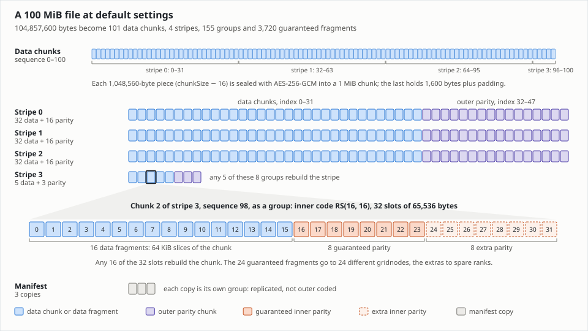
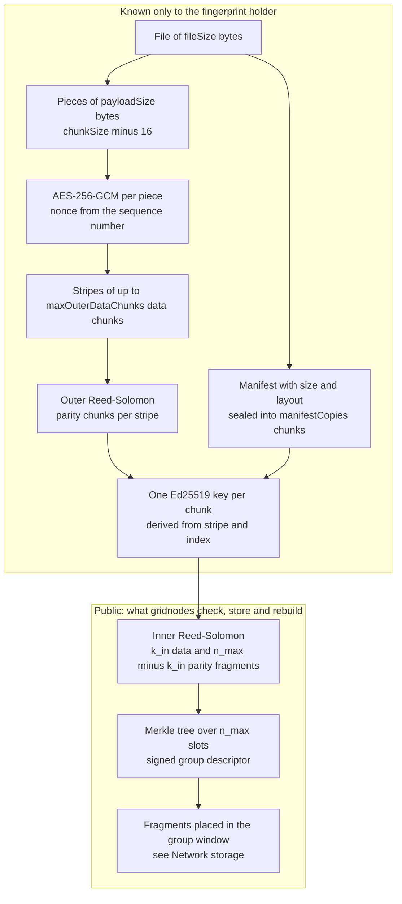
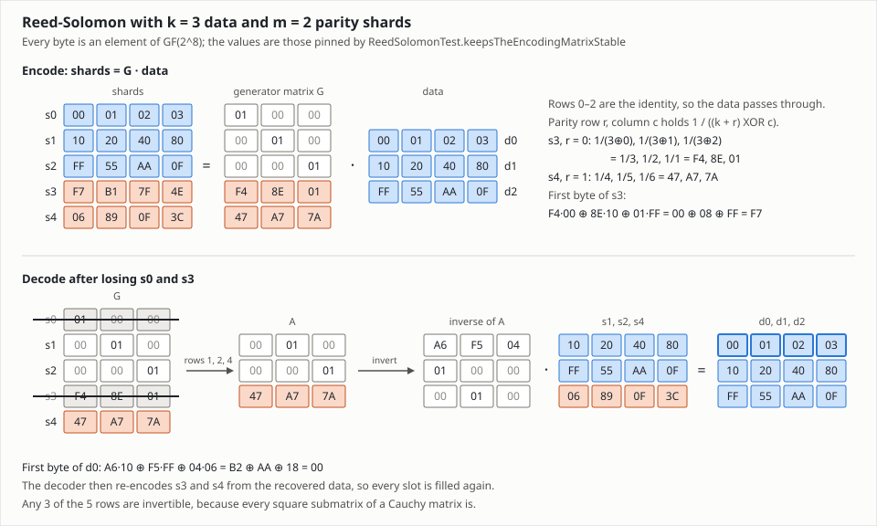
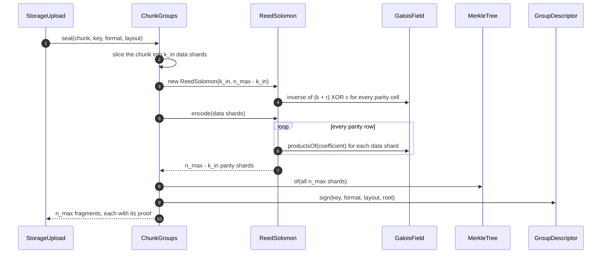
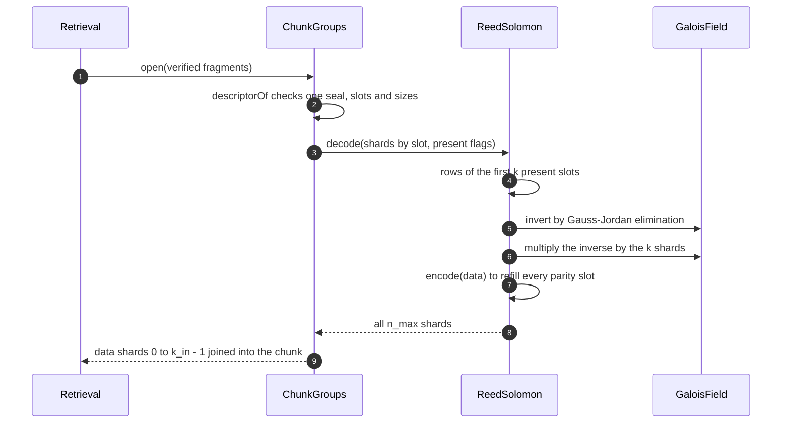
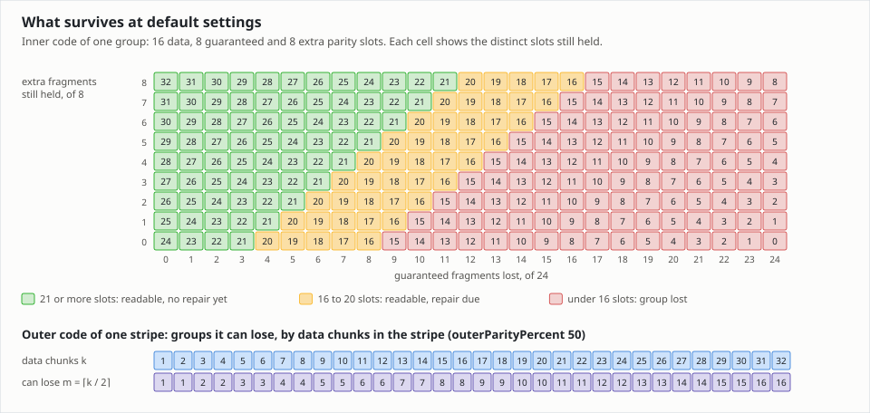
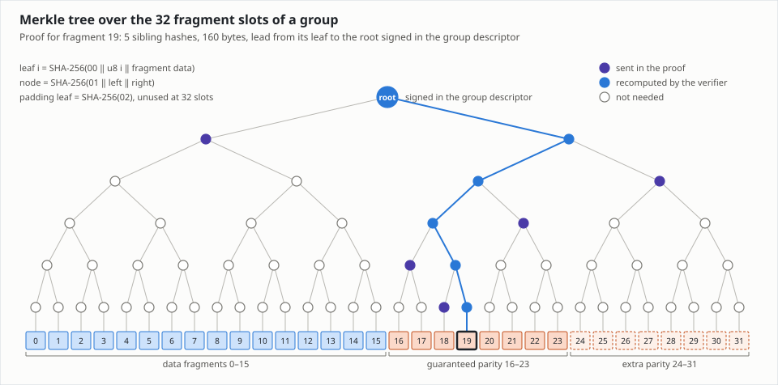
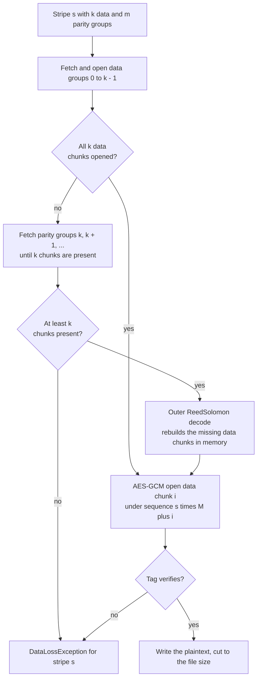
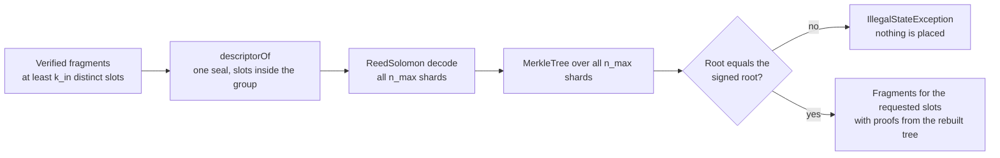
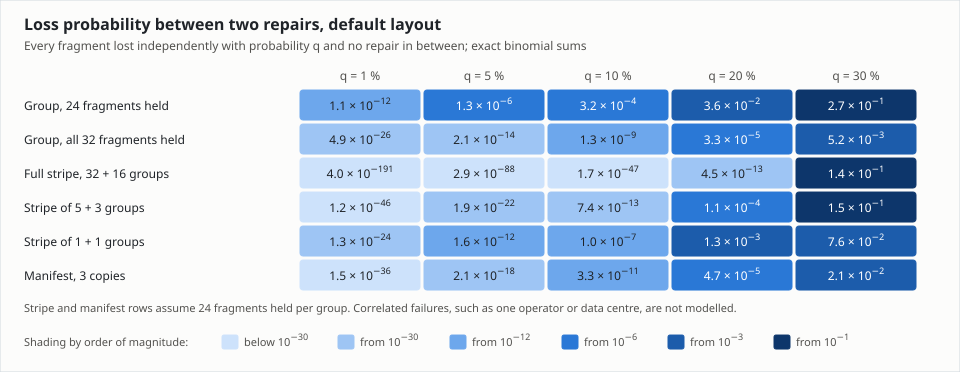

# Erasure coding

Hedgehog stores a file on the network as many small, encrypted fragments, and it can rebuild the
file from a subset of them. This document covers how that works at the level of bytes: the finite
field the arithmetic runs in, the Reed-Solomon codec, the two coding layers and why there are two,
the arithmetic that turns spork parameters into a layout, how one chunk is sealed into verifiable
fragments, and the paths that turn fragments back into a chunk. Where fragments are sent, how they
are fetched, when repair runs, the wire packets and the REST and command-line interfaces belong to
[Network storage](storage.md). The design and its analysis are written up in the storage white paper,
`documentation/storage-white-paper/sharded-and-redundant-storage.tex`; this document describes what
the code does today, and the places where the two disagree are listed under
[Known rough edges](#known-rough-edges).

## Where to start reading

1. `application/src/main/java/org/unigrid/hedgehog/model/storage/erasure/GaloisField.java` — the
   byte arithmetic, three lookup tables and four small methods.
2. `application/src/main/java/org/unigrid/hedgehog/model/storage/erasure/ReedSolomon.java` — the
   only codec, used by both layers; `encode`, `decode` and a Gauss-Jordan inversion.
3. `application/src/main/java/org/unigrid/hedgehog/model/storage/LayoutParameters.java` and
   `StorageLayout.java` beside it — every count and size derived from the spork, and how a file
   splits into stripes.
4. `application/src/main/java/org/unigrid/hedgehog/model/storage/ChunkGroups.java` — `seal`,
   `open` and `rebuild`, where the inner code, the Merkle tree and the group descriptor meet.
5. `GroupDescriptor.java`, `Fragment.java` and `crypto/MerkleTree.java` in the same package — what
   a gridnode receives and how it checks it.
6. `ChunkCipher.java`, `FingerprintKeys.java` and `Manifest.java` — the encryption that runs before
   any coding, and the record that tells a reader which layout a file was written with.
7. `application/src/main/java/org/unigrid/hedgehog/service/storage/StorageUpload.java` and
   `Retrieval.java` — the only callers of the outer code.
8. `application/src/test/java/org/unigrid/hedgehog/model/storage/erasure/ReedSolomonTest.java` and
   `application/src/test/java/org/unigrid/hedgehog/model/storage/ChunkGroupsTest.java` — the
   properties the codec and the sealing promise, stated as jqwik properties.

## The problem

Gridnodes are machines run by strangers. They restart, lose their connection, lose disks, leave the
network for good, or simply drop data. A file stored on them has to outlive the machines that hold
it, and it has to stay readable while some of them are unreachable, without its owner being online
to notice. Two properties are at stake: *durability*, that the data still exists somewhere, and
*availability*, that enough of it can be reached right now to read it.

The obvious answer is replication: keep three copies and survive the loss of any two. It costs three
times the data, and the third loss of the same piece is the end of it. An erasure code spends the
same storage far more efficiently. Cut a chunk into `k` equal pieces and compute `m` further pieces
from them, so that **any** `k` of the `k + m` pieces are enough to recompute the chunk. Losing a piece
is then only an *erasure*: the reader knows which piece is missing and solves for it from the others.
The code tolerates the loss of any `m` pieces, whichever they are.

| Scheme | Stored per byte | What it survives |
| --- | ---: | --- |
| Three replicas | 3.00 | Any 2 of the 3 copies |
| Reed-Solomon, `k = 16`, `m = 8` (the inner code) | 1.50 | Any 8 of the 24 pieces |
| Reed-Solomon, `k = 32`, `m = 16` (the outer code) | 1.50 | Any 16 of the 48 pieces |
| Both layers together, the default | 2.25 | Any 8 of 24 fragments of every chunk, and any 16 of 48 chunks of every stripe |

One way to picture "any `k` of `n`": every piece is one equation in the `k` unknown data pieces, and
the code is built so that any `k` of its `n` equations are independent. With 24 equations in 16
unknowns, any 8 can go missing and the remaining 16 still have exactly one solution.

The price is paid at repair. Rebuilding one lost piece means reading `k` others, so in a network with
churn the bandwidth spent on repair, not the disk space, becomes the main cost of redundancy. That is
why Hedgehog repairs lazily, once losses pass a threshold, which [Network storage](storage.md)
describes.

## From file to fragments



A file passes through two codes, with encryption in front of both. Every step runs on the owner's
node. The first steps produce a structure that only the fingerprint holder can reconstruct; the last
steps produce public material that any gridnode can check, store and rebuild without a key.



The terms used throughout this document:

| Term | Meaning | Default |
| --- | --- | --- |
| Payload | The file bytes one chunk carries: `chunkSize - 16`, leaving room for the GCM tag | 1,048,560 bytes |
| Chunk | A fixed-size block of `chunkSize` bytes: AES-GCM ciphertext (a *data chunk*), outer parity (a *parity chunk*) or an encrypted manifest copy | 1,048,576 bytes |
| Sequence number | A data chunk's global position, `stripe × maxOuterDataChunks + i`; it fills the first eight nonce bytes and ends the associated data | 0 to 100 for a 100 MiB file |
| Stripe | Up to `maxOuterDataChunks` consecutive data chunks and their outer parity chunks; only the owner knows which chunks form one | 32 data + 16 parity |
| Group | One chunk as the network sees it, named by the SHA-256 of its own public key | 155 groups for a 100 MiB file |
| Fragment | One inner-code shard of a group plus its signed descriptor and Merkle proof; the unit a gridnode stores | 65,536 data bytes, 65,838 encoded |
| Slot | A fragment index, `0` to `n_max - 1` | 32 slots |
| Guaranteed fragment | Slots `0` to `n_in - 1`: the data fragments and the guaranteed parity | 24 |
| Extra fragment | Slots `n_in` to `n_max - 1`, kept only while quota allows | 8 |

## Arithmetic in GF(2^8)

Reed-Solomon treats every byte as an element of the finite field GF(2^8), which has exactly 256
elements, one per byte value.
`application/src/main/java/org/unigrid/hedgehog/model/storage/erasure/GaloisField.java` implements
it with the reducing polynomial `x^8 + x^4 + x^3 + x^2 + 1`, written `0x11D`
(`GENERATOR_POLYNOMIAL`), and the generator `2`. That is the field the Linux RAID-6 code uses; it is
*not* the field of AES, which reduces by `0x11B`.

* **Addition is XOR.** A byte is a polynomial with binary coefficients, and adding coefficients
  modulo 2 is XOR. Subtraction is the same operation, which is why the codec never subtracts.
* **Multiplication is polynomial multiplication reduced modulo `0x11D`.** Multiplying by the
  generator is a left shift, followed by an XOR with `0x11D` whenever the result no longer fits in a
  byte; `GaloisField.next` is exactly that. Because `2` generates the whole multiplicative group, its
  first 255 powers run through every non-zero byte once.
* **Every non-zero element has an inverse,** and zero has none.

The class precomputes three tables in its static initializer:

| Table | Size | Contents |
| --- | --- | --- |
| `EXP` | 512 `int` | `EXP[p] = 2^p`; from index 255 on the cycle repeats, so `EXP[LOG[a] + LOG[b]]` needs no modulo |
| `LOG` | 256 `int` | The inverse of `EXP` for non-zero bytes; `LOG[0]` is unused |
| `PRODUCTS` | 256 × 256 `byte`, 64 KiB | `PRODUCTS[a][b] = EXP[LOG[a] + LOG[b]]`; row and column 0 stay zero |

`multiply(a, b)` is one lookup in `PRODUCTS`, and `productsOf(a)` hands out a whole row so the codec
can multiply a long run of bytes by the same coefficient with one lookup per byte.
`inverse(a)` returns `EXP[255 - LOG[a]]` and throws an `ArithmeticException` for zero. The first
sixteen powers of the generator show the reduction at work: after `0x80` the shift overflows into
`0x100`, and the XOR with `0x11D` leaves `0x1D`.

```text
EXP[0..15] = 01 02 04 08 10 20 40 80 1D 3A 74 E8 CD 87 13 26
```

A worked example, with every value read back from the class itself:

| Operation | How the code computes it | Result |
| --- | --- | --- |
| `0x57 + 0x83` | XOR | `0xD4` |
| `2 · 0x80` | `0x80 << 1 = 0x100`, which overflows, so XOR with `0x11D` | `0x1D` |
| `0x57 · 0x83` | `LOG[0x57] = 189`, `LOG[0x83] = 247`, so `EXP[436]`, which is `EXP[181]` | `0x31` |
| `0x57 · 0x83` by hand | carry-less product `0x2B79`, reduced modulo `0x11D` | `0x31` |
| `0x57^-1` | `EXP[255 - 189] = EXP[66]`; check: `0x57 · 0x61 = 0x01` | `0x61` |
| `2^-1`, `3^-1` | `EXP[254]`, `EXP[230]` | `0x8E`, `0xF4` |

In the AES field the same product `0x57 · 0x83` is `0xC1`, the familiar example from FIPS 197; the
polynomial matters, and every node must use the same one, which `0x11D` being a constant guarantees.

## Reed-Solomon as implemented

`application/src/main/java/org/unigrid/hedgehog/model/storage/erasure/ReedSolomon.java` is a
systematic Reed-Solomon code over GF(2^8) whose parity rows form a Cauchy matrix. It has no external
dependency. A `ReedSolomon(dataShards, parityShards)` instance holds only its parity rows; it is
cheap to build and both layers build one per call.

### The generator matrix

The code is linear: each of the `n = k + m` shards is a combination of the `k` data shards, and the
`n × k` *generator matrix* says which. Its first `k` rows are the identity, so the code is
*systematic*: the first `k` shards are the data itself, and an intact read needs no arithmetic at
all on the data path. Below them, parity row `r`, which is generator row `k + r`, is row `r` of a
Cauchy matrix (`ReedSolomon.cauchy`):

$$C_{r,c} = \frac{1}{(k + r) \oplus c}, \qquad 0 \le r < m,\ 0 \le c < k$$

A Cauchy matrix has entries `1 / (x_r - y_c)` for two sets of distinct field elements that never
overlap. Here `x_r = k + r` runs over `k .. k + m - 1` and `y_c = c` over `0 .. k - 1`, so no
denominator is zero, and in a field of characteristic 2 the difference is the XOR the code computes.
**Every square submatrix of a Cauchy matrix is invertible.** Losing shards deletes rows of the
generator matrix; any `k` rows that remain consist of some identity rows and some Cauchy rows, and
their determinant reduces to a square submatrix of `C`, which is non-zero. Any `k` shards therefore
determine the data, so the code is maximum distance separable (MDS): it tolerates the loss of any `m`
shards, the most any code with that overhead can. A carelessly built systematic Vandermonde code does
not always have this property; the Cauchy construction has it by design.

A parity row depends only on its absolute position `k + r`, never on `m`. The parity of a code with
`m1` parity shards is therefore the first `m1` parity rows of a code with `m2 > m1`, which
`ReedSolomonTest.smallerCodesArePrefixesOfLargerOnes` and `smallerCodesDecodeFragmentsOfLargerOnes`
pin. For the inner layer this means the guaranteed fragments of a group, slots `0` to `n_in - 1`, are
by themselves a complete `RS(k_in, m_in)` code, whatever happens to the extras.



### Encoding

`encode(byte[][] data)` requires exactly `k` non-null shards of equal length and returns the `m`
parity shards. For each parity row it calls `multiplyInto`, which walks the data shards column by
column, fetches the 256-byte product row for that column's coefficient with
`GaloisField.productsOf`, and XORs `products[source[i]]` into the target for every byte. The cost is
one table lookup and one XOR per data byte per parity row; nothing else runs in the inner loop.

### Decoding

`decode(byte[][] shards, boolean[] present)` takes all `n` slots and a flag per slot, and returns all
`n` shards, the missing ones filled in:

1. Collect the indices of the present shards. Fewer than `k` throws `IllegalArgumentException`
   ("Need k shards but only ... are present"), and so does a present shard that is null or of a
   different length from the others.
2. Take the **first `k` present shards in index order**. Any further present shards are checked for
   their length but take no part in the decoding.
3. Build the `k × k` matrix of their generator rows (`rowOf`): a unit row for a data index, the
   Cauchy row for a parity index.
4. Invert it by Gauss-Jordan elimination over GF(2^8) (`invert`, `pivot`, `eliminate`) on a
   `k × 2k` working matrix: pick the first row with a non-zero entry in the column, swap it up,
   scale it by the inverse of the pivot, and XOR multiples of it out of every other row. A column
   without a pivot would throw `ArithmeticException("Singular decoding matrix")`; with Cauchy rows
   that cannot happen, so the check is a guard, not a code path.
5. Multiply the inverse by the `k` source shards to recover every data shard, with the same
   `multiplyInto` loop the encoder uses.
6. Re-encode all `m` parity shards from the recovered data and return data and parity together.

The decoder does the same work however many shards are missing: even when the first `k` present
shards are exactly the data shards, it multiplies by an identity inverse and re-encodes all parity.

### A worked example

`ReedSolomonTest.keepsTheEncodingMatrixStable` pins the output of `RS(3, 2)`, small enough to follow
by hand; the figure above draws it. The parity rows are

| Row | Denominators `(3 + r) XOR c` | Coefficients |
| --- | --- | --- |
| `s3`, `r = 0` | `3, 2, 1` | `F4 8E 01` |
| `s4`, `r = 1` | `4, 5, 6` | `47 A7 7A` |

and for the data `d0 = 00 01 02 03`, `d1 = 10 20 40 80`, `d2 = FF 55 AA 0F` the first byte of `s3` is

```text
F4·00 ⊕ 8E·10 ⊕ 01·FF = 00 ⊕ 08 ⊕ FF = F7
```

so the parity shards are `s3 = F7 B1 7F 4E` and `s4 = 06 89 0F 3C`, the values the test asserts.

Now lose `s0` and `s3`. The first three present shards are `s1`, `s2` and `s4`, whose generator rows
form

```text
A = | 00 01 00 |        A^-1 = | A6 F5 04 |
    | 00 00 01 |               | 01 00 00 |
    | 47 A7 7A |               | 00 01 00 |
```

The first row of the inverse recovers `d0` from the survivors; for its first byte,

```text
A6·10 ⊕ F5·FF ⊕ 04·06 = B2 ⊕ AA ⊕ 18 = 00
```

and the decoder then re-encodes `s3` from the recovered `d0, d1, d2`. All numbers here were computed
by the classes in the repository, not by hand.

### Limits and errors

| Limit | Where | Why |
| --- | --- | --- |
| `dataShards >= 1`, `parityShards >= 0`, `dataShards + parityShards <= 255` | `ReedSolomon` constructor, `MAX_SHARDS = 255` | Shard counts and indices travel as single bytes: the descriptor's `maxFragments`, the fragment index, the Merkle leaf index and the chunk index in a key label. The field itself would allow 256 distinct row and column values. |
| Non-null shards of one common length | `requireCountOfEqualSize`, `requireNonNullOfEqualSize` | A length mismatch is a malformed input and is refused, never padded. |
| At least `k` present shards | `decode` | Fewer cannot determine the data. |

`ReedSolomonTest.refusesMoreShardsThanTheFieldAllows`, `refusesTooFewShards` and
`refusesMalformedPresentShards` pin each of these.

### Cost

Counting table lookups, each followed by one XOR:

| Operation at default settings | Lookups per data byte | Why |
| --- | ---: | --- |
| Inner encode, `ChunkGroups.seal` | 16 | 16 parity rows (8 guaranteed, 8 extra) over the chunk |
| Inner decode, `ChunkGroups.open` | 32 | 16 to multiply by the 16 × 16 inverse, 16 more to re-encode parity |
| Outer encode, a full stripe | 16 | 16 parity rows over 32 data chunks |
| Outer decode, a full stripe | 48 | 32 to multiply by the 32 × 32 inverse, 16 more to re-encode parity |

Matrix inversion is `O(k^3)`: at most about 65,000 field multiplications for the 32 × 32 matrix of a
full stripe at default settings, which does not matter next to the data. Sealing also hashes all 32
slots once for the Merkle tree, and every fetched fragment is verified on its own, which costs one
SHA-256 over the fragment, five node hashes and one Ed25519 signature check per fragment. The white
paper reports measured single-threaded throughput of 81 MiB/s for inner encoding, 41 MiB/s for inner
decoding, 78 MiB/s for outer encoding and 26 MiB/s for a degraded outer decode; their ratios match
the lookup counts above.





## Two layers

Both layers use the same `ReedSolomon` class. They differ in what a shard is, who applies the code,
and who can repair it.

### The inner layer: a chunk into fragments

`ChunkGroups.seal` cuts one chunk into `k_in = chunkSize / fragmentSize` data fragments, 16 slices of
64 KiB at default settings, and encodes them once with `RS(k_in, n_max - k_in)`, producing all 32
slots in one pass. Slots 0 to 15 are the slices themselves, 16 to 23 the guaranteed parity, and 24 to
31 the extra parity. Each guaranteed fragment is placed on a different gridnode of the group's
window, and the extras go to spare ranks while quota allows; [Network storage](storage.md) describes
placement and the extra-parity pool.

The inner code is public. Its descriptor states `k_in`, `m_in`, `n_max` and the fragment size, so any
gridnode that collects `k_in` verified fragments can decode the chunk and re-encode a lost slot
without any key. It protects one chunk against the loss of up to `n_in - k_in = 8` of its 24
guaranteed fragments, or up to 16 of all 32 slots while the extras are held: gridnodes that leave,
crash, lose a disk or drop a fragment.

### The outer layer: chunks across a stripe

`StorageUpload.storeStripe` reads up to `maxOuterDataChunks` payloads, seals each into a data chunk
with `ChunkCipher`, and computes `outerParityChunks(k_s) = ⌈k_s · outerParityPercent / 100⌉` parity
chunks with `new ReedSolomon(k_s, m_s).encode(data)`. The shards here are whole chunks of ciphertext,
1 MiB each, so outer parity chunks are combinations of ciphertext and are not encrypted again. Every
chunk of the stripe, data and parity, then becomes its own group, signed with a key derived from
`(stripe, index)`: data chunks take indices `0` to `k_s - 1`, parity chunks `k_s` to `k_s + m_s - 1`
(`FingerprintKeys.chunkSeed`).

The outer code is private. Nothing in a group names its stripe or its siblings, so only the owner,
who can derive every group identifier from the fingerprint, can apply it. It protects a stripe
against the loss of whole groups: a full stripe of 32 + 16 groups survives any 16 of them being
unreadable, for whatever reason — more than 8 guaranteed fragments lost between two repairs, a group
whose fragments mix two seals, a group sealed with another layout. Outer parity is only ever decoded
by `Retrieval`, in memory; a lost group is never re-sealed or repaired.



### Stripes and sequence numbers

`application/src/main/java/org/unigrid/hedgehog/model/storage/StorageLayout.java` derives the shape of
a file from its size and the layout parameters alone, which is what lets a reader rebuild the same
shape from the manifest:

| Method | Value | Default, 100 MiB file |
| --- | --- | --- |
| `dataChunks()` | `max(1, ⌈fileSize / payloadSize⌉)`; an empty file still gets one chunk | 101 |
| `stripes()` | `⌈dataChunks / maxOuterDataChunks⌉`, refused above `Integer.MAX_VALUE` | 4 |
| `dataChunksIn(s)` | `min(maxOuterDataChunks, dataChunks - firstSequenceOf(s))` | 32, 32, 32, 5 |
| `parityChunksIn(s)` | `outerParityChunks(dataChunksIn(s))` | 16, 16, 16, 3 |
| `firstSequenceOf(s)` | `s × maxOuterDataChunks` | 0, 32, 64, 96 |

Only the last stripe can be short. The sequence number of data chunk `i` in stripe `s` is
`firstSequenceOf(s) + i`, a global chunk number that both `StorageUpload` and `Retrieval` use as the
GCM nonce and associated data. Because stripes are always numbered with the full
`maxOuterDataChunks` stride, sequences never collide, even across a short final stripe.
`StorageUpload.readStripe` produces exactly the chunks `StorageLayout` predicts:
`StorageLayoutTest.coversEveryByteWithoutSpareChunks` and `addsNoChunkForAnExactMultiple` pin the
arithmetic, `StorageServiceTest.roundTripsBoundarySizes` stores files of 0 bytes, one payload, one
payload plus one byte, one full stripe and one stripe plus one byte, and
`StorageServiceTest.sealsEveryChunkUnderItsOwnSequence` checks that an upload places no group beyond
the ones the layout accounts for.

### Why two layers

For the network to repair a file without its owner, gridnodes must know which pieces belong
together. For the network to learn nothing about files, they must not. The split resolves this: a
gridnode knows the members of one chunk, and nothing beyond it. The alternatives each give up a goal:

* **One code across the whole file.** If the network held the fragments of a single code spanning many
  chunks, every repairer would have to know which fragments form a codeword, which is exactly the
  structure the design hides, and every repair would read many chunks' worth of data.
* **The inner code alone.** Gridnodes could still repair every chunk, but each chunk would be only as
  safe as its own group, and a group that loses more than 8 of 24 fragments between two repairs would
  take the file with it. The outer code covers that case, and it adds nothing that ties groups
  together, because only the owner applies and reads it.
* **Replication.** Three copies of every chunk cost 3.0 times the data and lose a full stripe far more
  often than both layers do at 2.25 times (see [Guarantees and limits](#guarantees-and-limits)).
* **Repair by the owner or a coordinator.** An owner who must stay online, or a service that knows
  every file's structure, breaks either durability or privacy.

Because both codes are linear and every chunk of a stripe uses the same inner code, the two layers
together form a product code: slot `j` of an outer parity group is the same outer combination of slot
`j` of the stripe's data groups. Nothing in the implementation exploits that, but it is the reason
short stripes leak structure, described under
[What a holder of fragments learns](#what-a-holder-of-fragments-learns).

The white paper also explains three families of techniques it set aside. Fountain codes and network
coding create new coded pieces on demand, which the owner's signature cannot cover, so Hedgehog fixes
all `n_max` slots at upload and commits to every one of them in the Merkle root. Entanglement codes
tie blocks into a global order that conflicts with deletion and quotas. Deduplication through
convergent encryption would reveal whether a file is stored; every upload draws a fresh fingerprint
instead, so two uploads of the same file share nothing.

## Layout and parameter arithmetic

### The formulas

All derived quantities live in
`application/src/main/java/org/unigrid/hedgehog/model/storage/LayoutParameters.java`, built from the
storage spork by `StorageSpork.SporkData.layout()`
(`application/src/main/java/org/unigrid/hedgehog/model/spork/StorageSpork.java`). Every percentage
rounds **up**: `percentOf(value, percent) = ⌈value · percent / 100⌉`, so any non-zero percentage of a
non-zero count yields at least one shard.

| Method | Formula | Name in this document |
| --- | --- | --- |
| `payloadSize()` | `chunkSize - ChunkCipher.TAG_SIZE`, the tag being 16 bytes | payload |
| `dataFragments()` | `chunkSize / fragmentSize` | `k_in` |
| `parityFragments()` | `percentOf(k_in, innerParityPercent)` | `m_in` |
| `guaranteedFragments()` | `k_in + m_in` | `n_in` |
| `maxFragments()` | `k_in + percentOf(k_in, maxParityPercent)` | `n_max` |
| `outerParityChunks(k_s)` | `percentOf(k_s, outerParityPercent)` | `m_s` |
| `SporkData.window()` | `maxFragments() + placementSlack` | `W` |

### Validation

`LayoutParameters.validate()` runs before anything is sealed or signed and whenever a manifest or a
spork is read, and its bounds are chosen so that every count fits the codec and the single-byte
fields that carry it:

* `fragmentSize > 0`, `chunkSize >= 42` (a 16-byte tag plus the 26-byte manifest, so a manifest
  always fits in one chunk), and `chunkSize` a multiple of `fragmentSize`.
* `outerParityPercent` and `innerParityPercent` within 0 to 200 (`MAX_PARITY_PERCENT`), and
  `maxParityPercent` between `innerParityPercent` and 25,500.
* `k_in <= 255` and `n_max <= 255`; the counts are bounded before any percentage is taken of them,
  so the arithmetic cannot overflow.
* `maxOuterDataChunks` within 1 to 255, and a full stripe, `maxOuterDataChunks + m_s`, at most 255.

`LayoutParametersTest.neverAcceptsAnUncodableLayout` throws 3,000 extreme layouts at the validator,
and `acceptsExactlyTheFragmentCountsReedSolomonCanCode` and `acceptsExactlyTheStripesReedSolomonCanCode`
check the boundaries from both sides. `StorageSpork.SporkData.validate()` adds the non-layout bounds,
such as 1 to 16 manifest copies and a placement slack of 0 to 255.

### Default and test layouts

The defaults are the field initializers of `StorageSpork.SporkData`; the test values are those of
`application/src/test/java/org/unigrid/hedgehog/service/storage/StorageTestData.java`, whose small
chunks keep property tests fast. Encoded fragment sizes were measured by sealing a group with each
layout, and `M` stands for `maxOuterDataChunks`.

| Quantity | Default spork | `StorageTestData` |
| --- | ---: | ---: |
| `chunkSize` / `fragmentSize` | 1,048,576 / 65,536 | 1,024 / 128 |
| payload per data chunk | 1,048,560 | 1,008 |
| `k_in` / `m_in` / `n_in` | 16 / 8 / 24 | 8 / 4 / 12 |
| `n_max` (extras) | 32 (8) | 16 (4) |
| `maxOuterDataChunks` / `m_s` of a full stripe | 32 / 16 | 4 / 2 |
| `placementSlack` / window `W` | 8 / 40 | 4 / 20 |
| Merkle depth, proof hashes | 5 | 4 |
| Encoded fragment: `142 + 32 · depth + fragmentSize` | 65,838 (302 overhead) | 398 (270 overhead) |
| `manifestCopies` | 3 | 2 |
| Losses a group survives | any 8 of 24 guaranteed | any 4 of 12 guaranteed |
| Losses a full stripe survives | any 16 of 48 groups | any 2 of 6 groups |
| Pure coding factor, `(n_in / k_in) · ((M + m_s) / M) · (chunkSize / payload)` | 2.2500 | 2.2857 |
| Stored per file byte in full stripes, guaranteed fragments with proofs | 2.2604 | 7.1071 |
| The same with every extra held | 3.0139 | 9.4762 |

The test layout's 270 bytes of descriptor, proof and length around each 128-byte fragment make it
expensive per byte; that is irrelevant for tests and the reason the defaults use 64 KiB fragments.

### What files cost

A file needs `dataChunks + Σ m_s + manifestCopies` groups, and each group stores `n_in` encoded
fragments. At default settings:

| File size | Data chunks | Stripes, data + parity | Groups | Guaranteed fragments | Stored bytes | Per file byte | With every extra held |
| --- | ---: | --- | ---: | ---: | ---: | ---: | ---: |
| 0 bytes | 1 | 1 + 1 | 5 | 120 | 7,900,560 | – | 10,534,080 |
| 1 KiB | 1 | 1 + 1 | 5 | 120 | 7,900,560 | 7,715× | 10,287× |
| 1,048,560 bytes, one payload | 1 | 1 + 1 | 5 | 120 | 7,900,560 | 7.53× | 10.05× |
| 1 MiB | 2 | 2 + 1 | 6 | 144 | 9,480,672 | 9.04× | 12.06× |
| 33,553,920 bytes, one full stripe | 32 | 32 + 16 | 51 | 1,224 | 80,585,712 | 2.40× | 3.20× |
| 32 MiB | 33 | 32 + 16, 1 + 1 | 53 | 1,272 | 83,745,936 | 2.50× | 3.33× |
| 100 MiB | 101 | 3 × (32 + 16), 5 + 3 | 155 | 3,720 | 244,917,360 | 2.34× | 3.11× |
| 1 GiB | 1,025 | 32 × (32 + 16), 1 + 1 | 1,541 | 36,984 | 2,434,952,592 | 2.27× | 3.02× |
| 10 GiB | 10,241 | 320 × (32 + 16), 1 + 1 | 15,365 | 368,760 | 24,278,420,880 | 2.26× | 3.01× |

A 1 MiB file needs two data chunks, because a chunk carries 16 bytes less than 1 MiB. Large files
approach 1.5 × 1.5 = 2.25 plus 0.46 % of proof material; small files are dominated by the fixed cost
of three manifest groups and a one-chunk stripe, which is the price of every group looking alike.

With `StorageTestData`:

| File size | Data chunks | Stripes, data + parity | Groups | Guaranteed fragments | Stored bytes | Per file byte |
| --- | ---: | --- | ---: | ---: | ---: | ---: |
| 0 bytes | 1 | 1 + 1 | 4 | 48 | 19,104 | – |
| 1,008 bytes, one payload | 1 | 1 + 1 | 4 | 48 | 19,104 | 18.95× |
| 1,009 bytes | 2 | 2 + 1 | 5 | 60 | 23,880 | 23.67× |
| 4,032 bytes, one full stripe | 4 | 4 + 2 | 8 | 96 | 38,208 | 9.48× |
| 4,033 bytes | 5 | 4 + 2, 1 + 1 | 10 | 120 | 47,760 | 11.84× |
| 12,097 bytes | 13 | 3 × (4 + 2), 1 + 1 | 22 | 264 | 105,072 | 8.69× |

## Sealing a chunk

### Encryption comes first

Every data chunk is AES-256-GCM ciphertext before any code touches it, so both codes spread
ciphertext and no fragment, parity or not, carries plaintext.
`application/src/main/java/org/unigrid/hedgehog/model/storage/ChunkCipher.java` builds one cipher per
use:

| Element | Data chunks, `ChunkCipher.forChunks` | Manifest copies, `ChunkCipher.forManifest` |
| --- | --- | --- |
| Key, 32 bytes | `FingerprintKeys.chunkKey()`, HKDF label `"enc"` | `FingerprintKeys.manifestKey()`, label `"manifest-enc"` |
| Nonce, 12 bytes | u64 sequence ‖ u32 `0` | u64 copy number ‖ u32 `1` |
| Associated data | `"hh-chunk-v1"` ‖ u64 sequence | `"hh-manifest-v1"` ‖ u64 copy number |
| Plaintext | file bytes zero-padded to the payload size | the 26-byte manifest zero-padded to the payload size |
| Output | payload + 16-byte tag = exactly `chunkSize` | the same |

**A nonce is never used twice under one key**, which GCM requires: a repeat would reveal the XOR of
two plaintexts and allow forged tags. Three facts make that hold.

* Every upload draws a fresh 32-byte fingerprint from a `SecureRandom` (`Fingerprint.generate`, called
  by `StorageService.store`), and every key is derived from it with HKDF-SHA256 under the salt
  `"hedgehog-storage-v1"` (`FingerprintKeys`). A retried upload is a new upload with new keys.
* Within one upload, data chunk `i` of stripe `s` is sealed exactly once, under the sequence
  `s × maxOuterDataChunks + i`, and distinct positions have distinct sequences. Outer parity chunks
  are not encrypted at all.
* The manifest copies share one plaintext and one key, but each is sealed under its own copy number,
  and the manifest key differs from the chunk key; the last four nonce bytes, `0` or `1`, separate the
  two uses once more.

`StorageServiceTest.sealsEveryChunkUnderItsOwnSequence` reads every placed group back and checks that
each data chunk opens under its own sequence and no other, and that no group exists beyond what the
layout accounts for. Because the sequence also sits in the associated data, a chunk moved to another
position or taken from another file fails authentication (`ChunkCipherTest.rejectsAMovedChunk`,
`rejectsAnotherFingerprint`).

### Group keys and identifiers

Each chunk is sealed under its own Ed25519 key. `FingerprintKeys.chunkSeed(stripe, index)` derives a
32-byte seed with the HKDF label `"chunk"` ‖ u32 stripe ‖ u8 index, and `manifestSeed(copy)` one with
`"manifest"` ‖ u8 copy. `GroupKey` uses the seed directly as the private key, and the group
identifier is the SHA-256 of the public key (`GroupKey.groupIdOf`). The identifier is self-certifying:
anyone can check that a public key belongs to a group by hashing it, and only the fingerprint holder
can produce a signature under it. Without the fingerprint, two identifiers of one file look like two
identifiers of unrelated files.

### `ChunkGroups.seal`

`application/src/main/java/org/unigrid/hedgehog/model/storage/ChunkGroups.java` turns one chunk into
its fragments:

1. Validate the layout and require the chunk to be exactly `chunkSize` bytes.
2. Slice it into `k_in` data shards of `fragmentSize` bytes.
3. Encode `n_max - k_in` parity shards with `RS(k_in, n_max - k_in)`, guaranteed and extra parity in
   one pass.
4. Build a Merkle tree over all `n_max` shards.
5. Sign a group descriptor that commits to the layout and the tree's root.
6. Return one `Fragment` per slot, each carrying the descriptor, its index, its Merkle proof and its
   data.

The upload sends the guaranteed fragments first and the extras after them; the order and the targets
are in [Network storage](storage.md).

### The group descriptor

`application/src/main/java/org/unigrid/hedgehog/model/storage/GroupDescriptor.java` is the 136-byte
header every fragment carries, big-endian:

| Offset | Bytes | Field |
| ---: | ---: | --- |
| 0 | 1 | Storage format, `0x01` today (`StorageFormat.V1`) |
| 1 | 1 | `dataFragments`, `k_in` |
| 2 | 1 | `parityFragments`, `m_in` (guaranteed parity only) |
| 3 | 1 | `maxFragments`, `n_max` |
| 4 | 4 | `fragmentSize`, u32 |
| 8 | 32 | Ed25519 public key of the group |
| 40 | 32 | Merkle root over all `n_max` slots |
| 72 | 64 | Ed25519 signature |

The signature covers the ASCII domain `"hh-group-v1"` followed by the first 72 bytes, an 83-byte
message (`signedBytes`); `GroupDescriptorTest.signsTheKnownAnswer` pins that message and the
signature byte for byte. `sign` validates the layout *before* writing the counts, so a count above
255 can never be truncated silently into the byte that gets signed. The descriptor carries absolute
counts, not percentages, so a group can be decoded and rebuilt from its descriptor alone, whatever the
spork says today.

`isWellFormed()` is the structural check every consumer applies, because anyone with a key can sign a
descriptor: `1 <= k_in <= 255`, `0 <= m_in <= 255`, `k_in + m_in <= n_max <= 255` and
`fragmentSize > 0`.

### The Merkle tree over fragments



`application/src/main/java/org/unigrid/hedgehog/model/storage/crypto/MerkleTree.java` commits to every
slot, extras included. The leaves are padded to a power of two, so the depth is `⌈log2 n_max⌉`: 5 at
default settings and at most 8. Three tagged hashes keep the node kinds apart; the leaf and node tags
are those of Certificate Transparency:

| Node | Hash |
| --- | --- |
| Leaf `i` | SHA-256(`0x00` ‖ u8 `i` ‖ fragment data) |
| Inner node | SHA-256(`0x01` ‖ left ‖ right) |
| Padding leaf | SHA-256(`0x02`), used only when `n_max` is not a power of two |

The index is part of each leaf, so a fragment cannot pass as another slot of its group
(`MerkleTreeTest.rejectsChangedBytesAndWrongIndices`). The proof for slot `i` is the sibling hash at
every level, five hashes or 160 bytes at default settings. `MerkleTree.verify` first requires the
index to lie inside the group and the proof to have exactly the tree's depth, then recomputes the
path, choosing the hash order from the low bit of the position at each level, and compares the result
with the signed root in constant time.

Committing to every slot has a useful consequence: a repairer that rebuilds fragments must arrive at
the signed root, so it can reproduce the fragments the owner committed to and nothing else, and the
rebuilt fragments carry valid proofs although the repairer never holds the owner's key.

### The fragment

`application/src/main/java/org/unigrid/hedgehog/model/storage/Fragment.java` encodes as

```text
descriptor (136) ‖ u8 index ‖ u8 proofLength ‖ proof (32 · proofLength) ‖ u32 dataLength ‖ data
```

which is 65,838 bytes at default settings, 302 of them overhead. `Fragment.decode` requires the data
length to equal both the descriptor's fragment size and the bytes that remain, so a forged length can
never drive an allocation beyond the input, and an unknown format byte fails in `StorageFormat.of`.
`Fragment.verify(expected)` then checks, in this order:

1. the descriptor is well formed;
2. the SHA-256 of its public key equals the expected group identifier;
3. the data length equals the descriptor's fragment size;
4. the descriptor's signature verifies;
5. the Merkle proof leads from this index and data to the signed root.

A fetched fragment is checked against the identifier that was asked for, a stored one against the
identifier its own key names (`FragmentKeeper.decode`). `FragmentTest.detectsAnyChangedByte` and
`survivesArbitraryCorruption` flip bytes anywhere in an encoded fragment and require it to fail
verification or decoding, never to verify. `Fragment.isExtra()` is simply `index >= n_in`.

### The manifest and its copies

A reader needs the file size and the layout before it can address a single data chunk, and the spork
may have changed since the upload.
`application/src/main/java/org/unigrid/hedgehog/model/storage/Manifest.java` records them in 26
bytes, big-endian:

| Offset | Bytes | Field |
| ---: | ---: | --- |
| 0 | 1 | Storage format |
| 1 | 8 | `fileSize` |
| 9 | 1 | `manifestCopies` |
| 10 | 4 | `chunkSize` |
| 14 | 4 | `fragmentSize` |
| 18 | 2 | `outerParityPercent` |
| 20 | 2 | `maxOuterDataChunks` |
| 22 | 2 | `innerParityPercent` |
| 24 | 2 | `maxParityPercent` |

`StorageUpload.storeManifest` pads it to the payload size, seals it with the manifest cipher under the
copy number, and places it `manifestCopies` times, each copy an ordinary group of its own with a key
from `manifestSeed(copy)`. The manifest is therefore protected by *replication of whole groups*, each
of which is inner-coded like any other, rather than by the outer code: there is no stripe to put it
in, and the file is unreadable without it. A manifest group is indistinguishable from a data group by
size or shape. `Manifest.decode` validates what it reads, and `Retrieval` additionally requires the
layout to address the recorded file size and the format to match the fingerprint's, so a copy that
decrypts but describes something unusable counts as missing. The order in which copies are searched
is in [Network storage](storage.md).

## Decoding paths

### Opening a group

`ChunkGroups.open(verified)` trusts its callers to have run `Fragment.verify` on every fragment, and
checks only that the set describes one codable group (`descriptorOf`):

* the collection is not empty and its first descriptor is well formed;
* **every fragment carries an equal descriptor**, otherwise it throws "Fragments belong to different
  seals"; one key can sign more than one seal of a group, and mixing their fragments would decode to
  garbage;
* every index is a slot of the group and every fragment has the descriptor's fragment size.

It then places each fragment at its index, decodes with `RS(k_in, n_max - k_in)`, and joins the data
shards `0` to `k_in - 1` into a chunk of `k_in · fragmentSize` bytes. Every failure is an
`IllegalArgumentException`, which `Retrieval` treats as a missing chunk.
`ChunkGroupsTest.opensFromAnyDataFragmentsWorth` opens shuffled groups from exactly `k_in` random
fragments under random valid layouts.

### Normal read

`application/src/main/java/org/unigrid/hedgehog/service/storage/Retrieval.java` reads a file stripe by
stripe. For each data chunk it derives the group identifier, asks `GroupFetcher` for `k_in` verified
fragments with distinct indices (the fetch itself is described in [Network storage](storage.md)),
opens the group, and accepts the chunk only if it has the manifest's chunk size, so a group sealed
under another layout counts as missing. When every data chunk of a stripe is present, the outer code
is not involved at all: each chunk is opened with AES-GCM under its sequence number, and the output is
cut to the file size, which drops the padding of the last chunk.

### Degraded read

When a data group cannot be opened, `Retrieval.stripe` fetches the stripe's parity groups in index
order, stopping as soon as `k_s` chunks are present, and decodes the stripe with
`new ReedSolomon(k_s, m_s).decode(chunks, present)`. The rebuilt chunks exist only in memory; nothing
is stored back.



A group that cannot be opened looks the same to this path whatever the reason: too few verified
fragments, fragments of two seals, the wrong chunk size.
`StorageServiceTest.survivesAnyLossWithinInnerParity` takes up to `m_in` gridnodes offline and
requires every file to read back unchanged, and `treatsMixedSealsOfAGroupAsMissing` replaces half of
a data group's fragments with a second seal and requires the outer code to cover it whenever the
stripe has parity.

### Rebuilding a lost fragment

Repair needs no key and no knowledge of the file. The gridnode on duty for a group collects the
verified fragments the other holders serve (when and how is in [Network storage](storage.md)) and
calls `ChunkGroups.rebuild(sources, missing)`:



The repairer asks for every slot it did not receive, extras included, and delivers them in ascending
index order, so guaranteed fragments are restored first. Because the rebuilt tree must reproduce the
signed root, the rebuilt fragments are byte for byte the ones the owner sealed
(`ChunkGroupsTest.rebuildsIdenticalFragments`), and a single altered source byte makes the rebuild
refuse (`refusesToRebuildFromAlteredData`). Rebuilding decodes the whole group in memory, so a
repairer skips groups whose slots add up to more than sixteen full groups of the current spork, 32 MiB
at default settings; the exact bound is in [Network storage](storage.md).

### Corrupt, forged and mismatched fragments

| What arrives | Where it is caught | Outcome |
| --- | --- | --- |
| A fragment with any byte changed, in storage or in transit | Merkle proof or signature in `Fragment.verify` | Dropped; it never claims its index |
| A fragment signed by another key | Identifier check in `Fragment.verify` | Dropped |
| A validly signed but malformed descriptor | `GroupDescriptor.isWellFormed` | Dropped by `verify`; `open` and `rebuild` refuse it as well |
| A truncated or padded encoding | Length checks in `Fragment.decode` | Dropped |
| A fragment of an unknown or different format | `StorageFormat.of`, the format filter in `GroupFetcher.valid` | Dropped |
| Fragments of two seals of one group | `ChunkGroups.descriptorOf` | The chunk counts as missing; a rebuild refuses |
| A group sealed with another chunk size | Size check in `Retrieval.chunk` | The chunk counts as missing |
| Fewer than `k_in` verified fragments | `GroupFetcher.isComplete`, `ReedSolomon.decode` | The chunk counts as missing |
| Fewer than `k_s` chunks in a stripe | `Retrieval.stripe` | `DataLossException` |
| A data chunk whose tag fails | `ChunkCipher.open` | `DataLossException` |
| Rebuilt shards that miss the signed root | `ChunkGroups.rebuild` | `IllegalStateException`; nothing is placed |

## Guarantees and limits

### What survives

For a group, the decoder needs any `k_in` distinct slots. With the defaults:

* Any 8 of the 24 guaranteed fragments can be lost, and while all 8 extras are held, any 16 of the 32
  slots. The figure under [The outer layer](#the-outer-layer-chunks-across-a-stripe) shows every
  combination, and where the repair threshold of `GroupRepairer.needsRepair` sits between them: at
  default settings repair is due once 20 or fewer distinct slots remain, extras counted.
* A stripe of `k_s` data chunks survives the loss of any `m_s = ⌈k_s / 2⌉` of its groups: 16 of 48 for
  a full stripe, 3 of 8 for the five-chunk stripe that ends a 100 MiB file, and 1 of 2 for a stripe of
  one chunk.
* The manifest survives as long as one of its copies can be opened.
* The file survives as long as its manifest and every stripe do.

Under the simplest model, every fragment lost independently with probability `q` between two repairs
of its group, a group holding `n` fragments of which it needs `k` is lost with probability

$$P_{group}(q) = \sum_{j = n - k + 1}^{n} \binom{n}{j} q^j (1 - q)^{n - j}$$

and a stripe of `k_s + m_s` groups is lost with the same sum, taking `P_group` in place of `q`. The
heat map evaluates both exactly, with rational arithmetic, for the default layout.



The layers multiply: at `q = 10 %` a group is lost with probability `3.2 × 10^-4`, a full stripe only
with `1.7 × 10^-47`. A file is only as durable as its weakest structure, which is the manifest set or
a short last stripe; at `q = 10 %` a one-chunk stripe, which every file of at most one chunk has, is
lost with probability `1.0 × 10^-7`, more than three orders of magnitude worse than the manifest set
at `3.3 × 10^-11`. The same numbers bound a coalition that runs a share `q` of the gridnodes and drops
all its fragments at once. The independence assumption is the weak point of the model: machines in
one data centre, with one operator or on one software version fail together, and rendezvous placement
cannot see that.

### What does not survive

* More than `m_s` unreadable groups in one stripe, or every manifest copy, is data loss, reported as
  `DataLossException` or as "not found"; it is never answered with wrong bytes
  (`StorageServiceTest.neverReturnsWrongBytes`).
* **Lost groups stay lost.** Repair renews only the inner code. A group that falls below `k_in` before
  repair reaches it is gone for good, and retrieval rebuilds its chunk in memory without storing it,
  so a stripe's outer margin is spent, never renewed, over the life of the file.
* **Correlated losses beyond the outer margin.** The inner code only has to bridge the time between
  two repairs of a group. Failures that remove many holders of many groups at once, faster than
  repair can follow, are what the outer code exists for, but once more than `m_s` groups of one stripe
  are gone it cannot help either.

### What a holder of fragments learns

* **One fragment.** Data fragments of a data group are verbatim 64 KiB slices of AES-GCM ciphertext,
  because the code is systematic; the last data fragment ends with the 16-byte tag. Parity fragments
  are combinations of ciphertext. Neither reveals plaintext without the chunk key, which exists only
  in the fingerprint.
* **`k_in` fragments of one group,** which every repairer holds while it rebuilds, yield the whole
  chunk, which is still ciphertext. No key is ever stored with or derived from public material.
* **The descriptor** reveals the format, `k_in`, `m_in`, `n_max`, the fragment size, the group's
  public key and the Merkle root: the layout of the spork in force at upload, shared by every upload
  made under it, and nothing about the file's size or position.
* **Links between groups.** Group identifiers come from independent HKDF labels and cannot be linked
  without the fingerprint, but outer parity is a public linear function of the stripe's ciphertext.
  For a stripe of one data chunk the only Cauchy coefficient is `1/(1 XOR 0) = 1`, so the parity chunk
  is a byte-identical copy of the data chunk: the two groups have identical fragments and the same
  Merkle root, and anyone who sees both descriptors can link them. That covers every file of at most
  one chunk and the last stripe of every file whose data chunk count leaves a remainder of one modulo
  32, such as the 32 MiB and 1 GiB files above. For stripes of two or three chunks an observer that
  collects same-slot fragments of many groups could search for sets satisfying the outer equations;
  for full stripes that search is out of reach.
* **Sizes.** Every chunk, including the last and every manifest copy, is exactly `chunkSize` bytes, and
  every fragment exactly `fragmentSize`, so no single piece reveals a file's size. Traffic order and
  timing are a separate matter, covered in [Network storage](storage.md).

## Testing

The coding is tested from the field up to a churning network, almost entirely with jqwik properties
rather than fixed examples, so test runs keep drawing fresh layouts, sizes and loss patterns.

| Test | What it establishes |
| --- | --- |
| `model/storage/erasure/ReedSolomonTest` | Any erasure pattern within `m` decodes for `k` up to 20, `m` up to 12 and shards of 1 to 64 bytes; smaller codes are prefixes of larger ones; the `RS(3, 2)` known answer; refusals of too few, null, unequal or too many shards |
| `model/storage/LayoutParametersTest` | Rounding of `percentOf`; the derived counts of the small layout; no uncodable layout is ever accepted, tested against 3,000 extreme layouts |
| `model/storage/StorageLayoutTest` | Every byte is covered by exactly the chunks needed, an empty file is one chunk, exact multiples add none, huge sizes do not overflow |
| `model/storage/crypto/MerkleTreeTest` | Every slot proves for 1 to 255 leaves; changed bytes, wrong indices and wrong proof lengths fail |
| `model/storage/ChunkGroupsTest` | Sealed fragments verify, open from any `k_in` of them, rebuild byte for byte; too few fragments, altered data, mixed seals, foreign indices and validly signed malformed groups are refused |
| `model/storage/FragmentTest`, `GroupDescriptorTest`, `ManifestTest`, `ChunkCipherTest`, `FingerprintKeysTest` | Round trips through bytes, corruption anywhere is caught, known answers for the descriptor signature, the cipher and the key derivation |
| `service/storage/StorageServiceTest` | Whole files round-trip under random layouts and boundary sizes, survive any loss within the inner parity, never come back wrong, read after spork changes, treat mixed seals as missing, and seal every chunk under its own sequence |
| `service/storage/StorageNetworkStateTest` | A stateful model: 25 random sequences of 30 stores, deletes, kills, wipes, revivals, joins, repair rounds and heals, with every live file read back after each step |
| `service/storage/StorageNetworkTest` | The same codec across real nodes over QUIC: read back, read with gridnodes unreachable, restore wiped gridnodes, delete |

Paths in the table are relative to `application/src/test/java/org/unigrid/hedgehog/`. Layouts are
generated by `LayoutParametersTest.validLayouts()` for the model tests and by
`application/src/test/java/org/unigrid/hedgehog/service/storage/StorageArbitraries.java` for the
service tests; the latter draws fragment sizes of 32, 64 or 128 bytes, 2 to 12 data fragments, inner
parity of 25 to 100 %, up to 50 % of extras, outer parity of 0 to 100 % and stripes of 1 to 6 data
chunks, and weights file sizes towards the boundaries `0`, `1`, `payload - 1`, `payload`,
`payload + 1`, one stripe and one stripe plus one. The stateful model (`StorageNetworkModel`)
deliberately runs with outer parity, extras and spare manifest copies switched off and a repair
threshold of one percent, which repairs on the first missing fragment, so that the inner parity is
the whole tolerance and any mistake in the inner code or in repair shows up as a lost file. Its
gridnodes keep their fragments in in-memory Jimfs file systems behind an in-memory transport
(`StorageFleet`, `InMemoryTransport`).

To run the coding tests on their own, from the repository root:

```bash
mvn -pl application test -Dtest='ReedSolomonTest,LayoutParametersTest,StorageLayoutTest,MerkleTreeTest,ChunkGroupsTest'
mvn -pl application test -Dtest='FragmentTest,GroupDescriptorTest,ManifestTest,ChunkCipherTest,FingerprintKeysTest'
mvn -pl application test -Dtest='StorageServiceTest,StorageNetworkStateTest'
mvn -pl application test -Dtest=StorageNetworkTest
```

Each class in the first two lines runs in a few seconds once the module is compiled; the service,
model and network tests store and repair whole files and take considerably longer. The Surefire and
jqwik setup behind these commands, including the `.jqwik-database` that replays failing samples, is
described in [Build, testing and native image](build-and-native-image.md).

## Known rough edges

Collected here so they are not a surprise while reading the code:

- **Decoding always does the full work.** `ReedSolomon.decode` multiplies by the inverse even when
  the first `k` present shards are the data shards themselves, where the inverse is the identity, and
  it always re-encodes every parity shard. `ChunkGroups.open` throws the re-encoded parity away, and so
  does `Retrieval.stripe` for the outer code, so opening a chunk costs 32 table lookups per byte at
  default settings where an intact group needs no field arithmetic at all. The white paper lists a
  fast path for intact data as a possible improvement; the format would not change.
- **An authentication failure is not treated as an erasure.** When a data chunk opens from `k_in`
  verified fragments but fails its GCM tag, `Retrieval` throws `DataLossException` for the stripe
  instead of counting the chunk as missing and trying the outer parity. Relatedly, the decoder reads
  only the first `k` present shards, and `ChunkGroups.open`, unlike `rebuild`, never checks the decoded
  shards against the signed root, so a group whose signed fragments do not form one codeword decodes
  differently depending on which fragments arrive first. Only the owner's key can produce such a
  group, and the outcome is a reported loss, never wrong output, but the outer parity could have
  covered it.
- **The prefix property promises more than the format allows.** The comment on `ReedSolomon.cauchy`
  says the prefix property "lets extra parity be added later without touching the guaranteed shards",
  and the white paper says the inner layer relies on it. In the code every group is sealed, opened and
  rebuilt with the full `RS(k_in, n_max - k_in)` code, and the descriptor's `n_max` and Merkle root fix
  the slots at seal time, so parity can never be appended to an existing group without a new
  descriptor. The property holds and is tested, but no production path depends on it.
- **Short stripes link groups by content.** A one-chunk stripe stores its data chunk twice, as
  identical groups with identical Merkle roots, and stripes of two or three chunks are open to an
  equation search. The white paper's remedy, encrypting outer parity chunks under keys of their own,
  is listed as future work and not implemented.
- **Outer redundancy is never renewed.** Repair rebuilds fragments of a group, never a lost group, and
  a reader that rebuilds a chunk from outer parity does not store it again.
- **Zero-parity layouts validate.** `LayoutParameters.validate` accepts `outerParityPercent = 0` and
  `innerParityPercent = maxParityPercent = 0`, which switches a layer's protection off for every upload
  made under such a spork. The stateful model test switches the outer layer off this way on purpose;
  nothing warns a spork signer who does it by accident.
- **The published throughput figures cannot be reproduced from the repository.** The white paper's
  measurements were taken on Java 17, while the build targets Java 25 (`maven.compiler.release` in the
  root `pom.xml`), and the repository contains no benchmark harness that produced them.
