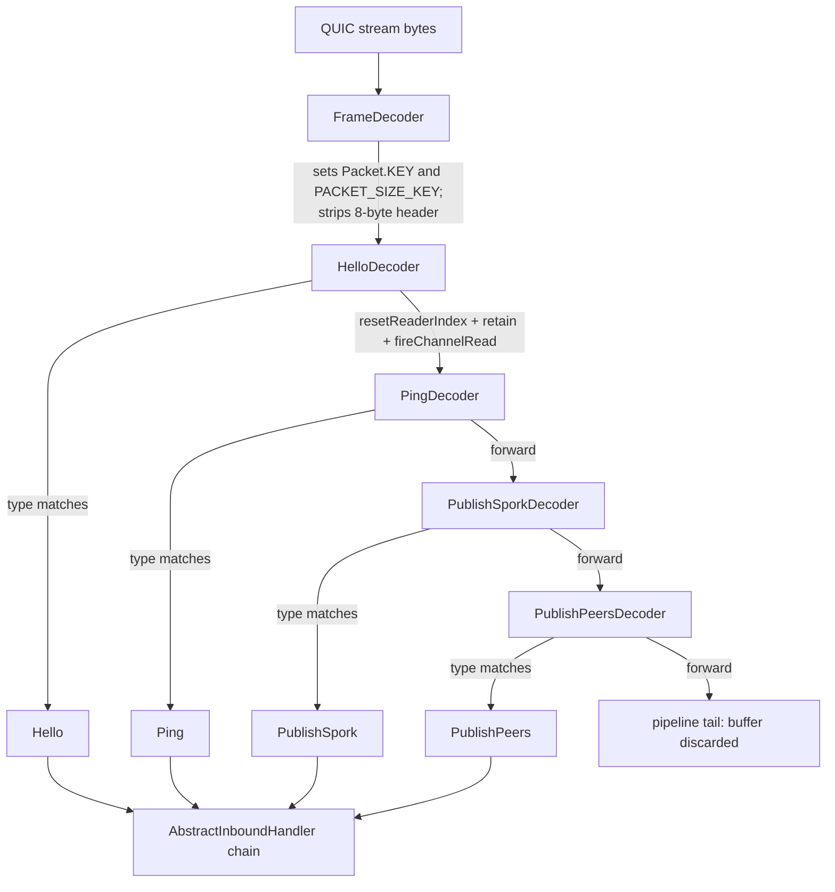
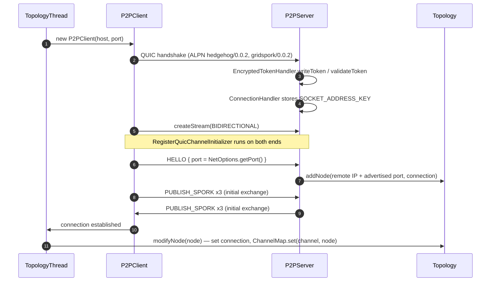
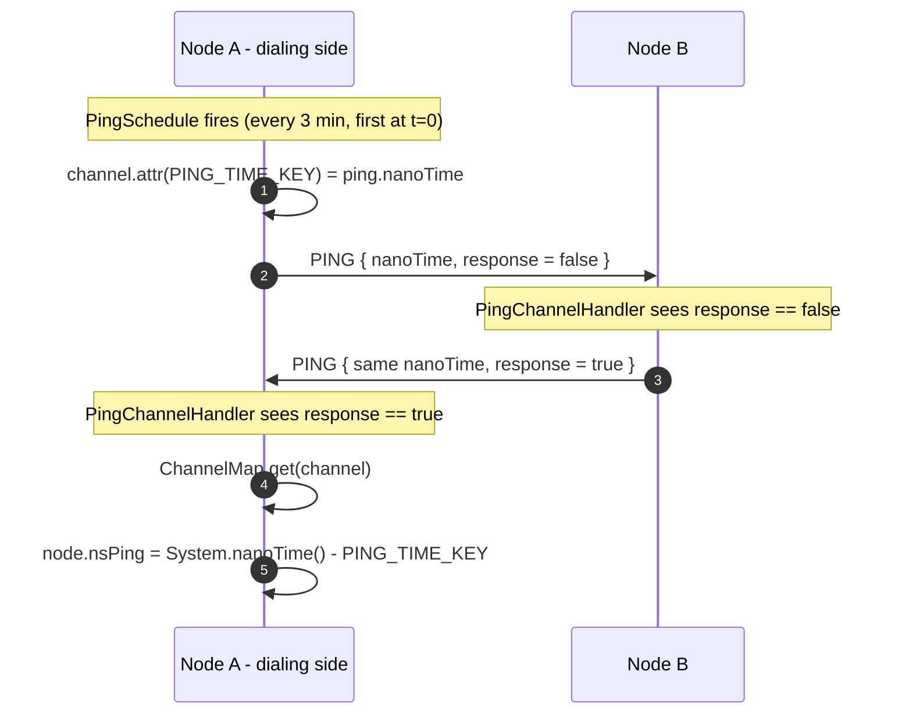
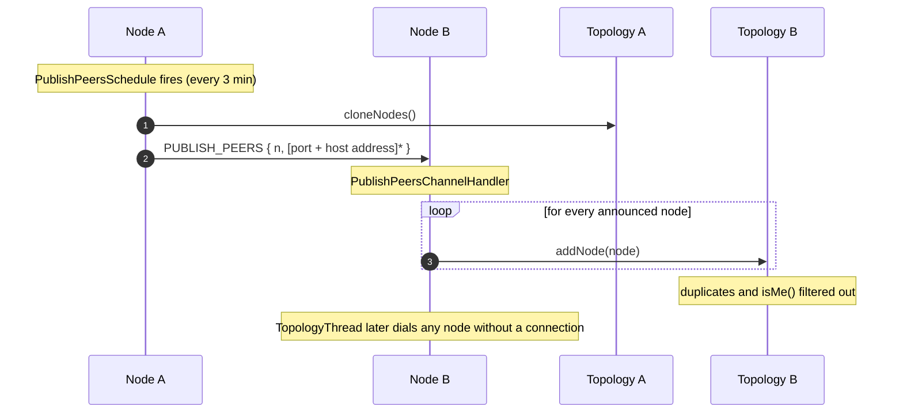
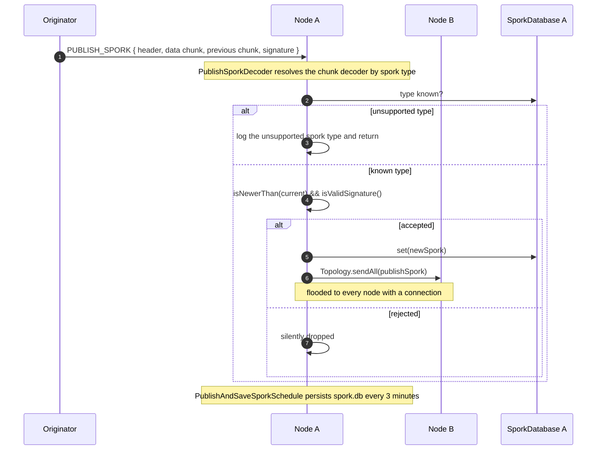

# Peer-to-peer network protocol

Hedgehog nodes talk to each other over QUIC, using the Netty incubator QUIC codec on top of a plain
NIO datagram channel. Every message is a length-prefixed binary frame carrying one packet type; the
packet types, their wire layouts, the Netty pipeline that encodes and decodes them, the handlers that
act on them and the topology bookkeeping they drive are all described here. For how the daemon is
started and wired together see the [Architecture overview](architecture.md) and
[CDI container and component lifecycle](cdi-and-lifecycle.md); the payloads carried by
`PUBLISH_SPORK` are covered in [Grid sporks](sporks.md).

## Transport

The P2P server is `application/src/main/java/org/unigrid/hedgehog/server/p2p/P2PServer.java`, an
`@Eager @ApplicationScoped` bean whose `@PostConstruct` method builds the whole stack. The client
side is `application/src/main/java/org/unigrid/hedgehog/client/P2PClient.java`. Both bind a
`NioDatagramChannel` through a Netty `Bootstrap` and install a QUIC codec as the datagram handler.

`P2PServer.init()` is where the server side is assembled, in this order:

1. Netty's internal logging is routed to SLF4J with
   `InternalLoggerFactory.setDefaultFactory(Slf4JLoggerFactory.INSTANCE)`.
2. A fresh `SelfSignedCertificate` is generated and turned into a `QuicSslContext` carrying
   `Network.getProtocols()` as the ALPN list.
3. A `QuicServerCodecBuilder` is configured with that context, the injected `EncryptedTokenHandler` as
   `tokenHandler`, the four flow-control settings fed from `MAX_DATA_SIZE` and `MAX_STREAMS`,
   `maxIdleTimeout` from `IDLE_TIME_MINUTES`,
   `.handler(new ConnectionHandler())` on the QUIC connection channel and a
   `RegisterQuicChannelInitializer` (handler supplier, schedule supplier, `Type.SERVER`) as
   `.streamHandler(...)`.
4. The codec is bound as the datagram handler of a `NioDatagramChannel` at
   `NetOptions.getHost()`/`getPort()` through a `Bootstrap` on the bean's four-thread
   `NioEventLoopGroup`, and the bind is `sync()`ed before the channel is stored.
5. A `TopologyThread` is constructed and started.

`@PreDestroy` unwinds the same three long-lived pieces — `topologyThread.exit()`, `channel.close()`,
`group.shutdownGracefully()`. `P2PServer` extends
`application/src/main/java/org/unigrid/hedgehog/server/AbstractServer.java`, which reads the bound
channel's `localAddress()` to expose `getHostName()`, `getPort()` and `getChannelId()`; that is how the
P2P tests learn which host and port the server actually landed on. `AbstractServer` also carries the
`allocate(String)` free-port helper, which only the REST server uses (see
[REST interface](rest-api.md)).

`application/src/main/java/org/unigrid/hedgehog/model/Network.java` holds every transport constant:

| Constant | Value | Used for |
| --- | ---: | --- |
| `COMMUNICATION_THREADS` | `4` | Size of the `NioEventLoopGroup` on both server and client |
| `MAX_DATA_SIZE` | `1024 * 1024 * 256` (256 MiB) | QUIC `initialMaxData`, both `initialMaxStreamDataBidirectional*` values, and the `maxFrameLength` of `FrameDecoder` |
| `MAX_STREAMS` | `512` | QUIC `initialMaxStreamsBidirectional` |
| `IDLE_TIME_MINUTES` | `15` | QUIC `maxIdleTimeout` |
| `CONNECTION_TIMEOUT_MS` | `2000` | Timeout on `QuicChannel.newBootstrap(...).connect()` in `P2PClient` |

The source comment on `MAX_DATA_SIZE` reads `/* 256 MB */`; the value is `1024 * 1024 * 256`, i.e.
256 MiB, and that is how it is written throughout this manual.

`PROTOCOLS` is `{ "hedgehog/0.0.2", "gridspork/0.0.2" }` and is passed verbatim to
`QuicSslContextBuilder.applicationProtocols(...)` on both sides, so both strings are offered as ALPN
identifiers. Nothing in the code inspects the negotiated protocol afterwards — `gridspork/0.0.2` is
advertised but never used to select behavior. The same array is echoed by the REST version endpoint
(see [REST interface](rest-api.md)).

`SEEDS` is the six-entry list `seed1.unigrid.org` … `seed6.unigrid.org`. `Network.getSeeds()` returns
it only when `NetOptions.isSeeds()` is true (the `--no-seeds` picocli option is negatable and
defaults to enabled); otherwise it returns an empty array. The method also catches `ClassCastException`
and logs it, with a `TODO` noting that the exception "only seems to happen during testing".

Ports and bind addresses come from
`application/src/main/java/org/unigrid/hedgehog/command/option/NetOptions.java`: `--nethost`/`-H`
defaults to `0.0.0.0`, `--netport`/`-p` defaults to `52883` (`NetOptions.DEFAULT_PORT`).

### TLS and certificates

There is no peer authentication. The server generates a fresh `SelfSignedCertificate` in its
`@PostConstruct` and builds the context with
`QuicSslContextBuilder.forServer(certificate.privateKey(), null, certificate.certificate())` — a new
certificate per process start, with no key password. The client builds
`QuicSslContextBuilder.forClient().trustManager(InsecureTrustManagerFactory.INSTANCE)`, which accepts
any certificate presented. QUIC therefore provides transport encryption and integrity, but node
identity is established solely by the address the connection came from plus the port announced in the
`HELLO` packet. Authenticity of the data that matters — grid sporks — is enforced separately by
signature verification (see [Grid sporks](sporks.md)).

### QUIC address validation tokens

The server installs `application/src/main/java/org/unigrid/hedgehog/model/network/handler/EncryptedTokenHandler.java`
as its `QuicTokenHandler`. It is `@ApplicationScoped`, calls `Quic.ensureAvailability()` from
`@PostConstruct` (which loads the native quiche library), and derives its AES key from an injected
`UUID`:

- `SERVER_NAME` is `Hedgehog.class.getSimpleName()`, i.e. the literal `Hedgehog` (8 bytes).
- The key is the injected UUID with dashes removed, taken as ISO-8859-1 bytes — 32 bytes, so AES-256.
  The UUID comes from `model/producer/RandomUUIDProducer.java` and is therefore new on every process
  start; tokens do not survive a restart.
- `writeToken` encrypts `"Hedgehog"` concatenated with the raw bytes of the peer address using
  `AES/CBC/PKCS5Padding` with an **all-zero 16-byte IV**, then writes a single length byte, the
  ciphertext, and the destination connection id.
- `validateToken` decrypts, checks the server name and that the address bytes match, and returns
  `length + 1` (the offset of the connection id) or `-1`.
- `maxTokenLength()` returns `SERVER_NAME.length() + IPV6_LENGTH` rounded up to the next 16-byte
  boundary plus `QUICHE_MAX_CONN_ID_LEN` (18) — 50 bytes in practice.

Cipher failures are reported with `System.err.println(ex)` rather than the logger.

### Streams

The client creates exactly one bidirectional stream per connection
(`quicChannel.createStream(QuicStreamType.BIDIRECTIONAL, new RegisterQuicChannelInitializer(...))`)
and that stream carries all traffic in both directions. The client also passes a bare
`ChannelInboundHandlerAdapter` as the `streamHandler` of the QUIC channel bootstrap, so any stream the
*server* opens toward the client gets no codec pipeline at all. On the server, `.streamHandler(...)`
receives a `RegisterQuicChannelInitializer` and `.handler(new ConnectionHandler())` is installed on
the QUIC connection channel itself.

### Channel initialization

`application/src/main/java/org/unigrid/hedgehog/model/network/initializer/RegisterQuicChannelInitializer.java`
is a `ChannelInitializer<QuicStreamChannel>` constructed with two `Supplier`s (handlers and
schedulables) and a `Type` (`CLIENT` or `SERVER`). `initChannel` does four things, in order:

1. Stores the type in the channel attribute `CHANNEL_TYPE_KEY` (`"CHANNEL_TYPE"`), written as
   `channel.pipeline().channel().attr(CHANNEL_TYPE_KEY).set(type)` — `ChannelPipeline.channel()`
   returns the stream channel itself, so this lands on the stream channel, not its QUIC parent.
   `Type.is(Channel)` reads it back the same way, which is what the tests use to tell the two
   directions apart.
2. Adds every handler from `handlersCreator.get()` to the pipeline, in list order.
3. If the type is `CLIENT`, immediately writes `Hello.builder().port(NetOptions.getPort()).build()`.
4. Registers each `Schedulable` with `channel.eventLoop().scheduleAtFixedRate(...)`, using an initial
   delay of `0` when `isExecuteOnCreation()` is true and `getPeriod()` otherwise, and cancels the
   future from the channel's `closeFuture()` listener.

Finally it resolves `SporkDatabase` from CDI and calls
`PublishAndSaveSporkSchedule.writeAndFlush(channel, db)` — so **both** sides push their sporks the
moment the stream comes up, independent of the periodic schedule. That push only produces traffic once
the database actually holds sporks; on a node whose database is still empty the write fails inside the
encoder (see [Scheduled traffic](#scheduled-traffic)).

The convenience constructor `RegisterQuicChannelInitializer(handlersCreator, type)` passes `null` for
`schedulersCreator`, but `initChannel` calls `schedulersCreator.get()` inside `Objects.nonNull(...)`,
which would dereference the null supplier. Nothing uses that constructor today; both call sites pass
all three arguments.

## Pipeline assembly

The pipelines are currently assembled by hand in `P2PServer` and `P2PClient`. Both are marked with
`// TODO: Add support for ChannelCollector`.

Server pipeline (in order):

```
LoggingHandler(DEBUG)
FrameDecoder
HelloDecoder
PingEncoder            PingDecoder
PublishSporkEncoder    PublishSporkDecoder
PublishPeersEncoder    PublishPeersDecoder
PingChannelHandler
PublishSporkChannelHandler
HelloChannelHandler
PublishPeersChannelHandler
```

Client pipeline (in order):

```
LoggingHandler(DEBUG)
FrameDecoder
HelloEncoder
PingEncoder            PingDecoder
PublishSporkEncoder    PublishSporkDecoder
PublishPeersEncoder    PublishPeersDecoder
PingChannelHandler
PublishSporkChannelHandler
PublishPeersChannelHandler
```

The asymmetry is deliberate for `HELLO` — only the client sends it and only the server decodes it —
but it means a `HELLO` sent by a server would be dropped by the client, since the client has no
`HelloDecoder`. Neither pipeline contains the `ASK_PEERS` or `ASK_NODE_DETAILS` codecs.

Both sides register the same three schedules: `PingSchedule`, `PublishPeersSchedule` and
`PublishAndSaveSporkSchedule`.

### Annotation-driven discovery

Three marker annotations exist under
`application/src/main/java/org/unigrid/hedgehog/model/network/channel/`:
`ChannelCodec.java`, `ChannelHandler.java` and `ChannelScheduler.java`. All three are
`@Target(TYPE) @Retention(RUNTIME)` and declare the same two members:

```java
Type[] value() default {Type.CLIENT, Type.SERVER};
int priority() default 0;
```

Each annotation declares its own nested `Type { CLIENT, SERVER }` enum.

`ChannelCollector.java` scans for them with the Reflections library
(`org.reflections:reflections:0.10.2`), configured with the `TypesAnnotated` and `Resources`
scanners. `collectCodecs`, `collectHandlers` and `collectSchedules` each default their scan root to
the classpath location of a marker class — `codec/Package.java`, `handler/Package.java` and
`schedule/Package.java` respectively, three empty classes whose only comment is *"Empty on purpose.
Just a placeholder for reflection"*. Each discovered class is instantiated through its declared
no-argument constructor, the list is sorted by `priority()` ascending, and then filtered to those
whose `value()` contains the requested `Type`.

Only `@ChannelCodec` is actually applied anywhere in main sources:

| Class | Priority |
| --- | ---: |
| `FrameDecoder` | `-10` |
| `HelloEncoder` | `0` |
| `HelloDecoder` | `1` |
| `PingEncoder` | `2` |
| `PingDecoder` | `3` |
| `PublishSporkEncoder` | `10` |
| `PublishSporkDecoder` | `11` |

`PublishPeersEncoder`/`PublishPeersDecoder`, `AskPeersEncoder`/`AskPeersDecoder` and
`AskNodeDetailsEncoder`/`AskNodeDetailsDecoder` carry no annotation, and no class anywhere carries
`@ChannelHandler` or `@ChannelScheduler`. The ordering the priorities encode matches the hand-written
pipelines: the frame decoder first, then codecs grouped per packet type.

Two things about `ChannelCollector` are worth knowing before relying on it:

- The private `find(...)` method reads `o.getClass().getAnnotation(ChannelCodec.class)` for both the
  sort key and the filter, regardless of which annotation class was requested. `collectHandlers` and
  `collectSchedules` would therefore dereference `null` on any class annotated with `@ChannelHandler`
  or `@ChannelScheduler` instead of `@ChannelCodec`.
- All three public methods take `ChannelCodec.Type` (imported unqualified as `Type`), so
  `ChannelHandler.Type` and `ChannelScheduler.Type` are never used. The generic bound
  `<T extends ChannelHandler>` refers to the *annotation* type in the same package, not to Netty's
  `io.netty.channel.ChannelHandler`.

The only exercise of this code is `application/src/test/java/org/unigrid/hedgehog/model/network/channel/ChannelCollectorTest.java`,
which declares two annotated inner classes (`@ChannelCodec` and `@ChannelCodec(Type.SERVER)`) and
prints the collected result with `System.out.println` — there is no assertion anywhere in it. The
collector is therefore exercised, not tested.

`application/src/main/java/org/unigrid/hedgehog/model/util/Reflection.java` is a separate general
reflection helper — `getDeclaredFieldsWithParents`, `getConstructor`, `invoke`, `getFieldValue`, and
`resetIllegalAccessLogger` (which pokes `jdk.internal.module.IllegalAccessLogger` through
`sun.misc.Unsafe` to silence reflective-access warnings, and bails out with a warning if either class
is absent). It is called from `Hedgehog.main` (`resetIllegalAccessLogger`), from `RestServer`
(`getConstructor`, twice) and from tests; it plays no part in pipeline assembly.

### Interaction with the native image

Runtime classpath scanning normally conflicts with a closed-world native image, but it does not here:
the `native-image` module does not compile the daemon ahead of time. `NativeImage.java` is a launcher
that unpacks a bundled jlink JVM image into the user data directory and executes the run script in it,
so `Reflections`, CDI and the annotation scan all run on a normal JVM. `BundleFeature` only registers
the jlink archive as a resource and forces build-time initialization of Logback/SLF4J/Commons Compress
classes. Details are in [Build, testing and native image](build-and-native-image.md).

## Frame format

Every message on the wire is one frame with an eight-byte header, produced by
`application/src/main/java/org/unigrid/hedgehog/model/network/codec/AbstractMessageToByteEncoder.java`
and consumed by `application/src/main/java/org/unigrid/hedgehog/model/network/codec/FrameDecoder.java`.
All integers are big-endian, matching Netty's `ByteBuf` defaults.

```
 byte 0    byte 1    byte 2    byte 3    byte 4    byte 5    byte 6    byte 7
+---------+---------+---------+---------+---------+---------+---------+---------+
|      0xBABE       |    packet type    |            payload length            |
|     uint16        |      int16        |                int32                 |
+---------+---------+---------+---------+---------+---------+---------+---------+
|                        << packet-specific payload >>                          |
+-------------------------------------------------------------------------------+
```

- `FrameDecoder.MAGIC` is `0xBABE`.
- `packet type` is `Packet.Type.getValue()` of the encoder that produced the frame.
- `payload length` counts only the bytes after the header — `AbstractMessageToByteEncoder` writes
  `data.writerIndex()` of the encoded payload buffer.

`FrameDecoder` extends `LengthFieldBasedFrameDecoder` and is constructed as
`super(Network.MAX_DATA_SIZE, 4, 4, 0, 8)`: max frame length 256 MiB, length field at offset 4 and 4
bytes wide, no length adjustment, and eight initial bytes stripped. Netty computes
`frameLength = payloadLength + lengthFieldEndOffset (8) + lengthAdjustment (0)`, which is exactly the
total frame size, and then strips the header before passing the frame on.

Before delegating to the superclass, `FrameDecoder.decode` marks the reader index, reads the magic and
— on a match — stores routing information as *channel attributes*:

| Attribute key | Declared in | Content |
| --- | --- | --- |
| `Packet.KEY` (`"Packet"`) | `packet/Packet.java` | `Packet.Type.get(in.readShort())` for the frame being decoded |
| `FrameDecoder.PACKET_SIZE_KEY` (`"PACKET_SIZE"`) | `codec/FrameDecoder.java` | the payload length as `int` |

It then resets the reader index and calls `super.decode(...)`. A mismatched magic throws
`codec/InvalidFrameMagicNumberException.java`, a plain checked `Exception` whose message is
`"Invalid magic number in frame"`.

Two consequences of putting the type on the channel rather than in the decoded message:

- `FrameDecoder.decode` reads eight header bytes without first checking `readableBytes()`. Since
  `ByteToMessageDecoder` may invoke `decode` on a partially filled cumulation buffer, a header split
  across reads makes one of those reads throw `IndexOutOfBoundsException` — `ByteBuf` read methods are
  bound-checked, so nothing is read past the writer index. `ByteToMessageDecoder` wraps that in a
  `DecoderException`, which travels down the pipeline as `exceptionCaught` to the first
  `AbstractInboundHandler`, gets logged at warn level and closes the channel. The partial-frame
  buffering `LengthFieldBasedFrameDecoder` would normally provide is bypassed by the manual header
  read in front of it.
- The routing key is per-channel mutable state, so its correctness depends on frames being dispatched
  one at a time. They are: `ByteToMessageDecoder.callDecode` fires the accumulated output list
  downstream at the *top* of each loop iteration, before decoding the next frame, so several frames
  arriving in one read are each dispatched through the (synchronous) pipeline while `Packet.KEY` and
  `PACKET_SIZE_KEY` still hold their own values. The design leans on that ordering and on every
  decoder in the chain staying synchronous; move a packet decoder onto another executor and the
  attributes stop describing the frame in flight.

### The decoder chain

`application/src/main/java/org/unigrid/hedgehog/model/network/codec/AbstractReplayingDecoder.java`
turns the flat list of decoders into a type-dispatch chain. It extends Netty's `ReplayingDecoder` and
overrides `callDecode`:

```java
final Packet.Type type = ctx.channel().attr(Packet.KEY).get();

if (TypedCodec.class.isAssignableFrom(getClass())) {
        final TypedCodec<Packet.Type> object = (TypedCodec<Packet.Type>) this;

        if (object.getCodecType() == type) {
                super.callDecode(ctx, in, out);
                forward = false;
        }
}

if (forward) {
        in.resetReaderIndex();
        in.retain();
        ctx.fireChannelRead(in);
}
```

Each decoder compares the channel's current `Packet.Type` against its own `getCodecType()`. On a match
it decodes; otherwise it rewinds, retains the buffer and forwards it to the next handler. A frame
whose type no decoder in the pipeline claims travels to the pipeline tail as a raw `ByteBuf` and is
discarded there by Netty.

The buffer being forwarded deserves attention, because nothing in the chain copies it. The `in` handed
to `callDecode` is that decoder's own `ByteToMessageDecoder` cumulation, so `retain()` plus
`fireChannelRead(in)` passes the *same* buffer instance to the next decoder, which adopts it as its own
cumulation. Nobody consumes it on the way down; the decoder that finally matches consumes it, and
because the instance is shared, the reader index it advances is the one every upstream decoder is
holding. When the call stack unwinds, the `finally` block of `ByteToMessageDecoder.channelRead` in each
upstream decoder sees a cumulation that is no longer readable, releases it and drops its reference.
That is what keeps the chain from leaking on the ordinary path.

The path where no decoder matches has no such drain. Every decoder retained the buffer and kept it as a
readable cumulation; only the pipeline tail's release balances the last retain. Each decoder then merges
the next frame onto its leftover bytes rather than starting clean, and its `numReads` counter keeps
climbing toward `discardAfterReads` (16 by default) with `discardSomeReadBytes()` as the only cleanup.
The leading decoder of each pipeline — `HelloDecoder` on the server, `PingDecoder` on the client — sees
every frame of every type, so it is the one that carries this residue.

`AbstractReplayingDecoder.decode` reads `PACKET_SIZE_KEY` into a local, adds the decoded entity to the
output list if present, and carries a `// TODO: Verify size with PACKET_SIZE_KEY` — the announced
payload length is currently never validated against what the decoder consumed. The `BaseCodecTest`
harness does check the equivalent invariant offline: `PingIntegrityTest`, `PublishPeersIntegrityTest`,
`AskNodeDetailsIntegrityTest` and `PublishSporkIntegrityTest` all assert that the decoder's final
reader index equals the frame's writer index, i.e. that decoding consumes exactly the bytes the
encoder produced.

The server pipeline's decoder chain, in order:



The encoders are simpler. `AbstractMessageToByteEncoder<T>` extends `MessageToByteEncoder<T>`,
declares `abstract Optional<ByteBuf> encode(ctx, T)` for subclasses, and in its `final`
`encode(ctx, T, ByteBuf out)` writes the frame header followed by the payload, then releases the
payload buffer. A subclass returning `Optional.empty()` would write nothing at all — no header, no
payload — but no encoder in the repository ever does: every `encode` implementation ends in
`Optional.of(out)`. When `AbstractGridSporkEncoder` finds no chunk encoder registered for a spork type
it writes nothing at all into the buffer `PublishSporkEncoder` returns, and
`AbstractMessageToByteEncoder` still writes an eight-byte `PUBLISH_SPORK` frame with
`payload length = 0` onto the wire. All encoders are annotated `@Sharable`; the decoders are stateful
`ReplayingDecoder`s and are not.

`codec/api/PacketEncoder.java` and `codec/api/PacketDecoder.java` both extend
`codec/chunk/TypedCodec.java`, a one-method interface (`T getCodecType()`) shared with the chunk
codecs.

## Packet catalog

`application/src/main/java/org/unigrid/hedgehog/model/network/packet/Packet.java` declares the type
enum. `Packet.Type.get(short)` maps unknown values to `UNDEFINED`.

| Type | Id | Packet class | Encoder | Decoder | Handler | In a live pipeline |
| --- | ---: | --- | --- | --- | --- | --- |
| `UNDEFINED` | 0 | — | — | — | — | no |
| `HELLO` | 250 | `Hello` | `HelloEncoder` | `HelloDecoder` | `HelloChannelHandler` | encoder client-side, decoder and handler server-side |
| `PING` | 500 | `Ping` | `PingEncoder` | `PingDecoder` | `PingChannelHandler` | yes, both sides |
| `ASK_PEERS` | 1000 | `AskPeers` | `AskPeersEncoder` | `AskPeersDecoder` | `AskPeersChannelHandler` (empty body) | no |
| `PUBLISH_PEERS` | 1010 | `PublishPeers` | `PublishPeersEncoder` | `PublishPeersDecoder` | `PublishPeersChannelHandler` | yes, both sides |
| `ASK_NODE_DETAILS` | 1100 | `AskNodeDetails` | `AskNodeDetailsEncoder` | `AskNodeDetailsDecoder` | `AskNodeDetailsChannelHandler` (`//TODO: Implement me`) | no |
| `PUBLISH_NODE_DETAILS` | 1110 | — | — | — | — | not implemented |
| `ASK_SPORKS` | 2000 | — | — | — | — | not implemented |
| `GROW_SPORK` | 2010 | — | — | — | — | not implemented |
| `PUBLISH_SPORK` | 2020 | `PublishSpork` | `PublishSporkEncoder` | `PublishSporkDecoder` | `PublishSporkChannelHandler` | yes, both sides |

So of the nine defined non-`UNDEFINED` types, six have codecs, three (`PUBLISH_NODE_DETAILS`,
`ASK_SPORKS`, `GROW_SPORK`) have no packet class, no codec and no handler, and of the six with codecs
only four (`HELLO`, `PING`, `PUBLISH_PEERS`, `PUBLISH_SPORK`) are reachable on a live connection.

Every packet class extends `Packet`, is a Lombok `@Data @Builder @AllArgsConstructor
@EqualsAndHashCode(callSuper = false)` type implementing `Serializable`, and sets its own type in its
no-argument constructor. `@Builder` goes through the `@AllArgsConstructor`, which covers only the fields
declared in the subclass, so a builder-constructed packet leaves the inherited `type` null while a
decoder-constructed one — `new Ping()`, `new Hello()` — sets it. That difference is invisible to
`equals`, since `callSuper = false` keeps `type` out of Lombok's generated comparison, but it is visible
to the shazamcrest `sameBeanAs(...)` matcher the integrity tests use, which serializes the whole object
graph including inherited fields. `PingIntegrityTest` and `AskNodeDetailsIntegrityTest` therefore call
`setType(...)` on the expected value, because `PingDecoder` and `AskNodeDetailsDecoder` construct
through the no-argument constructor. `PublishPeersIntegrityTest` and `PublishSporkIntegrityTest` need no
such fixup: their decoders build through the builder too, so both sides end up with `type == null`.

The class comment at the top of `Packet.java` describes a header of
`[ type ][resrvd][ packet size ][ reserved ]`, which does not match what `FrameDecoder` and
`AbstractMessageToByteEncoder` actually read and write. Treat the frame layout above as authoritative.

## Packet payload layouts

All layouts below describe the bytes *after* the eight-byte frame header. "Reserved" bytes are written
as zeros by the encoders (`ByteBuf.writeZero`) and skipped by the decoders (`ByteBuf.skipBytes`); no
decoder inspects them.

### HELLO — 16 bytes

`codec/HelloEncoder.java`, `codec/HelloDecoder.java`

| Offset | Size | Field | Encoding |
| ---: | ---: | --- | --- |
| 0 | 2 | port | `writeShort(port)` / `readUnsignedShort()` |
| 2 | 14 | reserved | zero |

Sent once by the client from `RegisterQuicChannelInitializer.initChannel` with
`NetOptions.getPort()`, so the server learns the port the peer *listens* on rather than the ephemeral
source port of the QUIC connection.

### PING — 16 bytes

`codec/PingEncoder.java`, `codec/PingDecoder.java`

| Offset | Size | Field | Encoding |
| ---: | ---: | --- | --- |
| 0 | 8 | nano request time | `writeLong(nanoTime)` |
| 8 | 1 | response flag | `0x01` when `isResponse()`, else `0x00`; decoded as `(byte & 0x01) == 0x01` |
| 9 | 7 | reserved | zero |

`Ping.nanoTime` is a Lombok `@Builder.Default` initialized to `System.nanoTime()`, so
`Ping.builder().build()` timestamps itself. `Ping.HEARTBEAT_MINUTES` is `3` and `Ping.PING_TIME_KEY`
(`"PING_TIME"`) is the channel attribute used for latency measurement.

### ASK_PEERS — 8 bytes

`codec/AskPeersEncoder.java`, `codec/AskPeersDecoder.java`

| Offset | Size | Field | Encoding |
| ---: | ---: | --- | --- |
| 0 | 2 | amount | `writeShort(amount)` / `readShort()` |
| 2 | 6 | reserved | zero |

`AskPeers.amount` defaults to `8` (`DEFAULT_ASK_AMOUNT_OF_PEERS`). Nothing constructs or sends this
packet today.

### PUBLISH_PEERS — variable

`codec/PublishPeersEncoder.java`, `codec/PublishPeersDecoder.java`

| Offset | Size | Field | Encoding |
| ---: | ---: | --- | --- |
| 0 | 2 | `n` = node count | `writeShort(nodes.size())` / `readShort()` |
| 2 | 6 | reserved | zero |

followed by `n` repetitions of:

| Size | Field | Encoding |
| ---: | --- | --- |
| 2 | port | `writeShort(port)` / `readUnsignedShort()` |
| 6 | reserved | zero |
| var | host address | NUL-terminated UTF-8 of `address.getAddress().getHostAddress()` |

The decoder rebuilds each entry as `new InetSocketAddress(hostAddress, port)` wrapped in
`Node.builder().address(...).build()`, so the connection, details and ping fields of a published node
are never transmitted. `PublishPeersIntegrityTest.shouldNotIncludeConnectionOrPing` pins down the
connection field specifically — it sets a mocked `Connection` on every node before encoding and then
asserts `getConnection()` is `Optional.empty()` on every decoded node; despite the name, it makes no
assertion about `nsPing` or `details`.

Because the encoder dereferences `getAddress().getAddress()`, a `Node` holding an unresolved
`InetSocketAddress` (a hostname whose DNS lookup failed) cannot be encoded. The same dereference sits
in `Node.getURI()`, which makes the hazard wider than the encoder — see [Node identity](#node-identity).

`PublishPeers.DISTRIBUTION_FREQUENCY_MINUTES` is `3`.

### ASK_NODE_DETAILS — 8 bytes

`codec/AskNodeDetailsEncoder.java`, `codec/AskNodeDetailsDecoder.java`

| Offset | Size | Field | Encoding |
| ---: | ---: | --- | --- |
| 0 | 1 | flags | bit mask, see below |
| 1 | 7 | reserved | zero |

`AskNodeDetails.Flags` defines `PROTOCOL` = `0x01` and `VERSION` = `0x02`, with
`isSet(flags)` testing `(flags & mask) == mask`. Both booleans default to `true`. There is no
`PUBLISH_NODE_DETAILS` counterpart, and the `protocols`/`version` fields of `Node.Details` are never
populated by any code in the repository — although every `Node` carries an empty `Details` instance
(`@Builder.Default private Details details = new Details();`) and Jackson serializes it whenever the
REST node endpoints return a node.

### PUBLISH_SPORK — variable

`codec/PublishSporkEncoder.java`, `codec/PublishSporkDecoder.java` delegate the entire payload to
`codec/AbstractGridSporkEncoder.java` / `codec/AbstractGridSporkDecoder.java`. The spork header is:

| Offset | Size | Field | Encoding |
| ---: | ---: | --- | --- |
| 0 | 2 | spork type | `GridSpork.Type.getValue()` / `GridSpork.Type.get(readShort())` |
| 2 | 2 | flags | `writeShort(flags)` / `readShort()` |
| 4 | 4 | reserved | zero |
| 8 | 8 | timestamp | `timeStamp.toEpochMilli()` / `Instant.ofEpochMilli(readLong())` |
| 16 | 8 | previous timestamp | `previousTimeStamp.toEpochMilli()` / `Instant.ofEpochMilli(readLong())` |
| 24 | 8 | reserved | zero |

followed by the chunk encoding of `data`, then the chunk encoding of `previousData`, then:

| Size | Field | Encoding |
| ---: | --- | --- |
| 2 | signature length | `writeShort(signature.length)` / `readUnsignedShort()` |
| var | signature | raw bytes |

Timestamps are millisecond precision on the wire; `GridSpork.archive()` truncates to
`ChronoUnit.MILLIS` for exactly this reason. `GridSpork.Flag` values (`GOVERNED` = `0x01`,
`DELTA` = `0x02`) travel in the flags field.

The encoder writes the spork into a temporary buffer and copies that into the buffer
`PublishSporkEncoder` returns; when `encoders.getOptional(spork.getType())` is empty it writes nothing
into that returned buffer at all — which, as described above, still puts an eight-byte frame with
`payload length = 0` on the wire.

The receiving side handles the two failure shapes differently:

- **A zero-length payload is dropped in silence.** `FrameDecoder` computes a frame length of exactly
  eight, strips all eight header bytes and hands the next decoder an empty `ByteBuf`. Both
  `ReplayingDecoder.callDecode` and `ByteToMessageDecoder.callDecode` loop on `in.isReadable()`, so
  `PublishSporkDecoder.typedDecode` is never entered, nothing is added to the output list, and the
  empty cumulation is released by `channelRead`'s `finally`. No packet, no warning, no error.
- **An unknown spork type leaves the reader index mid-frame.** `AbstractGridSporkDecoder.decodeGridSpork`
  reads the two type bytes first and only then looks the chunk decoder up. `GridSpork.Type.get(short)`
  maps anything unrecognized to `UNDEFINED`, for which nothing is registered, so it logs
  `"Unable to handle spork chunk of type {}"` at error level and returns `Optional.empty()` with those
  two bytes already consumed. `AbstractReplayingDecoder.decode` adds nothing to the output list, and
  `ReplayingDecoder.callDecode` — which continues the loop whenever the decoder consumed bytes but
  produced no message — calls straight back in, reading the *next* two bytes of the same frame as
  another spork type. That repeats until the frame runs dry, at which point the replaying buffer raises
  its `REPLAY` signal, the reader index rewinds to the last checkpoint and the remainder of the frame
  stays in the cumulation waiting for bytes that will belong to the next frame.

`PublishSpork.DISTRIBUTION_FREQUENCY_MINUTES` is `3`.

## Grid spork payloads and chunk codecs

The spork body is not encoded by the packet codec; it is delegated to a *chunk* codec selected at
runtime by spork type. The mechanism is generic enough to be reused for other payload families —
`ChunkGroup` exists to keep such families apart — but grid sporks are the only user today.

- `network/chunk/Chunk.java` — `@Target(TYPE) @Retention(RUNTIME)` annotation with
  `ChunkGroup group() default ChunkGroup.DEFAULT` and a mandatory `ChunkType type()`.
- `network/chunk/ChunkGroup.java` — `DEFAULT`, `GRIDSPORK`.
- `network/chunk/ChunkType.java` — `ENCODER`, `DECODER`.
- `network/chunk/ChunkData.java` — the payload marker interface; `Serializable`, one method
  `ChunkData empty()`, and Jackson `@JsonTypeInfo(use = Id.DEDUCTION)` with `@JsonSubTypes` listing
  `MintStorage.SporkData`, `MintSupply.SporkData` and `VestingStorage.SporkData`.
  `StatisticsPubKey.SporkData` is **not** in that list, so Jackson has no registered subtype for it.
- `network/chunk/ChunkScanner.java` — `scan(ChunkType, ChunkGroup)` runs Reflections over
  `TypedCodec.class.getPackageName()` (`org.unigrid.hedgehog.model.network.codec.chunk`), keeps the
  classes whose `@Chunk` matches both arguments, instantiates each through its no-arg constructor and
  collects them into an `OptionalMap` keyed by `getCodecType()`. A failure to instantiate is rethrown
  as `IllegalStateException("Unable to instantiate chunk converter.")`.
- `codec/api/ChunkEncoder.java` / `codec/api/ChunkDecoder.java` — `encodeChunk(ctx, T, ByteBuf)` and
  `Optional<T> decodeChunk(ctx, ByteBuf)`.
- `model/collection/OptionalMap.java` — an Apache Commons `AbstractMapDecorator` adding
  `getOptional(key)`.

`AbstractGridSporkEncoder` and `AbstractGridSporkDecoder` each build their map once, in the
constructor, calling `ChunkScanner.scan(...)` with `ChunkType.ENCODER` and `ChunkType.DECODER`
respectively and `ChunkGroup.GRIDSPORK` in both cases. This happens per codec instance, and the
pipeline suppliers construct fresh codecs for every stream — so every new connection re-runs the
classpath scan twice.

Four chunk types are implemented, all in
`application/src/main/java/org/unigrid/hedgehog/model/network/codec/chunk/`:

| `GridSpork.Type` | Id | Encoder | Decoder |
| --- | ---: | --- | --- |
| `MINT_STORAGE` | 1000 | `MintStorageEncoder` | `MintStorageDecoder` |
| `MINT_SUPPLY` | 1010 | `MintSupplyEncoder` | `MintSupplyDecoder` |
| `VESTING_STORAGE` | 1020 | `VestingStorageEncoder` | `VestingStorageDecoder` |
| `STATISTICS_PUBKEY` | 2001 | `StatisticsPubKeyEncoder` | `StatisticsPubKeyDecoder` |

### MINT_STORAGE chunk

| Size | Field | Encoding |
| ---: | --- | --- |
| 3 | `n` = mint count | `writeMedium(mints.size())` / `readMedium()` |
| 5 | reserved | zero |

then `n` repetitions of:

| Size | Field | Encoding |
| ---: | --- | --- |
| var | address | NUL-terminated UTF-8 of `Address.getWif()` |
| 4 | height | `writeInt` / `readInt` |
| var | amount | NUL-terminated UTF-8 of `BigDecimal.toPlainString()` |

The decoder loops `while (in.readableBytes() > 0 && mints.size() < entries)` and returns
`Optional.empty()` unless it read exactly `entries` mints. Amounts round-trip as decimal strings, so
scale is preserved exactly. Note that `AbstractGridSporkDecoder` unwraps the chunk with
`cd.get().decodeChunk(ctx, in).get()` — an empty result from a chunk decoder surfaces as a
`NoSuchElementException` out of the pipeline rather than as a clean rejection. The same applies to
`VestingStorageDecoder`, which uses the identical count-check pattern.

### MINT_SUPPLY chunk

| Size | Field | Encoding |
| ---: | --- | --- |
| var | max supply | NUL-terminated UTF-8 of `BigDecimal.toPlainString()` |

No count and no reserved padding — the shortest chunk of the four.

### VESTING_STORAGE chunk

| Size | Field | Encoding |
| ---: | --- | --- |
| 3 | `n` = entry count | `writeMedium` / `readMedium` |
| 5 | reserved | zero |

then `n` repetitions of:

| Size | Field | Encoding |
| ---: | --- | --- |
| var | address | NUL-terminated UTF-8 of `Address.getWif()` |
| 8 | vesting start | `start.getEpochSecond()` / `Instant.ofEpochSecond(readLong())` |
| 8 | vesting duration | `duration.getSeconds()` / `Duration.ofSeconds(readLong())` |
| 4 | parts | `writeInt` / `readInt` |

Second precision here, against millisecond precision in the spork header.

### STATISTICS_PUBKEY chunk

| Size | Field | Encoding |
| ---: | --- | --- |
| 8 | reserved | zero |
| var | public key | NUL-terminated UTF-8 |

The reserved eight bytes come first, unlike every other chunk.

Note that `PublishAndSaveSporkSchedule` publishes only `MINT_STORAGE`, `MINT_SUPPLY` and
`VESTING_STORAGE`; the statistics public key spork has full codec support but is never sent on the
wire by the current code. It can still arrive from a peer, and `SporkDatabase.set` has no `break` on
its `STATISTICS_PUBKEY` case, so storing one falls through to `default` and throws
`IllegalArgumentException` — see [Grid sporks](sporks.md).

## Buffer primitives

`application/src/main/java/org/unigrid/hedgehog/model/network/util/ByteBufUtils.java` holds the four
helpers the codecs share. Everything else is plain `ByteBuf` calls.

| Method | Behavior |
| --- | --- |
| `readNullTerminatedString(ByteBuf)` | Sizes a `byte[]` from `src.bytesBefore((byte) 0)`, reads it, skips the terminator, decodes as UTF-8 |
| `writeNullTerminatedString(String, ByteBuf)` | Writes the UTF-8 bytes then a single zero byte |
| `readNullTerminatedStringArray(ByteBuf, Function<ByteBuf, T>)` | Reads the count via the supplied reader (cast to `int`), then that many NUL-terminated strings |
| `writeNullTerminatedStringArray(String[], ByteBuf, Consumer<ByteBuf>)` | Invokes the supplied writer for the count, then writes each string |

The array variants take the count reader/writer as a lambda so callers choose the width;
`ByteBufUtilsTest` uses `writeMedium`/`readMedium`. Neither array variant is used by any production
codec at present — the chunk codecs write their counts inline.

An empty string encodes as a single zero byte and decodes back to `""`. A string containing an
embedded NUL cannot round-trip; no caller guards against that, and WIF addresses, decimal strings and
IP literals never contain one.

## Inbound handlers

`application/src/main/java/org/unigrid/hedgehog/model/network/handler/AbstractInboundHandler.java`
is the base for every packet handler. It extends `ChannelInboundHandlerAdapter`, is constructed with
the `Class<T>` it wants, and in `channelRead` either calls `typedChannelRead(ctx, (T) obj)` and
releases the message, or forwards it unchanged with `ctx.fireChannelRead(obj)` without releasing.
`exceptionCaught` logs the message and stack trace at warn level and closes the channel — so any
exception escaping a handler tears the connection down.

`ConnectionHandler` is the exception — it extends `ChannelInboundHandlerAdapter` directly, since it
handles a Netty user event rather than a decoded packet.

| Handler | Reacts to | What it does |
| --- | --- | --- |
| `ConnectionHandler` | `QuicConnectionEvent` on the QUIC connection channel | Address tracking, see below |
| `HelloChannelHandler` | `Hello` | Registers the sending node in the topology |
| `PingChannelHandler` | `Ping` | Echoes requests, records latency for responses |
| `PublishPeersChannelHandler` | `PublishPeers` | Adds every announced node to the topology |
| `PublishSporkChannelHandler` | `PublishSpork` | Validates, stores and re-broadcasts a spork |
| `AskPeersChannelHandler` | `AskPeers` | Empty body — the reply is commented out |
| `AskNodeDetailsChannelHandler` | `AskNodeDetails` | Empty body — `//TODO: Implement me` |

Handlers that need application state resolve it through
`CDIUtil.resolveAndRun(SomeBean.class, bean -> ...)`, which selects the bean from
`CDI.current()` and logs `"Unable to resolve instance {}"` at warn level if it is not resolvable — so a
handler whose bean is unresolvable inside a live container degrades to a no-op rather than failing.
That graceful path only covers an unresolvable bean: with no container at all, `CDI.current()` itself
throws `IllegalStateException` before the resolvability check is reached.

### ConnectionHandler

Installed with `.handler(...)` on the server's `QuicServerCodecBuilder`, so it sits on the QUIC
*connection* channel, not the stream channel. It only implements `userEventTriggered`, and only reacts
to `QuicConnectionEvent` (QUIC connection migration, or the initial address assignment). On each
event it:

1. Takes the new address from `event.newAddress()`.
2. Builds `new InetSocketAddress(addr.getHostAddress(), getPort(ctx))`, where `getPort` returns the
   port from the previously stored `SOCKET_ADDRESS_KEY` attribute, or `NetOptions.getPort()` when
   there is none yet.
3. If a previous address was stored, calls `topology.modifyNode(oldNode, n -> n.setAddress(newWPort))`
   so the node keeps its identity across a migration.
4. Stores the new address on the channel attribute
   `ConnectionHandler.SOCKET_ADDRESS_KEY` (`"SOCKET_ADDRESS"`).

The fallback port on first contact is the *local* listening port, which is then replaced by the peer's
real port as soon as `HELLO` arrives.

Two details of the implementation are easy to trip over. The single `else` branch covers both "the
`Topology` instance is not resolvable" and "the event was not a `QuicConnectionEvent`", but always
logs `"Unable to resolve Topology instance"`, so unrelated user events produce a misleading warning.
And `userEventTriggered` never calls `super`, so the event is not propagated further down the
connection channel's pipeline.

### HelloChannelHandler

Reads `SOCKET_ADDRESS_KEY` from `ctx.channel().parent()` — the stream channel's parent QUIC channel,
which is where `ConnectionHandler` stored it — takes the IP from there and the port from the packet,
wraps the stream channel in a `ConnectionContainer` and adds the resulting `Node` to the topology.

Note that it does not register the channel in the `ChannelMap` (see below).

### PingChannelHandler

```java
if (!ping.isResponse()) {
        ping.setResponse(true);
        ctx.writeAndFlush(ping).addListener(ChannelFutureListener.FIRE_EXCEPTION_ON_FAILURE);
} else {
        CDIUtil.resolveAndRun(Topology.class, topology -> {
                topology.getChannels().get(ctx.channel()).ifPresent(n -> {
                        final long previousTime = ctx.channel().attr(Ping.PING_TIME_KEY).get();
                        n.setNsPing(System.nanoTime() - previousTime);
                });
        });
}
```

A request is turned into a response by mutating the received packet in place and writing it straight
back, so the `nanoTime` value the originator chose is echoed unchanged. The latency is *not* computed
from that echoed value; it comes from `PING_TIME_KEY`, which `PingSchedule` writes on the channel just
before sending. That makes the wire field redundant for measurement purposes and means only one ping
per channel can be outstanding accurately — a second scheduled ping overwrites the attribute.

The read of that attribute is an unboxing one:
`final long previousTime = ctx.channel().attr(Ping.PING_TIME_KEY).get()`.
A `PING` that arrives with the response flag already set, on a channel that
is present in the `ChannelMap` but on which `PingSchedule` has not yet written the attribute, unboxes a
null `Long` and throws `NullPointerException`. Nothing in the handler guards against that; the
exception escapes to `AbstractInboundHandler.exceptionCaught`, which logs it at warn level and closes
the connection. Ordinary traffic never hits it — the attribute is written before the request goes out —
but an unsolicited response does.

`PingChannelHandlerTest.shouldSetResponseFlagOnResponse` asserts the flag flip;
`shoulBeAbleToPingNetwork` drives real `P2PClient` connections against up to twenty `TestServer`
instances and counts handler invocations on the server side.

### PublishPeersChannelHandler

Logs the count and adds every received `Node` through `topology.addNode(...)`, which filters
duplicates and the local node itself. There is no cap on how many peers a single packet may carry
beyond the `short` count field and the 256 MiB frame limit.

### PublishSporkChannelHandler

Resolves `SporkDatabase`, builds a map of the four known spork types to their current values, and then:

1. Looks the incoming type up in that map with `entries.get(newSpork.getType())`, which runs before the
   guard below. The map is built with `model/collection/NullableMap.java` rather than `Map.of` because
   a fresh database has null values for every type and `Map.of` rejects null values at construction.
2. If the received type is not one of the four keys, logs
   `"Received unsupported spork type - ignoring."` at error level and returns. The four keys cover
   every constant of `GridSpork.Type` except `UNDEFINED`, and the decoder never produces an
   `UNDEFINED`-typed spork — `decodeGridSpork` gives up before it constructs one when no chunk decoder
   is registered — so in the current pipeline this branch is unreachable.
3. Otherwise, if `newSpork.isNewerThan(oldSpork) && newSpork.isValidSignature()`, stores it with
   `db.set(newSpork)` and re-broadcasts the *original* `PublishSpork` packet to every connected node
   via `Topology.sendAll(publishSpork, topology, Optional.empty())`. `isNewerThan` treats a null or
   timestamp-less `oldSpork` as older than anything with a timestamp, which is what lets a node with an
   empty database accept the first spork it is offered.

`db.set(...)` is where a `STATISTICS_PUBKEY` spork falls through a missing `break` into `default` and
throws `IllegalArgumentException`; the ramifications of that are in [Grid sporks](sporks.md).

The re-broadcast has no origin suppression and no hop limit; loops are broken only by the
`isNewerThan` timestamp check on the receiving side. The `Optional.empty()` consumer carries a
`// TODO: Handle errors better rather than sending Optional.empty()`, i.e. write failures during
propagation are not observed.

`PublishSporkChannelHandlerTest` mocks `GridSpork.isValidSignature()` to return `true` and asserts
`greaterThanOrEqualTo` on the invocation count, with a comment explaining that the flooding makes an
exact count unpredictable.

## Topology and connection state

`application/src/main/java/org/unigrid/hedgehog/model/network/Topology.java` is the
`@ApplicationScoped` registry of known nodes. It holds a `HashSet<Node>` and an injected `ChannelMap`.

Most of its methods carry `@Protected @Lock(LockMode.READ)` or `@Protected @Lock(LockMode.WRITE)`, an
interceptor binding implemented by `model/cdi/ProtectedInterceptor.java`. **Those annotations have no
effect in the packaged daemon.** The interceptor is declared `@Interceptor @Protected` with no
`@Priority`, and `application/src/main/resources/META-INF/beans.xml` is an empty `<beans …
bean-discovery-mode="annotated">` element with no `<interceptors>` entry, which are the only two ways
CDI enables an interceptor — so every method below runs unsynchronized in the shipped process. Only the
test harness switches the interceptor on, which means the locking is live under test and dead in
production. [CDI container and component lifecycle](cdi-and-lifecycle.md) carries the full account,
including the interceptor's read/write semantics and self-invocation behavior; read the annotations
here as declared intent. As declared, `clear`, `modifyNode`, `addNode` and `removeNode` ask for
`LockMode.WRITE`; `repopulate`, `forEach`, `cloneNodes`, `containsNode` and the static `sendAll` ask
for `LockMode.READ`; `init()` and `isEmpty()` ask for nothing.

| Method | What it does |
| --- | --- |
| `init()` (`@PostConstruct`) | calls `repopulate()`; carries no annotation |
| `clear()` | clears the node set |
| `repopulate()` | replaces the node set, clears the `ChannelMap` and re-adds the seeds |
| `forEach(Consumer<Node>)` | iterates the node set |
| `isEmpty()` | reads the node set; carries no annotation at all |
| `modifyNode(Node, Consumer<Node>)` | applies the consumer to every stored node equal to the argument |
| `cloneNodes()` | returns `new HashSet(nodes)` |
| `containsNode(Node)` | set membership by `Node.equals` |
| `addNode(Node)` | adds unless already present or `node.isMe()` |
| `removeNode(Node)` | removes by equality |
| `sendAll(Packet, Topology, Optional<BiConsumer<Node, Future>>)` | `static`; writes the packet to every node that has a connection |

Two of the declarations could not work even with the interceptor enabled: `repopulate()` is annotated
`LockMode.READ` while it mutates, and `sendAll` is `static`, which no CDI interceptor ever sees. A third
detail matters if the interceptor is ever turned on — `repopulate()` calls `addNode(...)` on itself, a
read-annotated method calling a write-annotated one, and `ReentrantReadWriteLock` cannot upgrade a read
hold to a write hold. Self-calls are not re-intercepted, which is what keeps that from deadlocking; the
mechanism is described in [CDI container and component lifecycle](cdi-and-lifecycle.md).

`repopulate()` is the seed bootstrap: for each entry of `Network.getSeeds()` it builds a node with
`Node.fromAddress(address)` and adds it unless `isMe()`; an unparseable seed is logged as
`"Invalid address format for seed node {}: {}"` and skipped.

### Node identity

`application/src/main/java/org/unigrid/hedgehog/model/network/Node.java` carries:

| Field | Notes |
| --- | --- |
| `InetSocketAddress address` | host plus the peer's advertised listening port |
| `Optional<Connection> connection` | `@JsonIgnore`, `@ToString.Exclude`, defaults to `Optional.empty()` |
| `Details details` | `String[] protocols` and `int version`; `@Builder.Default`s to an empty instance, and neither field is ever populated |
| `long nsPing` | last measured round-trip in nanoseconds |

`equals` and `hashCode` are both defined purely in terms of `getURI()`, which is
`UriBuilder.fromPath("/{host}:{port}").build(address.getAddress().getHostAddress(), address.getPort())`.
Two nodes are the same node if and only if their resolved IP and port match — connection state,
details and measured latency play no part, which is what lets `PublishPeers` announcements merge
cleanly into an existing set. `equals` casts its argument to `Node` without an `instanceof` check, so
comparing against `null` or a foreign type throws.

That definition puts the unresolved-address hazard on every code path that touches a node, not just on
the encoder. `InetSocketAddress.getAddress()` returns `null` for an address built from a hostname whose
DNS lookup failed, and `getURI()` dereferences it without a guard. Since `equals` and `hashCode` both
call `getURI()`, an unresolvable node throws `NullPointerException` out of `Topology.addNode`,
`containsNode`, `modifyNode` and every `HashSet` operation underneath them. `Topology.repopulate()`
builds all six `seedN.unigrid.org` entries through `Node.fromAddress` and immediately calls `isMe()` on
each, which compares through `equals` and therefore through `getURI()` — so a seed whose DNS lookup
fails throws out of `repopulate()`, including the call `init()` makes from `@PostConstruct`. Only
`URISyntaxException` is caught there. The same holds for any hostname arriving in a `PUBLISH_PEERS`
packet.

`Node.fromAddress(String)` parses through
`new URI(null, address, null, null, null).parseServerAuthority()`
and falls back to `NetOptions.DEFAULT_PORT` when the URI carries no port,
which is why `[::1]`-style bracketed IPv6 literals work (`NodeTest` generates both families).

`isMe()` enumerates every address of every local `NetworkInterface`, pairs each with
`NetOptions.getPort()`, builds a `Node` per address and compares; failing that it compares against
`NetOptions.getHost()`/`getPort()`. It is worth knowing what that costs, because `Topology.addNode`
calls it on every candidate: a `PUBLISH_PEERS` packet carries the sender's entire topology with no cap
beyond the `short` count field, and each entry drives a full interface enumeration inside a
write-annotated method. The fallback branch also leaves a dead local behind —
`final Node me = Node.fromAddress(NetOptions.getHost());` is assigned and never read before the method
returns `equals(Node.fromAddress(address))`.

`Node.send(packet, node, consumer)` writes and flushes through the node's connection when one is
present and invokes the optional callback from the write future's listener.

### Connections

`network/Connection.java` is the interface: `getChannel()`, `send(Packet)`, `close()`,
`closeDirty()`. `network/ConnectionContainer.java` implements it over a `QuicStreamChannel` plus an
optional `EventLoopGroup`: `close()` shuts the channel down and the group down gracefully, both
`sync()`ed; `closeDirty()` does the same without waiting. `P2PClient extends ConnectionContainer`, so
an outbound client *is* the connection object stored on a `Node` — it assigns both `channel` and
`group` directly. Server-side connections are wrapped by `HelloChannelHandler` into
`ConnectionContainer.builder().channel(...).build()`; `group` has no `@Builder.Default`, so it is left
`null` rather than `Optional.empty()`, and calling `close()` or `closeDirty()` on such a container
dereferences it.

`P2PClientTest.shouldRemoveThreadsAfterClose` asserts that opening and closing clients leaves the
process thread count within 2 of where it started.

### Channel to node mapping

`network/ChannelMap.java` is a separate `@ApplicationScoped` bean, injected into `Topology` and
exposed through `topology.getChannels()`. It is a `Map<Channel, Node>` with `clear`, `modify`, `get`
(returning `Optional<Node>`), `set` and `remove`, and it carries the same `@Protected @Lock`
annotations as `Topology` — with the same lack of effect in the packaged application.

Only one place populates it: `TopologyThread.NodeConnectionHandler`, after a successful outbound
connect, does `topology.getChannels().set(client.getChannel(), n)`. `HelloChannelHandler` — the
inbound path — does not. In practice the mapping therefore covers connections this node dialed, and
consequently `PingChannelHandler` records `nsPing` only for those. Entries are removed in exactly two
places: `Topology.repopulate()` calls `channels.clear()`, and `NodeConnectionHandler` calls
`remove(connection.getChannel())` when a connect attempt fails. Nothing removes a mapping when a
healthy connection is closed.

### The topology thread

`network/TopologyThread.java` is a plain `Thread` started from `P2PServer`'s `@PostConstruct` and
stopped from its `@PreDestroy`. Its loop:

1. If `topology.isEmpty()`, call `topology.repopulate()` to pull the seeds back in.
2. `topology.cloneNodes()` and run `NodeConnectionHandler` over the snapshot.
3. Wait on a monitor for `getReconnectionTime(nodes.size())` milliseconds.

`NodeConnectionHandler.accept(node)` skips nodes that already have a connection. Otherwise it
constructs a `P2PClient` for the node's host and port; on success it stores the client as the node's
connection and registers the channel in the `ChannelMap`. On `CertificateException`,
`ExecutionException`, `InterruptedException`, `NoSuchAlgorithmException` or `TimeoutException` it logs
`"Node connection to {} failed"`, dirty-closes any existing connection, removes the channel mapping
and **removes the node from the topology**. That is the only pruning path on the network side — a node
that cannot be reached once is dropped immediately, and reappears only through seeds or a future
`PUBLISH_PEERS`. The other way into `Topology.removeNode` is the REST endpoint
`DELETE /node/{address}` in `application/src/main/java/org/unigrid/hedgehog/server/rest/NodeResource.java`
(see [REST interface](rest-api.md)); those two call sites are the only ones in the repository.

The back-off is

```java
return (BASE_SECONDS_BETWEEN_RECONNECTS
        + (ADDITIONAL_SECONDS_BETWEEN_RECONNECTS_PER_NODE * (connections + 1)))
        * 1000;
```

with `BASE_SECONDS_BETWEEN_RECONNECTS = 30` and
`ADDITIONAL_SECONDS_BETWEEN_RECONNECTS_PER_NODE = 3`: 33 s with no nodes, 63 s with ten, 333 s with a
hundred. `exit()` sets the run flag false and notifies the monitor.

`TopologyThreadTest.shouldRepopulateWithSeedsIfEmpty` clears the topology, starts the thread and waits
until the node count equals `Network.getSeeds().length`, with the seed list mocked to three loopback
addresses.

## Scheduled traffic

`network/schedule/Schedulable.java` declares `getPeriod()`, `getTimeUnit()`, `isExecuteOnCreation()`
and `getConsumer()`. `network/schedule/AbstractSchedule.java` is a Lombok `@Data
@RequiredArgsConstructor` holding the first three as final fields and leaving `getConsumer()`
abstract. `RegisterQuicChannelInitializer` wraps the consumer in a `Runnable` for
`eventLoop().scheduleAtFixedRate`; the comment there records why — Netty's schedulers only take a
`Callable`, so anything taking an argument has to be closed over instead.

| Schedule | Period | Runs at channel creation | Emits |
| --- | --- | --- | --- |
| `PingSchedule` | `Ping.HEARTBEAT_MINUTES` = 3 minutes | yes | one `Ping` (request), after storing its `nanoTime` in `PING_TIME_KEY` on the channel |
| `PublishPeersSchedule` | `PublishPeers.DISTRIBUTION_FREQUENCY_MINUTES` = 3 minutes | no | one `PublishPeers` containing `topology.cloneNodes()` |
| `PublishAndSaveSporkSchedule` | `PublishSpork.DISTRIBUTION_FREQUENCY_MINUTES` = 3 minutes | no | three `PublishSpork` packets (mint storage, mint supply, vesting storage), then persists the database |

All three are registered on both the server and client pipelines, so both ends of a connection ping,
publish peers and publish sporks independently on their own three-minute cadence.

`PublishPeersSchedule` publishes the *entire* known topology, not a sample — `AskPeers.amount` has no
influence, since nothing sends `ASK_PEERS`.

`PublishAndSaveSporkSchedule` also carries the static `writeAndFlush(Channel, SporkDatabase)` helper
that `RegisterQuicChannelInitializer` calls on every new stream, and a private `save(...)` that
resolves `ApplicationDirectory`, creates the user data directory and writes
`SporkDatabase.SPORK_DB_FILE` (`spork.db`), logging at warn level on failure rather than propagating.
Its `getConsumer()` resolves `SporkDatabase` from CDI and does both in sequence: `writeAndFlush(channel,
db)` first, `save(db)` second.

Both the on-stream-creation push and the periodic run assume the database has sporks in it, and a fresh
node's does not. `model/producer/SporkDatabaseProducer.java` falls back to
`SporkDatabase.builder().build()` whenever `spork.db` cannot be read — on first start, and after an
`IOException`, `ClassCastException` or `SerializationException` — and none of the four spork fields
carries a `@Builder.Default`, so all four are null. `writeAndFlush` then builds three `PublishSpork`
packets with `gridSpork == null`, and `AbstractGridSporkEncoder.encodeGridSpork` dereferences that at
`encoders.getOptional(spork.getType())`. The `NullPointerException` is wrapped by Netty's
`MessageToByteEncoder` into an `EncoderException` that fails the write promise; since neither call site
attaches a listener, nothing observes it. A node with an empty database therefore publishes nothing at
all until a peer has sent it sporks.

The schedule tests override the period through JMockit: `PingScheduleTest` runs at 75 ms with a 15 %
tolerance and `PublishPeersScheduleTest` at 250 ms with 30 %, both counting only invocations where
`RegisterQuicChannelInitializer.Type.CLIENT.is(channel)`.

## Protocol exchanges

### Connection establishment and HELLO



If the constructor throws — including on the 2000 ms connect timeout — `TopologyThread` removes the
node from the topology instead. The two `PUBLISH_SPORK` bursts only materialize on a side that already
has sporks stored; on a node whose database is still empty the encoder throws and nothing goes out (see
[Scheduled traffic](#scheduled-traffic)).

### Ping and latency



The measurement lands on the `Node` only when the channel is present in the `ChannelMap`, i.e. for
connections this node dialed. `nsPing` is a plain field on `Node` and is serialized by the REST node
endpoints (see [REST interface](rest-api.md)).

### Peer exchange



There is no request side to this exchange in the running code: `ASK_PEERS` has a packet, an encoder
and a decoder, but no sender and a handler with an empty body.

### Spork publication



Signature verification uses the network public keys; the key material and the `--network-keys`
override live in `NetOptions` and are described in [Grid sporks](sporks.md).

## Known rough edges

Collected here so a reader does not have to rediscover them:

- **Three declared packet types have nothing behind them.** `PUBLISH_NODE_DETAILS` (1110),
  `ASK_SPORKS` (2000) and `GROW_SPORK` (2010) exist only as enum constants.
- **Two more are implemented but unreachable.** `ASK_PEERS` and `ASK_NODE_DETAILS` have full codecs
  (`ASK_NODE_DETAILS` even has a property-based round-trip test), but neither codec is installed in a
  pipeline, nothing constructs the packets, and both handlers have empty bodies. The `protocols` and
  `version` fields of `Node.Details`, the data `ASK_NODE_DETAILS` exists to fetch, are never populated.
- **`ChannelCollector` is not wired in.** Both `P2PServer` and `P2PClient` carry
  `// TODO: Add support for ChannelCollector` and build their pipelines by hand; `@ChannelHandler` and
  `@ChannelScheduler` are unused, and `find(...)` would fail on them if they were used. Its only test
  prints the collected list without asserting on it, so the collector is exercised rather than tested.
- **Frame size is never validated.** `PACKET_SIZE_KEY` is set by `FrameDecoder` and read by
  `AbstractReplayingDecoder.decode` into an unused local, next to
  `// TODO: Verify size with PACKET_SIZE_KEY`.
- **Packet type routing lives on the channel, not in the message.** It works because
  `ByteToMessageDecoder` dispatches each decoded frame downstream before decoding the next one and
  because every decoder in the chain is synchronous. Both are Netty implementation details this design
  depends on, not guarantees the code states or checks.
- **`FrameDecoder.decode` reads the header without a readability check**, so a header split across
  reads throws `IndexOutOfBoundsException`, surfaces as a `DecoderException` and closes the connection
  instead of being buffered the way `LengthFieldBasedFrameDecoder` normally buffers partial frames.
- **A forwarded frame that no decoder claims is never drained.** Each decoder in the type-dispatch
  chain keeps the shared cumulation as a readable buffer, so the next frame is merged onto the
  leftover bytes rather than onto an empty one.
- **An empty spork database poisons every publication.** All four fields of a freshly built
  `SporkDatabase` are null, and `PublishAndSaveSporkSchedule.writeAndFlush` dereferences them in the
  encoder; the resulting `EncoderException` only fails a write promise nobody inspects.
- **An unregistered spork type leaves the reader index mid-frame.** `decodeGridSpork` consumes the two
  type bytes before it looks the chunk decoder up, and the replaying decoder loops back in over the
  rest of the frame.
- **The stale header comment in `Packet.java`** describes a layout that neither the encoder nor the
  decoder implements.
- **The `@Protected @Lock` annotations on `Topology` and `ChannelMap` do not run in the packaged
  application.** The interceptor is enabled only by the test harness, so the node set and the channel
  map are mutated unsynchronized in the daemon — see
  [CDI container and component lifecycle](cdi-and-lifecycle.md). Even as intent the declarations are
  inconsistent: `repopulate()` declares a read lock while mutating, `sendAll` is `static`, and
  `isEmpty()` carries nothing.
- **`Node` identity throws on an unresolved address.** `getURI()` dereferences
  `address.getAddress().getHostAddress()`, and `equals`/`hashCode` are defined in terms of it, so a
  hostname that fails DNS breaks `Topology.addNode`, `containsNode` and the seed bootstrap, not just
  the `PUBLISH_PEERS` encoder.
- **`Node.isMe()` enumerates every local interface on every call**, once per entry of every inbound
  `PUBLISH_PEERS` packet, from inside `Topology.addNode`.
- **A response-flagged `PING` this node never asked for throws.** `PingChannelHandler` unboxes
  `PING_TIME_KEY` into a `long` without checking it was ever written.
- **Latency is only tracked for outbound connections**, because only `TopologyThread` populates the
  `ChannelMap`, and mappings are never removed when a healthy connection closes.
- **Server-side `ConnectionContainer`s cannot be closed.** `HelloChannelHandler` builds one without a
  group, and the field carries no `@Builder.Default`, so `close()`/`closeDirty()` dereference a null
  `Optional`.
- **Spork flooding has no loop suppression**, only the `isNewerThan` timestamp guard on each receiver.
- **Chunk scanning is repeated per codec instance**, i.e. twice per new connection, since
  `AbstractGridSporkEncoder`/`Decoder` call `ChunkScanner.scan(...)` from their constructors.
- **TLS is unauthenticated by design today**: a fresh self-signed certificate per server start and
  `InsecureTrustManagerFactory` on the client. The QUIC retry token uses a fixed all-zero IV and a key
  that changes on every restart.
