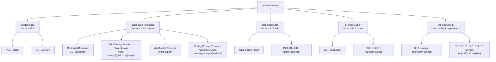
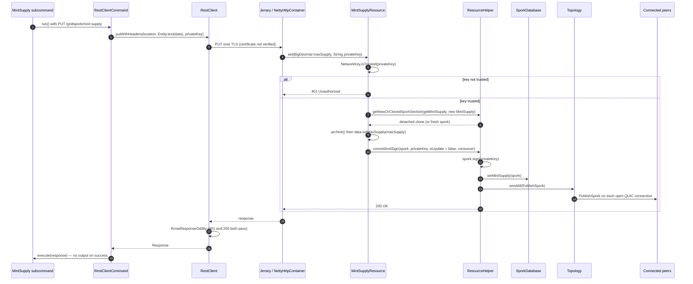

# REST interface

Hedgehog exposes a JAX-RS surface over HTTPS on a second socket, separate from the QUIC peer
protocol described in [Peer-to-peer network protocol](network-protocol.md). It serves three unrelated
things through one Jersey application: an administrative API over the [Grid sporks](sporks.md)
database, a read/write view of the peer topology, and a partial, unauthenticated S3-compatible
object store. The bundled CLI (`hedgehog cli …`) is a thin client over exactly this interface — it
has no other way to talk to a running daemon. For how this listener sits alongside the rest of the
daemon, see [Architecture overview](architecture.md).

## Server bootstrap

`application/src/main/java/org/unigrid/hedgehog/server/rest/RestServer.java` is an
`@Eager @ApplicationScoped` CDI bean extending
`application/src/main/java/org/unigrid/hedgehog/server/AbstractServer.java`. Because it carries both
`@Eager` and `@ApplicationScoped`, `EagerExtension` instantiates it at
`AfterDeploymentValidation` time, so simply booting the container starts the listener; no injection
point is needed to start it. See [CDI container and component lifecycle](cdi-and-lifecycle.md) for
that mechanism. Two beans do inject it:
`Daemon` (`application/src/main/java/org/unigrid/hedgehog/command/Daemon.java`) holds an
`@Inject private RestServer restServer` although its `start(@Observes ContainerInitialized)` body is
empty, and the test harness's `TestServer`
(`application/src/test/java/org/unigrid/hedgehog/server/TestServer.java`) injects it to expose the
bound host and port to the REST tests.

Despite `jersey-container-jdk-http` being on the dependency list in `application/pom.xml`, nothing
references it. The container actually used is the Netty one, and `RestServer` reaches it through
reflection:

| Step | Detail |
| --- | --- |
| Container | `org.glassfish.jersey.netty.httpserver.NettyHttpContainer`, constructed via `Reflection.getConstructor(name, Application.class)` |
| Channel initializer | `org.glassfish.jersey.netty.httpserver.JerseyServerInitializer(URI, SslContext, NettyHttpContainer, ResourceConfig)` |
| Transport | `ServerBootstrap` on `NioServerSocketChannel` |
| Event loop | `new NioEventLoopGroup(COMMUNICATION_THREADS)`, `COMMUNICATION_THREADS = 4` |
| TLS | `SslContextBuilder.forServer(...)` over a fresh `io.netty.handler.ssl.util.SelfSignedCertificate` |
| Bind address | `new InetSocketAddress(RestOptions.getHost(), RestOptions.getPort())`, `.sync()`-ed |

`Reflection.getConstructor` (`application/src/main/java/org/unigrid/hedgehog/model/util/Reflection.java`)
calls `setAccessible(true)` on the constructor it looks up; both Jersey Netty types are reached this
way rather than by direct reference. `module-info.java` still `requires jersey.container.netty.http`,
so the module is on the module path even though no compile-time reference exists.

The base URI handed to `JerseyServerInitializer` comes from `AbstractServer.allocate()`:

```java
final String url = String.format("https://%s:%d", RestOptions.getHost(), RestOptions.getPort());
...
return (ChannelHandler) constructor.newInstance(allocate(url).toURI(), context, container, resourceConfig);
```

`allocate()` appends a trailing `/` if missing (so the application root is `/`, and every resource
path below is absolute against the host), resolves the host to an `InetAddress`, and then runs it
through `FreePortFinder.findFreeLocalPort(url.getPort(), address)`. That call returns the requested
port when it is free and a different one when it is not. The subsequent `bind()` uses
`RestOptions.getPort()` directly, so the two only agree while the configured port is free. When the
configured port is occupied, the bind itself fails — `.sync()` rethrows the `BindException` out of
`@PostConstruct` — and nothing ever listens on the free port `allocate()` picked; the only lasting
effect of `FreePortFinder` here is the base URI Jersey believes it is serving. This divergence is
the reason the tests read the live port back off the channel rather than off `RestOptions`.

`init()` is annotated `@PostConstruct @SneakyThrows`, so every checked exception from certificate
generation, reflection and binding is rethrown undeclared. `destroy()` (`@PreDestroy`) closes the
channel, calls `container.getApplicationHandler().onShutdown(container)` and
`group.shutdownGracefully()`. Note that `channel.close()` is not awaited.

`AbstractServer` contributes `getHostName()` and `getPort()`, both derived from the bound channel's
`localAddress()` cast to `InetSocketAddress`, plus `getChannelId()`, which returns the channel's own
id. The tests use the first two to find the port the server actually landed on.

### Options

`application/src/main/java/org/unigrid/hedgehog/command/option/RestOptions.java`:

| Option | Field | Default |
| --- | --- | --- |
| `-R`, `--resthost` | `host` | `localhost` |
| `-r`, `--restport` | `port` | `52884` (`DEFAULT_PORT`) |

Both are `CommandLine.ScopeType.INHERIT` and are mixed into `Daemon` and `CLI`, so the same flags
select the bind address on the server and the target on the client. The REST listener defaults to
loopback, unlike the P2P listener which defaults to `0.0.0.0` (`NetOptions`, default port `52883`).

### Request pipeline

```mermaid
flowchart LR
    A[TCP + TLS<br/>NioServerSocketChannel] --> B[JerseyServerInitializer<br/>SslContext + HTTP codec]
    B --> C[NettyHttpContainer]
    C --> D[ResourceConfig<br/>8 resource classes]
    D --> E[CDIBridgeResource<br/>@PostConstruct field injection]
    E --> F[Resource method]
    F --> G[Jackson / JAXB providers]
    G --> H[Response]
```

## Resource model and providers

`RestServer.getResourceConfig()` builds the `ResourceConfig` from an explicit class list. There is no
package scanning and no `Application` subclass:

```java
final ResourceConfig config = new ResourceConfig(GridSporkResource.class,
    MintStorageResource.class,
    MintSupplyResource.class,
    NodeResource.class,
    VestingStorageResource.class,
    StorageBucket.class,
    StorageObject.class,
    UtilResource.class
);
```

A new resource class is therefore invisible until it is added to that list. The field is initialized
eagerly at construction (`private ResourceConfig resourceConfig = getResourceConfig();`), before
`@PostConstruct`.

Registered providers:

| Provider | Registered as | Purpose |
| --- | --- | --- |
| `org.glassfish.jersey.jackson.internal.jackson.jaxrs.json.JacksonJaxbJsonProvider` | class | JSON reading/writing (Jersey's shaded Jackson JAX-RS provider) |
| `org.unigrid.hedgehog.model.JsonConfiguration` | instance | `ContextResolver<ObjectMapper>` supplying the shared mapper configuration |
| `org.unigrid.hedgehog.server.rest.JsonExceptionMapper` | class | maps `JsonMappingException` to `400` |
| `org.glassfish.jersey.server.validation.ValidationFeature` | class | activates bean validation on `@NotNull` parameters |

`JsonConfiguration` (`application/src/main/java/org/unigrid/hedgehog/model/JsonConfiguration.java`)
returns a fresh `ObjectMapper` per call with `JavaTimeModule` registered,
`WRITE_DATES_AS_TIMESTAMPS` off, `READ_DATE_TIMESTAMPS_AS_NANOSECONDS` off and
`FAIL_ON_UNKNOWN_PROPERTIES` off. XML support is not registered explicitly — the S3 resources rely on
`jersey-media-jaxb` being on the classpath, plus
`opens org.unigrid.hedgehog.model.s3.entity to jakarta.xml.bind;` in `module-info.java`.

Nothing is registered for authentication, CORS, request logging or gzip. The only authorization in
the whole surface is the per-request `privateKey` header on the three spork mutation endpoints.

### CDI injection into resources

Resources are instantiated by Jersey, not by Weld, so they cannot use `@Inject`. Every resource
extends `CDIBridgeResource`
(`application/src/main/java/org/unigrid/hedgehog/model/cdi/CDIBridgeResource.java`), whose private
`@PostConstruct` walks the declared fields and populates anything annotated `@CDIBridgeInject` from
`CDI.current().select(f.getType()).get()`. This is described in
[CDI container and component lifecycle](cdi-and-lifecycle.md).

Two properties of that bridge matter when reading the resources below. It uses
`getClass().getDeclaredFields()`, so a field declared on a superclass of a resource would not be
injected. And `CDI.current().select(...).get()` returns a client proxy for a normal-scoped bean, so
the lookup by itself instantiates nothing: the `@CDIBridgeInject P2PServer` field that six of the
eight resources declare does not bring the QUIC server up. `P2PServer` is created at bootstrap
because it is `@Eager @ApplicationScoped`, exactly like `RestServer`; the resource fields are simply
dead.

### Path merging

`GridSporkResource`, `MintStorageResource`, `MintSupplyResource` and `VestingStorageResource` all
declare `@Path("/gridspork")` at class level. Four root resource classes sharing one path is legal
here only because their method paths do not collide: `GridSporkResource` owns the bare `GET`, the
other three own disjoint sub-paths. Adding a second method for the same path and verb in two of these
classes would make the application fail Jersey's model validation.

## Endpoint reference

All paths are relative to `https://<resthost>:<restport>/`. Status codes below are the ones the
resource methods actually build; framework-level failures (bean validation, unmatched media types,
unmapped exceptions) are covered under [Error handling](#error-handling).



### Spork endpoints

`application/src/main/java/org/unigrid/hedgehog/server/rest/GridSporkResource.java`,
`MintStorageResource.java`, `MintSupplyResource.java`, `VestingStorageResource.java`.

| Method | Path | Consumes | Produces | Body in | Body out | Status codes |
| --- | --- | --- | --- | --- | --- | --- |
| `GET` | `/gridspork` | `application/json` | `application/json` | – | `SporkDatabaseInfo` | `200` always |
| `GET` | `/gridspork/mint-storage` | `application/json`, `text/plain` | `application/json` | – | `MintStorage` | `200`; `204` when the spork is absent |
| `GET` | `/gridspork/mint-storage/{address}/{height}` | `application/json`, `text/plain` | `application/json` | – | `BigDecimal` | `200`; `204` when the spork is absent; `404` when that location has no mint |
| `PUT` | `/gridspork/mint-storage/{address}/{height}` | `application/json`, `text/plain` | `application/json` | `BigDecimal` | – | `200` on insert; `204` on update; `401` when the key is untrusted or signing fails |
| `GET` | `/gridspork/mint-supply` | `application/json`, `text/plain` | `application/json` | – | `MintSupply` | `200`; `204` when the spork is absent |
| `PUT` | `/gridspork/mint-supply` | `application/json`, `text/plain` | `application/json` | `BigDecimal` | – | `200`; `401` when the key is untrusted or signing fails |
| `GET` | `/gridspork/vesting-storage` | `application/json` | `application/json` | – | `VestingStorage` | `200`; `204` when the spork is absent |
| `GET` | `/gridspork/vesting-storage/{address}` | `application/json` | `application/json` | – | `VestingStorage.SporkData.Vesting` | `200`; `204` when the spork is absent; `404` when the address has no vesting |
| `PUT` | `/gridspork/vesting-storage/{address}` | `application/json` | `application/json` | `Vesting` | – | `200` on insert; `204` on update; `401` when the key is untrusted or signing fails |

The `Consumes` column is taken from the class-level annotations, and on the read endpoints it is
inert: `GridSporkResource` declares `@Consumes(MediaType.APPLICATION_JSON)` even though its only
method is a `GET` with no entity, and the `text/plain` that `MintStorageResource` and
`MintSupplyResource` add is only ever needed by their `PUT`s. A `GET` carries no request body for
Jersey to match a media type against, so the declaration neither restricts nor enables anything on
those paths.

Path parameters:

* `{address}` — a WIF address string, wrapped as `Address.builder().wif(address).build()`.
  `Address` (`application/src/main/java/org/unigrid/hedgehog/model/Address.java`) is a
  `@Data @Builder` holder around one `String wif` field with no validation, so any string becomes a
  map key.
* `{height}` — an `int` block height on the consensus chain.

Nothing validates the values either. `MintStorageResource.grow` accepts any `BigDecimal` — negative
amounts included — and any `int` height, and `VestingStorageResource.grow` accepts any `Vesting`
object; the only check performed anywhere on the write path is the trust check on the key. A caller
holding a trusted key can therefore write arbitrary, unusable entries into the mint and vesting maps,
and those entries then propagate to every peer.

The three `PUT`s require a `privateKey` request header, declared
`@NotNull @HeaderParam("privateKey") String privateKey`. The value is the hex form of a secp521r1
private key. `NetworkKey.isTrusted`
(`application/src/main/java/org/unigrid/hedgehog/model/crypto/NetworkKey.java`) decides whether that
key belongs to the network, and the same private key is then used to sign the spork itself; both the
trust test and the key encoding are documented in [Grid sporks](sporks.md). What matters at this
layer is that the caller hands its raw network private key to the daemon on every mutating call; the
only protection is the TLS channel, whose certificate is self-signed and, in the shipped client, not
verified at all.

`MintSupplyResource.set()` passes `isUpdate = false` unconditionally, so it answers `200` even when it
overwrites an existing supply value; the other two compute `isUpdate` from whether the map already
held the key.

`GET /gridspork` is the only spork endpoint that never returns `204`: `SporkDatabaseInfo`
(`application/src/main/java/org/unigrid/hedgehog/model/spork/SporkDatabaseInfo.java`) initializes its
three `Overview` fields to `0`/`BigDecimal.ZERO` with `lastChanged = "never"`
(`SporkDatabaseInfo.LASTCHANGED_NEVER`) and only overwrites them for sporks that exist. Its JSON shape
is:

```json
{
  "mintStorageEntries": { "amount": 0, "lastChanged": "never" },
  "mintSupply": { "amount": 0, "lastChanged": "never" },
  "vestingStoragEntries": { "amount": 0, "lastChanged": "never" }
}
```

The misspelled `vestingStoragEntries` is the field name in the source and therefore the wire name.

`Vesting` (`VestingStorage.SporkData.Vesting`) serializes `amount` as a number and `start`
(`Instant`) plus `duration` (`Duration`) as strings via `@JsonFormat(shape = STRING)`, with `parts` an
`int`. The full grid spork envelope (`timeStamp`, `previousTimeStamp`, `flags`, `type`, `data`,
`previousData`, `signature`) is documented in [Grid sporks](sporks.md); `type` is
`@JsonProperty(access = READ_ONLY)` and `getSignable()`/`isValidSignature()` are `@JsonIgnore`.

`MintStorage.SporkData.mints` is a `Map<Location, BigDecimal>` with a custom key serializer that
renders the compound key as `"<wif>/<height>"`, and a matching `KeyDeserializer` that splits on `/`.

### Node endpoints

`application/src/main/java/org/unigrid/hedgehog/server/rest/NodeResource.java`, class-level
`@Path("/node")`, `@Produces(application/json)`, `@Consumes({application/json, text/plain})`.

| Method | Path | Body in | Body out | Status codes |
| --- | --- | --- | --- | --- |
| `GET` | `/node` | – | `Set<Node>` | `200`; `204` when the topology is empty |
| `GET` | `/node/{address}` | – | `Node` | `200`; `404` when unknown; `400` on `URISyntaxException` |
| `POST` | `/node` | address string | – | `201` with `Location`; `409` when already known; `304` when `addNode` refuses; `400` on `URISyntaxException` |
| `DELETE` | `/node/{address}` | – | – | `200`; `404` when unknown; `400` on `URISyntaxException` |

`{address}` and the `POST` body are both `host:port` strings parsed by `Node.fromAddress`
(`application/src/main/java/org/unigrid/hedgehog/model/network/Node.java`), which builds
`new URI(null, address, null, null, null).parseServerAuthority()`. A missing port falls back to
`NetOptions.DEFAULT_PORT` (`52883`) — `NodeResourceTest.shouldAddNodeWithMissingPort` pins that
behavior. Because `Node.equals`/`hashCode` are defined over `getURI()`, node identity is exactly the
resolved `host:port` pair.

`POST` returns `Response.created(node.getURI())`, and `Node.getURI()` builds the *relative*
`/{host}:{port}`; JAX-RS resolves it against the request URI when writing the `Location` header.
`304 Not Modified` is emitted when `Topology.addNode` returns `false`, which happens when the node is
already present or when `node.isMe()` — pushing the daemon's own address therefore silently yields
`304` rather than an error.

`DELETE` parses the address into a fresh `Node`, attempts `closeDirty()` on that node's connection,
removes the node from the topology and returns an empty `200`. The connection is never actually
closed: `Node.fromAddress` delegates to `fromURI`, which builds
`Node.builder().address(new InetSocketAddress(host, port)).build()`, and `connection` is declared
`@Builder.Default private Optional<Connection> connection = Optional.empty()`. The instance the
topology holds — the one that owns the live QUIC connection — is never consulted, so
`nodeToFind.getConnection().ifPresent(...)` is unreachable code and the peer stays connected until
the connection is torn down for some other reason.

The `Topology` methods the resource calls (`addNode`, `removeNode`, `containsNode`, `cloneNodes`,
`forEach`) are annotated `@Protected @Lock(...)`, but that interceptor is not enabled in the packaged
application, so REST requests mutate the topology without synchronizing against the Netty threads
that also touch it; see [CDI container and component lifecycle](cdi-and-lifecycle.md).

`NodeResource` also carries a private `getURIFromString(String)` helper that nothing calls;
`Node.fromAddress` performs the same parse.

Serialized `Node` JSON contains `address`, `details` (`protocols` array plus `version`) and `nsPing`;
`connection` is `@JsonIgnore`.

### Utility endpoints

`application/src/main/java/org/unigrid/hedgehog/server/rest/UtilResource.java`, class-level
`@Path("/")`, so these sit at the root.

| Method | Path | Body out | Status codes |
| --- | --- | --- | ---: |
| `POST` | `/stop` | – | `202` |
| `GET` | `/version` | `VersionResponse` | `202` |

`/stop` calls `CDIContext.stop()`, which `notifyAll()`s the monitor that `CDIContext.run()` is
blocked on, unwinding the Weld container and thereby the daemon. There is no authorization on it: any
client that can reach the port can shut the node down. The default bind of `localhost` is what
limits the exposure.

`/version` answering `202 Accepted` rather than `200 OK` looks unintended, but `RestClient` treats
`202` as a success, so nothing in-tree notices. No CLI command calls `/version`; it exists purely for
external callers.

`application/src/main/java/org/unigrid/hedgehog/server/rest/entity/VersionResponse.java` is a
`@Data @Builder` record-like holder with a static factory:

```java
public static VersionResponse create() {
    return VersionResponse.builder()
        .version(Version.getVersionNumber())
        .protocols(Network.getProtocols())
        .build();
}
```

`Version.getVersionNumber()` (`common/src/main/java/org/unigrid/hedgehog/common/model/Version.java`)
reads `project.version` out of `application.properties` on the classpath and falls back to
`0.0.0-BASTARD`. `Network.getProtocols()`
(`application/src/main/java/org/unigrid/hedgehog/model/Network.java`) returns the constant array
`{ "hedgehog/0.0.2", "gridspork/0.0.2" }`. So the payload is:

```json
{ "version": "…", "protocols": ["hedgehog/0.0.2", "gridspork/0.0.2"] }
```

### S3 bucket endpoints

`application/src/main/java/org/unigrid/hedgehog/server/rest/StorageBucket.java`, class-level
`@Path("/bucket")`. There is no class-level `@Produces`/`@Consumes`; each method declares its own (or
none).

| Method | Path | Consumes | Produces | Body in | Body out | Status codes |
| --- | --- | --- | --- | --- | --- | --- |
| `PUT` | `/bucket/{bucket}` | `application/xml` | – | `CreateBucketConfiguration` | – | `200` with `Location: /<name>` |
| `GET` | `/bucket/list` | – | `application/xml` | – | `ListAllMyBucketsResult` | `200` |
| `DELETE` | `/bucket/{bucket}` | – | – | – | – | `204`; `404` when absent; `500` with the message on `IOException` |

`PUT` requires a `CreateBucketConfiguration` body (`@NotNull`), but never reads it — the location
constraint is discarded. It always answers `200`, whether the directory was created, already existed
or failed to be created; `BucketService.create` swallows the distinction into `System.out.println`
calls and returns the directory name in all three cases. It has one more outcome: the whole body sits
in `try { … } catch (Exception e) { e.printStackTrace(); }` with `location` initialized to `""` and
assigned only at the end of the `try`, so an exception leaves the empty string in place and the
endpoint still answers `200`, now with the header `Location: /`.

Real S3 lists buckets with `GET /`; here the operation lives at `GET /bucket/list`. `/list` and
`/{bucket}` are separate path templates on the same class, and Jersey matches the literal one first,
so `GET /bucket/list` is always the list-buckets operation. `PUT` and `DELETE` on that path match the
same literal template, which declares only `@GET`, so a bucket named `list` can be neither created
nor deleted through this API.

### S3 object endpoints

`application/src/main/java/org/unigrid/hedgehog/server/rest/StorageObject.java`, class-level
`@Path("/storage-object")`.

| Method | Path | Consumes | Produces | Body in | Body out | Status codes |
| --- | --- | --- | --- | --- | --- | --- |
| `POST` | `/storage-object/{bucket}/{key}` | `application/octet-stream` | – | raw bytes | – | `200`; `404` on `NoSuchBucketException`; `500` on `IOException` |
| `GET` | `/storage-object/list/{bucket}` | – | `application/xml` | – | `ListBucketResult` | `200`; `404` on `NoSuchBucketException` |
| `PUT` | `/storage-object/{bucket}/{key}` | – | `application/xml` | ignored | `CopyObjectResult` | `200`; `400` when `x-amz-copy-source` is missing; `404` on `NoSuchBucketException`; `500` on `IOException` |
| `GET` | `/storage-object/{bucket}/{key}` | – | `application/octet-stream` | – | raw bytes | `200`; `404` on `NoSuchBucketException`/`NoSuchKeyException`; `500` otherwise |
| `DELETE` | `/storage-object/{bucket}/{key}` | – | – | – | – | `204`; `404` on `NoSuchKeyException`; `500` otherwise, including the literal body `Deletion has failed` |

`POST` is used for object creation, where S3 uses `PUT`; `PUT` on the same path is the copy operation.

The listing path repeats the collision the bucket resource has, one level deeper.
`/storage-object/list/{bucket}` and `/storage-object/{bucket}/{key}` are both two-segment templates
on the same class, so for a bucket named `list` the request `GET /storage-object/list/photo.png`
is ambiguous between "list the bucket `photo.png`" and "read key `photo.png` from bucket `list`", and
the literal `list` segment wins. Objects in a bucket named `list` are unreachable through `GET`.

The listing endpoint reads its options straight off `UriInfo.getQueryParameters()`:

| Query parameter | Type | Default |
| --- | --- | --- |
| `prefix` | string, empty values filtered out | `""` |
| `delimiter` | string, empty values filtered out | `""` |
| `maxkeys` | `Integer.parseInt` | `ObjectService.MAX_KEYS` = `10000` |

Note `maxkeys`, not S3's `max-keys`, and that a non-numeric value throws `NumberFormatException` out
of the resource method rather than yielding `400`.

The copy source header is parsed as `copySource.split("/", 2)`, taking `parts[0]` as the bucket and
`parts[1]` as the key. AWS specifies the header as `/source-bucket/source-key`, i.e. with a leading
slash; that form parses here as an empty bucket name with `source-bucket/source-key` as the key, but
`dataDir.resolve("")` returns `s3data` itself and `Path.of` drops the empty element, so the source
still resolves to `<s3data>/source-bucket/source-key` and the copy happens to work. It only fails
with `404` when `s3data` has never been created. The only in-tree caller,
`StorageObjectTest.shouldCopyAndReturnXML`, sends the leading slash and is `@Disabled`.

## The S3-compatible storage surface

### On-disk layout

Both services resolve their root the same way, in a private `@PostConstruct`:

```java
dataDir = applicationDirectory.getUserDataDir().resolve("s3data");
```

`ApplicationDirectory` (`common/src/main/java/org/unigrid/hedgehog/common/model/ApplicationDirectory.java`)
derives the platform user-data directory from the application author and name; the per-OS paths and
the lower-casing rule are tabulated in [Architecture overview](architecture.md). A bucket is a
directory directly under `s3data`; an object is a file inside it named by its key. There is no
metadata sidecar, no versioning, no multipart state and no index — every listing operation is a
directory walk.

Consequences that follow directly from that layout:

* Nested keys cannot be written. An unencoded `/` never reaches `key` at all — the template
  `@Path("/{bucket}/{key}")` matches a single segment, so such a request `404`s. A percent-encoded
  `%2F` is decoded into the parameter after matching, and `ObjectService.put` then resolves
  `Path.of(dataDir, bucket, key)` and calls `Files.copy` without creating parent directories, so
  `a%2Fb` raises `IOException` and the endpoint answers `500`. The exception is a key whose decoded
  form resolves to a directory that already exists: `..%2Fevil` normalizes to `s3data/evil` and is
  written successfully, outside the bucket — see the traversal note in
  [Architecture overview](architecture.md).
* `ObjectService.listBucket` uses `bucketFile.listFiles()` (one level, non-recursive) and drops
  directories, so the `delimiter`/common-prefix logic in the same method can never fire against real
  nested content.
* `Content.lastModified` is filled with `new Date().toInstant()` — the time of the listing, not the
  file's modification time. `Bucket.creationDate` is likewise "now".
* `ETag` is a real MD5 of the file content (`DigestUtils.md5Hex`), recomputed on every listing.
* Deleting a bucket (`BucketService.delete`) walks the tree in reverse order and deletes everything;
  the return value only says whether the directory existed, not whether deletion succeeded.

`BucketService.listBuckets()` calls `Stream.of(dataDir.toFile().listFiles())`. Nothing creates
`s3data` at startup — only `BucketService.create` does, via `mkdirs()` — so `GET /bucket/list` on a
node where no bucket has ever been created dereferences a `null` array.

### Services

`application/src/main/java/org/unigrid/hedgehog/service/BucketService.java` and
`ObjectService.java` are both `@Data @ApplicationScoped` beans with an injected `ApplicationDirectory`.

| Method | Behavior |
| --- | --- |
| `BucketService.create(name)` | `mkdirs()` the bucket directory; returns its name, or `""` if anything throws; prints outcome to stdout |
| `BucketService.listBuckets()` | maps each subdirectory to a `Bucket`, wraps in `ListAllMyBucketsResult` with a fabricated `Owner` |
| `BucketService.delete(name)` | `false` when absent, otherwise recursive delete and `true` |
| `ObjectService.put(bucket, key, stream)` | `NoSuchBucketException` when the bucket directory is missing; otherwise `Files.copy(..., REPLACE_EXISTING)` |
| `ObjectService.listBucket(bucket, prefix, delimiter, maxkeys)` | prefix filter, optional common-prefix collapsing, sort by key, truncate to `maxkeys` |
| `ObjectService.copy(srcBucket, srcKey, dstBucket, dstKey)` | verifies both buckets exist, `Files.copy(..., REPLACE_EXISTING)`, returns MD5 in a `CopyObjectResult` |
| `ObjectService.getObject(bucket, key)` | `NoSuchBucketException`/`NoSuchKeyException`, otherwise `Files.readAllBytes` |
| `ObjectService.delete(bucket, key)` | `NoSuchKeyException` when absent; `File.delete()` for files; `false` for directories |

`BucketService.listBuckets()` builds `new Owner("user", RandomStringUtils.randomNumeric(20))` — the
owner display name is the constant `user` and the ID is regenerated randomly on every call. There is
no notion of an authenticated principal anywhere in this surface.

`ObjectService.copy` does not check that the source *key* exists, so a missing object surfaces as an
`IOException` and a `500` rather than a `404`. It also returns `new CopyObjectResult(checksum,
Instant.now(), "", "", "", "")` — the four checksum algorithm fields are always empty strings. And it
computes that checksum with `DigestUtils.md5Hex(new FileInputStream(destFile))`, a stream that is
never closed and never reaches a try-with-resources; `listBucket` opens its equivalent stream inside
`try (FileInputStream stream = ...)`, so the leak is specific to the copy path and costs one file
descriptor per successful `PUT /storage-object/{bucket}/{key}`.

`ObjectService.MAX_KEYS` carries the source comment `/* TODO: Do we even want to set a maximum? */`.
`ListBucketResult.maxKeys` echoes the requested `maxkeys` value, or `ObjectService.MAX_KEYS` (10000)
when the parameter is absent — S3's own default is 1000 — and `isTruncated` is
`filteredFiles.size() > count`.

### XML entities

Every entity type under `application/src/main/java/org/unigrid/hedgehog/model/s3/entity/` — apart
from `InstantAdapter` and the two exception classes — is a Lombok
`@Data @NoArgsConstructor @AllArgsConstructor` JAXB type with `@XmlAccessorType(XmlAccessType.FIELD)`.
`package-info.java` sets the package-wide schema:

```java
@XmlSchema(namespace = "http://s3.amazonaws.com/doc/2006-03-01", elementFormDefault = XmlNsForm.QUALIFIED)
```

| Type | Elements | Notes |
| --- | --- | --- |
| `Bucket` | `CreationDate`, `Name` | `Serializable`; `CreationDate` via `InstantAdapter` |
| `Owner` | `DisplayName`, `ID` | `Serializable` |
| `ListAllMyBucketsResult` | `Buckets` wrapper of `Bucket`, `Owner` | the only type that repeats the namespace on `@XmlRootElement` |
| `Content` | `Key`, `LastModified`, `ETag`, `Size`, `StorageClass` | `StorageClass` is hardcoded to `STANDARD` by `ObjectService` |
| `ListBucketResult` | `Name`, `Prefix`, `Delimiter`, `MaxKeys`, `IsTruncated`, `Contents` wrapper of `Content` | no `KeyCount`, no `CommonPrefixes` element |
| `CopyObjectResult` | `ETag`, `LastModified`, `ChecksumCRC32`, `ChecksumCRC32C`, `ChecksumSHA1`, `ChecksumSHA256` | checksums always empty |
| `CreateBucketConfiguration` | `locationConstraint` | bare `@XmlElement`, so the element name is lowercase, unlike S3's `LocationConstraint` |
| `InstantAdapter` | – | `XmlAdapter<String, Instant>` using `Instant.toString()` / `Instant.parse`; no Lombok, only `@XmlRootElement` |
| `NoSuchBucketException`, `NoSuchKeyException` | – | plain checked `Exception` subclasses with a message constructor; not JAXB types and not mapped to S3 error XML |

The two exception types are caught in the resource methods and turned into a `404` whose body is the
raw exception message, written under whatever media type the method's `@Produces` declares —
`application/xml` for `StorageObject.list`, `application/octet-stream` for `StorageObject.get`, and
whatever content negotiation settles on for `StorageObject.create`/`delete` and `StorageBucket.delete`,
which declare no `@Produces` at all. Real S3 clients expect an `<Error>` document with a `Code`
element; nothing in the tree produces one.

### How much S3 is actually here

Implemented: create bucket, list buckets, delete bucket, put object, get object, delete object, copy
object, list objects (v1-shaped result). Not implemented anywhere in the tree: SigV4 or any other
authentication, ACLs and policies, versioning, multipart upload, range reads, tagging, lifecycle,
`ListObjectsV2` continuation tokens, `CommonPrefixes` in the response document, the standard S3 error
document, and S3's `HeadObject`/`HeadBucket` metadata responses — no `@HEAD` method exists, and while
JAX-RS answers bare `HEAD` requests off the matching `@GET` methods by discarding the entity, no
object metadata headers are produced. Bucket names and object keys are used verbatim as filesystem
path components, with no validation or normalization of either.

The `StorageBucket`/`StorageObject` resources also declare the dead `P2PServer` field described under
[CDI injection into resources](#cdi-injection-into-resources); the object store is purely local and
nothing about it is replicated to peers.

## Error handling

### JsonExceptionMapper

`application/src/main/java/org/unigrid/hedgehog/server/rest/JsonExceptionMapper.java` is a `@Provider`
implementing `ExceptionMapper<JsonMappingException>`. It builds a one-field object node, logs at WARN
with the full stack trace, and returns:

```
400 Bad Request
{ "error": "<exception message>" }
```

pretty-printed, with no explicit content type. It is the only exception mapper in the Hedgehog code
base, and it is narrow: `JsonMappingException` covers binding-level failures, not JSON syntax errors
(`JsonParseException` is a sibling, not a subclass). Anything else that escapes a resource method —
for example the `NumberFormatException` from a bad `maxkeys`, or the `RuntimeException` that
`ObjectService.listBucket` wraps `IOException` in — falls through to whatever default handling
Jersey and the Jackson provider supply, and surfaces as a `500`.

`RestClient` registers the same mapper on the client `ClientConfig`. `ExceptionMapper` is a
server-side extension point, so that registration has no effect on client behavior.

### Bean validation

`ValidationFeature` is registered, so the `@NotNull` annotations on path, header and entity parameters
are enforced before the method body runs, and constraint violations on input are answered by Jersey
with `400 Bad Request`. This makes some in-method guards redundant: all three of
`MintStorageResource.grow`, `MintSupplyResource.set` and `VestingStorageResource.grow` declare
`@NotNull @HeaderParam("privateKey")` and then re-check `Objects.nonNull(privateKey)` before
consulting `NetworkKey.isTrusted`. A caller that omits the header gets `400`, not the `401` the
method would produce.

### ResourceHelper

`application/src/main/java/org/unigrid/hedgehog/server/rest/ResourceHelper.java` holds the two-step
mutation pattern shared by the three spork writers:

```java
public static <S extends Serializable> S getNewOrClonedSporkSection(Supplier<S> supplier, Supplier<S> newSupplier)
public static <S extends Signable> Response commitAndSign(S signable, String privateKey,
    SporkDatabase sporkDatabase, boolean isUpdate, Consumer<S> consumer)
```

The clone-then-sign-then-broadcast semantics — why every mutation runs on a detached copy, when
`archive()` is called, and what the consumer does with the signed spork — belong to
[Grid sporks](sporks.md). What the REST surface adds is the mapping from that outcome to a status
code:

* `SigningException` from `signable.sign(privateKey)` → `401`, with the exception object itself as
  the response entity, which Jackson then serializes as a `Throwable`. The source comment explains
  why bailing out here is safe: *"As we clone() the vesting storage, returning here results in a
  database NOP"*.
* success with `isUpdate == true` → `204 No Content`.
* success with `isUpdate == false` → `200 OK`.

The `sporkDatabase` parameter is never read by the method; all three call sites pass it anyway.

Note that REST mutations do not persist the spork database inline. Persistence happens through
`application/src/main/java/org/unigrid/hedgehog/model/network/schedule/PublishAndSaveSporkSchedule.java`
and the `@PreDestroy` in
`application/src/main/java/org/unigrid/hedgehog/model/producer/SporkDatabaseProducer.java`; see
[Grid sporks](sporks.md).

### Status conventions

| Meaning | Code |
| --- | ---: |
| Read succeeded | `200` |
| Write created a new entry | `200` |
| Write updated an existing entry | `204` |
| Resource exists but is unset/empty | `204` |
| Entry not present | `404` |
| Unparseable node address | `400` |
| Missing/malformed JSON body | `400` |
| Untrusted key or signing failure | `401` |
| Node already in topology | `409` |
| Topology refused the node (self, duplicate) | `304` |
| Shutdown and version | `202` |

## The client side

### RestClient

`application/src/main/java/org/unigrid/hedgehog/client/RestClient.java` is an `AutoCloseable` wrapper
over a JAX-RS `Client`. Its constructor takes `(String host, int port, boolean isSecure)` and:

* registers the same three JSON providers as the server,
* builds an `SSLContext.getInstance("ssl")` initialized with
  `InsecureTrustManagerFactory.INSTANCE.getTrustManagers()`,
* installs a hostname verifier that returns `true` for everything, with the source comment
  *"Accept all hostnames"*,
* stores a base URL format string built as `https://%s:%d%%s` (or `http://…` when `isSecure` is
  false), so each call substitutes the location with `String.format(baseUrl, location)`.

TLS is therefore encrypted but entirely unauthenticated — which is the counterpart to the server
generating a throwaway `SelfSignedCertificate` on each start. Since the `privateKey` header rides on
this channel, a man in the middle between CLI and daemon can capture a network private key.

Methods: `get`, `getEntity`, `delete`, `post`, `put`, `putWithHeaders`, `close`. All but `getEntity`
funnel their response through:

```java
private void throwResponseOddity(Response response) throws ResponseOddityException {
    final List<Status> status = List.of(Status.ACCEPTED, Status.CREATED, Status.OK,
        Status.NO_CONTENT, Status.NOT_FOUND, Status.UNAUTHORIZED
    );

    if (!status.contains(Status.fromStatusCode(response.getStatus()))) {
        throw new ResponseOddityException(response.getStatusInfo());
    }
}
```

So `200`, `201`, `202`, `204`, `401` and `404` are handed back to the caller, and everything else —
including `304`, `400`, `409` and `500` — becomes an exception. `getEntity` declares
`throws ResponseOddityException` but never calls the check, so it silently bypasses this filter.

`ResponseOddityException`
(`application/src/main/java/org/unigrid/hedgehog/client/ResponseOddityException.java`) is a plain
checked `Exception` whose message is formatted `"%d %s (%s)"` from the status code, the `Status` enum
constant and the reason phrase — e.g. `409 Conflict (Conflict)`. It carries no response body.

### RestClientCommand

`application/src/main/java/org/unigrid/hedgehog/command/util/RestClientCommand.java` is the picocli
side. It is `@RequiredArgsConstructor` over a single final `method` field, with additional
constructors taking `(method, location)` and `(method, location, defaultSupplier)`, plus an optional
header map set through `setHeaders`.

`run()` opens `new RestClient(RestOptions.getHost(), RestOptions.getPort(), true)` — always TLS —
dispatches on the HTTP verb through an inner `MethodCallback`, and prints any
`ResponseOddityException` message to `System.err`.

Three protected hooks exist for subclasses. `getEntity()` and `execute(Response)` throw
`UnsupportedOperationException` by default; `getLocation()` returns the constructor-supplied location.
A subclass that forgets to override the hook its verb needs fails at runtime, not compile time.

Two verbs get special handling before `execute` is called:

* `GET` on `204 No Content` prints `defaultSupplier.get()` if one was supplied, otherwise the status
  info.
* `PUT` on `401 Unauthorized` does the same.

Everything else goes straight to `execute(response)`.

### CLI response handling

`hedgehog cli` (`application/src/main/java/org/unigrid/hedgehog/command/CLI.java`) mixes in
`NetOptions` and `RestOptions`. Five of its eight subcommands (`gridspork-list`, `node-add`,
`node-remove`, `node-list` and `stop`) are `RestClientCommand` subclasses against one of the
endpoints above; `gridspork-get`, `gridspork-set` and `gridspork-grow` are container commands whose
`mint-storage`/`mint-supply` leaves are `Runnable`s that build anonymous `RestClientCommand`
instances. The full command-to-endpoint table, with bodies, headers and required options, is in
[Architecture overview](architecture.md); what belongs here is how those commands read the responses
this interface produces.

* `gridspork-list` prints the `SporkDatabaseInfo` body as pretty JSON. It also passes a default
  supplier yielding `No Content` for a `204`, but that branch is unreachable: `GridSporkResource.list()`
  is a bare `Response.ok().entity(...)` and never answers `204`, as noted above.
* `gridspork-get mint-supply` and `gridspork-get mint-storage` re-parse the raw body with `Json.parse`
  and print it. Neither supplies a default, so a `204` prints the bare status line rather than a
  chosen placeholder.
* `gridspork-set mint-supply` and `gridspork-grow mint-storage` override `execute(Response)` with an
  empty body, so a successful `PUT` prints nothing, and a `401` is reported by the `PUT` special case
  in `RestClientCommand` rather than by the command.
* `node-add` prints `Response.getLocation()` — the `Location` header — rather than the node itself.
* `node-remove` is the only command that overrides `getLocation()` rather than passing a location to
  the constructor, because its path carries the positional address. It then calls
  `response.readEntity(new GenericType<Set<Node>>() { })` on a response that `NodeResource.remove`
  builds as an empty `200`, so there is no entity to read.
* `node-list` prints the node set as pretty JSON, and an empty `HashSet` on `204`.
* `stop` sends a `null` entity and ignores the `202`.

The `mint-storage` and `mint-supply` leaves are shared classes that branch on
`spec.parent().userObject()` to pick their verb and path. `mint-storage` handles `GridSporkGet` and
`GridSporkGrow`, `mint-supply` handles `GridSporkGet` and `GridSporkSet`, and both throw
`UnsupportedOperationException` for any other parent — which is also why `gridspork-set mint-storage`
and `gridspork-grow mint-supply` do not exist: `gridspork-get` wires up both leaves, while
`gridspork-grow` wires up only `mint-storage` and `gridspork-set` only `mint-supply`.

Nothing in the CLI targets `/version`, `/bucket` or `/storage-object`; the S3 surface has no
first-party client.

`hedgehog util` (`application/src/main/java/org/unigrid/hedgehog/command/Util.java`) hosts
`key-generate`, `key-sign` and `key-validate`, which are local key utilities and never touch REST.

## A representative round trip

`hedgehog cli gridspork-set mint-supply --data 42 --key <hex>`:



`Topology.sendAll` only writes to nodes whose `Connection` is present, so a spork set on an isolated
node is stored locally and propagates later; the packet format is covered in
[Peer-to-peer network protocol](network-protocol.md).

## Tests

The REST tests live in `application/src/test/java/org/unigrid/hedgehog/server/rest/` and all extend
`BaseRestClientTest`, which:

* is annotated `@WeldSetup(TestServer.class)` and extends `BaseMockedWeldTest`, so a real Weld
  container with a real `RestServer` is started per container,
* mocks `NetOptions`/`RestOptions` through JMockit so both servers bind to free local ports
  (`TestServer.mockProperties`),
* installs `ApplicationDirectoryMockUp`, redirecting the data directory to a temporary directory —
  which is also what keeps the S3 tests off the developer's real `s3data`,
* builds a fresh `RestClient` against `server.getRest().getHostName()`/`getPort()` per try,
* provides a `provideSignature()` arbitrary that generates a keypair and mocks
  `NetworkKey.getPublicKeys()` to return its public key, which is how the `privateKey` header is made
  to pass `isTrusted` in tests.

Coverage is uneven. `MintStorageResourceTest`, `MintSupplyResourceTest`, `VestingStorageResourceTest`
and `NodeResourceTest` are live jqwik properties that exercise the real endpoints;
`GridSporkResourceTest` is a single `@Example` — `shouldBeAbleToGetGridSporkOverview` — which runs
once with no generated input. `StorageBucketTest` and `StorageObjectTest` stand up an
`io.findify.s3mock.S3Mock` on port `8001` to compare Hedgehog's answers against a reference S3
implementation, but almost every one of their methods is `@Disabled` — all three in
`StorageBucketTest`, six of eight in `StorageObjectTest`. The two that still run
(`shouldHaveInputStream` and `shouldContainHeader`) only assert that malformed requests fail. Nothing
currently verifies a successful S3 round trip.

`MintStorageResourceTest` and `MintSupplyResourceTest` send the amount with `Entity.text(...)`, which
is why the mint resources declare `text/plain` alongside JSON.

The JMockit agent and the `--add-exports`/`--add-opens` flags these tests need — including
`--add-exports org.unigrid.hedgehog/org.unigrid.hedgehog.server.rest=jersey.server` — are configured
on the surefire plugin in `application/pom.xml`; see
[Build, testing and native image](build-and-native-image.md).

## Known rough edges

- **`DELETE /node/{address}` never closes the live connection.** `NodeResource.remove` calls
  `closeDirty()` on a `Node` freshly built by `Node.fromAddress`, whose `connection` is always
  `Optional.empty()`; the stored instance that owns the QUIC connection is never consulted, so the
  entry is dropped from the topology while the peer stays connected.
- **The base URI and the bind port are computed differently.** The URI passed to Jersey goes through
  `FreePortFinder`, while the socket is bound to the configured port directly; when that port is
  occupied the bind fails outright and nothing listens on the free port that was chosen.
- **Topology access from REST is unsynchronized.** The `@Protected @Lock(...)` annotations on
  `Topology` are not enabled in the packaged application, so resource methods mutate it concurrently
  with the Netty threads.
- **`/version` returns `202 Accepted`.** `RestClient` accepts it, so nothing in-tree notices.
- **`POST /stop` is unauthenticated.** Only the `localhost` default bind limits who can call it.
- **The `privateKey` header transports a raw network private key to the daemon**, over TLS that the
  shipped client does not verify.
- **The spork writers validate nothing but the key.** Amounts, block heights and WIF addresses are
  taken verbatim and broadcast to every peer.
- **`RestClient.getEntity` declares `throws ResponseOddityException` but never performs the check.**
- **`ResourceHelper.commitAndSign` takes a `SporkDatabase` it never uses**, and serializes a
  `SigningException` as the `401` response body.
- **`NodeResource.getURIFromString` is dead code**, as are the six `@CDIBridgeInject P2PServer`
  fields on the resource classes.
- **`GET /bucket/list` dereferences `null`** when the `s3data` directory has not been created yet.
- **`ObjectService.copy` leaks a file descriptor** on every successful copy: the `FileInputStream` it
  opens for the MD5 is never closed.
- **A non-numeric `maxkeys` yields `500`, not `400`.** `Integer.parseInt` throws out of the resource
  method and no mapper catches it.
- **A bucket named `list` is partly unreachable.** `GET /bucket/list` is always the list-buckets
  operation, and `GET /storage-object/list/<key>` matches the `/list/{bucket}` template, so it is
  always a listing rather than a read of that key.
- **`BucketService.create` cannot fail.** Every outcome, including an exception, answers `200`; an
  exception additionally sends `Location: /`.
- **The S3 surface has no authentication, no S3 error documents, no nested keys**, and reports "now"
  as every object's `LastModified`.
- **Stray `.original~` editor backups are tracked in git** beside `StorageBucket`, `BucketService`
  and `StorageBucketTest`; they are listed in [Build, testing and native image](build-and-native-image.md).
