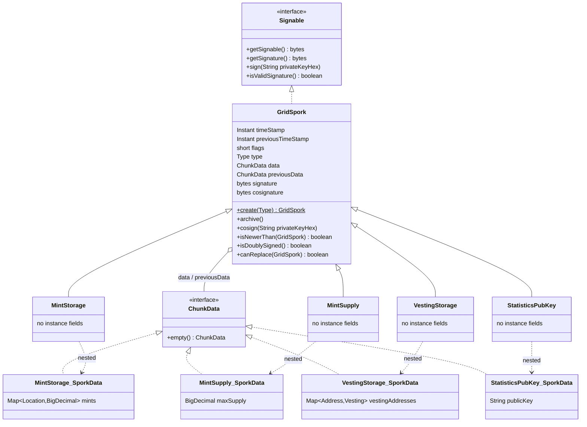
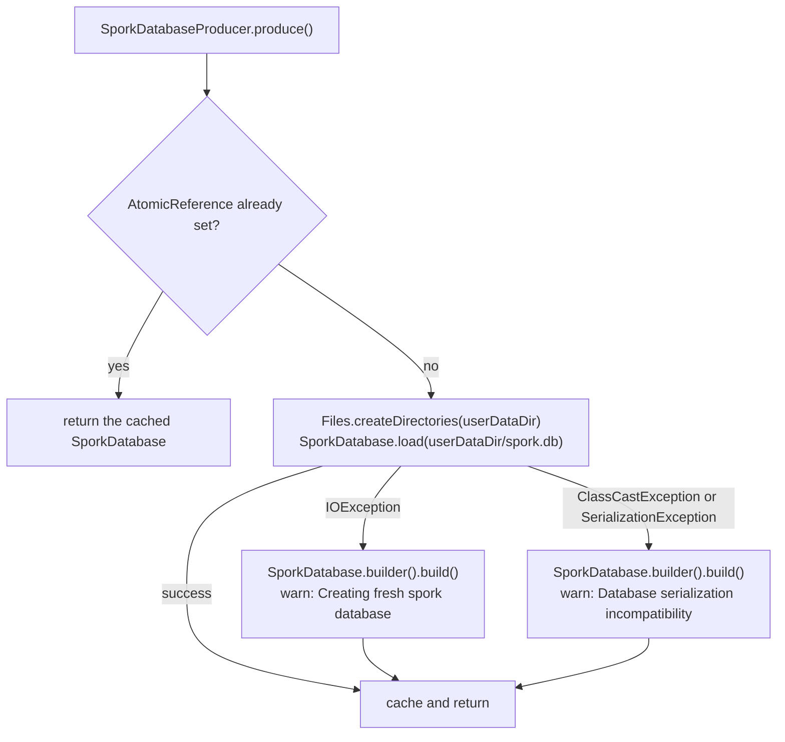

# Grid sporks

A *grid spork* is a signed, network-wide parameter record. Sporks are the mechanism by which the
Unigrid foundation keys distribute mutable configuration — mint records, maximum supply, vesting
schedules, the statistics public key — to every node on the network without a consensus round. A
node holds at most one instance of each spork type, keeps it in a small serialized database on disk,
gossips it to every peer it is connected to, and accepts an incoming replacement only when that
replacement is newer, signed by two different keys the node trusts, and extends the spork's
[signature log](#signature-log) without rewriting it. A change signed by one key travels as a
[proposal](#pending-sporks) until a second key co-signs it.

The data model, the database and the signing live under
`application/src/main/java/org/unigrid/hedgehog/model/spork/` and `model/crypto/`; the wire codecs
under `model/network/codec/`, `model/network/codec/chunk/` and `model/network/chunk/` (the
`ChunkData` marker and the `@Chunk` scanner); the CDI producer, the inbound handler and the publish
schedule under `model/producer/`, `model/network/handler/` and
`model/network/schedule/`. The read/write surfaces are the REST resources in `server/rest/` and the
picocli commands in `command/cli/`, documented in [REST interface](rest-api.md) and
[Architecture overview](architecture.md); the transport is described in
[Peer-to-peer network protocol](network-protocol.md).

## The `GridSpork` base type

`application/src/main/java/org/unigrid/hedgehog/model/spork/GridSpork.java` is a concrete (not
abstract) Lombok `@Data` class implementing `Serializable` and `Signable`. Every concrete spork
extends it and carries its payload in a nested `SporkData` class.

| Field | Type | Notes |
| --- | --- | --- |
| `timeStamp` | `Instant` | Time the current value was set. Serialized to JSON as a string (`@JsonFormat(shape = STRING)`). |
| `previousTimeStamp` | `Instant` | Time the archived value was set. |
| `flags` | `short` | Bit field, see `Flag` below. |
| `type` | `Type` | Numeric discriminator; marked `@JsonProperty(access = READ_ONLY)` so JSON input cannot set it. |
| `data` | `ChunkData` | The current value. |
| `previousData` | `ChunkData` | The archived value. The source comment states that `Flag.DELTA` controls whether this is a delta or a raw copy. |
| `signature` | `byte[]` | DER-encoded ECDSA signature bytes — `java.security.Signature` with `SHA512WithECDSA` emits an ASN.1 `SEQUENCE { r, s }` of variable length, which is why the wire format length-prefixes it. Exposed through an explicit `@Getter`. The first of the two signatures. |
| `cosignature` | `byte[]` | The second signature, over the same bytes, from a different network key. `null` while the spork is a proposal. See [Two signatures](#two-signatures). |
| `signatureLog` | `SignatureLog` | Every version this spork replaced, with the keys that signed it. `@JsonIgnore`d; read through `GET /gridspork/log`. See [Signature log](#signature-log). |

`getData()` and `getPreviousData()` are declared as `<T extends ChunkData> T` and perform an
unchecked cast, so call sites read them into the concrete `SporkData` type without an explicit cast.

### Type identifiers

`GridSpork.Type` carries a `short` id and a `Type.get(short)` lookup that falls back to `UNDEFINED`
for anything unrecognized.

| Constant | Value | Implementation |
| --- | ---: | --- |
| `UNDEFINED` | 0 | none — `GridSpork.create(UNDEFINED)` throws `IllegalArgumentException` |
| `MINT_STORAGE` | 1000 | `MintStorage` |
| `MINT_SUPPLY` | 1010 | `MintSupply` |
| `VESTING_STORAGE` | 1020 | `VestingStorage` |
| `STATISTICS_PUBKEY` | 2001 | `StatisticsPubKey` |

The first three ids are spaced by ten; `STATISTICS_PUBKEY` breaks that pattern at 2001. Nothing in
the code depends on the spacing.

`setType(short)` is annotated `@Tolerate` so it coexists with the Lombok-generated
`setType(Type)`; it routes through `Type.get(short)`.

### Flags

```java
GOVERNED((short) 0x01),  /* Governed sporks have to be voted on to accept the change on the network */
DELTA((short) 0x02);     /* Is either delta-data or a raw representation of the previous value */
```

Only one flag is ever written: `MintSupply`'s constructor ORs in `Flag.GOVERNED`. No code reads
either flag — there is no governance vote and no delta encoding today. `previousData` is always a
full copy of the previous value (see `archive()`), and `flags` is carried verbatim across the wire
and through persistence without being interpreted.

### Creation

`GridSpork.create(Type)` is the factory:

```java
case MINT_STORAGE: return new MintStorage();
case MINT_SUPPLY: return new MintSupply();
case VESTING_STORAGE: return new VestingStorage();
case STATISTICS_PUBKEY: return new StatisticsPubKey();
default: throw new IllegalArgumentException("Unknown spork type supplied");
```

Each subclass constructor sets its own `type` and installs an empty `SporkData` instance, so a
freshly created spork always has non-null `data`. It has no `timeStamp`, `previousTimeStamp` or
`previousData` yet: on the REST path those are filled in by `archive()`, and on the receive path the
decoder sets them from the wire. `create()` is called by
`AbstractGridSporkDecoder.decodeGridSpork` and by the test data provider; the REST resources pass
the constructors as suppliers to `ResourceHelper.nextVersion`.

### Chaining previous values

```java
public void archive() {
	previousData = SerializationUtils.clone(data);
	previousTimeStamp = SerializationUtils.clone(timeStamp);
	timeStamp = Instant.now().truncatedTo(ChronoUnit.MILLIS);
	...
}
```

`archive()` deep-copies the current value into the previous slots and stamps the current time,
truncated to milliseconds. The truncation matters: the wire format transports timestamps as
`toEpochMilli()` (`AbstractGridSporkEncoder`), so any sub-millisecond precision would be silently
lost in transit and change the bytes that are signed.

Every mutation path calls `archive()` *before* writing the new value — `MintSupplyResource.set`,
`MintStorageResource.grow` and `VestingStorageResource.grow` all start from
`ResourceHelper.nextVersion`, which archives. Because `archive()` clones `data` into `previousData`,
the subsequent mutation lands on the current value and leaves the archived copy untouched.

`renew()` is the one timestamp change that does not archive. It assigns only
`timeStamp = Instant.now().truncatedTo(ChronoUnit.MILLIS)` and leaves `data`, `previousData` and
`previousTimeStamp` exactly as they were, so a renewed spork carries the same value and the same
history under a newer timestamp. Its only caller is `GridSporkResource.renew`, described under
[Renewing after a key change](#renewing-after-a-key-change).
`GridSporkTest.shouldOnlyMoveTimeStampForwardOnRenewal` pins that contract.

The method closes with two null-defaulting guards, and only one of them works:

```java
if (Objects.isNull(previousData)) {
	previousData = previousData.empty();
}

if (Objects.isNull(previousTimeStamp)) {
	previousTimeStamp = Instant.EPOCH.truncatedTo(ChronoUnit.MILLIS);
}
```

The first dereferences the null it just tested for. It is unreachable in practice, because `data` is
never null on a spork produced by the constructors or the decoder, so the preceding `clone` always
yields a non-null value. `ChunkData.empty()` — implemented by all four `SporkData` classes — has no
other caller.

The second guard is both reachable and load-bearing. On a first-ever archive, `timeStamp` is still
null, `SerializationUtils.clone(null)` returns null, and `previousTimeStamp` would stay null; the
`Instant.EPOCH` default is what stops `AbstractGridSporkEncoder.encodeGridSpork` from throwing a
`NullPointerException` on `spork.getPreviousTimeStamp().toEpochMilli()` the first time that spork is
published.

### Ordering

`isNewerThan(GridSpork)` is the merge predicate used by the inbound handler. It is null-tolerant in
both directions: a spork with a timestamp is newer than a null spork or one with a null timestamp; a
spork with a null timestamp is never newer than one that has one; two null timestamps compare as not
newer. `application/src/test/java/org/unigrid/hedgehog/model/spork/GridSporkTest.java` pins all six
cases. Renewal depends on this predicate: a renewed spork differs from the stored one only in its
timestamp, its signatures and the log entry for the version it replaced, and the later timestamp is
what lets it replace the old copy on a peer.

Stored sporks have no time-to-live. They do not expire, and nothing compares a stored spork's
timestamp against wall-clock now. The one exception is a proposal: `PendingSporks` drops it once its
`timeStamp` is more than an hour away from now (see [Pending sporks](#pending-sporks)).
`timeStamp` is also used for ordering, for the "last changed" field in
`SporkDatabaseInfo`, and — this matters for signing — as part of the wire header
(`data.writeLong(spork.getTimeStamp().toEpochMilli())`, after the type and flags shorts) and the
first field fed into `getSignable()`.

### Type hierarchy



Each subclass is an empty shell: it declares no instance fields of its own and exists to fix `type`,
install the right `SporkData` (and, in `MintSupply`'s case, to set `Flag.GOVERNED`), and give the
codec and database dispatch something to switch on. That has an unintended consequence discussed
under [the concrete sporks](#the-concrete-sporks).

## The concrete sporks

`ChunkData` (`model/network/chunk/ChunkData.java`) is the marker interface for every spork payload.
It is annotated for Jackson polymorphism by deduction:

```java
@JsonTypeInfo(use = JsonTypeInfo.Id.DEDUCTION)
@JsonSubTypes({
	@Type(MintStorage.SporkData.class),
	@Type(MintSupply.SporkData.class),
	@Type(VestingStorage.SporkData.class)
})
```

`StatisticsPubKey.SporkData` is absent from that list, so a JSON document containing only a
`publicKey` property cannot be deduced back into a `ChunkData`.

All four spork classes are annotated `@Data @ToString(callSuper = true) @EqualsAndHashCode(callSuper
= false)` and declare no instance fields. Lombok therefore generates an `equals` that compares
nothing and a constant `hashCode`: **any two `MintStorage` instances are equal, as are any two
`MintSupply`, `VestingStorage` or `StatisticsPubKey` instances**, regardless of their timestamps,
flags, data or signature. `GridSpork`'s own generated `equals` is never reached, because
`callSuper = false` excludes it. `toString` is unaffected — `callSuper = true` there does include the
base fields. Practical effects: `assertThat(x, equalTo(y))` on sporks is vacuous (the surviving
checks in `SporkDatabaseTest` and `PublishSporkIntegrityTest` are the shazamcrest `sameBeanAs`
matchers, which compare field graphs), and sporks must not be placed in a `HashSet` or used as map
keys.

### `MintSupply`

`model/spork/MintSupply.java`. Data model: a single `BigDecimal maxSupply`. Constructor sets
`Type.MINT_SUPPLY`, ORs in `Flag.GOVERNED`, and initializes `maxSupply` to `BigDecimal.ZERO`;
`empty()` returns another zero-valued instance.

The field is the network's maximum supply. The code imposes no scale, unit or bound — the value is
whatever `BigDecimal` the caller PUTs, and it travels the wire as `toPlainString()`. This is the
only spork that carries the `GOVERNED` flag, and nothing acts on that flag.

### `MintStorage`

`model/spork/MintStorage.java`. Data model: `Map<Location, BigDecimal> mints`, where

```java
public static class Location implements Serializable {
	private Address address;
	private int height;
}
```

`Address` (`model/Address.java`) is a one-field holder around a `wif` string; nothing validates it.
`height` is a block height on the consensus chain. The value is the minted amount at that
(address, height) pair. Until the chain reaches that height, the legacy balance endpoint adds the amount
to the address's snapshot balance (see [Legacy chain snapshot](legacy-chain-snapshot.md#rest-api)).

Because `Location` is a map *key*, Jackson needs key (de)serializers rather than value ones. Both are
nested in `Location`:

* `Location.Serializer` writes the compound key `wif + "/" + height`.
* `Location.Deserializer` splits on `/` and parses the second component as an `int`.

The compound key is neither escaped nor validated, and nothing in the code constrains the `wif`
string, so a WIF containing a `/` would round-trip incorrectly.

`empty()` returns an instance with a fresh empty `HashMap`.

### `VestingStorage`

`model/spork/VestingStorage.java`. Data model: `Map<Address, Vesting> vestingAddresses`, with

| `Vesting` field | Type | Notes |
| --- | --- | --- |
| `amount` | `BigDecimal` | Total vesting amount. |
| `start` | `Instant` | Vesting start, JSON-formatted as a string. |
| `duration` | `Duration` | Total vesting period, JSON-formatted as a string. |
| `parts` | `int` | Number of installments the amount is released in. |

Nothing in Hedgehog *consumes* a vesting schedule — no release calculation exists in this repository.
The spork is storage and distribution only.

`amount` is not carried by the wire codec, and `start`/`duration` are truncated to whole seconds by
it (see [Wire encoding](#wire-encoding)); all three survive persistence and REST unharmed, but not a
peer-to-peer hop.

### `StatisticsPubKey`

`model/spork/StatisticsPubKey.java`. Data model: a single `String publicKey`, defaulted to
`StringUtils.EMPTY`. It holds the public key of whatever statistics service the network trusts. No
code in this repository reads it; it exists to be distributed. It is also the least wired-up of the
four types — it is missing from `SporkDatabaseInfo`, from `ChunkData`'s `@JsonSubTypes` and from the
scheduled publish.

## Signing and trust

### `Signable`

`model/crypto/Signable.java` is a four-method interface:

```java
byte[] getSignable();
byte[] getSignature();
void sign(String privateKeyHex) throws SigningException;
boolean isValidSignature();
```

`GridSpork` implements it, and so does the private `NetworkKey.RandomSignableData`.

### What bytes are signed

`GridSpork.getSignable()` concatenates the Apache Commons `SerializationUtils.serialize(...)` output
of six fields, in this order:

1. `timeStamp`
2. `previousTimeStamp`
3. `flags`
4. `type`
5. `data`
6. `previousData`

and then, only when the spork's signature log is non-empty, the 64-byte head hash of that log
(`SignatureLog.headHash()`). An empty log adds nothing, so a spork signed before the log existed
still verifies byte for byte. `signature` and `cosignature` are excluded, so both keys sign the same
bytes and co-signing leaves them unchanged. Note that this is *Java serialization* of each field
independently, not the QUIC wire encoding — each `writeBytes` call appends a complete
`ObjectOutputStream` stream, header bytes and all. The signed byte string is therefore a function of
JDK serialization behavior for `Instant`, `Short`, the enum, and the concrete `SporkData` graph,
including the `HashMap` instances inside `MintStorage.SporkData` and `VestingStorage.SporkData`.

That has a consequence worth being explicit about. `HashMap.writeObject` emits the table capacity,
and `HashMap.readObject` recomputes the capacity from the entry count rather than reusing the value
it read; entry order also follows bucket order, which depends on capacity. A map that a peer
reconstructs by inserting decoded entries into `new HashMap<>()` (which is exactly what
`MintStorageDecoder` and `VestingStorageDecoder` do) will not in general serialize to the same bytes
as the sender's map, even for identical content. Combined with the field-level losses in the vesting
codec described under [Wire encoding](#wire-encoding), this means a signature produced by one node is
not guaranteed to verify on another after a round trip. The test suite covers that path only for a
spork without maps: `PublishSporkIntegrityTest.shouldAcceptRenewalsSentOverTheNetwork` signs and
co-signs a `MintSupply`, sends it through the codecs and checks that the received copy still passes
`canReplace`. Its property test round-trips sporks whose signatures are random bytes and never
verifies one, and `PublishSporkChannelHandlerTest` mocks `GridSpork.isDoublySigned()` to return
`true`.

### `Signature`

`model/crypto/Signature.java` wraps the JDK's `java.security` EC primitives. Three constants name the
algorithms:

| Constant | Value | Meaning |
| --- | --- | --- |
| `KEYPAIR_NAME` | `"EC"` | `KeyPairGenerator`/`KeyFactory` algorithm |
| `SIGNATURE_NAME` | `"SHA512WithECDSA"` | signature algorithm |
| `EC_SEC_NAME` | `"secp521r1"` | the P-521 curve |

Four more constrain key sizes:

| Constant | Value | Compared against |
| --- | ---: | --- |
| `PRIVATE_KEY_SIZE` | 520 | `privateKey.getS().bitLength()` in the generation loop |
| `PUBLIC_KEY_SIZE` | 1042 | halved, against each affine coordinate's `bitLength()` — 521 bits each |
| `PRIVATE_KEY_HEX_SIZE` | 65 | `privateKeyHex.length() / 2` in the two-argument constructor |
| `PUBLIC_KEY_HEX_SIZE` | 131 | `publicKeyHex.length() / 2` in the two-argument constructor |

The no-argument constructor generates keypairs in a loop and discards any whose bit lengths do not
match the first two constants exactly:

```java
if (xPubLength == PUBLIC_KEY_SIZE / 2 && yPubLength == PUBLIC_KEY_SIZE / 2
	&& privLength == PRIVATE_KEY_SIZE) {
	break;
}
```

That rejection sampling is what makes the hex encodings fixed-width, because the encodings are
`BigInteger.toString(16)` output, which drops leading zeros. `getPrivateKey()` returns
`privateKey.getS().toString(16)` — 130 hex characters for a 520-bit scalar — and `getPublicKey()`
returns the affine X and Y coordinates concatenated as `toString(16)`, 131 characters each for a
521-bit coordinate, 262 in total.

Both `*_HEX_SIZE` constants are genuine byte counts of those strings — 130 hex characters halve to
65, 262 halve to 131 — so the constructor's rejection message, "Private key is required to be %d
bytes", is accurate for the string as a whole. Two details still deserve care. `PUBLIC_KEY_SIZE` is a
*bit* count (2 x 521) while the two `*_HEX_SIZE` constants are byte counts, so the four constants
tabulated above are not measured in the same unit. And for the public key the halves are not
byte-aligned: each coordinate is 131 hex characters, an odd number, so neither half is a whole number
of bytes and a 521-bit coordinate needs 66 bytes on its own. The 262-character concatenation does
decode to 131 bytes, but those bytes cannot be split back into X and Y — `Signature` splits the
string at its character midpoint, not on a byte boundary. Because both guards divide with integer
division, a hex string one character too long passes as well: 131 characters for a private key, 263
for a public key.

The two-argument constructor `Signature(Optional<String> privateKeyHex, Optional<String>
publicKeyHex)` first calls `this()`, i.e. it runs the full rejection-sampling generation loop, and
then *replaces* the generated key(s) with the supplied hex. Both a private-key-only signer and a
public-key-only verifier pay that cost, on every call. The public key hex is split at its midpoint
into X and Y. Both branches throw `IllegalArgumentException` on a wrong length, with the private-key
check running before the key is parsed and the public-key check running after `generatePublic`. The
public-key branch also computes `xPubLength` and `yPubLength` and then never uses them.

Instance methods `sign(byte[])` and `verify(byte[], byte[])` do the obvious thing and wrap
`InvalidKeyException`/`NoSuchAlgorithmException`/`SignatureException` into `SigningException` and
`VerifySignatureException` respectively. The static helper is what the rest of the codebase calls:

```java
public static boolean verify(Signable signable, String key) throws VerifySignatureException {
	try {
		final Signature signature = new Signature(Optional.empty(), Optional.of(key));
		return signature.verify(signable.getSignable(), signable.getSignature());

	} catch (InvalidAlgorithmParameterException | InvalidKeySpecException | NoSuchAlgorithmException ex) {
		throw new VerifySignatureException(String.format("Failed to create signature "
			+ "with public key '%s'", key), ex
		);
	}
}
```

The `catch` is the mechanism the callers depend on: a public key that `KeyFactory.generatePublic`
rejects never produces `false`, it produces a `VerifySignatureException`.
`NetworkKey.RandomSignableData.isValidSignature()` swallows it at trace level around its whole loop,
turning it into an untrusted verdict for the whole key list rather than for the one bad key. The
spork checks go through `NetworkKey.signerOf`/`currentSignerOf` instead, which call
`Signature.verifyDigest` and swallow the exception per key, so one bad key only fails itself.
Unchecked exceptions behave differently again: the wrong-length check throws
`IllegalArgumentException`, and a key holding non-hex characters fails even earlier, in the
`BigInteger` parse, with a `NumberFormatException`. Neither `NetworkKey` catch handles those, so a
malformed configured public key propagates an unchecked exception straight out of the verification.
Only `SignatureLogEntry.isValid()` also catches `IllegalArgumentException`.

`application/src/test/java/org/unigrid/hedgehog/model/crypto/SignatureTest.java` covers sign/verify
round trips through both constructors and the length validation for both key kinds.

### `NetworkKey` and overriding the network keys

`model/crypto/NetworkKey.java` is the trust anchor. `NetworkKey.getPublicKeys()` simply delegates to
`NetOptions.getNetworkKeys()`, so the trusted key set is a picocli option and not a compiled-in
constant:

```java
@Getter @Option(names = "--network-keys", scope = CommandLine.ScopeType.INHERIT,
	description = "Override the default network keys", split = ",",
	defaultValue = "..."
)
private static String[] networkKeys;
```

(`application/src/main/java/org/unigrid/hedgehog/command/option/NetOptions.java`.) The default value
is a comma-separated list of **four** foundation public keys, one per board member, each 262 hex characters long — that
is, `length() / 2 == 131`, exactly the `PUBLIC_KEY_HEX_SIZE` that `Signature` demands.
`--network-keys` has `ScopeType.INHERIT`, so it is accepted on `hedgehog daemon` and on every
`hedgehog cli` subcommand.

Because the field is `private static` with no initializer and is only ever populated by picocli, it
is `null` until a command line has been parsed. That is not a benign default:
`NetworkKey.RandomSignableData.isValidSignature()` iterates the array with a `for`-each whose
surrounding `catch` lists only `VerifySignatureException`, and `NetworkKey.currentSignerOf` and
`getKnownPublicKeys()` hand it to `List.of` and `Stream.of(...).flatMap(Arrays::stream)`. An
unparsed command line therefore yields a `NullPointerException` out of `NetworkKey.isTrusted(...)`
and out of every spork signature check, not an "untrusted" verdict. Embedding scenarios and any test that
touches verification have to arrange for the option to be populated; the test suite sidesteps the
problem entirely by mocking `NetworkKey.getPublicKeys()` with JMockit.

`NetworkKey.isTrusted(String privateKey)` answers "does this private key correspond to one of the
trusted public keys?" without ever comparing keys directly. It signs 32 random bytes
(`RandomSignableData.SIZE = 32`, filled by `RandomUtils.nextBytes`) with the candidate private key
and then attempts to verify that signature against every configured public key in turn. A
`SigningException` (thrown for a malformed or wrong-length private key) is logged at trace level and
reported as untrusted. `NetworkKeyTest` asserts both directions: generated keypairs registered as
network keys are trusted, and random 65-byte keys are not.

A second option, `--retired-network-keys`, lists keys that no longer sign anything but once did. Its
default is the three foundation keys that the four board-member keys replaced.
`NetworkKey.getRetiredPublicKeys()` reads it, and `NetworkKey.getKnownPublicKeys()` returns the
network keys followed by the retired ones. Retired keys are never trusted for a new signature —
the spork checks and `isTrusted(...)` still consult `--network-keys` only. They exist so the
[signature log](#signature-log) can name who signed a version from before a key change.
`NetworkKey.signerOf(Signable)` and `signerOf(byte[] digest, byte[] signature)` return the first known
key that verifies a signature, or an empty `Optional`; `currentSignerOf(byte[] digest, byte[]
signature)` does the same among the `--network-keys` only.

### Two signatures

A spork is accepted only when two different network keys signed it. Both signatures cover the same
`getSignable()` bytes; neither covers the other.

| Method | Behavior |
| --- | --- |
| `sign(key)` | Logs the version being replaced (see [Growing the log](#growing-the-log)), sets `signature` and clears `cosignature`, so any change to a spork starts over as a proposal. |
| `cosign(key)` | Sets `cosignature`. Throws `SigningException` when the spork is unsigned or already co-signed, and — after clearing the cosignature again — when the result is not `isDoublySigned()`, which is what refuses the first signer's own key. |
| `isPending()` | `cosignature` is `null`. `@JsonIgnore`d, like the two below. |
| `isValidSignature()` | `NetworkKey.currentSignerOf` names a current network key for `signature`. |
| `isDoublySigned()` | Both signatures are made by current network keys, and not by the same one. |

`isValidSignature()` alone is what a proposal needs; `isDoublySigned()` is what the network needs to
store a spork. A retired key satisfies neither.

### Where verification is enforced

Only on the inbound and REST paths, and they enforce different things:

| Path | Check | Failure |
| --- | --- | --- |
| Inbound co-signed `PublishSpork` (`PublishSporkChannelHandler`) | `spork.canReplace(stored)`, see [Accepting a replacement](#accepting-a-replacement) | dropped with a debug line; nothing is stored or forwarded |
| Inbound proposal (`PublishSporkChannelHandler`) | `PendingSporks.offer(spork, stored)`, see [Pending sporks](#pending-sporks) | silently dropped; nothing is held or forwarded |
| REST `PUT` on a spork resource or `/gridspork/renew` | `Objects.nonNull(privateKey) && NetworkKey.isTrusted(privateKey)` on the `privateKey` request header, then `PendingSporks.offer` | `401 Unauthorized`; `409 Conflict` when the proposal is refused, which `/renew` instead leaves out of its answer |
| REST `PUT /gridspork/pending/{digest}` | `NetworkKey.isTrusted(privateKey)`, then `cosign(...)` and `canReplace(stored)` | `401`; `409` |

The REST path is a possession check on a *private* key supplied in a plaintext HTTP header, followed
by `ResourceHelper.propose` or `GridSporkResource.cosign` producing the signature. Nothing
verifies the signature of a spork loaded from disk, and nothing verifies a spork before it is written
out by `PublishAndSaveSporkSchedule` — a node re-publishes whatever is in its database.

### Exceptions

`SigningException` and `VerifySignatureException` (both in `model/crypto/`) are plain checked
`Exception` subclasses with a `(String msg, Throwable cause)` constructor; `SigningException` also
has a `(String msg)` one. They exist purely to give the two directions distinct types; neither
carries additional state.

## Signature log

A spork's two signatures say only that *some* two trusted keys signed the current version, and they
are overwritten by the next version. The signature log keeps the rest: every version a spork ever
replaced, which public keys signed it, and when. It lives in the spork itself, so it travels with
every publish, is stored in `spork.db` and grows by one entry each time the spork is signed again.
Nobody can edit it without breaking the current signature.

### Entries

`model/spork/SignatureLogEntry.java` is an immutable Lombok `@Value`:

| Field | Type | Notes |
| --- | --- | --- |
| `timeStamp` | `Instant` | The replaced version's `timeStamp` — the time its signer set it. |
| `signer` | `String` | The full public key hex that signed the version, retired keys included. |
| `digest` | `byte[]` | SHA-512 of the replaced version's `getSignable()`, `DIGEST_SIZE` = 64 bytes. |
| `signature` | `byte[]` | The replaced version's signature. |
| `cosigner` | `String` | The public key hex that co-signed the version, or `null` for a version signed once. |
| `cosignature` | `byte[]` | The replaced version's cosignature, or `null`. |

`isCosigned()` is true when both `cosigner` and `cosignature` are set, and `getSigners()` returns
the signer, followed by the cosigner when there is one. The log does not demand a cosigner: a
version signed once — such as a spork stored before double signing existed — enters it with
`signer` alone, and the first renewal after the upgrade retires exactly such a version. The two
signatures on the current version cover the log head, so every entry is still vouched for by two
keys once the spork is accepted.

The entry keeps a digest, not the old data, so the log stays a few hundred bytes per version.
`SignatureLogEntry.isValid()` still checks the signatures: `Signature.verifyDigest` uses
`NONEwithECDSA`, which takes the SHA-512 digest where `SHA512WithECDSA` would hash the data itself. A
512-bit digest fits the P-521 group order without truncation, so both produce and accept the same
signatures. A cosigned entry is valid only when its cosignature verifies too and its cosigner is not
its signer. The entry's `timeStamp` is not covered by that check; it is vouched for by whoever
signed the next version, because the log head is part of the bytes they signed.

`toBytes()` is the canonical encoding — `i64` epoch milliseconds, `u16` length and ASCII signer, the
64 digest bytes, `u16` length and signature, and, only for a cosigned entry, `u16` length and ASCII
cosigner followed by `u16` length and cosignature. An entry without a cosigner therefore encodes
exactly as it did before double signing existed, so the head hashes of older logs, and the
signatures over them, still verify; `SignatureLogTest.shouldKeepTheBytesOfAnEntryWithoutCosigner`
pins those bytes against a golden hash. The head hash is computed over `toBytes()`; the wire always
carries the two cosigner fields, empty when absent (see [Wire encoding](#wire-encoding)).

### The chain

`model/spork/SignatureLog.java` wraps an append-only list. `headHash(k)` folds the first `k`
entries into one SHA-512 value, `h = SHA-512(h ‖ entry.toBytes())`, starting from an empty `h`, and
`headHash()` covers them all. Because that head is appended to `getSignable()`, dropping, reordering
or changing any entry changes the signed bytes and neither of the spork's signatures verifies.
`isPrefixOf(other)` compares heads instead of entries: this log is a prefix of `other` when
`other.headHash(size())` equals `headHash()`.

### Growing the log

`archive()` and `renew()` are the two ways a new version starts, and both first capture the version
being replaced — its timestamp, the digest of its signable bytes, its signature and its cosignature,
if any — in a transient field. `sign(...)` then asks `NetworkKey.signerOf(digest, signature)` which
known key made each of the two signatures, appends the entry and only then computes the new
signature, over a signable that already includes the new head. A spork that was never signed
contributes no entry. `cosign(...)` never touches the log: it signs the same bytes, head included,
that the first signature covers.

When no network key and no retired key verifies a signature of the version being replaced,
`sign(...)` throws `SigningException("No known network key signed the version being replaced")`.
The log therefore never holds an entry with an unknown signer or cosigner, and the REST endpoints
answer `401` as for any other signing failure; `ResourceHelper.propose` logs the reason at warn.

### Accepting a replacement

`GridSpork.canReplace(GridSpork stored)` is the gate `PublishSporkChannelHandler` applies to every
inbound co-signed spork, and `GridSporkResource.cosign` to a spork it has just co-signed. A missing
stored spork counts as one with an empty log. The incoming spork is accepted only when all of these
hold:

1. Its log is longer than the stored log, or the same length and `isNewerThan` the stored spork.
2. The stored log is a prefix of its log — nothing that was already recorded has been changed.
3. Its own `timeStamp` is after the last entry's.
4. `isDoublySigned()` — the current version is signed by two different network keys, never a
   retired one.
5. Every entry past that prefix is valid, every one of its signers is in `getKnownPublicKeys()`
   (`SignatureLog.isValidFrom`), and it is newer than the entry before it. The prefix itself was
   checked when it was stored and is not checked again, which matters because every `Signature`
   construction generates a keypair.

The checks run in that order, so a forged log costs one head verification rather than one per
entry. `canBeProposedOver(GridSpork stored)` is the same gate for a proposal: the spork must be
pending, and check 4 is replaced by `isValidSignature()` on the first signature alone.

Two pairs of board members who sign on top of the same log at about the same time produce two sporks
with logs of equal length. The newer timestamp wins, as before the log existed. The first version
signed on top of either of them has a longer log and wins over both, so the network settles on one
history; the losing version never enters the log.

## Pending sporks

`model/spork/PendingSporks.java` is an `@ApplicationScoped` bean holding the proposals: sporks signed
once that wait for a second key. It is in memory only — never part of `SporkDatabase`, never written
to `spork.db` — so a restarted node holds no proposals until a peer publishes them again.

| Member | Behavior |
| --- | --- |
| `LIFETIME` | 60 minutes, measured from the spork's own `timeStamp` in both directions. |
| `offer(spork, stored)` | Holds the spork when it is within its lifetime, `isNewerThan` the proposal already held for its type and `canBeProposedOver(stored)`. Returns whether it was taken. |
| `list()` | Drops every proposal past its lifetime and returns the rest. |
| `find(digest)` | The live proposal whose `digestOf` matches. |
| `proposalOf(type)` | The live proposal for a spork type. |
| `remove(type)` | Drops the proposal for a type; called once it has been co-signed and stored. |
| `retainProposalsOver(stored)` | Drops the proposal for the stored spork's type when it can no longer be proposed over it. |
| `digestOf(spork)` | Static; the SHA-512 hex of `getSignable()`, which is how the CLI and REST name a proposal. |

There is one proposal per spork type, and the one with the newest timestamp wins. The lifetime is
reckoned from the spork's timestamp rather than from when a node received it, so every node with a
reasonably set clock drops an abandoned proposal at the same moment instead of passing it back and
forth. `offer` returning `false` for a proposal already held is what ends its flood. Every public
instance method is `synchronized`.

A proposal and an accepted spork travel in the same `PUBLISH_SPORK` packet; the receiver tells them
apart by the empty cosignature (see [Receiving](#receiving)).

## Persistence

### `SporkDatabase`

`model/spork/SporkDatabase.java` is a flat `@Data @Builder` container with one field per spork type
plus the file name constant:

```java
public static final String SPORK_DB_FILE = "spork.db";

private MintStorage mintStorage;
private MintSupply mintSupply;
private VestingStorage vestingStorage;
private StatisticsPubKey statisticsPubKey;
```

The file lives at `<userDataDir>/spork.db`, where `userDataDir` comes from
`ApplicationDirectory.getUserDataDir()` in the `common` module. The per-platform locations that
resolves to are tabulated in [Architecture overview](architecture.md).

The format is raw Java serialization of the whole `SporkDatabase` graph:

```java
public static SporkDatabase load(Path path) throws IOException {
	@Cleanup final InputStream stream = Files.newInputStream(path, StandardOpenOption.READ);
	return SerializationUtils.deserialize(stream);
}

public static void persist(Path path, SporkDatabase sporkDatabase) throws IOException {
	@Cleanup final OutputStream stream = Files.newOutputStream(path,
		StandardOpenOption.CREATE, StandardOpenOption.WRITE
	);
	SerializationUtils.serialize(sporkDatabase, stream);
}
```

`persist` opens with `CREATE, WRITE` and no `TRUNCATE_EXISTING`, so writing a smaller database over a
larger one leaves trailing bytes from the previous write. Java deserialization stops at the end of
the object graph and ignores the tail, so this is invisible in practice, but the file can only grow.
Every class stored in the file — `SporkDatabase`, the sporks, their `SporkData`, `Address`,
`Location` and `Vesting` — pins its `serialVersionUID` to the value earlier builds computed, so added
fields such as `signatureLog` load as `null` from older files instead of making them unreadable.
`GridSpork.getSignatureLog()` turns that `null` into an empty log.
`SporkDatabaseCompatibilityTest` loads `src/test/resources/spork/legacy-spork.db`, written by a
build from before the pinning, and checks that its sporks and their signatures survive, and that a
renewal of them signed and co-signed by two keys is accepted, as is the renewal after that.
`SporkDatabaseTest` property-checks that a database containing an arbitrary spork survives a
persist/load round trip, comparing with shazamcrest's `sameBeanAs`.

`SporkDatabase.get(Type)` returns the matching field or throws `IllegalArgumentException`. Its
callers are `PublishSporkChannelHandler.receive`, which has already turned `UNDEFINED` away, and
`GridSporkResource`, which asks for every type except `UNDEFINED`.

`SporkDatabase.set(GridSpork)` dispatches on `gridSpork.getType()`, assigns the matching field and
breaks out of the switch; an unrecognised type falls to `default` and throws
`IllegalArgumentException`. Its callers are `PublishSporkChannelHandler.receive` and
`GridSporkResource.cosign` — the only two places a spork is stored, both only for a co-signed one.

The `STATISTICS_PUBKEY` branch used to lack its `break` and fell into `default`, so storing a
statistics-pubkey spork assigned the field and then threw — reachable from the network by any peer
holding a validly signed statistics spork. No database test caught it, because
`BaseSporkDatabaseTest` carried its own copy of this dispatch with the `break` present and every
database test used that instead. Both the missing `break` and the duplicate helper are gone:
`SporkDatabaseTest` and `SporkDatabaseInfoTest` now call `SporkDatabase.set` directly, so a
regression in any branch of the switch surfaces as a failing property rather than as a runtime fault
on an inbound packet.

### `SporkDatabaseProducer`

`model/producer/SporkDatabaseProducer.java` is the `@ApplicationScoped` CDI producer that makes
`SporkDatabase` injectable. It caches the instance in an `AtomicReference` and falls back to an empty
database on every failure mode:



The `IOException` branch is the missing-file or unreadable-directory case; the
`ClassCastException`/`SerializationException` branch is the incompatible-format case that a changed
field layout produces. In every failure branch the exception itself is logged at trace level in
addition to the warning. A `@PreDestroy` hook persists the database again on container shutdown,
catching and logging any failure rather than propagating it — and it persists whatever the
`AtomicReference` currently holds, which is `null` if nothing ever triggered `produce()`.

`SporkDatabaseProducerTest.shouldReplaceIncompatibleDatabase` writes an unrelated serialized class to
`spork.db`, invokes the producer reflectively, and asserts the resulting file size differs — i.e.
that the corrupt database was replaced rather than propagated.

Note that the producer's fallback branches are per-*process*: a node that fails to read its database
starts empty and, on the next scheduled publish, writes that empty database back over the file. The
CDI scoping of the produced bean — `@Dependent`, but effectively a singleton because the
`AtomicReference` lives on an `@ApplicationScoped` host — is covered in
[CDI container and component lifecycle](cdi-and-lifecycle.md).

### `SporkDatabaseInfo`

`model/spork/SporkDatabaseInfo.java` is the read-only summary returned by `GET /gridspork`. It holds
three `Overview<amount, lastChanged>` pairs:

| Property | Amount type | Populated from |
| --- | --- | --- |
| `mintStorageEntries` | `Integer` | `mints.size()` |
| `mintSupply` | `BigDecimal` | `maxSupply` |
| `vestingStoragEntries` | `Integer` | `vestingAddresses.size()` |

`lastChanged` is the corresponding spork's `timeStamp.toString()`, or the constant
`LASTCHANGED_NEVER` (`"never"`) when the section is absent. The property name
`vestingStoragEntries` is misspelled in the source and therefore in the JSON. There is no overview
entry for `StatisticsPubKey`.

Each of the three blocks is wrapped in `ExceptionUtil.swallow(..., NullPointerException.class)`
(`model/util/ExceptionUtil.java`), which runs the lambda and discards only the listed exception
types, logging them at trace level. That is what keeps a half-populated spork (for example one with
a `null` `timeStamp`) from failing the whole response. The `mintSupply` block additionally calls
`Objects.requireNonNull(data.getMaxSupply())` so that a null supply is routed into the same swallow
rather than emitted as `null`.

`application/src/test/java/org/unigrid/hedgehog/model/spork/SporkDatabaseInfoTest.java` pins both
halves of that behavior: `shouldUseDefaultsOnEmptyDatabase` asserts all three `lastChanged` values
are `LASTCHANGED_NEVER` on a default-constructed instance, and `shouldSetOverviewOnPopulatedDatabase`
generates an arbitrary spork, places it in a database and asserts that the matching overview picks up
the spork's timestamp and the expected amount.

## Mutation and propagation

### The full path

```mermaid
sequenceDiagram
    autonumber
    participant CLI as hedgehog cli
    participant REST as MintSupplyResource / MintStorageResource / VestingStorageResource
    participant Helper as ResourceHelper
    participant Pool as PendingSporks
    participant Cosign as GridSporkResource
    participant DB as SporkDatabase
    participant Peer as Remote node
    participant Disk as spork.db

    CLI->>REST: PUT /gridspork/... (+ privateKey header)
    REST->>REST: NetworkKey.isTrusted(privateKey)
    Note over REST: 401 Unauthorized if not trusted
    REST->>Helper: nextVersion(stored, ...)
    Helper-->>REST: archived clone of the stored spork,<br/>carrying the data of a held proposal
    REST->>REST: mutate SporkData
    REST->>Helper: propose(spork, privateKey, stored, ...)
    Helper->>Helper: spork.sign(privateKey)
    Note over Helper: 401 with the exception body if signing fails
    Helper->>Pool: offer(spork, stored)
    Note over Helper: 409 if refused
    Helper->>Peer: Topology.sendAll(PublishSpork)
    Helper-->>CLI: 202 with PendingSporkInfo, digest included
    Peer->>Peer: offer(spork, local), re-broadcast if taken
    CLI->>Cosign: PUT /gridspork/pending/{digest} (+ second privateKey)
    Cosign->>Pool: find(digest)
    Cosign->>Cosign: clone, cosign(privateKey), canReplace(stored)
    Note over Cosign: 404 unknown digest, 409 refused
    Cosign->>DB: set(spork), then remove the proposal
    Cosign->>Peer: Topology.sendAll(PublishSpork)
    Cosign-->>CLI: 200
    Peer->>Peer: canReplace(local), db.set(spork), re-broadcast
    Note over DB,Disk: PublishAndSaveSporkSchedule persists every 3 minutes;<br/>SporkDatabaseProducer @PreDestroy persists on shutdown
```

### Setting and growing locally

`server/rest/ResourceHelper.java` holds the two shared steps that give every spork mutation its
clone-then-sign-then-propose shape. None of the three `PUT` resources stores anything: they make a
proposal, and a second key has to [co-sign](#co-signing) it.

```java
public static <S extends GridSpork> S nextVersion(S stored, Supplier<S> newSupplier, PendingSporks pendingSporks)
```

returns `newSupplier.get()` when nothing is stored, and otherwise `SerializationUtils.clone(stored)`,
then calls `archive()` on it. When `PendingSporks` already holds a proposal for that type, a clone of
the proposal's `data` replaces the new version's `data`, so a second `grow` builds on the first one
rather than on the stored value: several changes can be proposed in a row and co-signed once. The
`previousData` and the signature log still come from the stored spork. Working on a detached copy
keeps the live database object untouched.

```java
public static Response propose(GridSpork spork, String privateKey, GridSpork stored, PendingSporks pendingSporks,
	Topology topology)
```

calls `spork.sign(privateKey)` and, on `SigningException`, logs the message at warn and returns
`401` with the exception itself as the response entity. Otherwise it offers the spork to
`PendingSporks`; a refused offer answers an empty `409 Conflict`. A proposal that is taken goes out
through `Topology.sendAll(PublishSpork.builder().gridSpork(spork).build(), topology,
Optional.empty())`, and the answer is `202 Accepted` with a `PendingSporkInfo`
(`model/spork/PendingSporkInfo.java`): the type, `timeStamp`, `expires` (`timeStamp` plus
`LIFETIME`), the signer's public key, the `digest` the co-signing key needs and the proposed `data`.
The status-code mapping for every endpoint is tabulated in [REST interface](rest-api.md).

`grow` semantics are "add or replace one entry, leave the rest"; `set` semantics are "replace the
whole value". That distinction is mirrored in the CLI command names (`gridspork-grow` versus
`gridspork-set`) and in `GridSporkGrow`'s description: *"Grow an already defined spork, expanding a
defined data section. Previous data is unchanged."* The response no longer distinguishes an insert
from an update; every accepted proposal answers `202`.

Nothing on this path writes to disk. Persistence happens only through
`PublishAndSaveSporkSchedule` and the producer's `@PreDestroy`.

### Co-signing

`PUT /gridspork/pending/{digest}` (`GridSporkResource.cosign`) turns a proposal into a stored spork:

1. The `privateKey` header must pass `NetworkKey.isTrusted`; otherwise the answer is `401`.
2. `PendingSporks.find(digest)` must return a live proposal; otherwise `404`, which is also what an
   expired proposal answers.
3. A clone of the proposal is `cosign(...)`ed. A `SigningException` — the proposer's own key, most
   likely — answers `409` with the exception message as the entity and logs it at warn.
4. The co-signed spork must still pass `canReplace` against the stored one; another spork may have
   been stored since the proposal was made. Otherwise the answer is an empty `409`.
5. The spork is stored with `sporkDatabase.set(...)`, the proposal for its type is removed, the spork
   is sent to every peer and the answer is `200`.

`GridSporkResource.pending` (`GET /gridspork/pending`) lists every live proposal as a
`PendingSporkInfo`, or answers `204` when there is none.

### Renewing after a key change

A spork's signature only means something against the configured network keys, so replacing those
keys strands every spork signed with the old ones. That happened when four board-member keys replaced
the three foundation keys in the `--network-keys` default
(`application/src/main/java/org/unigrid/hedgehog/command/option/NetOptions.java`). An upgraded node
still holds its old-key sporks, because `SporkDatabase.load` does not re-verify anything read from
`spork.db`, and it keeps gossiping them through `PublishAndSaveSporkSchedule`. Its upgraded peers
drop every one of them in `PublishSporkChannelHandler`, and a freshly installed node never obtains a
spork at all.

Introducing double signing strands sporks the same way. A spork stored by an earlier build carries a
single signature; it keeps serving the node that holds it, but on the wire its empty cosignature
makes it a proposal, and `PendingSporks.offer` refuses it because its timestamp is long past
`LIFETIME`. Upgraded nodes therefore never take it from a peer.

`PUT /gridspork/renew` (`server/rest/GridSporkResource.java`) proposes what a node already holds,
re-signed and otherwise unchanged:

1. The `privateKey` header must pass `NetworkKey.isTrusted`, exactly as on the other mutating
   endpoints; otherwise the answer is `401`.
2. Every non-null spork returned by `SporkDatabase.get(Type)` for each `GridSpork.Type` except
   `UNDEFINED` — `STATISTICS_PUBKEY` included — is deep-copied with `SerializationUtils.clone`,
   `renew()`ed and signed.
3. All copies are signed before any of them is proposed, so a `SigningException` on any spork
   returns an empty `401`, logs the exception message at warn and proposes nothing. Unlike
   `ResourceHelper.propose`, the exception is not echoed back to the client.
4. With nothing stored the answer is `204`. Otherwise each renewed spork is offered to
   `PendingSporks`, every one it takes is sent with `Topology.sendAll(PublishSpork...)`, and the
   answer is `202` with a JSON list of `PendingSporkInfo`, one per proposal taken. Nothing is
   stored until a second key co-signs.

`renew()` keeps `data`, `previousData` and `previousTimeStamp` intact and only moves `timeStamp`
forward, so a peer that still holds the old copy sees the renewed one as `isNewerThan` it, and a
peer on the new keys finds its signatures valid once co-signed. Unlike the per-spork endpoints,
renewal does not go through `ResourceHelper` and does not call `archive()`: the history a spork
carried before the key change is carried over unchanged.

The version being renewed enters the [signature log](#signature-log). Its signer is found among the
retired keys, so after the cutover the log's first entry names the foundation key that signed the
spork before the key change; a version signed once enters it with that signer alone. A spork signed
by a key that is neither a network key nor a retired key cannot be renewed; the call answers `401`.

The cutover is run once every node is upgraded, on a node that held the sporks before it was
upgraded, so its `spork.db` still contains them. One board member proposes the renewal, and a
second board member co-signs every proposal it printed, by digest, within 60 minutes:

```
hedgehog cli gridspork-renew -k <board member private key>
hedgehog cli gridspork-cosign -k <another board member private key> <digest>...
```

`gridspork-pending` lists the proposals and their digests again if the first output is lost. The
co-signing has to happen on a node that holds the proposals — the proposing node always does (see
[Known rough edges](#known-rough-edges) for why mint-storage and vesting proposals may exist nowhere
else). The co-signed sporks then spread to upgraded peers through the normal publish path. Nodes
still on an earlier release advertise an older protocol version and cannot read the co-signed
`PUBLISH_SPORK` layout (see [Peer-to-peer network protocol](network-protocol.md)); the two sides do
not exchange sporks until every node is upgraded.

### Publishing

`PublishSpork` (`model/network/packet/PublishSpork.java`) is a one-field packet wrapping a
`GridSpork` — a proposal or an accepted spork alike. Its codec is registered for `Packet.Type.PUBLISH_SPORK` (2020), and that is how the type
reaches the wire — `AbstractMessageToByteEncoder` writes `getCodecType().getValue()` into the frame
header. The packet object itself does not carry it: `setType(Type.PUBLISH_SPORK)` lives only in the
explicit no-arg constructor, and every construction site in the main sources and the tests goes
through Lombok's `@Builder`, which routes to the generated `@AllArgsConstructor` and leaves the
inherited `Packet.type` null.

The class also holds one constant:

```java
public static final int DISTRIBUTION_FREQUENCY_MINUTES = 3;
```

`Packet.Type` also declares `ASK_SPORKS` (2000) and `GROW_SPORK` (2010). Neither has a packet class,
codec or handler — they are reserved identifiers, not implemented messages.

Broadcast goes through `Topology.sendAll(packet, topology, Optional.empty())`
(`model/network/Topology.java`), which iterates the topology and sends to every node whose
`getConnection()` is present. The `Optional.empty()` is a missing result callback; the call site in
`PublishSporkChannelHandler` carries a `// TODO: Handle errors better rather than sending
Optional.empty()`.

### Receiving

`model/network/handler/PublishSporkChannelHandler.java` is `@Sharable` and registered on both the
server and client pipelines. It turns an `UNDEFINED` type away with an error line, then hands the
spork to `receive(spork, db, pendingSporks)`, which returns whether the spork was new to this node:

1. A pending spork (no cosignature) is offered to `PendingSporks`; `offer` decides (see
   [Pending sporks](#pending-sporks)).
2. A co-signed spork that passes `canReplace(stored)` (see
   [Accepting a replacement](#accepting-a-replacement)) is stored with `db.set(...)`, and
   `retainProposalsOver` drops a held proposal it has superseded.
3. Anything else is dropped with *"Dropped a {} spork that cannot replace the stored one"* at debug
   level.

Only when `receive` returns `true` is the original packet re-broadcast. The step-by-step algorithm
and the flooding behavior of the re-broadcast are described in
[Peer-to-peer network protocol](network-protocol.md).

What matters for the spork model is what that gate implies. A refused co-signed spork leaves a
debug line and nothing else, and a refused proposal leaves nothing at all, so at the default log
level a node that is quietly refusing every update from the network looks identical to a node that
is up to date. The freshness half of the gate is also what terminates the flood, since a peer that
already holds the value or the proposal will not forward it again.

The handler body runs inside nested `CDIUtil.resolveAndRun` calls for `SporkDatabase`,
`PendingSporks` and `Topology` (`model/cdi/CDIUtil.java`), each of which checks
`Instance.isResolvable()` and, when the bean cannot be resolved, logs *"Unable to resolve instance
{}"* at warn level and runs nothing at all. Inbound sporks are therefore dropped without any
spork-specific diagnostic whenever the CDI container is not in a state to hand out those beans.

`PublishSporkChannelHandlerTest` verifies the propagation across a set of live test servers, with
`isDoublySigned()` mocked to always pass and the assertion written as `greaterThanOrEqualTo` because
the flooding makes an exact invocation count unpredictable. `SporkReceptionTest` calls `receive`
directly, without a network, with real keys: a proposal is held but not stored, a proposal already
held is not passed on, a co-signed spork is stored and its proposal dropped, a newer proposal on top
of the stored spork survives, and nothing older than the stored spork is passed on.

### Scheduled publish and save

`model/network/schedule/PublishAndSaveSporkSchedule.java` is the three-minute per-channel tick that
both gossips the database and writes it to disk; its period, its registration on both pipelines and
its `save(...)` failure path are described under scheduled traffic in
[Peer-to-peer network protocol](network-protocol.md). Its static
`writeAndFlush(Channel, SporkDatabase, PendingSporks)` is additionally called by
`RegisterQuicChannelInitializer.initChannel` so that sporks are exchanged the moment a stream comes
up (*"Exchanging sporks with {}"*).

Two properties of it belong to the spork model rather than to the transport.

First, `writeAndFlush` publishes exactly three stored sporks, followed by every live proposal:

```java
channel.writeAndFlush(PublishSpork.builder().gridSpork(sporkDatabase.getMintStorage()).build());
channel.writeAndFlush(PublishSpork.builder().gridSpork(sporkDatabase.getMintSupply()).build());
channel.writeAndFlush(PublishSpork.builder().gridSpork(sporkDatabase.getVestingStorage()).build());

pendingSporks.list().forEach(spork -> {
	channel.writeAndFlush(PublishSpork.builder().gridSpork(spork).build());
});
```

Publishing the proposals is what lets a node that connects, or restarts, while a proposal is waiting
still obtain it and co-sign it. `PublishAndSaveSporkScheduleTest` pins it on an `EmbeddedChannel`.

The stored `statisticsPubKey` is not among them. A statistics-pubkey spork can be received and
stored, but a node never volunteers one, so the type only spreads through the broadcast that
follows its co-signing and the re-broadcasts that follow that, reaching only the nodes connected at
the time. A statistics *proposal* — which
`gridspork-renew` makes — is published like any other.

Second, the three getters are read unconditionally. `AbstractGridSporkEncoder.encodeGridSpork`
dereferences `spork.getType()` with no null guard, so on a node whose database section is still empty
the corresponding write fails inside the encoder rather than being skipped — which is the ordinary
state of a freshly started node with no sporks yet.

Like the inbound handler, the tick body runs inside `CDIUtil.resolveAndRun(SporkDatabase.class, ...)`
and becomes a silent no-op — no publish and no save — if that bean cannot be resolved; an
unresolvable `PendingSporks` skips the publish but not the save.

## Wire encoding

Spork serialization is split in two layers. `AbstractGridSporkEncoder`/`AbstractGridSporkDecoder`
(`model/network/codec/`) handle the common spork header — type, flags, both timestamps, reserved
padding, the length-prefixed signature and cosignature and the signature log — and delegate the payload to a *chunk* codec chosen by
spork type. `PublishSporkEncoder`/`PublishSporkDecoder` wrap that in a `PUBLISH_SPORK` frame. The
frame and header layouts are documented in
[Peer-to-peer network protocol](network-protocol.md). A zero-length cosignature marks a proposal;
the decoder turns it back into `null`. Each log entry is written as `toBytes()`, followed by two
zero sizes when it has no cosigner, so the wire always carries the cosigner fields while the hashed
layout leaves them out.

Chunk codecs are discovered at construction time by `ChunkScanner.scan(ChunkType, ChunkGroup)`, which
uses Reflections over the `org.unigrid.hedgehog.model.network.codec.chunk` package and filters on the
`@Chunk` annotation. All spork codecs declare `group = ChunkGroup.GRIDSPORK`; the result is an
`OptionalMap` from `GridSpork.Type` to `ChunkEncoder` (or `ChunkDecoder`), keyed by each codec's
`getCodecType()`.

| `GridSpork.Type` | Id | Encoder | Decoder |
| --- | ---: | --- | --- |
| `MINT_STORAGE` | 1000 | `codec/chunk/MintStorageEncoder.java` | `codec/chunk/MintStorageDecoder.java` |
| `MINT_SUPPLY` | 1010 | `codec/chunk/MintSupplyEncoder.java` | `codec/chunk/MintSupplyDecoder.java` |
| `VESTING_STORAGE` | 1020 | `codec/chunk/VestingStorageEncoder.java` | `codec/chunk/VestingStorageDecoder.java` |
| `STATISTICS_PUBKEY` | 2001 | `codec/chunk/StatisticsPubKeyEncoder.java` | `codec/chunk/StatisticsPubKeyDecoder.java` |

`UNDEFINED` has no codec: the decoder logs *"Unable to handle spork chunk of type {}"* at error level
and returns `Optional.empty()`; the encoder silently writes nothing.

Each chunk codec is invoked twice per spork — once for `data`, once for `previousData` — so the
payload layout appears twice back to back inside a `PublishSpork`.

Three data-model gaps live in this layer:

* `VestingStorageEncoder` writes address, start, duration and parts. It does **not** write
  `Vesting.amount`, and `VestingStorageDecoder` never sets it, so a vesting entry arrives at a peer
  with a `null` amount.
* `Vesting.start` and `Vesting.duration` travel at second resolution — the encoder writes
  `start.getEpochSecond()` and `duration.getSeconds()`, and the decoder rebuilds them with
  `Instant.ofEpochSecond` and `Duration.ofSeconds`. Any sub-second component is dropped in transit.
  Like the missing `amount`, this changes the bytes that `getSignable()` would produce on the
  receiving node.
* `VestingStorage` and `MintStorage` carry their entry count in a 3-byte medium and their decoders
  return `Optional.empty()` when fewer entries were read than announced, but
  `AbstractGridSporkDecoder.decodeGridSpork` calls `.get()` on that `Optional` without checking it,
  so a short chunk becomes a `NoSuchElementException` rather than a clean decode failure.

`PublishSporkIntegrityTest` property-checks encode/decode symmetry for arbitrarily generated sporks
of all four types — pending or co-signed, with log entries that randomly carry a cosigner — and
additionally asserts that the decoder consumed exactly as many bytes as the
encoder produced — the framed buffer's writer index against its reader index, per
`BaseCodecTest.encodeDecode`. The jqwik property harness, the `SuiteDomain` `@NotNull` configurator
these properties are annotated with and the JMockit mocking they rely on are described in
[Build, testing and native image](build-and-native-image.md).

One field escapes that coverage. `flags` is described above as carried verbatim across the wire, and
the encoder/decoder pair does write and read it, but no test proves it: `GridSporkProvider.provide`
takes a `flags` argument from the jqwik generator and never calls `setFlags` on the spork it builds.
Every generated spork therefore has flags 0, or 1 when the generated type is `MINT_SUPPLY` and its
constructor sets `Flag.GOVERNED`. The `@ShortRange(min = 0, max = 3)` generator in
`PublishSporkIntegrityTest` and `BaseSporkDatabaseTest` has no effect on what is actually encoded.

## Surfaces

### CLI

`hedgehog cli` carries eight spork commands — `gridspork-list`, `gridspork-get`, `gridspork-set`,
`gridspork-grow`, `gridspork-log`, `gridspork-renew`, `gridspork-pending` and `gridspork-cosign` —
registered on the `cli` subcommand in
`application/src/main/java/org/unigrid/hedgehog/command/CLI.java`. `gridspork-list`, `gridspork-log`,
`gridspork-renew`, `gridspork-pending` and `gridspork-cosign` issue a request themselves; the other
three are containers whose `mint-supply`/`mint-storage` leaves are the REST clients. The PUT leaves
of `gridspork-set` and `gridspork-grow` print the proposal they made, digest included, as JSON;
`gridspork-pending` lists the live proposals the same way, and `gridspork-cosign -k <key>
<digest>...` sends one `PUT /gridspork/pending/{digest}` per digest and prints *"Co-signed …"*,
*"No spork awaits a co-signature under …"* or *"Co-signing … refused: …"* for each. The complete
command reference, including every option and whether picocli enforces it, is in
[Architecture overview](architecture.md), and the client-side response handling is in
[REST interface](rest-api.md).

Three properties of that surface are spork-semantic rather than plumbing:

* The command names mirror the resource semantics exactly: `gridspork-set` maps onto the "replace the
  whole value" endpoint and `gridspork-grow` onto the "add or replace one entry" endpoint. There is
  no CLI verb that rolls a spork back to its `previousData`; the archived value is readable — the
  `gridspork-get` commands print the whole `GridSpork` envelope, timestamps and `previousData`
  included — but nothing can act on it.
* `-D/--data` is described as *"JSON describing the spork data"*, but the two PUT endpoints the CLI
  can reach both bind a bare `BigDecimal` (`MintSupplyResource.set` and `MintStorageResource.grow`),
  and the command sends the option verbatim as `Entity.text(...)`. The description promises a JSON
  document where a single scalar is what the resource method signature accepts.
* There is no CLI surface at all for vesting storage or for the statistics public key, although the
  vesting-storage REST endpoints exist and are fully functional. Anything touching those two spork
  types has to be driven over REST directly; the exceptions are `gridspork-renew`, which proposes
  them re-signed along with every other stored spork but cannot change their values, and
  `gridspork-cosign`, which co-signs a proposal of any type.

Key material is handled by the separate `util` command group
(`application/src/main/java/org/unigrid/hedgehog/command/Util.java`): `key-generate` prints a fresh
`Signature` keypair, `key-sign` signs hex data with a hex private key, and `key-validate` verifies a
hex signature against hex data and a hex public key. None of them touch the spork database, and none
of them consult `NetworkKey` — a key generated this way is only a network key once it is added to
`--network-keys`.

### REST

Four JAX-RS resources are all rooted at `@Path("/gridspork")`:
`GridSporkResource`, `MintSupplyResource`, `MintStorageResource` and `VestingStorageResource`
(`application/src/main/java/org/unigrid/hedgehog/server/rest/`). All four inject `SporkDatabase` and
`P2PServer` through `CDIBridgeInject`, and all four also inject `Topology` and `PendingSporks`.
`GridSporkResource` exposes the `GET` overview, the `GET /log` of every stored spork's
[signature log](#signature-log), the `GET /pending` list and `PUT /pending/{digest}` described under
[Co-signing](#co-signing), and the `PUT /renew` described under
[Renewing after a key change](#renewing-after-a-key-change); the other three each expose a `GET`
list, and `MintStorageResource` and `VestingStorageResource` additionally a keyed `GET`, alongside
the `PUT` proposals described above. Paths, verbs, status codes and payloads are enumerated in [REST interface](rest-api.md).

The injected `P2PServer` is never read by any of the four resources — it is a dead field. The P2P
server is instantiated at bootstrap by `EagerExtension`, because `P2PServer` is
`@Eager @ApplicationScoped`; `CDIBridgeResource.init()` resolves the field with
`CDI.current().select(f.getType()).get()`, which for a normal-scoped bean hands back a lazy client
proxy and forces nothing. See [CDI container and component lifecycle](cdi-and-lifecycle.md).

## Known rough edges

Collected here so a reader does not have to rediscover them.

- **`GridSpork.archive()` dereferences `previousData` inside its own null check.** Unreachable
  today only because `data` is never null (`model/spork/GridSpork.java`).
- **`Vesting.amount` is neither encoded nor decoded.** A vesting entry arrives at a peer with a null
  amount (`model/network/codec/chunk/VestingStorage{Encoder,Decoder}.java`).
- **`Vesting.start` and `Vesting.duration` lose sub-second precision on the wire.** Both are
  transported as whole seconds (`model/network/codec/chunk/VestingStorage{Encoder,Decoder}.java`).
- **`StatisticsPubKey.SporkData` is missing from `ChunkData`'s `@JsonSubTypes`.** Deduction-based
  polymorphic JSON cannot reconstruct it (`model/network/chunk/ChunkData.java`).
- **`StatisticsPubKey` is never published by the schedule.** `writeAndFlush` emits only the other
  three stored sections (`model/network/schedule/PublishAndSaveSporkSchedule.java`);
  co-signing a statistics proposal through `PUT /gridspork/pending/{digest}` is the only path that
  sends a stored statistics spork to peers, apart from `PublishSporkChannelHandler` forwarding one it
  has just accepted.
- **`StatisticsPubKey` has no `SporkDatabaseInfo` overview.** `GET /gridspork` cannot report on it
  (`model/spork/SporkDatabaseInfo.java`).
- **`SporkDatabaseInfo.vestingStoragEntries` is misspelled.** The spelling is the source field name
  and therefore the JSON property name (`model/spork/SporkDatabaseInfo.java`).
- **Publishing a null database section throws inside the encoder.** `encodeGridSpork` dereferences
  `spork.getType()` with no guard rather than skipping the section
  (`model/network/codec/AbstractGridSporkEncoder.java`).
- **`Flag.GOVERNED` and `Flag.DELTA` are written and carried but never read.** There is no governance
  vote and no delta encoding (`model/spork/GridSpork.java`).
- **`@EqualsAndHashCode(callSuper = false)` on field-less subclasses makes all instances of a spork
  type equal.** Any two `MintStorage` values compare equal regardless of content, and sporks are
  unusable as set members or map keys
  (`model/spork/{MintStorage,MintSupply,VestingStorage,StatisticsPubKey}.java`).
- **`AbstractGridSporkDecoder` calls `.get()` on the chunk decoder's `Optional`.** A truncated chunk
  surfaces as `NoSuchElementException` instead of a clean decode failure
  (`model/network/codec/AbstractGridSporkDecoder.java`).
- **`ASK_SPORKS` and `GROW_SPORK` are declared with no packet, codec or handler.** They are reserved
  identifiers, not implemented messages (`model/network/packet/Packet.java`).
- **Signing over per-field Java serialization makes the signed bytes sensitive to `HashMap`
  internals.** The wire format does not preserve those internals, so a round-tripped spork is not
  guaranteed to re-verify (`model/spork/GridSpork.java`). A node holding such a spork can no longer
  name its signers either, so its next `archive()` or `renew()` is refused rather than logged.
- **Mint-storage and vesting proposals may only verify on the node that made them.** A vesting
  entry loses its `amount` and any sub-second part of `start` and `duration` on the wire, and a
  `MintStorage` map is not guaranteed to serialize to the same bytes after decoding, so a peer may
  compute a different `getSignable()` for the same proposal. It then refuses the proposal, and would
  name it by a different digest anyway: such a proposal can only be co-signed on the node where it was
  proposed, and the co-signed spork meets the same doubt on every peer
  (`model/spork/PendingSporks.java`, `model/network/codec/chunk/`).
- **Every `Signature` construction runs the keypair rejection-sampling loop.** The two-argument
  constructor calls `this()` first, so verification generates and discards a full P-521 keypair
  before it can look at the supplied key (`model/crypto/Signature.java`).
- **`NetworkKey.getPublicKeys()` is null before picocli parses.** `RandomSignableData` iterates it
  in a `for`-each guarded only against `VerifySignatureException`, and `currentSignerOf` and
  `getKnownPublicKeys()` pass it to `List.of` and `Arrays::stream`, so the result is a
  `NullPointerException` rather than an untrusted verdict (`model/crypto/NetworkKey.java`).
- **`PUBLIC_KEY_SIZE` counts bits while the `*_HEX_SIZE` constants count bytes.** The public key's
  two halves are also 131 hex characters each, an odd number, so the 262-character concatenation
  cannot be split back into whole-byte coordinates (`model/crypto/Signature.java`).
- **A bare `409` gives the CLI nothing to print.** `ResourceHelper.propose` refuses a proposal, and
  `GridSporkResource.cosign` a spork that can no longer replace the stored one, with an empty entity,
  so `gridspork-set`/`gridspork-grow` print no reason and `gridspork-cosign` prints
  *"Co-signing … refused: "* with nothing after it (`server/rest/ResourceHelper.java`,
  `server/rest/GridSporkResource.java`).
- **Proposals are not persisted.** `PendingSporks` lives in memory, so a node restarted while a
  proposal waits forgets it until a peer publishes it again; if the proposing node was the only
  holder, the proposal is gone (`model/spork/PendingSporks.java`).
- **`SporkDatabase.persist` opens without `TRUNCATE_EXISTING`.** A shrinking database leaves trailing
  bytes behind and the file can only grow (`model/spork/SporkDatabase.java`).
- **`--data` is described as JSON but the endpoints behind it bind a bare `BigDecimal`.** The option
  help promises a JSON document that neither `gridspork-set mint-supply` nor `gridspork-grow
  mint-storage` can actually send (`command/cli/GridSpork{Set,Grow}.java`).
- **CDI resolution failures silence the whole spork path.** `CDIUtil.resolveAndRun` logs *"Unable to
  resolve instance {}"* at warn level and runs nothing, turning both the inbound handler and the
  publish/save tick into no-ops (`model/cdi/CDIUtil.java`).
- **`flags` round-tripping is untested.** `GridSporkProvider.provide` accepts a `flags` argument and
  never applies it, so the property tests only ever exercise flags 0 and 1
  (`application/src/test/java/org/unigrid/hedgehog/model/spork/GridSporkProvider.java`).
