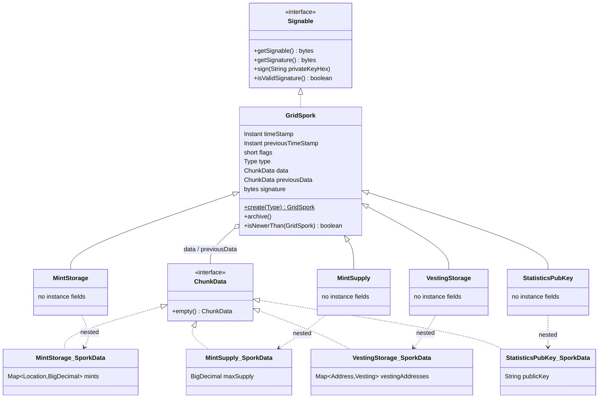
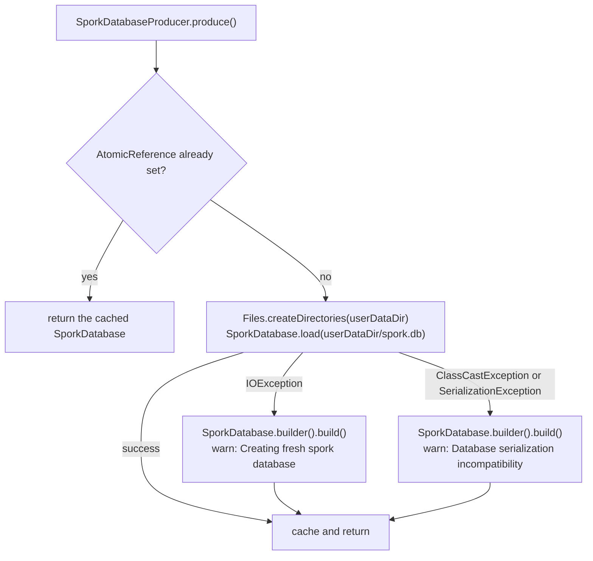

# Grid sporks

A *grid spork* is a signed, network-wide parameter record. Sporks are the mechanism by which the
Unigrid foundation keys distribute mutable configuration — mint records, maximum supply, vesting
schedules, the statistics public key — to every node on the network without a consensus round. A
node holds at most one instance of each spork type, keeps it in a small serialized database on disk,
gossips it to every peer it is connected to, and accepts an incoming replacement only when that
replacement is both newer and signed by a key the node trusts.

The data model, the database and the signing live under
`application/src/main/java/org/unigrid/hedgehog/model/spork/` and `model/crypto/`; the wire codecs
under `model/network/codec/`, `model/network/codec/chunk/` and `model/network/chunk/` (the
`ChunkData` marker and the `@Chunk` scanner); the CDI producer, the inbound handler and the publish
schedule under `model/producer/`, `model/network/handler/` and
`model/network/schedule/`. The read/write surfaces are the REST resources in `server/rest/` and the
picocli commands in `command/cli/`, documented in [REST interface](rest-api.md) and
[Architecture overview](architecture.md); the transport is described in
[Peer-to-peer network protocol](network-protocol.md).

## The `GridSpork` base type

`application/src/main/java/org/unigrid/hedgehog/model/spork/GridSpork.java` is a concrete (not
abstract) Lombok `@Data` class implementing `Serializable` and `Signable`. Every concrete spork
extends it and carries its payload in a nested `SporkData` class.

| Field | Type | Notes |
| --- | --- | --- |
| `timeStamp` | `Instant` | Time the current value was set. Serialized to JSON as a string (`@JsonFormat(shape = STRING)`). |
| `previousTimeStamp` | `Instant` | Time the archived value was set. |
| `flags` | `short` | Bit field, see `Flag` below. |
| `type` | `Type` | Numeric discriminator; marked `@JsonProperty(access = READ_ONLY)` so JSON input cannot set it. |
| `data` | `ChunkData` | The current value. |
| `previousData` | `ChunkData` | The archived value. The source comment states that `Flag.DELTA` controls whether this is a delta or a raw copy. |
| `signature` | `byte[]` | DER-encoded ECDSA signature bytes — `java.security.Signature` with `SHA512WithECDSA` emits an ASN.1 `SEQUENCE { r, s }` of variable length, which is why the wire format length-prefixes it. Exposed through an explicit `@Getter`. |

`getData()` and `getPreviousData()` are declared as `<T extends ChunkData> T` and perform an
unchecked cast, so call sites read them into the concrete `SporkData` type without an explicit cast.

### Type identifiers

`GridSpork.Type` carries a `short` id and a `Type.get(short)` lookup that falls back to `UNDEFINED`
for anything unrecognized.

| Constant | Value | Implementation |
| --- | ---: | --- |
| `UNDEFINED` | 0 | none — `GridSpork.create(UNDEFINED)` throws `IllegalArgumentException` |
| `MINT_STORAGE` | 1000 | `MintStorage` |
| `MINT_SUPPLY` | 1010 | `MintSupply` |
| `VESTING_STORAGE` | 1020 | `VestingStorage` |
| `STATISTICS_PUBKEY` | 2001 | `StatisticsPubKey` |

The first three ids are spaced by ten; `STATISTICS_PUBKEY` breaks that pattern at 2001. Nothing in
the code depends on the spacing.

`setType(short)` is annotated `@Tolerate` so it coexists with the Lombok-generated
`setType(Type)`; it routes through `Type.get(short)`.

### Flags

```java
GOVERNED((short) 0x01),  /* Governed sporks have to be voted on to accept the change on the network */
DELTA((short) 0x02);     /* Is either delta-data or a raw representation of the previous value */
```

Only one flag is ever written: `MintSupply`'s constructor ORs in `Flag.GOVERNED`. No code reads
either flag — there is no governance vote and no delta encoding today. `previousData` is always a
full copy of the previous value (see `archive()`), and `flags` is carried verbatim across the wire
and through persistence without being interpreted.

### Creation

`GridSpork.create(Type)` is the factory:

```java
case MINT_STORAGE: return new MintStorage();
case MINT_SUPPLY: return new MintSupply();
case VESTING_STORAGE: return new VestingStorage();
case STATISTICS_PUBKEY: return new StatisticsPubKey();
default: throw new IllegalArgumentException("Unknown spork type supplied");
```

Each subclass constructor sets its own `type` and installs an empty `SporkData` instance, so a
freshly created spork always has non-null `data`. It has no `timeStamp`, `previousTimeStamp` or
`previousData` yet: on the REST path those are filled in by `archive()`, and on the receive path the
decoder sets them from the wire. `create()` is called by
`AbstractGridSporkDecoder.decodeGridSpork` and by the test data provider; the REST resources call
the constructors directly through `ResourceHelper.getNewOrClonedSporkSection`.

### Chaining previous values

```java
public void archive() {
	previousData = SerializationUtils.clone(data);
	previousTimeStamp = SerializationUtils.clone(timeStamp);
	timeStamp = Instant.now().truncatedTo(ChronoUnit.MILLIS);
	...
}
```

`archive()` deep-copies the current value into the previous slots and stamps the current time,
truncated to milliseconds. The truncation matters: the wire format transports timestamps as
`toEpochMilli()` (`AbstractGridSporkEncoder`), so any sub-millisecond precision would be silently
lost in transit and change the bytes that are signed.

Every mutation path calls `archive()` *before* writing the new value — see `MintSupplyResource.set`,
`MintStorageResource.grow` and `VestingStorageResource.grow`. Because `archive()` clones `data`
first and the resources hold a reference to the live `SporkData` obtained *before* the call, the
subsequent mutation lands on the current value and leaves the archived copy untouched.

The method closes with two null-defaulting guards, and only one of them works:

```java
if (Objects.isNull(previousData)) {
	previousData = previousData.empty();
}

if (Objects.isNull(previousTimeStamp)) {
	previousTimeStamp = Instant.EPOCH.truncatedTo(ChronoUnit.MILLIS);
}
```

The first dereferences the null it just tested for. It is unreachable in practice, because `data` is
never null on a spork produced by the constructors or the decoder, so the preceding `clone` always
yields a non-null value. `ChunkData.empty()` — implemented by all four `SporkData` classes — has no
other caller.

The second guard is both reachable and load-bearing. On a first-ever archive, `timeStamp` is still
null, `SerializationUtils.clone(null)` returns null, and `previousTimeStamp` would stay null; the
`Instant.EPOCH` default is what stops `AbstractGridSporkEncoder.encodeGridSpork` from throwing a
`NullPointerException` on `spork.getPreviousTimeStamp().toEpochMilli()` the first time that spork is
published.

### Ordering

`isNewerThan(GridSpork)` is the merge predicate used by the inbound handler. It is null-tolerant in
both directions: a spork with a timestamp is newer than a null spork or one with a null timestamp; a
spork with a null timestamp is never newer than one that has one; two null timestamps compare as not
newer. `application/src/test/java/org/unigrid/hedgehog/model/spork/GridSporkTest.java` pins all six
cases.

There is no time-to-live anywhere in the subsystem. Sporks do not expire, and no code compares a
timestamp against wall-clock now. `timeStamp` is used for ordering, for the "last changed" field in
`SporkDatabaseInfo`, and — this matters for signing — as part of the wire header
(`data.writeLong(spork.getTimeStamp().toEpochMilli())`, after the type and flags shorts) and the
first field fed into `getSignable()`.

### Type hierarchy



Each subclass is an empty shell: it declares no instance fields of its own and exists to fix `type`,
install the right `SporkData` (and, in `MintSupply`'s case, to set `Flag.GOVERNED`), and give the
codec and database dispatch something to switch on. That has an unintended consequence discussed
under [the concrete sporks](#the-concrete-sporks).

## The concrete sporks

`ChunkData` (`model/network/chunk/ChunkData.java`) is the marker interface for every spork payload.
It is annotated for Jackson polymorphism by deduction:

```java
@JsonTypeInfo(use = JsonTypeInfo.Id.DEDUCTION)
@JsonSubTypes({
	@Type(MintStorage.SporkData.class),
	@Type(MintSupply.SporkData.class),
	@Type(VestingStorage.SporkData.class)
})
```

`StatisticsPubKey.SporkData` is absent from that list, so a JSON document containing only a
`publicKey` property cannot be deduced back into a `ChunkData`.

All four spork classes are annotated `@Data @ToString(callSuper = true) @EqualsAndHashCode(callSuper
= false)` and declare no instance fields. Lombok therefore generates an `equals` that compares
nothing and a constant `hashCode`: **any two `MintStorage` instances are equal, as are any two
`MintSupply`, `VestingStorage` or `StatisticsPubKey` instances**, regardless of their timestamps,
flags, data or signature. `GridSpork`'s own generated `equals` is never reached, because
`callSuper = false` excludes it. `toString` is unaffected — `callSuper = true` there does include the
base fields. Practical effects: `assertThat(x, equalTo(y))` on sporks is vacuous (the surviving
checks in `SporkDatabaseTest` and `PublishSporkIntegrityTest` are the shazamcrest `sameBeanAs`
matchers, which compare field graphs), and sporks must not be placed in a `HashSet` or used as map
keys.

### `MintSupply`

`model/spork/MintSupply.java`. Data model: a single `BigDecimal maxSupply`. Constructor sets
`Type.MINT_SUPPLY`, ORs in `Flag.GOVERNED`, and initializes `maxSupply` to `BigDecimal.ZERO`;
`empty()` returns another zero-valued instance.

The field is the network's maximum supply. The code imposes no scale, unit or bound — the value is
whatever `BigDecimal` the caller PUTs, and it travels the wire as `toPlainString()`. This is the
only spork that carries the `GOVERNED` flag, and nothing acts on that flag.

### `MintStorage`

`model/spork/MintStorage.java`. Data model: `Map<Location, BigDecimal> mints`, where

```java
public static class Location implements Serializable {
	private Address address;
	private int height;
}
```

`Address` (`model/Address.java`) is a one-field holder around a `wif` string; nothing validates it.
`height` is a block height on the consensus chain. The value is the minted amount at that
(address, height) pair.

Because `Location` is a map *key*, Jackson needs key (de)serializers rather than value ones. Both are
nested in `Location`:

* `Location.Serializer` writes the compound key `wif + "/" + height`.
* `Location.Deserializer` splits on `/` and parses the second component as an `int`.

The compound key is neither escaped nor validated, and nothing in the code constrains the `wif`
string, so a WIF containing a `/` would round-trip incorrectly.

`empty()` returns an instance with a fresh empty `HashMap`.

### `VestingStorage`

`model/spork/VestingStorage.java`. Data model: `Map<Address, Vesting> vestingAddresses`, with

| `Vesting` field | Type | Notes |
| --- | --- | --- |
| `amount` | `BigDecimal` | Total vesting amount. |
| `start` | `Instant` | Vesting start, JSON-formatted as a string. |
| `duration` | `Duration` | Total vesting period, JSON-formatted as a string. |
| `parts` | `int` | Number of installments the amount is released in. |

Nothing in Hedgehog *consumes* a vesting schedule — no release calculation exists in this repository.
The spork is storage and distribution only.

`amount` is not carried by the wire codec, and `start`/`duration` are truncated to whole seconds by
it (see [Wire encoding](#wire-encoding)); all three survive persistence and REST unharmed, but not a
peer-to-peer hop.

### `StatisticsPubKey`

`model/spork/StatisticsPubKey.java`. Data model: a single `String publicKey`, defaulted to
`StringUtils.EMPTY`. It holds the public key of whatever statistics service the network trusts. No
code in this repository reads it; it exists to be distributed. It is also the least wired-up of the
four types — it is missing from `SporkDatabaseInfo`, from `ChunkData`'s `@JsonSubTypes`, from the
scheduled publish, and it trips a fall-through bug in `SporkDatabase.set` (below).

## Signing and trust

### `Signable`

`model/crypto/Signable.java` is a four-method interface:

```java
byte[] getSignable();
byte[] getSignature();
void sign(String privateKeyHex) throws SigningException;
boolean isValidSignature();
```

`GridSpork` implements it, and so does the private `NetworkKey.RandomSignableData`.

### What bytes are signed

`GridSpork.getSignable()` concatenates the Apache Commons `SerializationUtils.serialize(...)` output
of six fields, in this order:

1. `timeStamp`
2. `previousTimeStamp`
3. `flags`
4. `type`
5. `data`
6. `previousData`

`signature` itself is excluded, as it must be. Note that this is *Java serialization* of each field
independently, not the QUIC wire encoding — each `writeBytes` call appends a complete
`ObjectOutputStream` stream, header bytes and all. The signed byte string is therefore a function of
JDK serialization behavior for `Instant`, `Short`, the enum, and the concrete `SporkData` graph,
including the `HashMap` instances inside `MintStorage.SporkData` and `VestingStorage.SporkData`.

That has a consequence worth being explicit about. `HashMap.writeObject` emits the table capacity,
and `HashMap.readObject` recomputes the capacity from the entry count rather than reusing the value
it read; entry order also follows bucket order, which depends on capacity. A map that a peer
reconstructs by inserting decoded entries into `new HashMap<>()` (which is exactly what
`MintStorageDecoder` and `VestingStorageDecoder` do) will not in general serialize to the same bytes
as the sender's map, even for identical content. Combined with the field-level losses in the vesting
codec described under [Wire encoding](#wire-encoding), this means a signature produced by one node is
not guaranteed to verify on another after a round trip. Nothing in the test suite covers that path:
`PublishSporkChannelHandlerTest` mocks `GridSpork.isValidSignature()` to return `true`, and
`PublishSporkIntegrityTest` round-trips sporks whose `signature` is random bytes and never verifies
one — its assertions are the bean comparison and a byte-count check, neither of which touches
`isValidSignature()`.

### `Signature`

`model/crypto/Signature.java` wraps the JDK's `java.security` EC primitives. Three constants name the
algorithms:

| Constant | Value | Meaning |
| --- | --- | --- |
| `KEYPAIR_NAME` | `"EC"` | `KeyPairGenerator`/`KeyFactory` algorithm |
| `SIGNATURE_NAME` | `"SHA512WithECDSA"` | signature algorithm |
| `EC_SEC_NAME` | `"secp521r1"` | the P-521 curve |

Four more constrain key sizes:

| Constant | Value | Compared against |
| --- | ---: | --- |
| `PRIVATE_KEY_SIZE` | 520 | `privateKey.getS().bitLength()` in the generation loop |
| `PUBLIC_KEY_SIZE` | 1042 | halved, against each affine coordinate's `bitLength()` — 521 bits each |
| `PRIVATE_KEY_HEX_SIZE` | 65 | `privateKeyHex.length() / 2` in the two-argument constructor |
| `PUBLIC_KEY_HEX_SIZE` | 131 | `publicKeyHex.length() / 2` in the two-argument constructor |

The no-argument constructor generates keypairs in a loop and discards any whose bit lengths do not
match the first two constants exactly:

```java
if (xPubLength == PUBLIC_KEY_SIZE / 2 && yPubLength == PUBLIC_KEY_SIZE / 2
	&& privLength == PRIVATE_KEY_SIZE) {
	break;
}
```

That rejection sampling is what makes the hex encodings fixed-width, because the encodings are
`BigInteger.toString(16)` output, which drops leading zeros. `getPrivateKey()` returns
`privateKey.getS().toString(16)` — 130 hex characters for a 520-bit scalar — and `getPublicKey()`
returns the affine X and Y coordinates concatenated as `toString(16)`, 131 characters each for a
521-bit coordinate, 262 in total.

Both `*_HEX_SIZE` constants are genuine byte counts of those strings — 130 hex characters halve to
65, 262 halve to 131 — so the constructor's rejection message, "Private key is required to be %d
bytes", is accurate for the string as a whole. Two details still deserve care. `PUBLIC_KEY_SIZE` is a
*bit* count (2 x 521) while the two `*_HEX_SIZE` constants are byte counts, so the four constants
tabulated above are not measured in the same unit. And for the public key the halves are not
byte-aligned: each coordinate is 131 hex characters, an odd number, so neither half is a whole number
of bytes and a 521-bit coordinate needs 66 bytes on its own. The 262-character concatenation does
decode to 131 bytes, but those bytes cannot be split back into X and Y — `Signature` splits the
string at its character midpoint, not on a byte boundary. Because both guards divide with integer
division, a hex string one character too long passes as well: 131 characters for a private key, 263
for a public key.

The two-argument constructor `Signature(Optional<String> privateKeyHex, Optional<String>
publicKeyHex)` first calls `this()`, i.e. it runs the full rejection-sampling generation loop, and
then *replaces* the generated key(s) with the supplied hex. Both a private-key-only signer and a
public-key-only verifier pay that cost, on every call. The public key hex is split at its midpoint
into X and Y. Both branches throw `IllegalArgumentException` on a wrong length, with the private-key
check running before the key is parsed and the public-key check running after `generatePublic`. The
public-key branch also computes `xPubLength` and `yPubLength` and then never uses them.

Instance methods `sign(byte[])` and `verify(byte[], byte[])` do the obvious thing and wrap
`InvalidKeyException`/`NoSuchAlgorithmException`/`SignatureException` into `SigningException` and
`VerifySignatureException` respectively. The static helper is what the rest of the codebase calls:

```java
public static boolean verify(Signable signable, String key) throws VerifySignatureException {
	try {
		final Signature signature = new Signature(Optional.empty(), Optional.of(key));
		return signature.verify(signable.getSignable(), signable.getSignature());

	} catch (InvalidAlgorithmParameterException | InvalidKeySpecException | NoSuchAlgorithmException ex) {
		throw new VerifySignatureException(String.format("Failed to create signature "
			+ "with public key '%s'", key), ex
		);
	}
}
```

The `catch` is the mechanism the callers depend on: a public key that `KeyFactory.generatePublic`
rejects never produces `false`, it produces a `VerifySignatureException` — which
`GridSpork.isValidSignature()` and `NetworkKey.RandomSignableData.isValidSignature()` both swallow at
trace level, turning it into an untrusted verdict for the whole key list rather than for the one bad
key. Unchecked exceptions behave differently again: the wrong-length check throws
`IllegalArgumentException`, and a key holding non-hex characters fails even earlier, in the
`BigInteger` parse, with a `NumberFormatException`. Neither the static helper's `catch` nor the one
in `isValidSignature()` handles those, so a malformed configured public key propagates an unchecked
exception straight out of the verification loop.

`application/src/test/java/org/unigrid/hedgehog/model/crypto/SignatureTest.java` covers sign/verify
round trips through both constructors and the length validation for both key kinds.

### `NetworkKey` and overriding the network keys

`model/crypto/NetworkKey.java` is the trust anchor. `NetworkKey.getPublicKeys()` simply delegates to
`NetOptions.getNetworkKeys()`, so the trusted key set is a picocli option and not a compiled-in
constant:

```java
@Getter @Option(names = "--network-keys", scope = CommandLine.ScopeType.INHERIT,
	description = "Override the default network keys", split = ",",
	defaultValue = "..."
)
private static String[] networkKeys;
```

(`application/src/main/java/org/unigrid/hedgehog/command/option/NetOptions.java`.) The default value
is a comma-separated list of **three** foundation public keys, each 262 hex characters long — that
is, `length() / 2 == 131`, exactly the `PUBLIC_KEY_HEX_SIZE` that `Signature` demands.
`--network-keys` has `ScopeType.INHERIT`, so it is accepted on `hedgehog daemon` and on every
`hedgehog cli` subcommand.

Because the field is `private static` with no initializer and is only ever populated by picocli, it
is `null` until a command line has been parsed. That is not a benign default: both
`GridSpork.isValidSignature()` and `NetworkKey.RandomSignableData.isValidSignature()` iterate the
array with a `for`-each whose surrounding `catch` lists only `VerifySignatureException`, so an
unparsed command line yields a `NullPointerException` out of `isValidSignature()` and out of
`NetworkKey.isTrusted(...)`, not an "untrusted" verdict. Embedding scenarios and any test that
touches verification have to arrange for the option to be populated; the test suite sidesteps the
problem entirely by mocking `NetworkKey.getPublicKeys()` with JMockit.

`NetworkKey.isTrusted(String privateKey)` answers "does this private key correspond to one of the
trusted public keys?" without ever comparing keys directly. It signs 32 random bytes
(`RandomSignableData.SIZE = 32`, filled by `RandomUtils.nextBytes`) with the candidate private key
and then attempts to verify that signature against every configured public key in turn. A
`SigningException` (thrown for a malformed or wrong-length private key) is logged at trace level and
reported as untrusted. `NetworkKeyTest` asserts both directions: generated keypairs registered as
network keys are trusted, and random 65-byte keys are not.

`GridSpork.isValidSignature()` uses the same loop shape, verifying the spork's own signature against
each configured public key and swallowing `VerifySignatureException` at trace level.

### Where verification is enforced

Only in two places, and they enforce different things:

| Path | Check | Failure |
| --- | --- | --- |
| Inbound `PublishSpork` (`PublishSporkChannelHandler`) | `newSpork.isNewerThan(oldSpork) && newSpork.isValidSignature()` | silently dropped; nothing is stored or forwarded |
| REST `PUT` on a spork resource | `Objects.nonNull(privateKey) && NetworkKey.isTrusted(privateKey)` on the `privateKey` request header | `401 Unauthorized` |

The REST path is a possession check on a *private* key supplied in a plaintext HTTP header, followed
by `ResourceHelper.commitAndSign` producing the signature. Nothing verifies the signature of a spork
loaded from disk, and nothing verifies a spork before it is written out by
`PublishAndSaveSporkSchedule` — a node re-publishes whatever is in its database.

### Exceptions

`SigningException` and `VerifySignatureException` (both in `model/crypto/`) are plain checked
`Exception` subclasses with a single `(String msg, Throwable cause)` constructor. They exist purely
to give the two directions distinct types; neither carries additional state.

## Persistence

### `SporkDatabase`

`model/spork/SporkDatabase.java` is a flat `@Data @Builder` container with one field per spork type
plus the file name constant:

```java
public static final String SPORK_DB_FILE = "spork.db";

private MintStorage mintStorage;
private MintSupply mintSupply;
private VestingStorage vestingStorage;
private StatisticsPubKey statisticsPubKey;
```

The file lives at `<userDataDir>/spork.db`, where `userDataDir` comes from
`ApplicationDirectory.getUserDataDir()` in the `common` module. The per-platform locations that
resolves to are tabulated in [Architecture overview](architecture.md).

The format is raw Java serialization of the whole `SporkDatabase` graph:

```java
public static SporkDatabase load(Path path) throws IOException {
	@Cleanup final InputStream stream = Files.newInputStream(path, StandardOpenOption.READ);
	return SerializationUtils.deserialize(stream);
}

public static void persist(Path path, SporkDatabase sporkDatabase) throws IOException {
	@Cleanup final OutputStream stream = Files.newOutputStream(path,
		StandardOpenOption.CREATE, StandardOpenOption.WRITE
	);
	SerializationUtils.serialize(sporkDatabase, stream);
}
```

`persist` opens with `CREATE, WRITE` and no `TRUNCATE_EXISTING`, so writing a smaller database over a
larger one leaves trailing bytes from the previous write. Java deserialization stops at the end of
the object graph and ignores the tail, so this is invisible in practice, but the file can only grow.
No class declares a `serialVersionUID`, so any field change to `SporkDatabase`, a spork or a
`SporkData` invalidates existing files — which is precisely the case the producer handles below.
`SporkDatabaseTest` property-checks that a database containing an arbitrary spork survives a
persist/load round trip, comparing with shazamcrest's `sameBeanAs`.

`SporkDatabase.get(Type)` returns the matching field or throws `IllegalArgumentException`. It has no
caller in the main sources.

`SporkDatabase.set(GridSpork)` dispatches on `gridSpork.getType()` and **is missing a `break` in the
last case**:

```java
case STATISTICS_PUBKEY:
	statisticsPubKey = (StatisticsPubKey) gridSpork;

default:
	throw new IllegalArgumentException("Unsupported spork type sent to database");
```

Setting a `STATISTICS_PUBKEY` spork therefore assigns the field and then throws. Its only caller is
`PublishSporkChannelHandler`, so an inbound statistics-pubkey spork that passes the freshness and
signature checks propagates an unchecked exception out of `typedChannelRead`, which
`AbstractInboundHandler.exceptionCaught` logs at warn level before closing the channel. The test
suite does not exercise this: `BaseSporkDatabaseTest` defines its own `set(...)` helper with the
missing `break` restored, and every database test uses that instead.

### `SporkDatabaseProducer`

`model/producer/SporkDatabaseProducer.java` is the `@ApplicationScoped` CDI producer that makes
`SporkDatabase` injectable. It caches the instance in an `AtomicReference` and falls back to an empty
database on every failure mode:



The `IOException` branch is the missing-file or unreadable-directory case; the
`ClassCastException`/`SerializationException` branch is the incompatible-format case that a changed
field layout produces. In every failure branch the exception itself is logged at trace level in
addition to the warning. A `@PreDestroy` hook persists the database again on container shutdown,
catching and logging any failure rather than propagating it — and it persists whatever the
`AtomicReference` currently holds, which is `null` if nothing ever triggered `produce()`.

`SporkDatabaseProducerTest.shouldReplaceIncompatibleDatabase` writes an unrelated serialized class to
`spork.db`, invokes the producer reflectively, and asserts the resulting file size differs — i.e.
that the corrupt database was replaced rather than propagated.

Note that the producer's fallback branches are per-*process*: a node that fails to read its database
starts empty and, on the next scheduled publish, writes that empty database back over the file. The
CDI scoping of the produced bean — `@Dependent`, but effectively a singleton because the
`AtomicReference` lives on an `@ApplicationScoped` host — is covered in
[CDI container and component lifecycle](cdi-and-lifecycle.md).

### `SporkDatabaseInfo`

`model/spork/SporkDatabaseInfo.java` is the read-only summary returned by `GET /gridspork`. It holds
three `Overview<amount, lastChanged>` pairs:

| Property | Amount type | Populated from |
| --- | --- | --- |
| `mintStorageEntries` | `Integer` | `mints.size()` |
| `mintSupply` | `BigDecimal` | `maxSupply` |
| `vestingStoragEntries` | `Integer` | `vestingAddresses.size()` |

`lastChanged` is the corresponding spork's `timeStamp.toString()`, or the constant
`LASTCHANGED_NEVER` (`"never"`) when the section is absent. The property name
`vestingStoragEntries` is misspelled in the source and therefore in the JSON. There is no overview
entry for `StatisticsPubKey`.

Each of the three blocks is wrapped in `ExceptionUtil.swallow(..., NullPointerException.class)`
(`model/util/ExceptionUtil.java`), which runs the lambda and discards only the listed exception
types, logging them at trace level. That is what keeps a half-populated spork (for example one with
a `null` `timeStamp`) from failing the whole response. The `mintSupply` block additionally calls
`Objects.requireNonNull(data.getMaxSupply())` so that a null supply is routed into the same swallow
rather than emitted as `null`.

`application/src/test/java/org/unigrid/hedgehog/model/spork/SporkDatabaseInfoTest.java` pins both
halves of that behavior: `shouldUseDefaultsOnEmptyDatabase` asserts all three `lastChanged` values
are `LASTCHANGED_NEVER` on a default-constructed instance, and `shouldSetOverviewOnPopulatedDatabase`
generates an arbitrary spork, places it in a database and asserts that the matching overview picks up
the spork's timestamp and the expected amount.

## Mutation and propagation

### The full path

```mermaid
sequenceDiagram
    autonumber
    participant CLI as hedgehog cli
    participant REST as MintSupplyResource / MintStorageResource / VestingStorageResource
    participant Helper as ResourceHelper
    participant DB as SporkDatabase
    participant Topo as Topology
    participant Peer as Remote node
    participant Disk as spork.db

    CLI->>REST: PUT /gridspork/... (+ privateKey header)
    REST->>REST: NetworkKey.isTrusted(privateKey)
    Note over REST: 401 Unauthorized if not trusted
    REST->>Helper: getNewOrClonedSporkSection()
    Helper-->>REST: new spork, or a deep clone of the stored one
    REST->>REST: spork.archive() then mutate SporkData
    REST->>Helper: commitAndSign(spork, privateKey, ...)
    Helper->>Helper: spork.sign(privateKey)
    Note over Helper: 401 with the exception body if signing fails;<br/>the clone means the database is untouched
    Helper->>DB: setMintSupply / setMintStorage / setVestingStorage
    Helper->>Topo: Topology.sendAll(PublishSpork)
    Topo->>Peer: PublishSpork over QUIC
    Peer->>Peer: isNewerThan(local) && isValidSignature()
    Peer->>Peer: db.set(spork), then re-broadcast to its own peers
    Note over DB,Disk: PublishAndSaveSporkSchedule persists every 3 minutes;<br/>SporkDatabaseProducer @PreDestroy persists on shutdown
```

### Setting and growing locally

`server/rest/ResourceHelper.java` holds the two shared steps that give every spork mutation its
clone-then-sign-then-broadcast shape.

```java
public static <S extends Serializable> S getNewOrClonedSporkSection(Supplier<S> supplier, Supplier<S> newSupplier)
```

returns `newSupplier.get()` when the database section is `null`, and otherwise
`SerializationUtils.clone(section)`. Working on a detached copy is the whole point: the resource
mutates the clone, and the live database object is only replaced at the very end, after the signature
exists. The source comment on the failure path spells out the rationale — *"As we clone() the vesting
storage, returning here results in a database NOP"*.

```java
public static <S extends Signable> Response commitAndSign(S signable, String privateKey,
	SporkDatabase sporkDatabase, boolean isUpdate, Consumer<S> consumer)
```

calls `signable.sign(privateKey)` and, on `SigningException`, returns immediately with the exception
itself as the response entity — so nothing is stored and nothing is broadcast. On success it hands
the signed spork to the caller's consumer, which does two things and only those two: it writes the
spork back into `SporkDatabase` through the matching setter, and it calls
`Topology.sendAll(PublishSpork.builder().gridSpork(...).build(), topology, Optional.empty())`. The
`isUpdate` flag then selects between the two success statuses; the status-code mapping for every
endpoint is tabulated in [REST interface](rest-api.md). The `sporkDatabase` parameter is never read
by the method, though all three call sites pass it.

The three mutating resources differ in how they compute `isUpdate`, and that difference is exactly
the grow/set distinction:

* `MintStorageResource.grow` — `isUpdate` is true when the `(address, height)` location already had
  an amount. `MintStorageResourceTest.shoulBeAbleToGetMintStorageSpork` asserts the resulting
  200-then-204 behavior.
* `VestingStorageResource.grow` — same, keyed on the address.
* `MintSupplyResource.set` — passes `false` unconditionally, so a supply update is indistinguishable
  from an insert in the response.

`grow` semantics are "add or replace one entry, leave the rest"; `set` semantics are "replace the
whole value". That distinction is mirrored in the CLI command names (`gridspork-grow` versus
`gridspork-set`) and in `GridSporkGrow`'s description: *"Grow an already defined spork, expanding a
defined data section. Previous data is unchanged."*

Nothing on this path writes to disk. Persistence happens only through
`PublishAndSaveSporkSchedule` and the producer's `@PreDestroy`.

### Publishing

`PublishSpork` (`model/network/packet/PublishSpork.java`) is a one-field packet wrapping a
`GridSpork`. Its codec is registered for `Packet.Type.PUBLISH_SPORK` (2020), and that is how the type
reaches the wire — `AbstractMessageToByteEncoder` writes `getCodecType().getValue()` into the frame
header. The packet object itself does not carry it: `setType(Type.PUBLISH_SPORK)` lives only in the
explicit no-arg constructor, and every construction site in the main sources and the tests goes
through Lombok's `@Builder`, which routes to the generated `@AllArgsConstructor` and leaves the
inherited `Packet.type` null.

The class also holds one constant:

```java
public static final int DISTRIBUTION_FREQUENCY_MINUTES = 3;
```

`Packet.Type` also declares `ASK_SPORKS` (2000) and `GROW_SPORK` (2010). Neither has a packet class,
codec or handler — they are reserved identifiers, not implemented messages.

Broadcast goes through `Topology.sendAll(packet, topology, Optional.empty())`
(`model/network/Topology.java`), which iterates the topology and sends to every node whose
`getConnection()` is present. The `Optional.empty()` is a missing result callback; the call site in
`PublishSporkChannelHandler` carries a `// TODO: Handle errors better rather than sending
Optional.empty()`.

### Receiving

`model/network/handler/PublishSporkChannelHandler.java` is `@Sharable`, registered on both the server
and client pipelines, and accepts an incoming spork only when
`newSpork.isNewerThan(oldSpork) && newSpork.isValidSignature()` holds, after which it stores the
spork with `db.set(...)` and re-broadcasts the original packet. The step-by-step algorithm, the
`NullableMap` of the four known types and the flooding behavior of the re-broadcast are described in
[Peer-to-peer network protocol](network-protocol.md).

What matters for the spork model is what that gate implies. Rejection is completely silent — a stale
or badly signed spork produces no log line at all, so a node that is quietly refusing every update
from the network looks identical to a node that is up to date. The freshness half of the gate is also
what terminates the flood, since a peer that already holds the value will not forward it again.
Acceptance runs `db.set(...)`, which means the `STATISTICS_PUBKEY` fall-through described above is
reachable from the network by any peer holding a validly signed statistics spork.

The whole handler body runs inside `CDIUtil.resolveAndRun(SporkDatabase.class, ...)`
(`model/cdi/CDIUtil.java`), which checks `Instance.isResolvable()` and, when the bean cannot be
resolved, logs *"Unable to resolve instance {}"* at warn level and runs nothing at all. Inbound
sporks are therefore dropped without any spork-specific diagnostic whenever the CDI container is not
in a state to hand out a `SporkDatabase`.

`PublishSporkChannelHandlerTest` verifies the propagation across a set of live test servers, with
signature validation mocked to always pass and the assertion written as
`greaterThanOrEqualTo` because the flooding makes an exact invocation count unpredictable.

### Scheduled publish and save

`model/network/schedule/PublishAndSaveSporkSchedule.java` is the three-minute per-channel tick that
both gossips the database and writes it to disk; its period, its registration on both pipelines and
its `save(...)` failure path are described under scheduled traffic in
[Peer-to-peer network protocol](network-protocol.md). Its static
`writeAndFlush(Channel, SporkDatabase)` is additionally called by
`RegisterQuicChannelInitializer.initChannel` so that sporks are exchanged the moment a stream comes
up (*"Exchanging sporks with {}"*).

Two properties of it belong to the spork model rather than to the transport.

First, `writeAndFlush` publishes exactly three sporks:

```java
channel.writeAndFlush(PublishSpork.builder().gridSpork(sporkDatabase.getMintStorage()).build());
channel.writeAndFlush(PublishSpork.builder().gridSpork(sporkDatabase.getMintSupply()).build());
channel.writeAndFlush(PublishSpork.builder().gridSpork(sporkDatabase.getVestingStorage()).build());
```

`statisticsPubKey` is not among them. A statistics-pubkey spork can be received and stored, but a
node never volunteers one, so the type only ever spreads as far as whoever was PUT to directly can
reach — and even that is via the inbound re-broadcast, not via this schedule.

Second, the three getters are read unconditionally. `AbstractGridSporkEncoder.encodeGridSpork`
dereferences `spork.getType()` with no null guard, so on a node whose database section is still empty
the corresponding write fails inside the encoder rather than being skipped — which is the ordinary
state of a freshly started node with no sporks yet.

Like the inbound handler, the tick body runs inside `CDIUtil.resolveAndRun(SporkDatabase.class, ...)`
and becomes a silent no-op — no publish and no save — if that bean cannot be resolved.

## Wire encoding

Spork serialization is split in two layers. `AbstractGridSporkEncoder`/`AbstractGridSporkDecoder`
(`model/network/codec/`) handle the common spork header — type, flags, both timestamps, reserved
padding, and the length-prefixed signature — and delegate the payload to a *chunk* codec chosen by
spork type. `PublishSporkEncoder`/`PublishSporkDecoder` wrap that in a `PUBLISH_SPORK` frame. The
frame and header layouts are documented in
[Peer-to-peer network protocol](network-protocol.md).

Chunk codecs are discovered at construction time by `ChunkScanner.scan(ChunkType, ChunkGroup)`, which
uses Reflections over the `org.unigrid.hedgehog.model.network.codec.chunk` package and filters on the
`@Chunk` annotation. All spork codecs declare `group = ChunkGroup.GRIDSPORK`; the result is an
`OptionalMap` from `GridSpork.Type` to `ChunkEncoder` (or `ChunkDecoder`), keyed by each codec's
`getCodecType()`.

| `GridSpork.Type` | Id | Encoder | Decoder |
| --- | ---: | --- | --- |
| `MINT_STORAGE` | 1000 | `codec/chunk/MintStorageEncoder.java` | `codec/chunk/MintStorageDecoder.java` |
| `MINT_SUPPLY` | 1010 | `codec/chunk/MintSupplyEncoder.java` | `codec/chunk/MintSupplyDecoder.java` |
| `VESTING_STORAGE` | 1020 | `codec/chunk/VestingStorageEncoder.java` | `codec/chunk/VestingStorageDecoder.java` |
| `STATISTICS_PUBKEY` | 2001 | `codec/chunk/StatisticsPubKeyEncoder.java` | `codec/chunk/StatisticsPubKeyDecoder.java` |

`UNDEFINED` has no codec: the decoder logs *"Unable to handle spork chunk of type {}"* at error level
and returns `Optional.empty()`; the encoder silently writes nothing.

Each chunk codec is invoked twice per spork — once for `data`, once for `previousData` — so the
payload layout appears twice back to back inside a `PublishSpork`.

Three data-model gaps live in this layer:

* `VestingStorageEncoder` writes address, start, duration and parts. It does **not** write
  `Vesting.amount`, and `VestingStorageDecoder` never sets it, so a vesting entry arrives at a peer
  with a `null` amount.
* `Vesting.start` and `Vesting.duration` travel at second resolution — the encoder writes
  `start.getEpochSecond()` and `duration.getSeconds()`, and the decoder rebuilds them with
  `Instant.ofEpochSecond` and `Duration.ofSeconds`. Any sub-second component is dropped in transit.
  Like the missing `amount`, this changes the bytes that `getSignable()` would produce on the
  receiving node.
* `VestingStorage` and `MintStorage` carry their entry count in a 3-byte medium and their decoders
  return `Optional.empty()` when fewer entries were read than announced, but
  `AbstractGridSporkDecoder.decodeGridSpork` calls `.get()` on that `Optional` without checking it,
  so a short chunk becomes a `NoSuchElementException` rather than a clean decode failure.

`PublishSporkIntegrityTest` property-checks encode/decode symmetry for arbitrarily generated sporks
of all four types, and additionally asserts that the decoder consumed exactly as many bytes as the
encoder produced — the framed buffer's writer index against its reader index, per
`BaseCodecTest.encodeDecode`. The jqwik property harness, the `SuiteDomain` `@NotNull` configurator
these properties are annotated with and the JMockit mocking they rely on are described in
[Build, testing and native image](build-and-native-image.md).

One field escapes that coverage. `flags` is described above as carried verbatim across the wire, and
the encoder/decoder pair does write and read it, but no test proves it: `GridSporkProvider.provide`
takes a `flags` argument from the jqwik generator and never calls `setFlags` on the spork it builds.
Every generated spork therefore has flags 0, or 1 when the generated type is `MINT_SUPPLY` and its
constructor sets `Flag.GOVERNED`. The `@ShortRange(min = 0, max = 3)` generator in
`PublishSporkIntegrityTest` and `BaseSporkDatabaseTest` has no effect on what is actually encoded.

## Surfaces

### CLI

`hedgehog cli` carries four spork commands — `gridspork-list`, `gridspork-get`, `gridspork-set` and
`gridspork-grow` — registered on the `cli` subcommand in
`application/src/main/java/org/unigrid/hedgehog/command/CLI.java`. Only `gridspork-list` issues a
request itself; the other three are containers whose `mint-supply`/`mint-storage` leaves are the
REST clients. The complete command reference, including every option and whether picocli enforces
it, is in
[Architecture overview](architecture.md), and the client-side response handling is in
[REST interface](rest-api.md).

Three properties of that surface are spork-semantic rather than plumbing:

* The command names mirror the resource semantics exactly: `gridspork-set` maps onto the "replace the
  whole value" endpoint and `gridspork-grow` onto the "add or replace one entry" endpoint. There is
  no CLI verb that rolls a spork back to its `previousData`; the archived value is readable — the
  `gridspork-get` commands print the whole `GridSpork` envelope, timestamps and `previousData`
  included — but nothing can act on it.
* `-D/--data` is described as *"JSON describing the spork data"*, but the two PUT endpoints the CLI
  can reach both bind a bare `BigDecimal` (`MintSupplyResource.set` and `MintStorageResource.grow`),
  and the command sends the option verbatim as `Entity.text(...)`. The description promises a JSON
  document where a single scalar is what the resource method signature accepts.
* There is no CLI surface at all for vesting storage or for the statistics public key, although the
  vesting-storage REST endpoints exist and are fully functional. Anything touching those two spork
  types has to be driven over REST directly.

Key material is handled by the separate `util` command group
(`application/src/main/java/org/unigrid/hedgehog/command/Util.java`): `key-generate` prints a fresh
`Signature` keypair, `key-sign` signs hex data with a hex private key, and `key-validate` verifies a
hex signature against hex data and a hex public key. None of them touch the spork database, and none
of them consult `NetworkKey` — a key generated this way is only a network key once it is added to
`--network-keys`.

### REST

Four JAX-RS resources are all rooted at `@Path("/gridspork")`:
`GridSporkResource`, `MintSupplyResource`, `MintStorageResource` and `VestingStorageResource`
(`application/src/main/java/org/unigrid/hedgehog/server/rest/`). All four inject `SporkDatabase` and
`P2PServer` through `CDIBridgeInject`; the three mutating ones also inject `Topology`.
`GridSporkResource` is read-only; the other three each expose a `GET` list, and `MintStorageResource`
and `VestingStorageResource` additionally a keyed `GET`, alongside the `PUT` mutations described
above. Paths, verbs, status codes and payloads are enumerated in [REST interface](rest-api.md).

The injected `P2PServer` is never read by any of the four resources — it is a dead field. The P2P
server is instantiated at bootstrap by `EagerExtension`, because `P2PServer` is
`@Eager @ApplicationScoped`; `CDIBridgeResource.init()` resolves the field with
`CDI.current().select(f.getType()).get()`, which for a normal-scoped bean hands back a lazy client
proxy and forces nothing. See [CDI container and component lifecycle](cdi-and-lifecycle.md).

## Known rough edges

Collected here so a reader does not have to rediscover them.

- **`SporkDatabase.set` falls through from `STATISTICS_PUBKEY` into `default`.** The field is
  assigned and then an `IllegalArgumentException` is thrown, so storing a statistics-pubkey spork
  always fails after the fact — reachable from the network through `PublishSporkChannelHandler`
  (`model/spork/SporkDatabase.java`).
- **`GridSpork.archive()` dereferences `previousData` inside its own null check.** Unreachable
  today only because `data` is never null (`model/spork/GridSpork.java`).
- **`Vesting.amount` is neither encoded nor decoded.** A vesting entry arrives at a peer with a null
  amount (`model/network/codec/chunk/VestingStorage{Encoder,Decoder}.java`).
- **`Vesting.start` and `Vesting.duration` lose sub-second precision on the wire.** Both are
  transported as whole seconds (`model/network/codec/chunk/VestingStorage{Encoder,Decoder}.java`).
- **`StatisticsPubKey.SporkData` is missing from `ChunkData`'s `@JsonSubTypes`.** Deduction-based
  polymorphic JSON cannot reconstruct it (`model/network/chunk/ChunkData.java`).
- **`StatisticsPubKey` is never published by the schedule.** `writeAndFlush` emits only the other
  three sections (`model/network/schedule/PublishAndSaveSporkSchedule.java`).
- **`StatisticsPubKey` has no `SporkDatabaseInfo` overview.** `GET /gridspork` cannot report on it
  (`model/spork/SporkDatabaseInfo.java`).
- **`SporkDatabaseInfo.vestingStoragEntries` is misspelled.** The spelling is the source field name
  and therefore the JSON property name (`model/spork/SporkDatabaseInfo.java`).
- **Publishing a null database section throws inside the encoder.** `encodeGridSpork` dereferences
  `spork.getType()` with no guard rather than skipping the section
  (`model/network/codec/AbstractGridSporkEncoder.java`).
- **`Flag.GOVERNED` and `Flag.DELTA` are written and carried but never read.** There is no governance
  vote and no delta encoding (`model/spork/GridSpork.java`).
- **`@EqualsAndHashCode(callSuper = false)` on field-less subclasses makes all instances of a spork
  type equal.** Any two `MintStorage` values compare equal regardless of content, and sporks are
  unusable as set members or map keys
  (`model/spork/{MintStorage,MintSupply,VestingStorage,StatisticsPubKey}.java`).
- **`AbstractGridSporkDecoder` calls `.get()` on the chunk decoder's `Optional`.** A truncated chunk
  surfaces as `NoSuchElementException` instead of a clean decode failure
  (`model/network/codec/AbstractGridSporkDecoder.java`).
- **`ASK_SPORKS` and `GROW_SPORK` are declared with no packet, codec or handler.** They are reserved
  identifiers, not implemented messages (`model/network/packet/Packet.java`).
- **Signing over per-field Java serialization makes the signed bytes sensitive to `HashMap`
  internals.** The wire format does not preserve those internals, so a round-tripped spork is not
  guaranteed to re-verify (`model/spork/GridSpork.java`).
- **Every `Signature` construction runs the keypair rejection-sampling loop.** The two-argument
  constructor calls `this()` first, so verification generates and discards a full P-521 keypair
  before it can look at the supplied key (`model/crypto/Signature.java`).
- **`NetworkKey.getPublicKeys()` is null before picocli parses.** Both `isValidSignature()`
  implementations iterate it in a `for`-each guarded only against `VerifySignatureException`, so the
  result is a `NullPointerException` rather than an untrusted verdict
  (`model/crypto/NetworkKey.java`, `model/spork/GridSpork.java`).
- **`PUBLIC_KEY_SIZE` counts bits while the `*_HEX_SIZE` constants count bytes.** The public key's
  two halves are also 131 hex characters each, an odd number, so the 262-character concatenation
  cannot be split back into whole-byte coordinates (`model/crypto/Signature.java`).
- **`MintSupplyResource.set` hardcodes `isUpdate = false`.** It answers `200` even when it overwrites
  an existing supply value (`server/rest/MintSupplyResource.java`).
- **`SporkDatabase.persist` opens without `TRUNCATE_EXISTING`.** A shrinking database leaves trailing
  bytes behind and the file can only grow (`model/spork/SporkDatabase.java`).
- **`--data` is described as JSON but the endpoints behind it bind a bare `BigDecimal`.** The option
  help promises a JSON document that neither `gridspork-set mint-supply` nor `gridspork-grow
  mint-storage` can actually send (`command/cli/GridSpork{Set,Grow}.java`).
- **CDI resolution failures silence the whole spork path.** `CDIUtil.resolveAndRun` logs *"Unable to
  resolve instance {}"* at warn level and runs nothing, turning both the inbound handler and the
  publish/save tick into no-ops (`model/cdi/CDIUtil.java`).
- **`flags` round-tripping is untested.** `GridSporkProvider.provide` accepts a `flags` argument and
  never applies it, so the property tests only ever exercise flags 0 and 1
  (`application/src/test/java/org/unigrid/hedgehog/model/spork/GridSporkProvider.java`).
