# Network storage

Hedgehog stores files on the Unigrid network as small, encrypted, erasure-coded fragments spread over
the active gridnodes, and the gridnodes repair lost fragments among themselves while the owner is
offline. One random secret, the *fingerprint*, both locates and decrypts a file, and the network keeps
no other record of it. This document describes the storage service built around that data format: who
does what, how a file is stored, read back and deleted, how fragments are placed, what a gridnode does
with them, the wire protocol, repair, deletion, the spork that governs it all, the REST and command-line
surface, failure modes, security properties, tests and the rough edges.

How a chunk turns into fragments — the Galois field, the Reed-Solomon construction, the two coding
layers, the layout arithmetic, chunk sealing and the Merkle proofs — is the subject of
[Erasure coding](erasure-coding.md). The design rationale, the durability analysis and related work are
in the white paper, `documentation/storage-white-paper/sharded-and-redundant-storage.tex`. Where the
white paper and the code differ, this document describes the code and lists the difference under
[Known rough edges](#known-rough-edges).

Source paths are relative to `application/src/main/java/org/unigrid/hedgehog/`, and test paths to
`application/src/test/java/org/unigrid/hedgehog/`, unless they start with `application/` or
`documentation/`. Every number is the default of the storage spork unless the text says otherwise; the
spork and what each of its fields controls are described under
[Parameters: the storage spork](#parameters-the-storage-spork).

## Where to start reading

1. `service/storage/StorageService.java` — the three public operations and their preconditions.
2. `service/storage/StorageUpload.java` and `service/storage/Retrieval.java` — one upload, and one read
   or delete.
3. `service/storage/GroupDistributor.java` and `service/storage/GroupFetcher.java` — how a single group
   meets the gridnodes of its window.
4. `model/storage/placement/Placement.java` — the whole of rendezvous placement.
5. `service/storage/FragmentKeeper.java` and `model/storage/store/FragmentStore.java` — what a gridnode
   does with a request, and how it keeps fragments and tombstones on disk.
6. `service/storage/GroupRepairer.java` and `service/storage/RepairService.java` — self-healing.
7. `model/producer/StorageProducer.java` — how CDI wires the pieces together and when storage counts as
   enabled.
8. `service/storage/StorageNetworkTest.java` in the test tree — twenty daemons in one JVM storing,
   losing, repairing and deleting files over real QUIC connections.

## What the service is, and what it is not

The storage service stores opaque byte streams and hands back a fingerprint. It knows nothing about file
names, folders, buckets or owners. Whoever holds the fingerprint can read the file and delete it, and
nobody else can do either. The network keeps no index of files, no account and no record of who stored
what.

Guarantees, as implemented:

* **Confidentiality.** Every chunk is AES-256-GCM ciphertext under a key derived from the fingerprint;
  gridnodes never hold that key.
* **Integrity.** Every fragment is checked against a descriptor signed with a key only the fingerprint
  yields, and against a Merkle proof. A read returns the stored bytes or fails; it never returns other
  bytes (`StorageServiceTest.neverReturnsWrongBytes`).
* **Durability without the owner.** A group of fragments survives the loss of any 8 of its 24
  guaranteed fragments, the outer code protects whole stripes against lost groups, and gridnodes rebuild
  a group once it is down to 20 distinct fragments, without the owner taking part.
* **Delete authority.** Only the fingerprint yields the group keys that sign a valid delete, and every
  gridnode that accepts one keeps it as a tombstone for 30 days, so stale copies are dropped instead of
  repaired.
* **Discretion on the owner's node.** The fingerprint travels in a request header rather than a URL
  path, `Fingerprint.toString()` prints `Fingerprint[redacted]`, and storage failures are logged by
  exception class only above trace level.

It is not:

* **The S3-compatible surface.** `/bucket` and `/storage-object` (`server/rest/StorageBucket.java`,
  `server/rest/StorageObject.java`) write plain files under `s3data/` in the local data directory and
  never touch the network; [REST interface](rest-api.md) covers them.
* **An account system.** There are no owners, no payment and no per-user limit; each gridnode's quota is
  the only bound on what it stores.
* **A sharing system.** A fingerprint grants everything, delete included. There is no read-only form.
* **Expiring.** Nothing expires on its own. A file stays stored, and repaired, until its fingerprint
  holder deletes it.

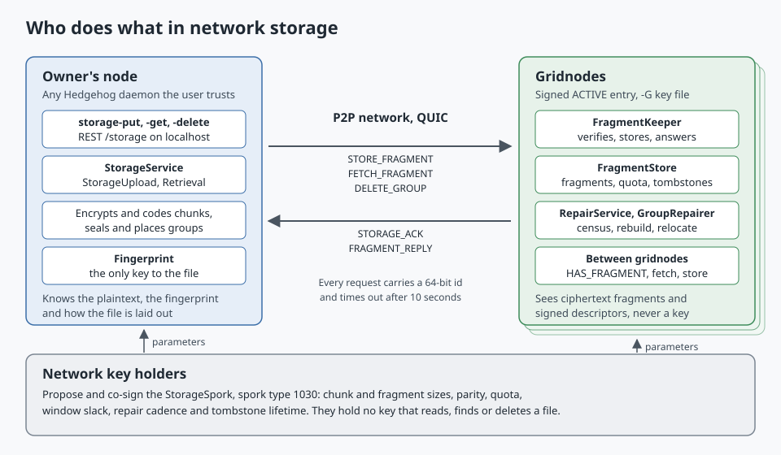

| Party | What runs there | What it sees | What it can do |
| --- | --- | --- | --- |
| Owner's node | `StorageService`, behind `POST`, `GET` and `DELETE /storage` | The plaintext, the fingerprint and the file's layout | Store, read and delete |
| Gridnode | `FragmentKeeper`, `FragmentStore`, `RepairService` and `GroupRepairer` | Its own fragments with their signed descriptors, census answers, and which peer sent each request | Store and serve fragments, answer censuses, rebuild and relocate fragments, keep tombstones |
| Plain node, without a gridnode key | The same beans, but `FragmentKeeper` refuses every store with `DISABLED` | Deletes sent to it | Keep tombstones within its budget; it is never in a window |
| Network key holders | `gridspork-set storage` and `gridspork-cosign` | The storage parameters | Change the parameters of new uploads and of repair, or disable storage; never read, find or delete a file |

The owner's node can itself be a gridnode. When it ranks in a group's window, its share of that group is
served by its own `FragmentKeeper` in-process rather than over the network.

## Vocabulary

| Term | Meaning |
| --- | --- |
| Fingerprint | The 32-byte random secret drawn for one upload, written as 50 Base58Check characters |
| Chunk | A fixed-size piece of ciphertext, 1 MiB; data chunks carry the file, parity chunks come from the outer code |
| Stripe | Up to 32 data chunks plus their 16 outer parity chunks; only the owner knows which chunks form one |
| Group | One chunk as the network sees it, named by a 32-byte group id: the SHA-256 of the group's Ed25519 public key |
| Fragment | One inner-code piece of a group, 64 KiB of data plus the signed descriptor, its index and a Merkle proof |
| Guaranteed fragment | Fragment index 0 to 23: placed by the upload, kept by repair |
| Extra fragment | Fragment index 24 to 31: extra parity that gridnodes keep only while their extras pool has room |
| Window | The 40 gridnodes that rank highest for a group; its fragments live there |
| Holder | A gridnode that stores a fragment of a group |
| Epoch | One repair interval, 60 minutes, counted on the wall clock |
| Duty | The task of checking one group in one epoch, which falls to whoever holds the group at one rank |
| Census | The duty holder's `HAS_FRAGMENT` query to every other window member |
| Tombstone | A kept, signed delete proof that blocks a group from being stored or repaired again |

## Components and wiring

| Type | File | Role |
| --- | --- | --- |
| `StorageService` | `service/storage/StorageService.java` | Entry point: `store`, `open`/`retrieve` and `delete`, each checking for a valid spork first |
| `StorageUpload` | `service/storage/StorageUpload.java` | One upload: reads stripes, seals chunks, places groups, stores manifests, rolls back on failure |
| `Retrieval` | `service/storage/Retrieval.java` | Manifest search, stripe recovery, streaming, and the withdrawal of every group on delete |
| `GroupDistributor` | `service/storage/GroupDistributor.java` | Places one group's fragments on its window and sends deletes |
| `GroupFetcher` | `service/storage/GroupFetcher.java` | Gathers verified fragments of one group from a ranked list of gridnodes |
| `FragmentTransport`, `NettyFragmentTransport` | `service/storage/` | Request and reply over peer connections, in-process for the node itself |
| `FragmentKeeper` | `service/storage/FragmentKeeper.java` | The gridnode side of every storage request |
| `FragmentStore` | `model/storage/store/FragmentStore.java` | Fragments, tombstones and quota accounting on disk |
| `GroupRepairer` | `service/storage/GroupRepairer.java` | One repair round over every group the node holds |
| `RepairService` | `service/storage/RepairService.java` | `@Eager` scheduler that runs a round once per epoch |
| `Placement` | `model/storage/placement/Placement.java` | Rendezvous ranking and windows |
| `GridnodeDirectory`, `TopologyGridnodeDirectory` | `model/storage/placement/` | The `ACTIVE` gridnodes and the node's own gridnode id |
| `PendingRequests` | `model/network/PendingRequests.java` | Matches replies to requests, with a 10-second timeout |
| `StoragePipeline` | `model/network/initializer/StoragePipeline.java` | The storage codecs and handlers added to every peer pipeline |
| `StorageResource`, `StorageSporkResource` | `server/rest/` | `/storage` and `/gridspork/storage` |
| `StorageSpork` | `model/spork/StorageSpork.java` | The parameters, spork type 1030 |
| `StorageProducer` | `model/producer/StorageProducer.java` | CDI producers for all of the above, and the spork check |
| `Fingerprint`, `FingerprintKeys`, `GroupKey`, `GroupId`, `Manifest`, `ChunkCipher`, `ChunkGroups`, `GroupDescriptor`, `Fragment`, `LayoutParameters`, `StorageLayout` | `model/storage/` | The data formats; see [Erasure coding](erasure-coding.md) |

`StorageProducer` produces `FragmentStore`, `FragmentKeeper`, `GridnodeDirectory`, `FragmentTransport`,
`StorageService` and `GroupRepairer`, each as a `@Singleton`. All of them read the spork through the
same supplier, `StorageProducer.storageSpork()`, which returns the stored `StorageSpork`'s data only when
`SporkData.validate()` accepts it. Nothing validates a spork when it arrives from a peer, so a stored
spork with parameters that break the layout simply disables storage on the node.

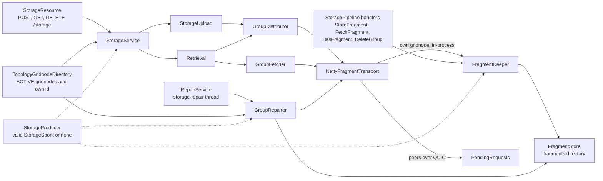

Every operation that waits for replies — store, read, delete and a repair round — blocks on futures
that the Netty event loops of the peer connections complete, so none of them may run on one of those
loops. The REST resource calls `StorageService` from the thread serving the HTTP request, and repair
runs on the single daemon thread `storage-repair` that `RepairService` owns. Incoming requests are the
other way round: the four request handlers call `FragmentKeeper` directly on the event loop, fragment
verification and disk access included.

`RepairService` is `@Eager`, and it injects `GroupRepairer`, which needs the `FragmentStore`. Every
daemon therefore creates and scans `fragments/` in its data directory at startup, whether it is a
gridnode or not.

## The fingerprint and what it derives

A fingerprint (`model/storage/Fingerprint.java`) is a format identifier and 32 bytes from a
`SecureRandom`, drawn fresh for every upload. Its text form is Base58Check: the format id (`0x01`,
`StorageFormat.V1`) as version byte, the secret, and a four-byte checksum, which always comes to 50
characters. `Fingerprint.parse` strips surrounding whitespace, verifies the checksum, requires exactly 33
decoded bytes and a known format, and throws `IllegalArgumentException` otherwise, so a mistyped
fingerprint is refused before any network traffic. Uploading the same file twice yields two unrelated
fingerprints and two unrelated sets of groups.

Everything else is derived from it in `model/storage/FingerprintKeys.java`, with HKDF-SHA256 under the
salt `hedgehog-storage-v1`:

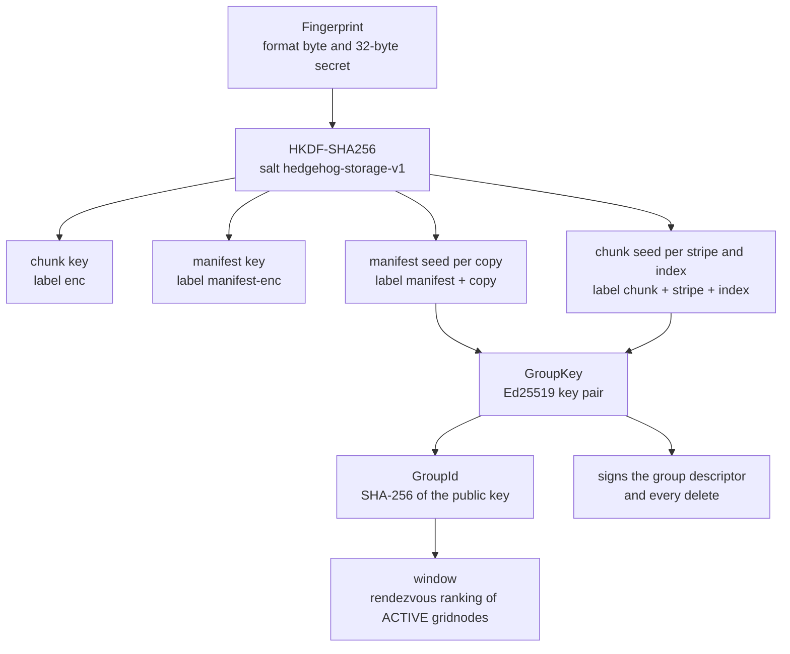

The chunk key encrypts every data chunk and the manifest key every manifest copy; outer parity chunks
are computed from ciphertext and need no key of their own. Each seed becomes a `GroupKey`
(`model/storage/GroupKey.java`), and its public key, hashed, names the group. The group id is therefore
self-certifying: anyone who meets a public key can check that it belongs to a group, but only the
fingerprint holder can derive the private key behind it. Without the secret, the group ids of one file
look like the ids of unrelated files, which is what keeps a gridnode from linking a file's groups by
their names. Positions enter the labels as single bytes, which is one reason a stripe holds at most 255
chunks and a manifest records at most 255 copies.

Reading a file therefore needs nothing but the fingerprint: the manifest group ids follow from it, the
manifest gives the size and the layout, and the layout gives every other group id. The chunk encryption,
the two Reed-Solomon layers — an outer code across the chunks of a stripe that only the owner knows, and
an inner code within each chunk that every gridnode can rebuild on its own — the signed descriptor and
the Merkle proofs are explained in [Erasure coding](erasure-coding.md).

## The life of a file

### Store

`StorageService.store` checks its preconditions before it reads a byte. Without a valid spork it throws
`StorageDisabledException`. It then takes one snapshot of `GridnodeDirectory.active()` and throws
`InsufficientGridnodesException` when the snapshot holds fewer gridnodes than a group has guaranteed
fragments, 24. The REST layer answers both with `503`. Otherwise it draws a fresh fingerprint and hands
the input, the parameters and the snapshot to a new `StorageUpload`; the snapshot is used for every
group of the upload.

`StorageUpload` reads the input one stripe at a time: up to `maxOuterDataChunks` (32) reads of
`chunkSize − 16` bytes (1,048,560), so memory stays bounded by one stripe however large the file is. An
empty input still becomes one chunk, so every file has a stripe 0 to find. Each read is zero-padded,
sealed under its global sequence number, and the stripe's outer parity chunks are computed. All chunks
of the stripe, data and parity alike, are then placed as groups in an order shuffled with the
`SecureRandom`, each under the `GroupKey` of its stripe and index, after `ChunkGroups.seal` has turned
the chunk into 32 signed, provable fragments. After the last stripe, the manifest — format, file size,
copy count and layout, 26 bytes padded to a full chunk — is sealed once per copy number and stored as
`manifestCopies` (3) further groups, in copy order.

`GroupDistributor.place` puts one group on its window. Guaranteed fragment *i* goes to window rank *i*.
All 24 leave at once in shuffled order, each delayed by a random 0 to 25 ms
(`StorageProducer.SEND_JITTER`), so the order in which fragments arrive says nothing about their index.
It then waits for every acknowledgement and retries each fragment whose store did not answer `OK` on the
spare ranks, one spare after another, blocking on each. If a fragment runs out of spares, the group, and
with it the upload, fails. The extra fragments 24 to 31 go to whichever spares are left, and nobody waits
for their answers.

Every group key is recorded before its group is placed. If anything ends the upload early — a read error
on the input, a seal failure, a group that too few gridnodes accepted — `StorageUpload.run` sends
`DELETE_GROUP` for every recorded group, the failed one included, before the error propagates. A failed
upload therefore leaves no live group behind, unless the daemon dies before the rollback finishes.

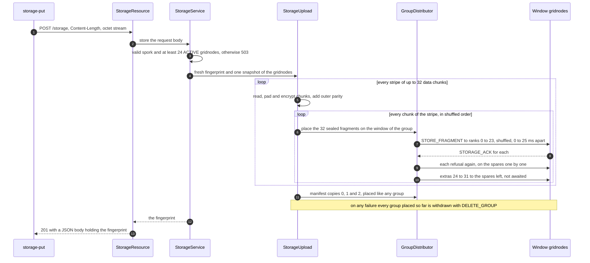

Groups are placed one after another, each waiting for its slowest guaranteed store. A 100 MiB file at
defaults becomes 101 data chunks in stripes of 32, 32, 32 and 5, plus 16, 16, 16 and 3 parity chunks
and 3 manifest copies: 155 groups and 3,720 guaranteed fragments, or 4,960 counting every extra.

### Retrieve

`StorageService.open` first has to find the manifest, without knowing the copy count, the layout or the
size, any of which a later spork may have changed. `Retrieval.open` therefore searches in two passes.
The narrow pass asks for copies 0 to 15 — `StorageSpork.SporkData.MAX_MANIFEST_COPIES`, the most any
spork can name — within the current window of 40. The wide pass asks for the copies the current spork
names across `255 + placementSlack`, 263 ranks. Copies are tried one after another, and the first that
decrypts, describes a layout `StorageLayout.of` accepts and carries the fingerprint's format wins. When
none does, the result is `FingerprintNotFoundException` and `404`: a mistyped fingerprint, a deleted
file and a completely lost file look the same, on purpose.

`GroupFetcher.fetch` gathers one group. It asks the best-ranked `dataFragments + 2` candidates — 18 —
in parallel and ends the round as soon as 16 verified fragments with distinct indices are in. Only when
the round settles short does it ask every remaining candidate. A reply counts only if it passes
`FragmentKeeper.decode`, which checks the descriptor, the group id, the data length, the signature and
the Merkle proof, and if it names the requested group in the fingerprint's format. The first verified
fragment for an index is kept, so a forged copy can never displace a genuine one.

Once the manifest is read, `Retrieval.prepare` recovers stripe 0 completely, before the REST layer
commits to a status, so a file lost from its start answers `410 Gone` instead of a truncated `200`.
Each stripe is read data groups first, in index order. Parity groups are fetched only while fewer chunks
than the stripe's data count are in hand, and the outer code decodes only when a data chunk was missing.
Data groups use the window `n_max + placementSlack`, with `n_max` from the manifest and the slack from
the current spork. A group whose fragments come from different seals, or whose decoded chunk has the
wrong size, counts as missing. A chunk that fails AES-GCM authentication ends the read with
`DataLossException`. `Retrieval.writeTo` then streams the plaintext stripe by stripe and cuts the last
chunk to the file size.

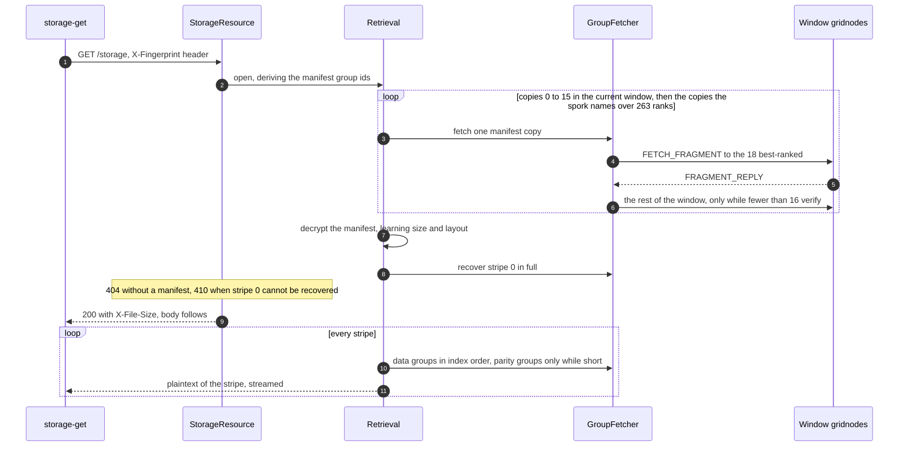

A stripe that is lost after the headers went out can only cut the body short. `storage-get` catches that
by comparing the number of bytes it received with `X-File-Size`.

### Delete

`StorageService.delete` runs the same manifest search, so a file whose data is already lost can still be
deleted. `Retrieval.withdraw` then walks every data and parity group of every stripe, followed by every
manifest copy the manifest records. For each group, `GroupDistributor.withdraw` signs a 52-byte message
— `hh-delete-v1`, the group id and the current time — with the group's private key, sends
`DELETE_GROUP` to every member of the group's window, and waits for every answer, ignoring failures. The
REST answer is `204` once every group has been handled.

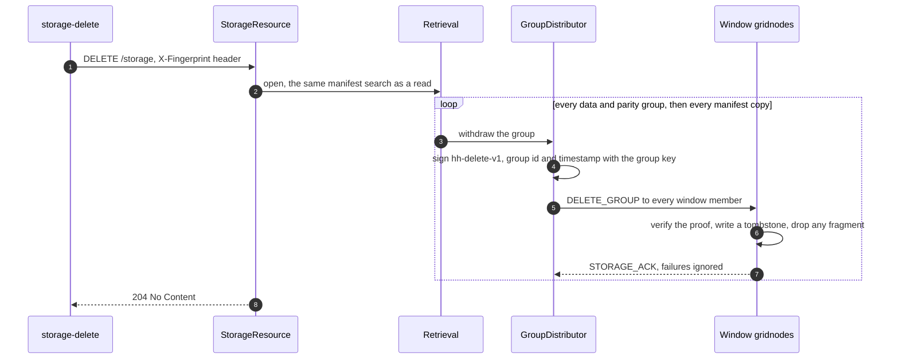

The delete does not insist on acknowledgements because tombstones spread through repair: a holder that
missed the delete learns of it from another holder's tombstone at its next duty visit or relocation
check. Waiting for every holder would let one silent gridnode block the caller.

## Placement

### Rendezvous ranking

`Placement.rank` scores every gridnode with `SHA-256(groupId ‖ gridnodeId)`, where the gridnode id is
the UTF-8 text of its hex public key, sorts the scores as unsigned bytes from highest to lowest, and
breaks ties by gridnode id. `Placement.window` keeps the first `width` entries and `Placement.rankOf`
finds one gridnode's position. That is all there is: no directory, ring or routing table, and any node
with the same list of active gridnodes computes the same windows. Every group gets its own pseudo-random
order, so the groups of one file land on unrelated sets of gridnodes, and a gridnode's rank in one group
says nothing about its rank in another. Ranking costs one SHA-256 per gridnode and group plus a sort, and
the code ranks afresh on every call.

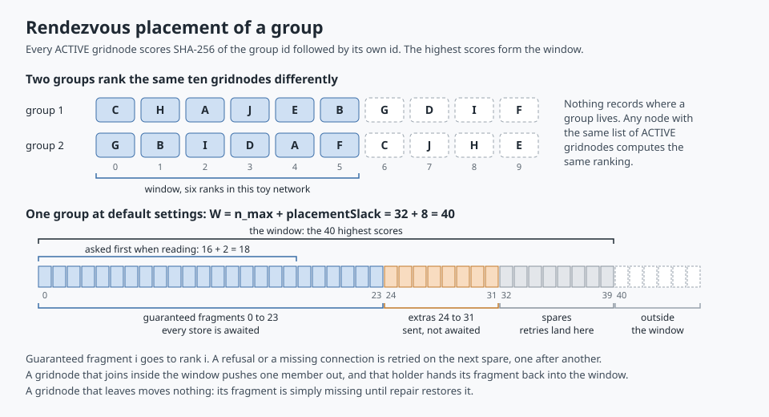

The window is `maxFragments + placementSlack` wide, 32 + 8 = 40 at defaults:

| Ranks | Role at upload | Role later |
| --- | --- | --- |
| 0 to 23 | Guaranteed fragment *i* to rank *i*; every acknowledgement is awaited | Holders take duty in turn |
| 24 to 31 | Extra fragments, sent without waiting, to the spares that retries left free | Holders of extras take duty too |
| 32 to 39 | Spares: a refused guaranteed fragment is retried here, one spare after another | Free ranks for rebuilt and relocated fragments |
| 40 and beyond | Nothing | A holder that falls here relocates its fragment into the window |

When the network has fewer than 40 active gridnodes, every gridnode is in every window and the window
shrinks with it: fewer spares, fewer extras. With exactly 24, a single refusal fails the upload. A
gridnode holds at most one fragment of a group and answers `DUPLICATE` to a second one.

Reading asks the 18 best-ranked first because most guaranteed fragments sit at the top ranks, and two
more than needed let a read finish without the slowest answers.

### Which gridnodes take part

`TopologyGridnodeDirectory` (`model/storage/placement/TopologyGridnodeDirectory.java`) is the only
`GridnodeDirectory` in production. It answers two questions:

* **`active()`** — every entry in `Topology.cloneGridnode()` whose status is `ACTIVE`. Entries arrive in
  signed announcements and pass `Topology.offerGridnode` only when they are fresh — signed at most 30
  minutes ago and at most 10 minutes ahead (`GridnodeSignature.MAX_AGE`, `MAX_SKEW`) — newer than the
  entry already held, and signed with `SHA512withECDSA` by the key that is the gridnode's id. At most
  `Topology.MAX_GRIDNODES`, 10,000 entries, are kept. A gridnode re-signs its own entry every five
  minutes and stale entries are purged, so a gridnode that vanishes drops out of every window within
  about 30 minutes; `gridnode-stop` signs it `INACTIVE` and takes it out as soon as that entry spreads.
  The announcement packet is described in [Peer-to-peer network protocol](network-protocol.md), and how
  an operator makes a gridnode in [Architecture overview](architecture.md#standing-up-a-network).
* **`self()`** — the node's own gridnode id, the public key of the `-G` key file, or empty on a node
  without one. Without an id a node refuses every store and tends no group.

Being listed is not enough to receive fragments. `NettyFragmentTransport` reaches a window member only
over an existing peer connection: it resolves the gridnode's announced `host:port` to a `Node` and looks
for an equal node with a live connection in the topology. A gridnode without one fails every request at
once with `No connection to the gridnode`, which counts as a refusal. Gridnode announcements do not open
connections; peers come from the seeds, `node-add` and peer exchange. The node itself is never in its own
peer topology, so when its own id ranks in a window the transport answers through its local
`FragmentKeeper` on the calling thread.

### Churn and differing views

An upload takes one snapshot of the active gridnodes and uses it for every group. Afterwards:

* **A gridnode joins.** In each group where it ranks inside the window, every member below it moves down
  one rank, and the one pushed from rank 39 to 40 relocates its fragment at its next repair round.
* **A gridnode leaves.** Nothing moves. Its fragments are missing, the gridnode that ranked 40 moves into
  the window holding nothing, and repair rebuilds once the group reaches its threshold.
* **Views differ.** Two nodes whose lists of active gridnodes differ by a few entries compute windows
  that differ by a few ranks. The spare ranks absorb that at upload, the second fetch round over the rest
  of the window absorbs it at read time, and relocation moves fragments into the window that the current
  view defines.

## The gridnode side

### `FragmentKeeper`

Four request handlers in `model/network/handler/` hand incoming requests to the node's
`FragmentKeeper`, which decides the answer. `NettyFragmentTransport` calls the same methods when the
target is the node itself.

| Request | Checks, in order | Answer |
| --- | --- | --- |
| `STORE_FRAGMENT` | No valid spork, or no own gridnode id | `DISABLED` |
| | Fragment does not decode, or fails verification against the group its own public key names | `INVALID` |
| | Fragment size outside 1/16 to 16 times the spork's, 4 KiB to 1 MiB at defaults (`GROWTH_TOLERANCE` = 16) | `INVALID` |
| | Group tombstoned | `TOMBSTONE` |
| | Group already held | `DUPLICATE` |
| | No room even after evicting extras | `QUOTA` |
| | Writing fails | `ERROR` |
| | Otherwise: stored, as an extra when its index is 24 or above | `OK` |
| `FETCH_FRAGMENT` | Group held: the stored bytes, unverified; the requester verifies | `OK` with the fragment |
| | Not held, tombstoned, or unreadable | `NOT_FOUND` with an empty fragment |
| `HAS_FRAGMENT` | Per group: a live tombstone, with its proof | `TOMBSTONE` |
| | Held, with the fragment's index | `HELD` |
| | Otherwise | `NONE` |
| `DELETE_GROUP` | No valid spork | `DISABLED` |
| | Group already tombstoned, whatever the proof | `OK` |
| | Proof fails: wrong key size, a key that does not hash to the group id, or a bad signature | `INVALID` |
| | Group not held, and the tombstone budget or the quota is spent | `QUOTA` |
| | Writing the tombstone fails | `ERROR` |
| | Otherwise: tombstone written, any held fragment removed | `OK` |

Only stores look at the gridnode identity, and only stores and deletes at the spork; fetches and
censuses are answered from whatever the store holds. The keeper does not check that it belongs to a group's window either: any
validly signed fragment is accepted within quota, and a holder that is not in the window moves the
fragment there at its next round. I/O failures are logged at warn level by exception class only,
because an exception message can name a fragment's path and with it the group.

### Status and state codes

Both enumerations travel as their ordinal in one byte.

| `StorageStatus` (`model/storage/StorageStatus.java`) | Byte | Sent when |
| --- | ---: | --- |
| `OK` | 0 | Stored, served or tombstoned |
| `QUOTA` | 1 | No room for the fragment, or no tombstone budget left |
| `INVALID` | 2 | A fragment or delete proof failed verification, or a fragment size is out of bounds |
| `TOMBSTONE` | 3 | A store of a deleted group |
| `DISABLED` | 4 | No valid spork, or a store on a node that is no gridnode |
| `NOT_FOUND` | 5 | A fetch of a group the node does not hold |
| `DUPLICATE` | 6 | A second fragment of a group the node already holds |
| `ERROR` | 7 | A disk failure; also what any unknown status byte decodes to |

| `FragmentStatus.State` (`model/network/packet/FragmentStatus.java`) | Byte | Meaning |
| --- | ---: | --- |
| `NONE` | 0 | Neither held nor tombstoned; also what any unknown state byte decodes to |
| `HELD` | 1 | Held, with the fragment index alongside |
| `TOMBSTONE` | 2 | Deleted, with the delete proof alongside |

An unknown state reads as `NONE` rather than `HELD` so that a peer cannot inflate a census with bytes
this node does not understand.

### The fragment store on disk

`FragmentStore` keeps everything under `fragments/` in the data directory (see
[Architecture overview](architecture.md#application-state-on-disk) for where that is on each platform).

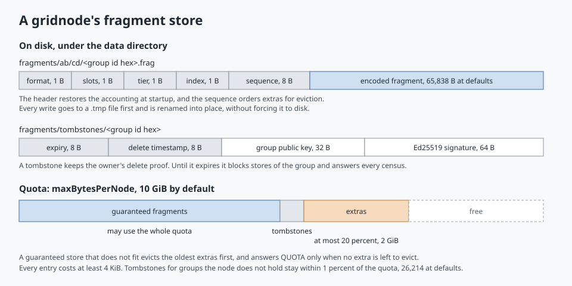

| Path | Contents |
| --- | --- |
| `fragments/ab/cd/<group id hex>.frag` | A 12-byte header — format, slot count, tier, index, each one byte, then a 64-bit sequence number — followed by the encoded fragment exactly as received. `ab` and `cd` are the first two bytes of the group id in hex |
| `fragments/tombstones/<group id hex>` | 112 bytes: expiry in epoch milliseconds, the delete's timestamp, the 32-byte public key and the 64-byte signature |

Every write goes to a sibling file with a `.tmp` suffix first and is moved into place with
`ATOMIC_MOVE`; nothing forces it to disk, so a power cut can lose or damage the latest writes. Checks on
every read catch damage, and repair restores what is lost. At startup the store rebuilds its accounting
by scanning these files: files that do not parse are removed, files that cannot be read are skipped and
left in place, and fragment files whose format byte this build does not know are left untouched and
uncounted, so that a newer build can pick them up again. The sequence numbers continue from the highest
one found.

The group id is the file name and nothing else is stored about a fragment. In particular nothing records
which node sent it.

### Quota and the two tiers

The keeper pushes the current spork's `maxBytesPerNode` and `extraPoolPercent` into the store before
every store and tombstone it writes. Fragments fall into two tiers by index:

* **Guaranteed** — indices 0 to 23. They may use the whole quota, 10 GiB.
* **Extra** — indices 24 and up. Together they may use at most `extraPoolPercent` of the quota, 20 % or
  2 GiB.

Every entry is charged at least `FragmentStore.MIN_ENTRY_COST`, 4 KiB, so the quota bounds the number of
files as well as the bytes: a 10 GiB node holds at most 2,621,440 entries. A guaranteed fragment that does
not fit evicts extras, oldest first by sequence number, and is refused with `QUOTA` only when no extra is
left to evict. A new extra that finds the pool full evicts older extras the same way. Extras therefore
only ever use space that guaranteed fragments do not need.

Tombstones cost 4 KiB of quota each. A node always tombstones a group it holds, since dropping the
fragment frees at least as much as the tombstone costs. It tombstones a group it does not hold only
while all its tombstones stay within `TOMBSTONE_BUDGET_PERCENT`, 1 % of the quota — 26,214 at defaults —
and while the quota has room, which may evict extras. That bounds the work a stream of deletes for
made-up groups can cause, since each one costs the sender only a fresh key.

### One group on one gridnode

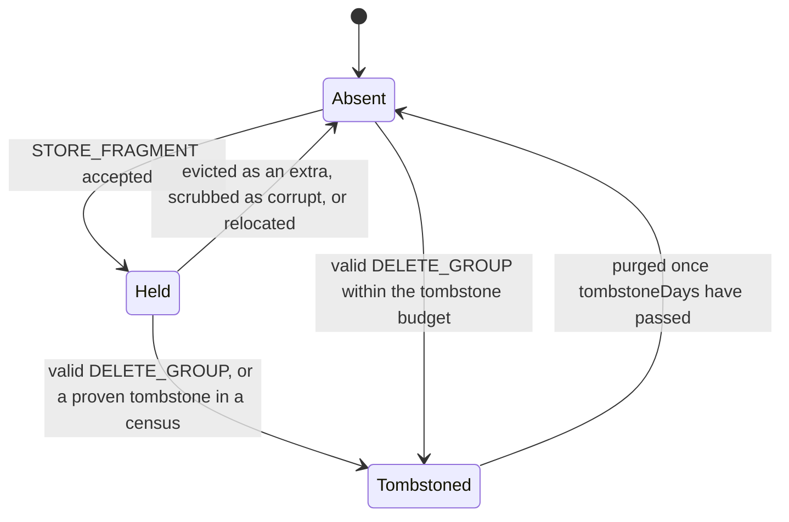

While a group is tombstoned, stores of it answer `TOMBSTONE`, deletes answer `OK`, fetches answer
`NOT_FOUND`, and censuses answer `TOMBSTONE` with the proof attached.

## Wire protocol

### Transport and pipeline

Storage traffic uses the existing peer-to-peer transport — QUIC streams with the 8-byte frame header of
magic `0xBABE`, a 16-bit type and a 32-bit payload length, frames of at most 256 MiB including the
header — described in [Peer-to-peer network protocol](network-protocol.md). `StoragePipeline.handlers()`
returns fourteen codecs (an encoder and a decoder for each of the seven packets), the four request
handlers and three `StorageResponseChannelHandler` instances for the three reply types. `P2PServer` and
`P2PClient` both append them after their existing handlers. Decoders pass on what they do not own and
handlers ignore foreign packets, so every earlier packet keeps its old path.

The codecs live in `model/network/codec/` as `<Packet>Encoder.java` and `<Packet>Decoder.java`, with the
shared helpers in `StorageCodecs.java`. The decoders refuse a group count above 4,096
(`StorageCodecs.MAX_GROUPS_PER_PACKET`), a negative byte-array length or one above 256 MiB, and public
keys and signatures of any size but 32 and 64 bytes. A length-prefixed array is sliced off the buffer
before it is copied, so a forged length cannot drive an allocation. In the live pipeline the failure
shows up as the replaying decoder's `REPLAY` signal rather than a refusal; see
[Peer-to-peer network protocol](network-protocol.md) under `Known rough edges`.

### Packets

Every payload starts with a 64-bit request id. Sizes are payload bytes at default settings, without the
frame header.

| Packet | Type | Payload after the request id | Size | Answered with |
| --- | ---: | --- | ---: | --- |
| `STORE_FRAGMENT` | 3000 | u32 length, encoded fragment | 65,850 | `STORAGE_ACK` |
| `FETCH_FRAGMENT` | 3010 | 32-byte group id | 40 | `FRAGMENT_REPLY` |
| `FRAGMENT_REPLY` | 3020 | u8 status, u32 length, fragment, empty unless `OK` | 13 + length | — |
| `HAS_FRAGMENT` | 3030 | u16 count of at most 4,096, then the group ids | 10 + 32 per group | `FRAGMENT_STATUS` |
| `FRAGMENT_STATUS` | 3040 | u16 count, then per group the id, u8 state and u8 index; a `TOMBSTONE` entry adds the 32-byte public key, the i64 timestamp and the 64-byte signature | 10 + 34 per group, + 104 per tombstone | — |
| `DELETE_GROUP` | 3050 | group id, u32 length and public key, i64 timestamp, u32 length and signature | 152 | `STORAGE_ACK` |
| `STORAGE_ACK` | 3060 | u8 status | 9 | — |

A `HAS_FRAGMENT` can ask about 4,096 groups at once, but the repairer always asks about one.

### Request correlation

`PendingRequests` (`model/network/PendingRequests.java`) is an application-scoped map from request id to
the channel the request went out on, the expected reply type and a future. Ids start at a random 64-bit
value and count up. A reply completes a request only if it arrives on the same channel with the expected
type; a reply of another type neither consumes nor fails it. Every request times out after
`PendingRequests.TIMEOUT`, 10 seconds, and one whose write fails is failed at once.

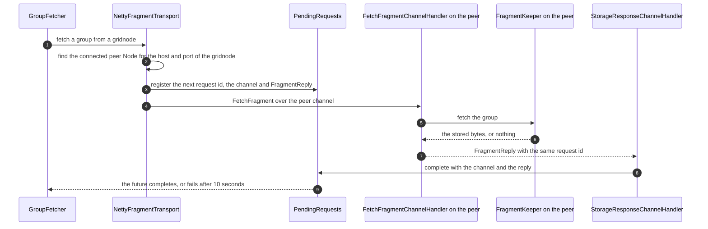

## Repair

### Scheduling

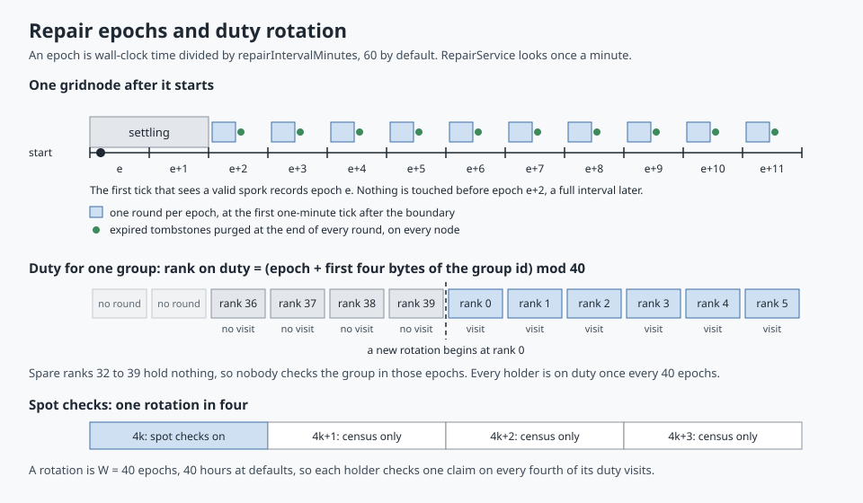

An epoch is the wall-clock time divided by the repair interval, `repairIntervalMinutes` (60), so every
gridnode with a reasonably set clock agrees on the boundaries. `RepairService` looks once a minute on its
`storage-repair` thread. The first look that finds a valid spork records the current epoch, and no round
runs until the epoch is at least two higher, which leaves at least one full interval for the node's view
of the active gridnodes to fill in after a restart. From then on it runs exactly one round per epoch, at
the first look after each boundary. A round that overruns an epoch is not queued; the next round runs
at the first look after it ends, for whatever epoch it is then. Nothing escapes a round, because a
scheduled task that throws is never run again, and shutting the executor down stops a round between two
groups.

A round (`GroupRepairer.runEpoch`) walks every group the store holds, sorted by group id, and then purges
expired tombstones. A node without a gridnode id skips the groups but still purges, since any node may
have been handed a valid delete. Without a valid spork no round runs at all.

### Duty

For each group, the node first finds its own rank among the active gridnodes. A node that does not find
itself in its own view, as happens while the view fills in after a restart, leaves the group alone. The
group's width is its slot count, which the fragment file's header copies from the signed descriptor,
plus the current slack. A holder ranked at or beyond that width relocates its fragment. A holder inside
it acts only when it is on duty:

```
duty rank = (epoch + first four bytes of the group id, unsigned) mod width
```

Duty walks through the window one rank per epoch, so every rank is on duty once every 40 epochs — 40
hours at defaults — and a group with 24 holders in a window of 40 is visited in about three epochs out of
five. When the duty rank is a spare or its gridnode has lost the fragment, nobody checks the group that
epoch. One visit per group and epoch keeps the cost at 39 queries per group and epoch, instead of that
many per holder. Each node computes duty from its own view, so differing views may give a group two
visits in an epoch, or none.

### A duty visit

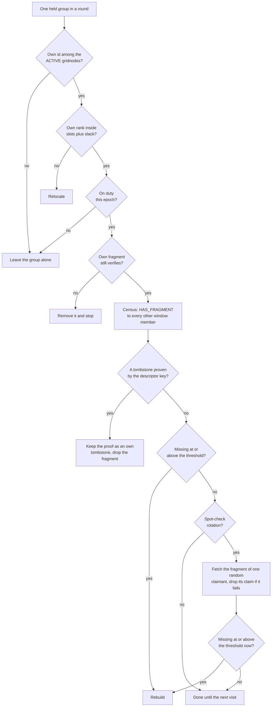

The census asks every other window member about the group and waits for every answer. A `HELD` answer
counts only with an index inside the group's slots. A `TOMBSTONE` answer counts only when its proof
verifies for the group *and* its public key equals the one in the local descriptor, so only the owner's
key can ever remove a fragment. A `NONE` answer marks a free rank. Anything else, and silence, counts as
no answer at all.

### Threshold and spot checks

Repair starts when

```
guaranteed fragments − distinct indices present ≥ max(1, ⌈parity fragments × repairThresholdPercent / 100⌉)
```

where the present indices are the holder's own and every `HELD` claim, extras included, and the parity
count comes from the group's own descriptor (`GroupRepairer.needsRepair`). At defaults the threshold is
4: repair starts once a group is down to 20 distinct fragments, four more than it needs. Without extras
that is 4 lost guaranteed fragments; with all 8 extras held it takes 12. Waiting for a threshold rather
than repairing every loss saves the bandwidth that transient losses — a restart, an hour offline —
would otherwise cost.

A census claim is unauthenticated, so a gridnode could claim a fragment it dropped and hold repair back.
In one rotation out of four — `floor((epoch + prefix) / width) mod 4 = 0`, `SPOT_CHECK_EVERY` = 4 —
every duty visit that finds the group above its threshold also checks one claim: it picks a claimant
with a `SecureRandom`, fetches its fragment and drops the claim when the reply does not verify with the
claimed index. A spot check moves a whole fragment where a census answer is a few bytes, which is why it
runs only in every fourth rotation. Knowing the schedule does not help a liar: answering `NONE` in a
checked rotation only makes the loss visible. With *L* colluding liars, repair starts for certain only
once real losses reach the threshold plus *L*, so the inner parity has to outnumber the liars a window
can hold; the white paper works through the numbers.

### Rebuild

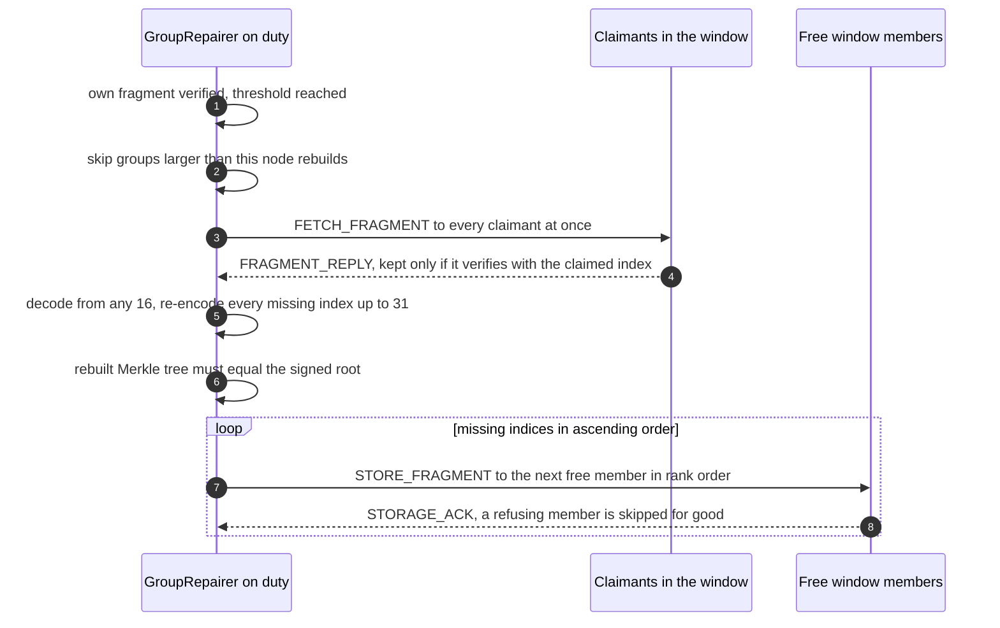

The repairer needs no key: the rebuilt fragments carry valid proofs because the rebuilt tree must match
the root the owner signed (`ChunkGroups.rebuild`), and it can produce no fragment the owner did not
commit to. Missing indices are those no verified source covers, so a claim that failed to verify is
rebuilt too. Guaranteed indices come first and extras fill whatever free ranks remain.

A repairer rebuilds only groups whose `maxFragments × fragmentSize` is at most
`min(maxBytesPerNode, 16 × n_max × fragmentSize)` under the current spork, 32 MiB at defaults, because a
validly signed group may claim 255 slots of any size and rebuilding decodes the whole group. A skipped
group is logged at warn level, since after a steep shrink of the spork's sizes no holder may be allowed
to repair it, and it slowly decays.

### Relocation

A holder ranked at or beyond the group's width — pushed out by a join, or handed a fragment for a window
it was never in — first verifies its fragment and runs a census over the current window, so a deleted
group is tombstoned rather than moved. Otherwise it offers the fragment to the free window members in
rank order. A member counts only after it stores the fragment *and* serves back a verified copy with the
same index; only then does the holder remove its own copy. An acknowledgement alone costs a peer nothing,
so it is not enough. A relocation that finds no taker is tried again the next round.

### What a round does not do

Repair renews only the inner code. A group that falls below 16 fragments is gone for good: a read
rebuilds its chunk in memory from the outer code but stores nothing, so the outer margin of a stripe is
spent over the life of a file, never renewed. Repair also never learns anything beyond one chunk: a
repairer holds the ciphertext of one chunk and the gridnodes that hold its fragments, and nothing leads
it to the file's other groups.

## Deletion, tombstones and retention

A delete proof (`model/storage/DeleteProof.java`) is the group's 32-byte Ed25519 public key, a timestamp
in epoch milliseconds and a 64-byte signature over

```
"hh-delete-v1" ‖ groupId (32 bytes) ‖ timestamp (i64)
```

It is self-certifying: a node checks that the key hashes to the group id and that the signature
verifies, and needs no stored state to do so. Even a node that never held the group can check it and
keep it. The timestamp is kept with the proof but not checked for freshness. A replayed proof can only
repeat a delete the owner already signed, and because every upload draws a fresh fingerprint, no group
id is ever reused.

A tombstone lives for `tombstoneDays` (30), counted from the moment each node writes it. While it lives,
the node refuses new stores of the group with `TOMBSTONE`, answers further deletes with `OK`, and hands
the proof to any census. A holder that was offline during the delete comes back with its fragment; at
its next duty visit or relocation check its census meets a tombstone, it verifies the proof against the
key in its own descriptor, keeps the proof as its own tombstone with a fresh lifetime, and drops the
fragment. Every rank is on duty once every 40 epochs, so a stale holder that stays inside the window
drops its fragment within about 40 hours. Expired tombstones are purged at the end of every repair round,
on every node with a valid spork, gridnode or not.

Retention follows from the same rules:

* A lost fingerprint means a lost file. There is no recovery path, and the file's fragments stay stored,
  and repaired, for as long as the network runs.
* The groups of an upload that died before its rollback stay stored the same way.
* A deleted group could only come back if at least 16 holders that missed the delete returned after
  every tombstone had expired, and the file would stay unreadable unless a manifest copy came back the
  same way.
* A delete withdraws the manifest copies from the data window, the file's `n_max` plus the current
  slack. A copy that only the wide search finds may escape it.

## Parameters: the storage spork

### Fields

`StorageSpork` (`model/spork/StorageSpork.java`) is spork type 1030. Its data travels as a 40-byte chunk
(`StorageSporkEncoder`, `StorageSporkDecoder`) in the field order below, followed by six reserved zero
bytes. `SporkData.validate()` enforces the ranges, together with the layout checks of
`LayoutParameters.validate()`.

| Field | Default | Valid range | Wire | Controls |
| --- | --- | --- | --- | --- |
| `maxBytesPerNode` | 10,737,418,240 (10 GiB) | ≥ 0 | i64 | Each gridnode's quota; the tombstone budget and the rebuild ceiling derive from it |
| `chunkSize` | 1,048,576 (1 MiB) | ≥ 42 — the 16-byte tag plus the 26-byte manifest — and a multiple of `fragmentSize` | i32 | Chunk size of new uploads |
| `fragmentSize` | 65,536 (64 KiB) | > 0, with at most 255 fragments per chunk | i32 | Fragment size of new uploads; the bounds gridnodes accept |
| `outerParityPercent` | 50 | 0–200 | u16 | Outer parity chunks per stripe |
| `maxOuterDataChunks` | 32 | 1–255, and a full stripe of at most 255 chunks | u16 | Data chunks per stripe |
| `innerParityPercent` | 50 | 0–200 | u16 | Guaranteed parity fragments per group |
| `maxParityPercent` | 100 | `innerParityPercent` to 25,500, with at most 255 fragments | u16 | Parity fragments including extras |
| `repairIntervalMinutes` | 60 | ≥ 1 | i32 | Epoch length |
| `tombstoneDays` | 30 | 1–65,535 | u16 | Tombstone lifetime |
| `manifestCopies` | 3 | 1–16 | u8 | Manifest copies of new uploads, and the wide manifest search |
| `placementSlack` | 8 | 0–255 | u8 | Spare ranks in every window, for old and new files alike |
| `repairThresholdPercent` | 50 | 1–100 | u8 | Share of the inner parity lost before repair starts |
| `extraPoolPercent` | 20 | 0–90 | u8 | Share of the quota extras may use |

The layout values — `chunkSize`, `fragmentSize`, the three parity percentages, `maxOuterDataChunks` and
`manifestCopies` — apply to new uploads only; every file keeps the layout its manifest and descriptors
record. Everything else applies at once to every file: the slack widens or narrows every window, and the
quota, threshold, interval, tombstone lifetime and growth limits follow the current spork. A change of
fragment size by more than a factor of 16 in either direction leaves older groups with no gridnode that
stores or rebuilds them, so sizes should move in smaller steps. Validation does not tie the fragment size
to the 256 MiB frame limit, so a spork could name fragments too large to send.

### What the defaults derive

| Quantity | Formula | Default |
| --- | --- | --- |
| Payload per chunk | `chunkSize − 16` | 1,048,560 bytes |
| Data fragments, *k* | `chunkSize / fragmentSize` | 16 |
| Guaranteed parity, *m* | ⌈*k* × `innerParityPercent` / 100⌉ | 8 |
| Guaranteed fragments | *k* + *m* | 24 |
| Fragment slots, *n_max* | *k* + ⌈*k* × `maxParityPercent` / 100⌉ | 32 |
| Window, *W* | *n_max* + `placementSlack` | 40 |
| Full stripe | `maxOuterDataChunks` + ⌈… × `outerParityPercent` / 100⌉ | 32 + 16 chunks |
| Repair threshold | max(1, ⌈*m* × `repairThresholdPercent` / 100⌉) | 4 missing |
| First fetch round | *k* + 2 | 18 gridnodes |
| Accepted fragment sizes | `fragmentSize` / 16 to 16 × `fragmentSize` | 4 KiB to 1 MiB |
| Largest group a repairer rebuilds | min(`maxBytesPerNode`, 16 × *n_max* × `fragmentSize`) | 32 MiB |
| Extras pool | `maxBytesPerNode` × `extraPoolPercent` / 100 | 2 GiB |
| Tombstones for groups not held | 1 % of `maxBytesPerNode`, at 4 KiB each | 26,214 |
| Duty rotation | *W* epochs | 40 hours |

The repairer takes *m* and *n_max* from each group's own descriptor and the slack and threshold
percentage from the current spork. The coding arithmetic behind the first rows, including how a file
size becomes stripes and chunks, is worked through in [Erasure coding](erasure-coding.md).

### Setting it

Storage is off until a valid storage spork exists: `StorageService` throws `StorageDisabledException`
(`503`), the keeper answers stores and deletes with `DISABLED`, and `RepairService` runs no round.
Fetches and censuses are still answered. Like every spork, the storage spork needs two network keys: one
proposes it and a second co-signs the proposal within the hour, as described in
[Grid sporks](sporks.md#two-signatures).

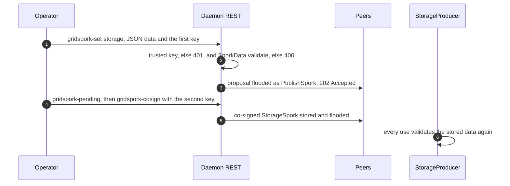

The co-signed spork reaches the other nodes as a `PublishSpork`, both when it is stored and every three
minutes from `PublishAndSaveSporkSchedule`. Every node then reads it through
`StorageProducer.storageSpork()`, which treats a spork that fails validation as absent.

The sporks named `MINT_STORAGE` (1000) and `VESTING_STORAGE` (1020) concern coin mints and vesting
schedules, as described in [Grid sporks](sporks.md). Nothing in the storage service reads them, and
neither gates storage.

## REST and command line

### REST endpoints

All endpoints need the daemon's bearer token (see [REST interface](rest-api.md#authentication)).

| Method and path | Request | Success | Failures |
| --- | --- | --- | --- |
| `POST /storage` | `application/octet-stream` body; `Content-Length` required, at most 64 GiB (`StorageResource.MAX_UPLOAD_BYTES`) | `201` with `{"fingerprint": "<50 characters>"}` | `411` without a length, `413` above the cap — both before any byte is read — `503` without a valid spork or with fewer than 24 `ACTIVE` gridnodes, `500` for anything else, a group that too few window members accepted included |
| `GET /storage` | `X-Fingerprint` header | `200`, `X-File-Size` header, the file as a streamed octet-stream body | `400` for a missing or malformed fingerprint, `404` when no manifest is found, `410` when stripe 0 is lost, `503` without a valid spork, `500`; a stripe lost later ends the body early |
| `DELETE /storage` | `X-Fingerprint` header | `204` | `400`, `404`, `503`, `500` as for `GET` |
| `GET /gridspork/storage` | — | `200` with the stored `StorageSpork` | `204` while none is stored |
| `PUT /gridspork/storage` | `SporkData` as JSON, `privateKey` header | `202` with the pending proposal and its digest | `401` for an untrusted key, `400` when validation fails, `409` when the proposal is refused |

The 64 GiB cap is a constant and independent of `--restmaxupload`, which limits only the S3-compatible
uploads. The fingerprint is accepted only in the header, never in the path, where access logs and
proxies would record it, and error bodies never repeat it.

### Commands

| Command | Class | Call | Prints |
| --- | --- | --- | --- |
| `cli storage-put <file>` | `command/cli/StoragePut.java` | `POST /storage`, streamed with the file's size as fixed length | The fingerprint |
| `cli storage-get -f [<fingerprint>] -o <path>` | `command/cli/StorageGet.java` | `GET /storage` | Nothing on success; the body lands in a `.storage-get-*.part` file beside the output and replaces it only when its length equals `X-File-Size`, otherwise `The file could not be read back completely`. Other answers go to stderr and leave the output alone |
| `cli storage-delete -f [<fingerprint>]` | `command/cli/StorageDelete.java` | `DELETE /storage` | The status line, `No Content` on success |
| `cli gridspork-get storage` | `command/cli/spork/Storage.java` | `GET /gridspork/storage` | The spork as pretty JSON, `No Content` when none is stored |
| `cli gridspork-set storage -D <json> -k <key>` | `command/cli/spork/Storage.java` | `PUT /gridspork/storage` | The status line, `Accepted` on success |

`-f` is declared `interactive` with arity `0..1` in `command/cli/FingerprintCommand.java`: given without
a value it prompts for the fingerprint with echo off, which keeps the only key to a file out of shell
history and the process list. Everything else about these commands — host, port, token, HTTPS without
certificate checks — comes from `RestClientCommand`, as described in
[Architecture overview](architecture.md#command-reference).

### A session

```sh
# Enable storage on a test network: propose with one network key, co-sign with a second
hedgehog cli gridspork-set storage -k <private-key-hex> -D '{"maxBytesPerNode":10737418240,
  "chunkSize":1048576,"fragmentSize":65536,"outerParityPercent":50,"maxOuterDataChunks":32,
  "innerParityPercent":50,"maxParityPercent":100,"repairIntervalMinutes":60,"tombstoneDays":30,
  "manifestCopies":3,"placementSlack":8,"repairThresholdPercent":50,"extraPoolPercent":20}'
hedgehog cli gridspork-pending
hedgehog cli gridspork-cosign -k <second-private-key-hex> <digest>

# Store, read back and delete a file
hedgehog cli storage-put ./report.pdf
hedgehog cli storage-get -f -o ./report-copy.pdf
hedgehog cli storage-delete -f
```

The JSON may span lines inside the single quotes. The example names every field, with its default
value.

## Failure modes

### What each tier tolerates

| Tier | Unit | Tolerates, at defaults | Restored by |
| --- | --- | --- | --- |
| Fragment | 64 KiB on one gridnode | Nothing on its own; a corrupt or forged fragment fails verification and counts as missing | Repair rebuilds it |
| Group, the inner code | 24 guaranteed fragments, up to 32 with extras | Any 8 of 24 missing, or 16 of 32 with every extra held | The duty holder, once 4 guaranteed fragments are missing |
| Stripe, the outer code | Up to 32 data and 16 parity groups | Any 16 of the 48 groups lost; a short last stripe tolerates proportionally fewer | Nobody: a read rebuilds lost chunks in memory only |
| Manifest | 3 copies, each a group | Any 2 copies lost | Each copy is repaired like any group |
| File | All of the above | Lost when any stripe, or every manifest copy, is lost | — |

How likely each loss is, and why a file of at most one chunk is the weakest case, is worked out in the
white paper's durability analysis and in [Erasure coding](erasure-coding.md).

### What goes wrong, and what the service does

| Situation | Effect |
| --- | --- |
| No valid storage spork | Every `/storage` call answers `503`; stores and deletes on the keeper answer `DISABLED`; no repair round runs |
| Fewer than 24 `ACTIVE` gridnodes in the node's view | `POST /storage` answers `503` before reading the body |
| Window members listed but unreachable or refusing | Their fragments go to spares; when the spares run out, the upload rolls back and answers `500` |
| A window member connected but silent | Each request to it waits the full 10 seconds: a store then retries on a spare, a read waits only when its round needs that member, and a census or a delete waits every time |
| A gridnode goes offline | Its fragments count as missing; reads use the rest of the window; repair starts at the threshold |
| A gridnode loses its disk | The same, permanently; repair restores its share |
| A fragment is corrupted on disk | The requester rejects it; the holder scrubs it at its next duty visit or relocation check; a file that no longer parses is removed at startup |
| A peer lies in a census | Spot checks remove the claim over time; *L* colluding liars delay repair by up to *L* losses |
| A forged fragment or delete | `INVALID`; nothing is stored or removed |
| The upload's client disconnects, or reading fails | Rollback withdraws every group placed so far |
| The daemon dies mid-upload | The groups placed so far stay, unreferenced, for good |
| Stripe 0 is lost | `410 Gone` before any byte is sent |
| A later stripe is lost | The body ends early; `storage-get` refuses to replace the output |
| Every manifest copy is lost | `404`, the same as an unknown fingerprint |
| The spork changes | Old files keep their layout; the slack, quota, threshold and growth limits change for everyone |
| A gridnode joins | At most one holder per affected group is pushed out of the window and relocates |
| The quota fills | Extras are evicted oldest first; guaranteed stores answer `QUOTA` only when no extras are left |

## Security properties and non-goals

What holds:

* **Gridnodes cannot read.** They see AES-256-GCM ciphertext or parity computed from it, padded to a
  uniform chunk size, and no key.
* **Gridnodes cannot forge.** Every fragment is verified by the keeper before it is stored, by the
  fetcher before it is used, and by the repairer before it serves as a rebuild source, against a
  descriptor only the fingerprint holder can sign. A rebuilt group must reproduce the signed Merkle root.
* **Only the owner deletes.** A delete or a tombstone counts only with a proof under the group's own
  key, and a repairer additionally requires that key to equal the one in its descriptor.
* **Groups are hard to link by name.** Group ids of one file are independent HKDF outputs, placement
  scatters them over unrelated gridnodes, and uploads shuffle group order and jitter fragment sends.
* **The owner's node keeps the fingerprint to itself.** No byte it sends contains the secret, the two
  encryption keys or any group seed — only sealed fragments, group ids, public keys and signatures leave
  the node (`StorageServiceTest.neverSendsTheFingerprintOrAnythingDerivedFromIt`) — and it never logs
  the fingerprint.
* **Abuse is bounded per gridnode.** The quota counts every entry at 4 KiB or more, the extras pool is
  capped, tombstones for groups a node does not hold are capped at 1 %, decoders bound counts and lengths
  before allocating, and gridnodes accept only fragment sizes near the spork's and rebuild only groups up
  to a ceiling.

What is out of scope, or not yet done:

* **Transport authentication.** Peers present self-signed certificates that every client accepts, so an
  attacker on the path sees what a curious gridnode sees — fragments, descriptors, request timing — but
  gains no key and cannot get forged fragments accepted. See
  [Architecture overview](architecture.md#trust-and-threat-model).
* **Sybil resistance.** Nothing ties a gridnode key to collateral yet: anyone can sign and announce
  `ACTIVE` entries, up to 10,000 of them, and a party that runs a large share of the gridnodes holds a
  similar share of every window. A node whose peer connections an attacker controls can also be kept
  from seeing honest gridnodes, steering its uploads.
* **Traffic analysis.** One upload comes from one node in a short time; reads fetch groups in index
  order and deletes walk the file stripe by stripe without shuffling. In a network of at most 40
  gridnodes, where every gridnode is in every window, the deletes alone reveal a file's group list.
* **Linked groups in short stripes.** The outer parity is a public linear combination of a stripe's data
  chunks; for a stripe of one data chunk the parity chunk is an identical copy. See
  [Erasure coding](erasure-coding.md).
* **Proof of storage.** A spot check proves that a claimant can serve a fragment when asked, not that it
  stores it; it could fetch it from another holder on demand.
* **Payment, accounts, expiry.** There is none of the three; the per-gridnode quota is the only limit.
* **The spork keys.** Two network keys together can stop new uploads, disable storage with parameters
  that fail validation, or set sizes under which old groups can no longer be stored or rebuilt. They
  cannot read, find or delete a file.

## How it is tested

| Area | Tests | What they pin down |
| --- | --- | --- |
| Formats | `model/storage/*Test.java`, `model/storage/crypto/MerkleTreeTest.java`, `model/storage/erasure/ReedSolomonTest.java` | Known answers, round trips, any changed byte rejected, layouts validated; see [Erasure coding](erasure-coding.md) |
| Placement | `model/storage/placement/PlacementTest.java`, `TopologyGridnodeDirectoryTest.java` | Input order does not matter, window members are distinct, a join keeps the others' order, groups spread |
| Fragment store | `model/storage/store/FragmentStoreTest.java` | Restart restores holdings and eviction order, tombstones block stores until they expire, unreadable and unknown files, quota bounds; `behavesLikeItsModel` runs random operation sequences against a model |
| Gridnode | `service/storage/FragmentKeeperTest.java` | Every status in the keeper table, single bit flips, growth bounds, the tombstone budget |
| Client side | `service/storage/GroupDistributorTest.java`, `GroupFetcherTest.java`, `StorageServiceTest.java` | Round trips under any valid layout, any loss within the inner parity, never wrong bytes, spork changes, joins, rollback, the fingerprint never sent |
| Repair | `service/storage/GroupRepairerTest.java`, `RepairServiceTest.java` | Duty once per rank and rotation, spot checks, the exact threshold, liars, the rebuild ceiling, tombstones, relocation, settling |
| Churn | `service/storage/StorageNetworkStateTest.java` with `StorageNetworkModel.java` | 25 random sequences of 30 actions — store, delete, kill, wipe, revive, join, repair, heal — over 24 in-memory gridnodes, with repair on the first missing fragment and the inner parity as the only redundancy; every live file must read back |
| Wire | `model/network/codec/StoragePacketIntegrityTest.java`, `model/network/PendingRequestsTest.java`, `service/storage/NettyFragmentTransportTest.java` | Round trips, decoder limits, unknown bytes, correlation by id, channel and type, timeouts, the in-process path |
| Spork | `model/spork/StorageSporkTest.java`, `StorageSporkIntegrityTest.java`, `server/rest/StorageSporkResourceTest.java` | Defaults, every bound, the 40-byte chunk, propose and co-sign over REST |
| REST and CLI | `server/rest/StorageResourceTest.java`, `command/cli/StoragePutTest.java`, `StorageGetTest.java`, `StorageDeleteTest.java`, `FingerprintCommandTest.java` | Every status, streaming in both directions, a stream cut short, the fingerprint never echoed, the prompt |
| Network | `service/storage/StorageNetworkTest.java` | Twenty real daemons, below |

Most of the service tests run against `StorageFleet` and `InMemoryTransport` in the test tree: a list of
gridnodes, each with its own in-memory `FragmentStore`, a shared `TestClock`, and a transport that can
take any gridnode offline. They use the small layout of `StorageTestData.parameters()`: 1,024-byte
chunks of 128-byte fragments, so 8 data and 4 parity fragments, 16 slots, a slack of 4 and a window of
20, two manifest copies and stripes of 4 data chunks. `StorageArbitraries.files` draws files of sizes
around the chunk and stripe boundaries, from empty to one byte past three full stripes.

`StorageNetworkTest` replaces the in-memory pieces with the real ones. It extends `BaseServerTest`, which
starts 20 `TestServer` instances — a full P2P and REST server each — and gives every one its own Weld
container. Each container gets a fresh gridnode key, its own jimfs file system for the `FragmentStore`,
the test layout as its spork and a `GroupRepairer` on the shared test clock. The test signs an `ACTIVE`
entry for every server, offers all of them to every container's topology and dials every server from
every other, so repair travels over real QUIC connections. The client is a separate `StorageService`
whose directory names itself `client`, so it is no gridnode, and whose `NettyFragmentTransport` reaches
the servers through `P2PClient` connections. Four properties run on it:

* `readsBackStoredFileAcrossTheNetwork` — a stored file reads back byte for byte, and at least 12
  servers hold something.
* `readsBackWithGridnodesUnreachable` — the file still reads back with 4 random servers, the inner
  parity count, unreachable.
* `restoresFragmentsOfWipedGridnodes` — wipes every holder of manifest copy 0 except 8, runs 20 repair
  epochs by advancing the clock and calling `runEpoch` in every container, then expects at least 12
  holders again and a read that survives 4 of them going missing.
* `deleteRemovesEveryFragment` — after a delete no server holds any of the file's groups, and `open`
  throws `FingerprintNotFoundException`.

To run them (see [Build, testing and native image](build-and-native-image.md) for the toolchain):

```sh
# The multi-daemon network test
mvn -pl application test -Dtest=StorageNetworkTest

# Most storage test classes by name; the pattern also picks up the S3 tests that share the prefix
mvn -pl application test -Dtest='Storage*Test,Fragment*Test,Group*Test,RepairServiceTest,PendingRequestsTest'
```

## Known rough edges

### Where the code and the white paper differ

- **The S3 surface already exists, and it is not on top of network storage.** The white paper calls an
  S3-style object layer "planned as a separate layer on top of" storage. The code already has
  `StorageBucket` and `StorageObject`, but they store plain files under `s3data/` in the local data
  directory through `service/BucketService.java` and `service/ObjectService.java`, and never call
  `StorageService`.
- **The storage spork needs two keys.** The white paper speaks of the foundation signing the
  StorageSpork. In the code it is a proposal until a second network key co-signs it, like every spork,
  and `gridspork-set storage` on its own changes nothing.
- **Gridnodes lock no collateral yet.** The white paper's trust section rests its Sybil argument on
  collateral. `Topology.offerGridnode` checks only freshness, ordering and the entry's own signature, so
  any key can announce itself `ACTIVE`. The white paper's own eclipse paragraph says as much; its trust
  section does not.
- **The throughput figures predate the build's Java version.** The white paper measured on Java 17; the
  build targets Java 25 (`maven.compiler.release` in the root `pom.xml`).

### Defects and gaps

- **`storage-put` blames the REST token for a missing upload file.** `StoragePut.post` opens the file
  with `Files.newInputStream` inside the `RestClientCommand` call, and `RestClientCommand.run` catches
  every `NoSuchFileException` as a missing token file. A mistyped path therefore prints
  `No REST token in <path>; is the daemon running? Otherwise pass --resttoken.` — with the upload's path
  in it. `StoragePutTest.namesAMissingFileWithoutSendingAnything` checks only that the path appears.
- **`storage-put` ignores the response status.** `StoragePut.execute` reads `fingerprint` from whatever
  body arrives. `RestClient` passes `200`, `201`, `202`, `204`, `404`, `409` and a `401` without a bearer
  challenge through as normal. For any of them without a fingerprint — a `404` from a daemon without the
  endpoint, for instance — Jackson's `readTree` returns a `MissingNode` or an object without the field,
  `get("fingerprint")` returns null, and the command dies with a `NullPointerException`. A plain-text
  body fails JSON parsing instead and prints the parser's message.
- **`gridspork-set storage` hides the digest.** `command/cli/spork/Storage.java` prints only the status
  line, `Accepted`, and drops the proposal the daemon returns with its digest, which
  `gridspork-set mint-supply` prints. The co-signer has to find the digest with `gridspork-pending`.
- **`MintStorage` treats a missing `--height` as 0.** The option is a primitive `int`, so the
  `ObjectUtils.anyNull` guard never sees it missing. This concerns the mint spork, not storage, and is
  written out in [Architecture overview](architecture.md#command-reference).
- **The client's 60-second read timeout also covers slow daemon work.** `RestClient.READ_TIMEOUT`
  applies to `GET` and `DELETE`. A read answers only after the manifest search and stripe 0, and a
  delete only after every group's window has answered or timed out. With connected but silent window
  members each round waits 10 seconds — a wrong fingerprint can take minutes to reject, and a large
  file's delete longer still — and the CLI then fails with an uncaught `ProcessingException` caused by a
  `SocketTimeoutException` while the daemon carries on. Stores are deliberately left without a timeout.
- **A `204` from a delete means the deletes were sent.** `GroupDistributor.withdraw` ignores every
  failure, so the answer is the same when no gridnode took the delete. That is intended, as tombstones
  spread through repair, but it is not a confirmation.
- **The `ACTIVE` count is not a reachability check.** `StorageService.store` compares the number of
  listed gridnodes with 24. When too few of them have a live peer connection, the upload reads and
  seals the first stripe, fails at the first group with too few takers, rolls back and answers `500`
  rather than `503`.
- **Repair rounds are serial and the census is unbatched.** A round visits its groups one after another,
  and each census sends one `HAS_FRAGMENT` per window member about a single group, although the packet
  holds 4,096, and waits for every reply. One window member that is connected but silent stretches every
  such visit to the 10-second timeout. A gridnode on duty for thousands of groups an epoch then cannot
  finish its round within the hour, and the epochs it overruns are skipped rather than caught up.
- **Temporary files are never cleaned up.** A crash between the write of a `.tmp` file and its rename
  leaves the file behind. The startup scan ignores names ending in `.frag.tmp` and skips `.tmp` files in
  `tombstones/`, but nothing deletes them.
- **Placement depends on peer connections that gridnode announcements do not create.** A gridnode that
  is listed `ACTIVE` but is no connected peer ranks in windows and refuses everything, which costs
  spares at upload and repair, until the topology happens to connect to it.
